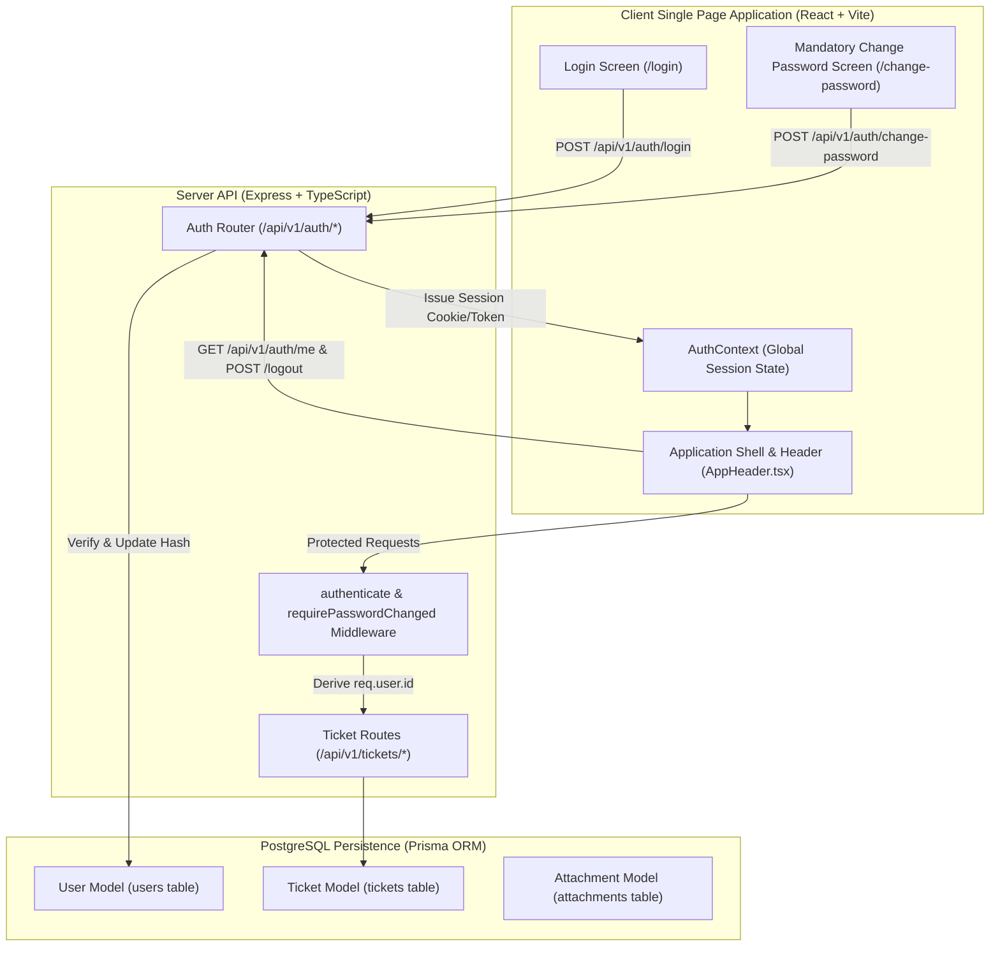
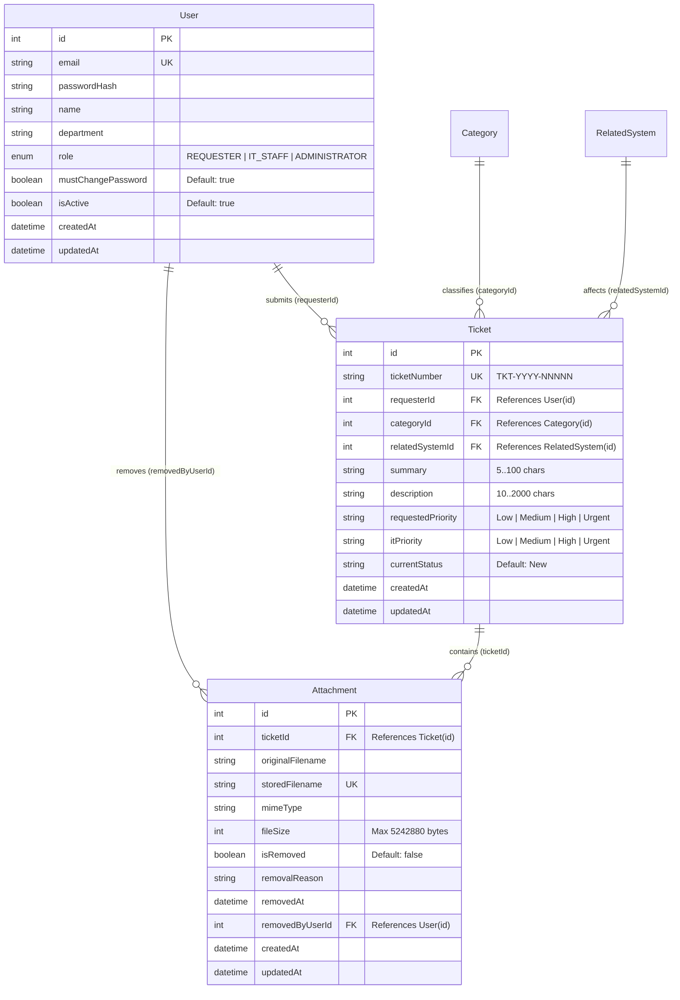
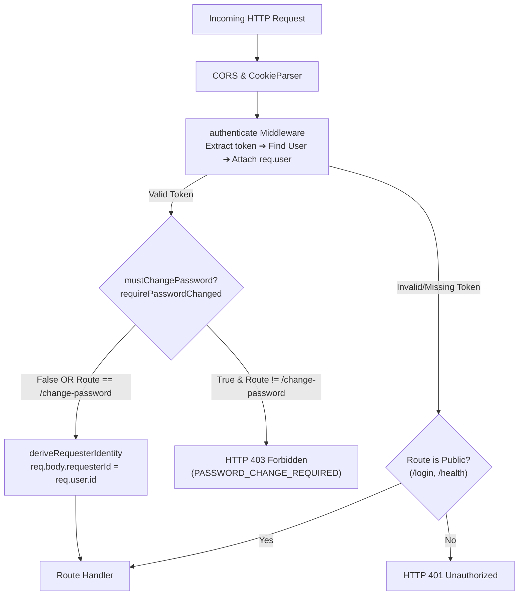
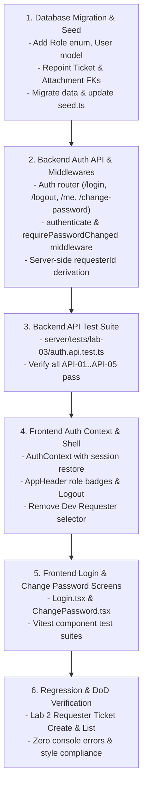

# Feature Engineering Contract: Issue 12 — Authentication Foundation, User Migration & Application Shell Navigation

**Feature Identifier:** Issue 12: Authentication Foundation, User Migration & Application Shell Navigation  
**Target Branch:** `feature/12-auth-and-shell`  
**Base Branch:** `lab3-staging`  
**Sprint / Milestone:** TokTickIT Lab 3 (Sprint 3) — Users, Roles, IT Staff Ticketing, and Admin Screens (Sprint Issue 2)  
**Specification Version:** 1.0.0  
**Status:** APPROVED ENGINEERING CONTRACT  

---

## 1. Feature Scope, Purpose & Objectives

### 1.1 Purpose & Objectives
This engineering contract establishes the authoritative technical contract for **Issue 12: Authentication Foundation, User Migration & Application Shell Navigation**.

Issue 12 transitions the TokTickIT IT Service Desk from the Lab 2 development prototype (which utilized an unauthenticated client-side Development Requester persona selector) to an authenticated, role-governed production foundation.

Specifically, Issue 12 accomplishes the following core objectives:
1. **Real User Authentication & Session Lifecycle:** Implements secure email and password authentication using hashed credentials (bcrypt), opaque server-side session management with secure HttpOnly cookies, profile introspection (`GET /api/v1/auth/me`), and secure session invalidation (`POST /api/v1/auth/logout`).
2. **User Data Model & Zero-Data-Loss Migration:** Migrates existing Lab 2 simulated `requester_users` into the unified `users` table with the `Role` enum (`REQUESTER`, `IT_STAFF`, `ADMINISTRATOR`), preserving all existing Ticket and Attachment foreign key linkages so existing ticket records remain intact.
3. **Mandatory First-Login Password Change:** Enforces password rotation on first login for all newly provisioned accounts (`mustChangePassword = true`) through both backend route-gating middleware and frontend blocking application shell views.
4. **Application Shell Modernization:** Replaces the temporary Development Requester selector banner and modal with an authenticated session header displaying the user's name, role badge pill, role-appropriate navigation tabs, and a working Logout control.
5. **Session-Derived Requester Ownership:** Reconfigures ticket creation and retrieval endpoints to strictly derive `requesterId` from the server-side authenticated session (`req.user.id`), disregarding any client-supplied user identifiers.



---

### 1.2 In-Scope Capabilities
* **Prisma Schema & Relational Integrity:**
  - Define `Role` enum (`REQUESTER`, `IT_STAFF`, `ADMINISTRATOR`).
  - Introduce `User` model mapping to PostgreSQL `users` table with fields: `id`, `email`, `passwordHash`, `name`, `department`, `role`, `mustChangePassword`, `isActive`, `createdAt`, `updatedAt`.
  - Repoint `Ticket.requesterId` to `User.id` with `onDelete: Restrict`.
  - Repoint `Attachment.removedByUserId` (formerly `removedByRequesterId`) to `User.id` with `onDelete: SetNull`.
  - Execute zero-data-loss database migration preserving existing IDs (1–5) and relationships.
* **Idempotent Database Seeding (`server/prisma/seed.ts`):**
  - Populate 11 seed accounts across all three roles:
    - $\ge 4$ active Requesters: Jennifer Anderson, Michael Brown, David Lee, Sarah Johnson.
    - $\ge 1$ inactive Requester: Prasert Inactive (`inactive.user@kmutt.ac.th`).
    - $\ge 3$ active IT Staff: Sompong IT, Wichai Support, Anong Network.
    - $\ge 1$ inactive IT Staff: Kanya Retired (`kanya.ret@kmutt.ac.th`).
    - $\ge 1$ active Administrator: System Administrator (`admin@kmutt.ac.th`).
  - Seed initial password hash for all accounts (`Password123!`) with `mustChangePassword: true`.
  - Synchronize PostgreSQL primary key sequences for `users`.
* **Backend Authentication & Security API:**
  - `POST /api/v1/auth/login`: Authenticates user, verifies active status, issues session cookie `toktickit_session`.
  - `POST /api/v1/auth/logout`: Clears session token and cookie.
  - `GET /api/v1/auth/me`: Inspects active session profile; returns `401 Unauthorized` if unauthenticated.
  - `POST /api/v1/auth/change-password`: Validates current password, enforces 5 complexity rules, updates password hash, sets `mustChangePassword = false`.
* **Security Middleware & Rule Enforcement:**
  - `authenticate`: Validates session cookie or Bearer header, loads active user, sets `req.user`. Returns `401 Unauthorized` on failure.
  - `requirePasswordChanged` (**BR-02**): Intercepts operational routes (`/api/v1/tickets/*`, `/api/v1/staff/*`, `/api/v1/admin/*`) and returns `403 Forbidden` if `mustChangePassword === true`.
  - `deriveRequesterIdentity` (**BR-03**): Injects `requesterId = req.user.id` into ticket operations; discards any client-supplied `requesterId`.
  - Anti-enumeration defense (**BR-01**): Returns uniform safe generic `401 Unauthorized` envelopes for non-existent users, wrong passwords, and inactive accounts.
* **Frontend React Authentication & Application Shell:**
  - `AuthContext`: Centralized session provider handling login, logout, password change, and session restore on reload.
  - `Login` screen (`/login`): Zen Green card, email/password inputs, show/hide password toggle, loading spinner, and safe error alert.
  - `Mandatory Change Password` screen (`/change-password`): Current/new/confirm password inputs, live interactive requirement checklist, prevents application navigation until completed.
  - `AppHeader` modernization: Complete removal of Dev Requester selector banner/modal; rendering of authenticated user display name, role badge pill (`Requester`, `IT Staff`, `Administrator`), and working Logout action.
  - Role-based header navigation rendering:
    - `REQUESTER`: "My Tickets", "+ Create Ticket"
    - `IT_STAFF`: "Ticket Queue", "+ Create Ticket"
    - `ADMINISTRATOR`: "User Management", "Ticket Queue"
* **Automated Verification:**
  - Supertest API integration test suite (`server/tests/lab-03/auth.api.test.ts`).
  - React Testing Library UI component test suites (`client/src/tests/lab-03/Login.test.tsx`, `client/src/tests/lab-03/ChangePassword.test.tsx`).

---

### 1.3 Explicit Exclusions (Strictly Out of Scope)
To prevent premature scope creep and honor course milestone boundaries (§4.2 of Lab 3 Sheet), the following items are **strictly prohibited** from Issue 12:
* **No Email Infrastructure:** No password reset via email, magic links, email invitations, or third-party mailing providers (SendGrid, Mailgun, AWS SES). Initial passwords and resets are managed strictly in-app or via admin screens.
* **No Social Login / SSO / OAuth:** No Google, GitHub, Microsoft 365, or SAML single sign-on integrations.
* **No Self-Registration:** No public sign-up or Requester-created accounts. All accounts are provisioned by an Administrator or pre-seeded.
* **No Multi-Role Assignments:** Strictly one role per user (`REQUESTER`, `IT_STAFF`, or `ADMINISTRATOR`) adhering to **BR-09**. Multi-role assignments or dynamic permission sets are prohibited.
* **No User Deletion / Hard Delete:** User records are never hard-deleted from the database; only soft-deactivation (`isActive = false`) is supported (administered in Issue 15).
* **No Multi-Factor Authentication (MFA/2FA):** No TOTP authenticator apps, SMS verification codes, or WebAuthn.
* **No IT Staff Operational Features:** Shared Ticket Queue (`/staff/tickets`), ticket assignment, IT Priority management, and status transitions belong to Issue 13 and Issue 14.
* **No Administrator User Management UI:** The `/admin/users` screen, create user modal, edit user modal, and administrative password reset actions belong to Issue 15.

---

### 1.4 Mapped Requirements & Traceability
| Requirement ID | Source Document | Description |
| :--- | :--- | :--- |
| **FR-01** | `docs/lab-03/specification.md` | User Authentication & Session Lifecycle (`/login`, `/logout`, `/me`). |
| **FR-02** | `docs/lab-03/specification.md` | Mandatory First-Login Password Change (`/change-password`). |
| **BR-01** | `docs/lab-03/specification.md` | Active account & valid credential verification without account enumeration. |
| **BR-02** | `docs/lab-03/specification.md` | Mandatory password change enforcement blocking normal operational routes. |
| **BR-03** | `docs/lab-03/specification.md` | Server-side authenticated identity determines Requester ownership (`req.user.id`). |
| **BR-09** | `docs/lab-03/specification.md` | Single-role assignment policy (`REQUESTER`, `IT_STAFF`, `ADMINISTRATOR`). |
| **DEC-UI-02**| `docs/lab-03/ui-spec.md` | App Shell Header displaying user name, role badge pill, and Logout action. |
| **DEC-UI-03**| `docs/lab-03/ui-spec.md` | Role-based navigation item rendering in header. |
| **DEC-UI-04**| `docs/lab-03/ui-spec.md` | Centered 420px Zen Green login layout with safe failure alert. |
| **DEC-UI-05**| `docs/lab-03/ui-spec.md` | Mandatory password change UX with interactive requirement checklist. |
| **D-04** | `TokTickIT-System-Level-SDS-v1.0.pdf` | Session authentication standard with HttpOnly cookies. |

---

## 2. Database Migration & Seed Data Specification

### 2.1 Prisma Schema Specification (`server/prisma/schema.prisma`)

```prisma
datasource db {
  provider = "postgresql"
  url      = env("DATABASE_URL")
}

generator client {
  provider = "prisma-client-js"
}

enum Role {
  REQUESTER
  IT_STAFF
  ADMINISTRATOR
}

model User {
  id                 Int          @id @default(autoincrement())
  email              String       @unique
  passwordHash       String
  name               String
  department         String?
  role               Role         @default(REQUESTER)
  mustChangePassword Boolean      @default(true)
  isActive           Boolean      @default(true)
  createdAt          DateTime     @default(now())
  updatedAt          DateTime     @updatedAt

  // Relationships
  requestedTickets   Ticket[]     @relation("RequesterTickets")
  removedAttachments Attachment[] @relation("UserRemovedAttachments")

  @@map("users")
}

model RelatedSystem {
  id        Int      @id @default(autoincrement())
  name      String   @unique
  isActive  Boolean  @default(true)
  createdAt DateTime @default(now())
  updatedAt DateTime @updatedAt
  tickets   Ticket[]

  @@map("related_systems")
}

model Category {
  id          Int      @id @default(autoincrement())
  code        String?  @unique
  name        String   @unique
  description String?
  isActive    Boolean  @default(true)
  createdAt   DateTime @default(now())
  updatedAt   DateTime @updatedAt
  tickets     Ticket[]

  @@map("categories")
}

model Ticket {
  id                Int           @id @default(autoincrement())
  ticketNumber      String        @unique @db.VarChar(32) // Format: TKT-YYYY-NNNNN
  requesterId       Int
  categoryId        Int
  relatedSystemId   Int
  summary           String        @db.VarChar(100)
  description       String        @db.Text
  requestedPriority String        // Low, Medium, High, Urgent
  itPriority        String?       // Low, Medium, High, Urgent
  currentStatus     String        @default("New")
  createdAt         DateTime      @default(now())
  updatedAt         DateTime      @updatedAt

  // Relations
  requester         User          @relation("RequesterTickets", fields: [requesterId], references: [id], onDelete: Restrict)
  category          Category      @relation(fields: [categoryId], references: [id], onDelete: Restrict)
  relatedSystem     RelatedSystem @relation(fields: [relatedSystemId], references: [id], onDelete: Restrict)
  attachments       Attachment[]

  @@index([requesterId])
  @@index([currentStatus])
  @@map("tickets")
}

model Attachment {
  id               Int       @id @default(autoincrement())
  ticketId         Int
  originalFilename String
  storedFilename   String    @unique
  mimeType         String
  fileSize         Int
  isRemoved        Boolean   @default(false)
  removalReason    String?   @db.Text
  removedAt        DateTime?
  removedByUserId  Int?
  createdAt        DateTime  @default(now())
  updatedAt        DateTime  @updatedAt

  // Relations
  ticket           Ticket    @relation(fields: [ticketId], references: [id], onDelete: Cascade)
  removedByUser    User?     @relation("UserRemovedAttachments", fields: [removedByUserId], references: [id], onDelete: SetNull)

  @@index([ticketId])
  @@map("attachments")
}

model TicketNumberSequence {
  year    Int @id
  nextVal Int @default(1)

  @@map("ticket_number_sequences")
}
```

---

### 2.2 Relational Entity Diagram



---

### 2.3 Zero-Data-Loss Migration Strategy

To transition existing databases from Lab 2 without breaking existing Ticket foreign keys:
1. **Direct Table Evolution / Copy:**
   - Create the `Role` enum in PostgreSQL: `CREATE TYPE "Role" AS ENUM ('REQUESTER', 'IT_STAFF', 'ADMINISTRATOR');`
   - Create the `users` table with identical column types for `id`, `name`, `email`, `department`, `isActive`, `createdAt`, `updatedAt`, plus new columns `passwordHash VARCHAR(255) NOT NULL`, `role "Role" NOT NULL DEFAULT 'REQUESTER'`, `mustChangePassword BOOLEAN NOT NULL DEFAULT true`.
   - If `requester_users` table exists and contains records, migrate existing rows into `users`:
     ```sql
     INSERT INTO "users" ("id", "name", "email", "department", "isActive", "createdAt", "updatedAt", "passwordHash", "role", "mustChangePassword")
     SELECT 
       "id", 
       "name", 
       "email", 
       "department", 
       "isActive", 
       "createdAt", 
       "updatedAt", 
       '$2a$10$w8.15tC8o1V1u8p48.j6O.L4c5u6d2k8v5j4x8c8v8b8n8m8k8l8a', -- Pre-computed bcrypt hash of Password123!
       'REQUESTER'::"Role", 
       true 
     FROM "requester_users"
     ON CONFLICT ("id") DO NOTHING;
     ```
   - Update foreign keys on `tickets`:
     ```sql
     ALTER TABLE "tickets" DROP CONSTRAINT IF EXISTS "tickets_requesterId_fkey";
     ALTER TABLE "tickets" ADD CONSTRAINT "tickets_requesterId_fkey" FOREIGN KEY ("requesterId") REFERENCES "users"("id") ON DELETE RESTRICT ON UPDATE CASCADE;
     ```
   - Update foreign keys on `attachments`:
     ```sql
     -- If column is named removedByRequesterId, rename to removedByUserId
     DO $$
     BEGIN
       IF EXISTS (SELECT 1 FROM information_schema.columns WHERE table_name='attachments' AND column_name='removedByRequesterId') THEN
         ALTER TABLE "attachments" RENAME COLUMN "removedByRequesterId" TO "removedByUserId";
       END IF;
     END $$;

     ALTER TABLE "attachments" DROP CONSTRAINT IF EXISTS "attachments_removedByRequesterId_fkey";
     ALTER TABLE "attachments" DROP CONSTRAINT IF EXISTS "attachments_removedByUserId_fkey";
     ALTER TABLE "attachments" ADD CONSTRAINT "attachments_removedByUserId_fkey" FOREIGN KEY ("removedByUserId") REFERENCES "users"("id") ON DELETE SET NULL ON UPDATE CASCADE;
     ```
   - Drop the deprecated `requester_users` table once verified: `DROP TABLE IF EXISTS "requester_users" CASCADE;`
2. **PostgreSQL Sequence Synchronization:**
   - Synchronize the `users_id_seq` counter with the maximum assigned ID to ensure future `INSERT` statements never conflict:
     ```sql
     SELECT setval(pg_get_serial_sequence('users', 'id'), coalesce(max(id), 1)) FROM users;
     ```

---

### 2.4 Database Seed Specification (`server/prisma/seed.ts`)

The database seed must be **100% idempotent** and populate 11 standard test accounts with the default initial password `Password123!` and `mustChangePassword: true`:

| ID | Full Name | Email Address | Role | Department | Active Status | Initial Password | mustChangePassword |
| :---: | :--- | :--- | :--- | :--- | :---: | :---: | :---: |
| **1** | Jennifer Anderson | `jennifer.anderson@kmutt.ac.th` | `REQUESTER` | Engineering | `true` | `Password123!` | `true` |
| **2** | Michael Brown | `michael.brown@kmutt.ac.th` | `REQUESTER` | Science | `true` | `Password123!` | `true` |
| **3** | David Lee | `david.lee@kmutt.ac.th` | `REQUESTER` | Architecture | `true` | `Password123!` | `true` |
| **4** | Sarah Johnson | `sarah.johnson@kmutt.ac.th` | `REQUESTER` | Science | `true` | `Password123!` | `true` |
| **5** | Prasert Inactive | `inactive.user@kmutt.ac.th` | `REQUESTER` | Liberal Arts | `false` | `Password123!` | `true` |
| **6** | Sompong IT | `sompong.it@kmutt.ac.th` | `IT_STAFF` | Central IT | `true` | `Password123!` | `true` |
| **7** | Wichai Support | `wichai.sup@kmutt.ac.th` | `IT_STAFF` | Helpdesk Tier 1 | `true` | `Password123!` | `true` |
| **8** | Anong Network | `anong.net@kmutt.ac.th` | `IT_STAFF` | Network Operations| `true` | `Password123!` | `true` |
| **9** | Kanya Retired | `kanya.ret@kmutt.ac.th` | `IT_STAFF` | Legacy Systems | `false` | `Password123!` | `true` |
| **10**| System Administrator | `admin@kmutt.ac.th` | `ADMINISTRATOR`| IT Administration | `true` | `Password123!` | `true` |
| **11**| Test Active Requester| `test.requester@kmutt.ac.th` | `REQUESTER` | Testing Pool | `true` | `Password123!` | `false` |

*Seed Invariants:*
* All password hashes are generated using `bcrypt.hashSync("Password123!", 10)`.
* User accounts are upserted matching on lowercase `email`.
* Existing 22+ Lab 2 tickets belonging to Jennifer Anderson (ID 1) remain linked without orphaned records.

---

## 3. API & Security Protocols

### 3.1 REST API Endpoint Contracts

All API endpoints follow the base route `/api/v1/auth/*` (with `/api/auth/*` aliases).

#### 1. User Login (`POST /api/v1/auth/login`)
* **Access:** Public / Unauthenticated
* **Request Headers:** `Content-Type: application/json`
* **Request Body DTO:**
  ```json
  {
    "email": "sarah.johnson@kmutt.ac.th",
    "password": "Password123!"
  }
  ```
* **Validation & Business Logic:**
  1. Validate `email`: string, required, trimmed, valid email format. Normalize to lowercase.
  2. Validate `password`: string, required, min length 1.
  3. Query `User` by normalized email.
  4. If user not found OR `user.isActive === false`: Return `401 Unauthorized` with generic safe error (**BR-01**).
  5. Compare supplied password against `user.passwordHash` using `bcrypt.compare`.
  6. If password comparison fails: Return `401 Unauthorized` with identical generic safe error (**BR-01**).
  7. If credentials are valid:
     - Generate cryptographic session token (UUID v4 or 32-byte hex).
     - Store session mapping in session store with expiration (default: 24 hours).
     - Set session cookie `toktickit_session`:
       `httpOnly: true; secure: isProduction; sameSite: "lax"; path: "/"; maxAge: 86400000`.
* **Response `200 OK`:**
  ```json
  {
    "success": true,
    "data": {
      "user": {
        "id": 4,
        "email": "sarah.johnson@kmutt.ac.th",
        "name": "Sarah Johnson",
        "department": "Science",
        "role": "REQUESTER",
        "mustChangePassword": true
      }
    }
  }
  ```
* **Response `401 Unauthorized` (Safe Anti-Enumeration Envelope):**
  ```json
  {
    "success": false,
    "error": {
      "code": "INVALID_CREDENTIALS",
      "message": "Invalid email address or password."
    }
  }
  ```
* **Response `400 Bad Request`:** Missing email or password in request body.

---

#### 2. User Logout (`POST /api/v1/auth/logout`)
* **Access:** Authenticated (Any role)
* **Request Body:** `{}` (empty)
* **Business Logic:**
  1. Extract session token from `toktickit_session` cookie or `Authorization: Bearer <token>` header.
  2. Invalidate / delete session token from server-side session registry.
  3. Clear client cookie `toktickit_session` via `res.clearCookie("toktickit_session", { path: "/" })`.
* **Response `200 OK`:**
  ```json
  {
    "success": true,
    "data": {
      "message": "Successfully logged out."
    }
  }
  ```

---

#### 3. Current Authenticated Profile (`GET /api/v1/auth/me`)
* **Access:** Authenticated (Any role)
* **Request Headers:** Cookie `toktickit_session=<token>` or `Authorization: Bearer <token>`
* **Business Logic:**
  1. Extract session token. If missing or invalid, return `401 Unauthorized`.
  2. Lookup session record; retrieve `user` from PostgreSQL by `session.userId`.
  3. If user is deactivated (`isActive === false`), invalidate session and return `401 Unauthorized`.
* **Response `200 OK`:**
  ```json
  {
    "success": true,
    "data": {
      "id": 4,
      "email": "sarah.johnson@kmutt.ac.th",
      "name": "Sarah Johnson",
      "department": "Science",
      "role": "REQUESTER",
      "mustChangePassword": true
    }
  }
  ```
* **Response `401 Unauthorized`:**
  ```json
  {
    "success": false,
    "error": {
      "code": "UNAUTHORIZED",
      "message": "Authentication required."
    }
  }
  ```

---

#### 4. Mandatory Password Change (`POST /api/v1/auth/change-password`)
* **Access:** Authenticated (Permitted even when `mustChangePassword === true`)
* **Request Body DTO:**
  ```json
  {
    "currentPassword": "Password123!",
    "newPassword": "SecureZenPass2026!",
    "confirmPassword": "SecureZenPass2026!"
  }
  ```
* **Validation & Complexity Rules:**
  1. `currentPassword`: string, required. Must match active user's existing `passwordHash`.
  2. `newPassword`: string, required, satisfying the **5 Mandatory Complexity Rules**:
     - Rule 1 (Length): Minimum 8 characters (`length >= 8`).
     - Rule 2 (Uppercase): At least 1 uppercase letter (`/[A-Z]/`).
     - Rule 3 (Lowercase): At least 1 lowercase letter (`/[a-z]/`).
     - Rule 4 (Number): At least 1 digit (`/[0-9]/`).
     - Rule 5 (Special): At least 1 special character (`/[!@#$%^&*()_+\-=\[\]{};':"\\|,.<>\/?]/`).
  3. `newPassword` must NOT equal `currentPassword`.
  4. `confirmPassword`: string, required. Must match `newPassword` exactly.
* **Processing:**
  - Verify `currentPassword` against stored `user.passwordHash`. If mismatch, return `422 Unprocessable Entity` (`code: "INVALID_CURRENT_PASSWORD"`).
  - Check complexity criteria. If unmet, return `422 Unprocessable Entity` (`code: "WEAK_PASSWORD"`).
  - Compute new hash: `bcrypt.hash(newPassword, 10)`.
  - Update user record in PostgreSQL: `passwordHash = newHash`, `mustChangePassword = false`.
* **Response `200 OK`:**
  ```json
  {
    "success": true,
    "data": {
      "message": "Password updated successfully."
    }
  }
  ```
* **Response `422 Unprocessable Entity` (Complexity Failure):**
  ```json
  {
    "success": false,
    "error": {
      "code": "WEAK_PASSWORD",
      "message": "New password does not meet complexity requirements.",
      "fieldErrors": [
        { "field": "newPassword", "message": "Password must contain at least 1 special character." }
      ]
    }
  }
  ```

---

### 3.2 Security Rules & Policies

* **BR-01: Safe Error Responses / Anti-Enumeration Policy:**
  - Login failures due to:
    1. Unregistered email address
    2. Incorrect password for registered email
    3. Deactivated account (`isActive === false`)
  - MUST return the exact same HTTP `401 Unauthorized` status code and identical response payload:
    ```json
    {
      "success": false,
      "error": {
        "code": "INVALID_CREDENTIALS",
        "message": "Invalid email address or password."
      }
    }
    ```
  - Timing attack mitigation: If an email is not found, the backend executes a dummy bcrypt comparison against a dummy hash to normalize response times.

* **BR-02: Mandatory First-Login Password Change Enforcement:**
  - Any user account with `mustChangePassword === true` is strictly prohibited from accessing normal application operations.
  - Express middleware `requirePasswordChanged` checks `req.user.mustChangePassword`.
  - If `true`, any request to operational routes (`/api/v1/tickets/*`, `/api/v1/staff/*`, `/api/v1/admin/*`, `/api/v1/categories`, `/api/v1/related-systems`) is terminated immediately with:
    ```json
    {
      "success": false,
      "error": {
        "code": "PASSWORD_CHANGE_REQUIRED",
        "message": "You must change your password before accessing the application."
      }
    }
    ```
  - The only permitted routes for users with `mustChangePassword === true` are:
    - `GET /api/v1/auth/me`
    - `POST /api/v1/auth/change-password`
    - `POST /api/v1/auth/logout`

* **BR-03: Server-Side Requester ID Derivation:**
  - On ticket creation (`POST /api/v1/tickets`) and ticket listing (`GET /api/v1/tickets`), the system strictly ignores any client-provided `requesterId` in request bodies, query strings, or headers (`x-requester-id`).
  - The backend derives `requesterId = req.user.id` strictly from the authenticated session context.
  - Requesters can only access and download attachments for tickets where `ticket.requesterId === req.user.id`.

* **D-04: Session Transport Architecture:**
  - Server maintains session state in memory (or database) with opaque token keys.
  - Session cookie named `toktickit_session` is configured with:
    - `HttpOnly: true` (prevents XSS exfiltration).
    - `SameSite: "lax"` (mitigates CSRF while supporting standard top-level navigation).
    - `Secure: process.env.NODE_ENV === "production"`.
  - Dual support: Bearer token in `Authorization: Bearer <token>` is also parsed by middleware to support automated testing tools (Supertest) seamlessly.

---

### 3.3 Express Middleware Pipeline



---

## 4. UI Wireframe & State Contracts

### 4.1 Zen Green Design Tokens Conformance
All UI components strictly adhere to KMUTT Zen Green design tokens defined in `client/src/index.css`:
* Primary Header & Buttons: `--color-primary-green: #006B3C`
* Hover & Focus Ring: `--color-secondary-green: #0B7A46`, `--focus-ring: 0 0 0 3px rgba(11, 122, 70, 0.2)`
* Card Surfaces & Background: `--color-page-bg: #F5F7F6`, `--color-surface-card: #FFFFFF`
* Typography: System font stack (`system-ui, -apple-system, sans-serif`).
* Touch Targets: Minimum $44\text{px} \times 44\text{px}$ for interactive elements on mobile.

---

### 4.2 Login Screen Contract (`/login`)

#### Wireframe
```
+-------------------------------------------------------------+
|                                                             |
|                     [ TokTickIT Logo ]                      |
|                   IT Service Desk Portal                    |
|                                                             |
|     +-------------------------------------------------+     |
|     |  Sign In to Your Account                        |     |
|     |                                                 |     |
|     |  Email Address *                                |     |
|     |  [ user@kmutt.ac.th                           ] |     |
|     |                                                 |     |
|     |  Password *                                     |     |
|     |  [ ****************                     [👁] ] |     |
|     |                                                 |     |
|     |  +-------------------------------------------+  |     |
|     |  | [Sign In]                                 |  |     |
|     |  +-------------------------------------------+  |     |
|     |                                                 |     |
|     |  [!] Invalid email or password                  |     |
|     +-------------------------------------------------+     |
|                                                             |
+-------------------------------------------------------------+
```

#### Element Identifiers & Test IDs
* Container Card: `data-testid="login-card"`
* Email Input: `data-testid="login-email"`, `name="email"`, `type="email"`, `autocomplete="email"`
* Password Input: `data-testid="login-password"`, `name="password"`, `type="password" | "text"`, `autocomplete="current-password"`
* Password Visibility Toggle: `data-testid="toggle-password-visibility"`, `aria-label="Toggle password visibility"`
* Submit Button: `data-testid="login-submit"`, `type="submit"`
* Error Alert Banner: `data-testid="login-error-alert"`, `role="alert"`

#### Interaction & State Behaviors
1. **Empty Field Validation:** Clicking "Sign In" with empty fields highlights required inputs with red borders and inline messages without calling backend.
2. **Blur Validation Rule:** Invalid formatting clears or flags on blur.
3. **Busy State:** Upon clicking "Sign In", the submit button is disabled, displays an inline CSS spinner, and changes text to `"Signing in..."` to prevent duplicate submissions.
4. **Authentication Failure:** Displays an accessible red alert banner (`#FDF2F2`, border `#B3261E`, text `#B3261E`): `"Invalid email address or password."`.
5. **Success Transition:** Upon `200 OK`, stores session state in `AuthContext` and smoothly redirects:
   - If `user.mustChangePassword === true`: Navigates to `/change-password`.
   - If `user.mustChangePassword === false`: Navigates to main application shell.

---

### 4.3 Mandatory Change Password Screen Contract (`/change-password`)

#### Wireframe
```
+-------------------------------------------------------------+
| [TokTickIT Header]                   [Sarah Johnson (Requester)] [Logout] |
+-------------------------------------------------------------+
|                                                             |
|     +-------------------------------------------------+     |
|     |  Password Change Required                       |     |
|     |  You must set a new password before entering    |     |
|     |  the application.                               |     |
|     |                                                 |     |
|     |  Current Password *                             |     |
|     |  [ ****************                           ] |     |
|     |                                                 |     |
|     |  New Password *                                 |     |
|     |  [ ****************                           ] |     |
|     |                                                 |     |
|     |  Password Requirements:                         |     |
|     |  [✓] At least 8 characters                      |     |
|     |  [✓] At least 1 uppercase letter (A-Z)          |     |
|     |  [✓] At least 1 lowercase letter (a-z)          |     |
|     |  [✓] At least 1 number (0-9)                    |     |
|     |  [✓] At least 1 special character (!@#$%^&*)    |     |
|     |                                                 |     |
|     |  Confirm New Password *                         |     |
|     |  [ ****************                           ] |     |
|     |  [✓] Passwords match                            |     |
|     |                                                 |     |
|     |  +-------------------------------------------+  |     |
|     |  | [Update Password & Continue]              |  |     |
|     |  +-------------------------------------------+  |     |
|     +-------------------------------------------------+     |
|                                                             |
+-------------------------------------------------------------+
```

#### Element Identifiers & Test IDs
* Container Card: `data-testid="change-password-card"`
* Current Password Input: `data-testid="current-password"`
* New Password Input: `data-testid="new-password"`
* Confirm Password Input: `data-testid="confirm-password"`
* Requirements Checklist: `data-testid="password-checklist"`
  - Min Length Item: `data-testid="rule-min-length"`
  - Uppercase Item: `data-testid="rule-uppercase"`
  - Lowercase Item: `data-testid="rule-lowercase"`
  - Number Item: `data-testid="rule-number"`
  - Special Char Item: `data-testid="rule-special"`
  - Confirmation Match Item: `data-testid="rule-match"`
* Submit Button: `data-testid="change-password-submit"`
* Error Alert Banner: `data-testid="change-password-error"`

#### Interactive Checklist State Machine
As the user types into `newPassword` and `confirmPassword`, the checklist dynamically evaluates each rule:
* **Unsatisfied State:** Neutral grey text (`--color-text-muted: #5B6573`) with an empty checkbox or circle icon `[ ]`.
* **Satisfied State:** Dark green text (`--color-primary-green: #006B3C`) with a bold checkmark icon `[✓]`.
* **Submit Gating:** The "Update Password & Continue" button is **strictly disabled** (`disabled={!allRulesSatisfied || isSubmitting}`) until all 6 criteria are verified client-side.
* **Navigation Lock:** All main application navigation links are omitted or disabled while on this screen. Only user identity and the Logout button remain functional.
* **Success Transition:** Upon successful update, sets `mustChangePassword = false` in `AuthContext` and automatically transitions into the main application view.

---

### 4.4 Application Shell Navigation Updates (`AppHeader.tsx`)

#### Desktop Shell Header Layout ($\ge 768\text{px}$)
```
+---------------------------------------------------------------------------------------------------+
| [TokTickIT]  My Tickets   + Create Ticket                    [Sarah Johnson (Requester) v] [Logout]|
+---------------------------------------------------------------------------------------------------+
```

#### Key Shell Changes:
1. **Eradication of Dev Requester Selector:**
   - Completely remove the simulated Persona dropdown banner and modal (`RequesterSelector.tsx`).
   - Remove simulated requester switching controls.
2. **Authenticated User Profile & Role Badges:**
   - Display active user display name (`data-testid="active-user-name"`).
   - Render role badge pill (`data-testid="user-role-badge"`):
     - `REQUESTER`: Zen Green pale pill (`background: #EAF6EF`, `color: #006B3C`).
     - `IT_STAFF`: Slate blue-grey pill (`background: #EEF2F6`, `color: #1E293B`).
     - `ADMINISTRATOR`: Amber pill (`background: #FEF3C7`, `color: #92400E`).
3. **Role-Based Navigation Tabs:**
   - `REQUESTER`: "My Tickets", "+ Create Ticket"
   - `IT_STAFF`: "Ticket Queue", "+ Create Ticket"
   - `ADMINISTRATOR`: "User Management", "Ticket Queue"
4. **Working Logout Action:**
   - Button or dropdown item (`data-testid="logout-button"`).
   - Triggers `POST /api/v1/auth/logout`, purges client session, clears cached state, and navigates user to `/login`.

#### Mobile Shell Header Layout ($< 768\text{px}$)
- Hamburger toggle button (`aria-label="Toggle navigation"`, touch target $\ge 44\text{px} \times 44\text{px}$).
- Collapsible drawer revealing role navigation links, user name, role badge pill, and Logout action button.
- Zero horizontal scroll (`overflow-x: hidden`, `width: 100%`).

---

## 5. Test Traceability Matrix

### 5.1 Acceptance Criteria Traceability

| Acceptance Criterion | Requirement Summary | Planned Test IDs | Automated Test File Path |
| :---: | :--- | :---: | :--- |
| **AC-01** / **AC-12.1** | Valid user login & session establishment | `API-01`, `UI-01` | `server/tests/lab-03/auth.api.test.ts`<br/>`client/src/tests/lab-03/Login.test.tsx` |
| **AC-02** / **AC-12.2** | Safe rejection of invalid passwords and inactive accounts | `API-02`, `UI-01` | `server/tests/lab-03/auth.api.test.ts`<br/>`client/src/tests/lab-03/Login.test.tsx` |
| **AC-03** / **AC-12.3** | Mandatory password change intercept & complexity enforcement | `API-03`, `UI-02` | `server/tests/lab-03/auth.api.test.ts`<br/>`client/src/tests/lab-03/ChangePassword.test.tsx` |
| **AC-04** / **AC-12.4** | Session-derived Requester ownership isolation | `API-05` | `server/tests/lab-03/auth.api.test.ts` |
| **AC-05** / **AC-12.5** | Logout session invalidation | `API-04` | `server/tests/lab-03/auth.api.test.ts` |

---

### 5.2 Test Specifications per Target File

#### 1. Backend API Tests: `server/tests/lab-03/auth.api.test.ts`
* **Test Case 1 (API-01: Valid Login):**
  - Given an active user (`sarah.johnson@kmutt.ac.th`, password `Password123!`).
  - When `POST /api/v1/auth/login` is called.
  - Then returns HTTP `200 OK`, returns user profile (`id`, `name`, `email`, `role`, `mustChangePassword`), and sets `toktickit_session` cookie.
* **Test Case 2 (API-02: Invalid Password Safe Rejection):**
  - Given an active user with incorrect password (`WrongPassword123!`).
  - When `POST /api/v1/auth/login` is called.
  - Then returns HTTP `401 Unauthorized` with generic safe error envelope (`code: "INVALID_CREDENTIALS"`).
* **Test Case 3 (API-02: Inactive Account Safe Rejection):**
  - Given a deactivated user (`inactive.user@kmutt.ac.th`, valid password `Password123!`).
  - When `POST /api/v1/auth/login` is called.
  - Then returns HTTP `401 Unauthorized` with identical generic safe error envelope without leaking inactive status.
* **Test Case 4 (API-03: Mandatory Password Change Route Gating):**
  - Given an authenticated session for a user with `mustChangePassword === true`.
  - When attempting to access `GET /api/v1/tickets`.
  - Then the server blocks the request with HTTP `403 Forbidden` (`PASSWORD_CHANGE_REQUIRED`).
* **Test Case 5 (API-03: Successful Password Change Execution):**
  - Given an authenticated user with `mustChangePassword === true`.
  - When submitting `POST /api/v1/auth/change-password` with valid current password and complex new password (`SecureZenPass2026!`).
  - Then returns HTTP `200 OK`, updates database `passwordHash`, sets `mustChangePassword = false`, and subsequent calls to `GET /api/v1/tickets` succeed.
* **Test Case 6 (API-03: Password Complexity Failures):**
  - When new password is $<8$ characters, lacks uppercase, lowercase, digit, or special character, or matches current password.
  - Then returns HTTP `422 Unprocessable Entity` with specific validation error messages.
* **Test Case 7 (API-04: Logout Session Invalidation):**
  - Given an active authenticated session.
  - When calling `POST /api/v1/auth/logout`.
  - Then returns HTTP `200 OK`, clears session cookie, and immediate next call to `GET /api/v1/auth/me` returns HTTP `401 Unauthorized`.
* **Test Case 8 (API-05: Server-Side Requester ID Derivation):**
  - Given an authenticated Requester (User ID 4).
  - When calling `POST /api/v1/tickets` with payload specifying `"requesterId": 999`.
  - Then created ticket record has `requesterId = 4` in PostgreSQL; client-supplied ID is completely ignored.

---

#### 2. Frontend UI Tests: `client/src/tests/lab-03/Login.test.tsx`
* **Test Case 1 (UI-01: Form Rendering):**
  - Renders email input, password input, show/hide password toggle, and "Sign In" button.
* **Test Case 2 (UI-01: Form Validation):**
  - Submitting empty form triggers validation indicators.
  - Invalid email format shows validation message on submit.
* **Test Case 3 (UI-01: Busy Spinner State):**
  - While login request is in flight, "Sign In" button is disabled and displays spinner with "Signing in...".
* **Test Case 4 (UI-01: Safe Error Alert):**
  - When API returns `401 Unauthorized`, an accessible red alert banner displays `"Invalid email address or password."`.
* **Test Case 5 (UI-01: Successful Login):**
  - Submitting valid credentials updates `AuthContext` and transitions user out of the login screen.

---

#### 3. Frontend UI Tests: `client/src/tests/lab-03/ChangePassword.test.tsx`
* **Test Case 1 (UI-02: Checklist State Machine):**
  - Live typing in new password field dynamically toggles checklist icons:
    - Typo without special char shows special char item as unmet `[ ]`.
    - Adding special char flips item to met `[✓]`.
* **Test Case 2 (UI-02: Password Confirmation Mismatch):**
  - When `confirmPassword` does not match `newPassword`, confirmation checklist item remains unmet and submit button remains disabled.
* **Test Case 3 (UI-02: Submit Button Gating):**
  - Submit button remains strictly disabled until all complexity requirements and confirmation match are fulfilled.
* **Test Case 4 (UI-02: Successful Submission):**
  - Clicking "Update Password & Continue" calls `POST /api/v1/auth/change-password`, updates context, and navigates into main application shell.

---

## 6. Implementation Checklist & Verification Gates



- [ ] **Gate 1: Data Model & Seed Verification**
  - `npx prisma migrate dev` completes with zero foreign key breakage.
  - `npm run prisma:seed` in `server/` populates all 11 user accounts idempotently.
  - Database sequences verified via `SELECT setval(...)`.
- [ ] **Gate 2: Backend Security & Middleware Gate**
  - `server/tests/lab-03/auth.api.test.ts` passes 100% with `npm test`.
  - Inactive accounts and invalid passwords return identical safe error envelopes.
  - Operational routes block requests when `mustChangePassword === true`.
- [ ] **Gate 3: Frontend Component & Shell Gate**
  - `client/src/tests/lab-03/Login.test.tsx` passes 100%.
  - `client/src/tests/lab-03/ChangePassword.test.tsx` passes 100%.
  - Dev Requester selector completely eradicated from the UI.
  - Responsive header displays user name and role badge pill.
- [ ] **Gate 4: Requester Feature Continuity**
  - Existing ticket creation and My Tickets views operate seamlessly using `req.user.id`.
  - Attachments viewable and downloadable by authenticated owner.
