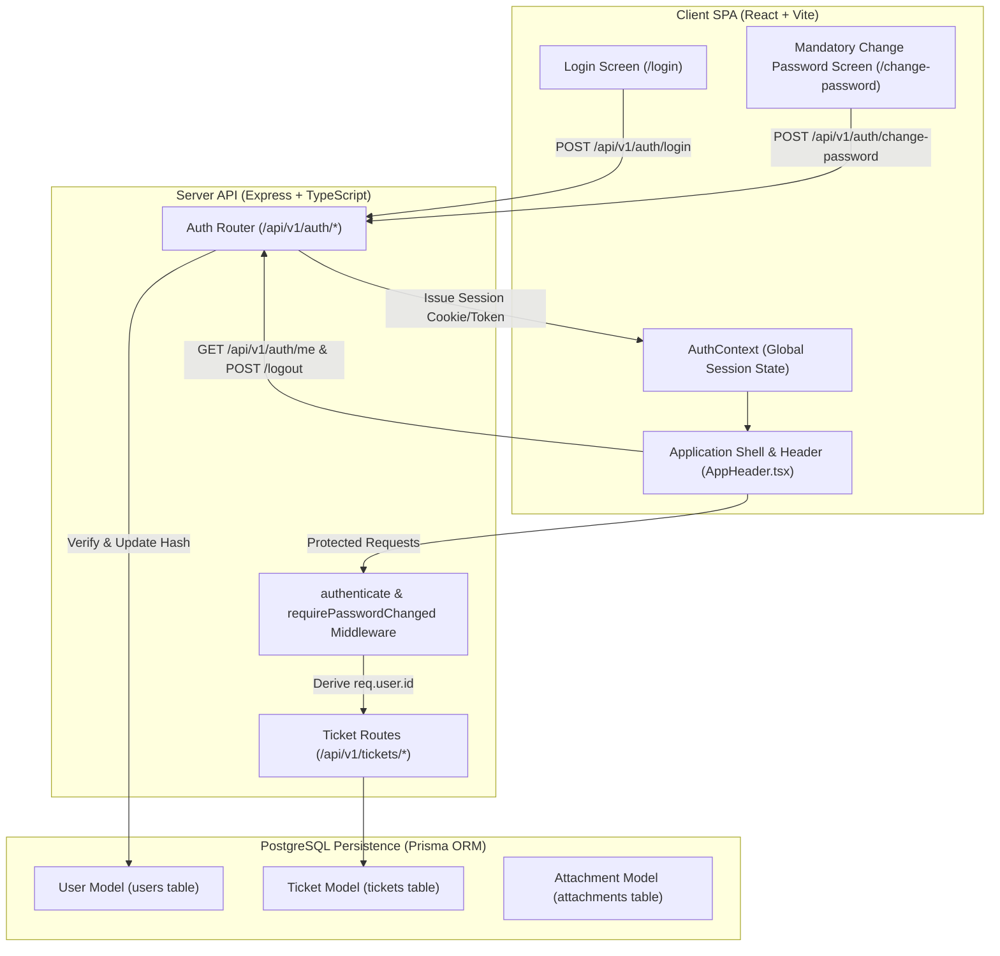
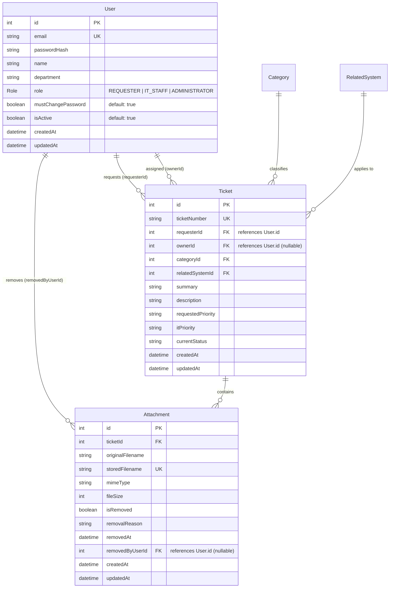
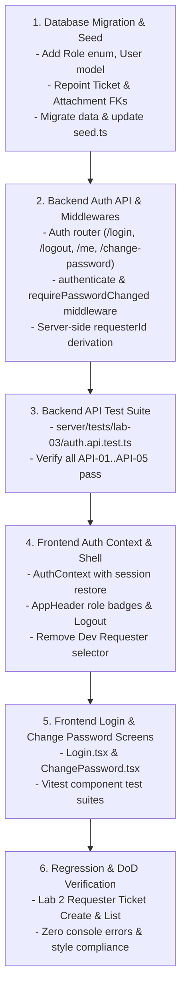

# Feature Engineering Contract: Issue 12 — Authentication Foundation, User Migration & Application Shell Navigation

**Feature Identifier:** Issue 12 (`feature/12-auth-and-shell`)  
**Sprint / Milestone:** TokTickIT Lab 3 (Sprint 3) — Users, Roles, IT Staff Ticketing, and Admin Screens  
**Target Branch:** `feature/12-auth-and-shell` (Base: `lab3-staging`)  
**Specification Version:** 1.0.0  
**Status:** PROPOSED FEATURE CONTRACT (Awaiting Peer Review)  
**Traceability References:**
- [Lab_3_sheet.pdf](../../reference/Lab_3_sheet.pdf) (§1, §3, §4.3, §4.4, §5.1–5.3, §6.1, §7, §8.1–8.2, §14)
- [TokTickIT-System-Level-SDS-v1.0.pdf](../../reference/TokTickIT-System-Level-SDS-v1.0.pdf) (SDS D-01..D-12, Security Architecture, API Standards)
- [docs/lab-03/specification.md](../../lab-03/specification.md) (FR-01, FR-02, BR-01, BR-02, BR-03, AC-01..AC-05)
- [docs/lab-03/ui-spec.md](../../lab-03/ui-spec.md) (DEC-UI-01..DEC-UI-05, Zen Green Tokens, Wireframes)
- [docs/lab-03/api-spec.md](../../lab-03/api-spec.md) (§1, §2: Auth Endpoints, Error Envelopes)
- [docs/lab-03/tests.md](../../lab-03/tests.md) (STS: API-01..API-05, UI-01, UI-02, E2E-01)
- [docs/lab-03/poc-scope-and-issues.md](../../lab-03/poc-scope-and-issues.md) (Issue 12 Detailed Scope & Dependencies)

---

## 1. Feature Scope & Objectives

### 1.1 Purpose & Problem Statement
In Sprint 2 (Lab 2), TokTickIT operated under a simulated development identity model where users were selected from a floating header modal (`RequesterSelector`), and identity was communicated across the frontend via `RequesterContext` and `sessionStorage`. No credential verification, authorization guards, or server-side session protections were present.

**Issue 12 delivers the production security and identity foundation for TokTickIT:**
1. Replaces the temporary Development Requester selector with secure authentication using hashed credentials (Argon2id or bcrypt) and opaque session tokens.
2. Migrates existing Lab 2 Requester user data (`requester_users`) into a unified `User` model (`users`) with zero data loss, preserving all existing ticket ownership and attachment relations.
3. Enforces mandatory first-login password changes for all newly provisioned accounts (`mustChangePassword: true`) through both server-side middleware route gating and client-side application shell routing locks.
4. Upgrades the Application Shell to derive active identity exclusively from the authenticated session, displaying the user's name, role badge pill (`Requester`, `IT Staff`, `Administrator`), and a functional Logout mechanism.
5. Guarantees Requester isolation by deriving `requesterId` strictly from the server-side authenticated session (`req.user.id`), discarding any client-supplied user IDs.



---

### 1.2 In-Scope Capabilities
* **Prisma Schema Evolution & Data Model Migration:**
  - Define `Role` enum (`REQUESTER`, `IT_STAFF`, `ADMINISTRATOR`).
  - Introduce `User` model mapping to PostgreSQL `users` table with fields: `id`, `email`, `passwordHash`, `name`, `department`, `role`, `mustChangePassword`, `isActive`, `createdAt`, `updatedAt`.
  - Update `Ticket` foreign key relation `requester` to point to `User(id)` via `requesterId`.
  - Update `Attachment` foreign key relation `removedByUser` to point to `User(id)` via `removedByUserId`.
  - Migration script that safely converts existing `requester_users` records into `users` without breaking foreign keys.
* **Idempotent Database Seeding (`server/prisma/seed.ts`):**
  - Populates seed accounts across all 3 roles: $\ge 4$ active Requesters, $\ge 1$ inactive Requester, $\ge 3$ active IT Staff, $\ge 1$ inactive IT Staff, and $\ge 1$ active Administrator.
  - Seeds secure initial password hashes (default: `Password123!`) with `mustChangePassword: true`.
  - Maintains PostgreSQL autoincrement sequence synchronization for `users`.
* **Backend Authentication & Security API:**
  - `POST /api/v1/auth/login`: Validates credentials, checks `isActive`, sets session cookie/token, returns user profile.
  - `POST /api/v1/auth/logout`: Clears session token/cookie on server and client.
  - `GET /api/v1/auth/me`: Returns authenticated session profile; returns `401 Unauthorized` if unauthenticated.
  - `POST /api/v1/auth/change-password`: Validates current password, enforces password complexity rules, updates hash, sets `mustChangePassword = false`.
* **Security & Route Protection Middleware:**
  - `authenticate`: Validates session cookie or Bearer token, extracts user, attaches `req.user`. Returns `401 Unauthorized` on failure.
  - `requirePasswordChanged` (BR-02): Blocks access to operational routes (`/api/v1/tickets/*`, `/api/v1/staff/*`, `/api/v1/admin/*`) when `req.user.mustChangePassword === true`.
  - `deriveRequesterIdentity` (BR-03): Forces `requesterId = req.user.id` on ticket creation and retrieval; ignores client body/query inputs.
  - Anti-enumeration defense (BR-01): Returns identical generic `401 Unauthorized` error responses for invalid passwords, nonexistent emails, and inactive accounts.
* **Frontend React Auth & Application Shell:**
  - `AuthContext` replacing `RequesterContext`: manages session lifecycle, initial load verification (`/api/v1/auth/me`), login, logout, and password change status.
  - `Login` screen (`/login`): Centered Zen Green card, email/password inputs, show/hide password toggle, loading spinner, and safe error alert.
  - `Mandatory Change Password` screen (`/change-password`): Current password, new password, confirmation inputs, dynamic interactive requirement checklist, prevents app navigation until saved.
  - `AppHeader` updates: Complete removal of simulated Dev Requester selector banner/modal; display of authenticated user name, role badge pill (`Requester`, `IT Staff`, `Administrator`), and working Logout action.
  - Role-based navigation rendering:
    - `REQUESTER`: "My Tickets", "+ Create Ticket"
    - `IT_STAFF`: "Ticket Queue", "+ Create Ticket"
    - `ADMINISTRATOR`: "User Management", "Ticket Queue"
* **Automated Verification:**
  - Supertest API test suite (`server/tests/lab-03/auth.api.test.ts`).
  - React Testing Library UI component test suites (`client/src/tests/lab-03/Login.test.tsx`, `client/src/tests/lab-03/ChangePassword.test.tsx`).

---

### 1.3 Explicit Exclusions (Strictly Out of Scope)
To prevent premature scope creep and honor course boundaries (§4.2 of Lab 3 Sheet), the following capabilities are **strictly prohibited**:
* **No Email Infrastructure:** No password reset via email, magic links, email activation, or SMTP/SES/SendGrid integration. Initial passwords and resets are handled strictly through the application or administrative screens.
* **No Social Login / SSO / OAuth:** No Google, GitHub, Microsoft 365, or SAML single sign-on.
* **No Self-Registration:** No public sign-up or user self-creation. All user accounts must be provisioned by an Administrator (or pre-seeded).
* **No Multi-Role Assignments:** Strictly one role per user (`REQUESTER`, `IT_STAFF`, or `ADMINISTRATOR`) adhering to BR-09. Multi-role selection or role hierarchies are prohibited.
* **No User Deletion / Hard Delete:** In accordance with system design constraints and course boundaries (§3.2 of specification.md), user accounts are never hard-deleted from the database; only soft-deactivation (`isActive = false`) is supported (administered in Issue 15).
* **No Multi-Factor Authentication (MFA/2FA):** No TOTP authenticator apps, SMS codes, or WebAuthn.
* **No IT Staff Operational Features:** IT Staff Ticket Queue (`/staff/tickets`), ticket assignment, IT Priority management, and status transitions belong to Issue 13 and Issue 14.
* **No Administrator User Management UI:** The `/admin/users` screen, create user modal, edit user modal, and reset password actions belong to Issue 15.

---

### 1.4 Mapped Requirements & Standards
| Requirement ID | Source Document | Description |
| :--- | :--- | :--- |
| **FR-01** | `docs/lab-03/specification.md` | User Authentication & Session Lifecycle (`/login`, `/logout`, `/me`). |
| **FR-02** | `docs/lab-03/specification.md` | Mandatory First-Login Password Change (`/change-password`). |
| **BR-01** | `docs/lab-03/specification.md` | Active account & valid credential verification without account enumeration. |
| **BR-02** | `docs/lab-03/specification.md` | Mandatory password change enforcement blocking normal app entry. |
| **BR-03** | `docs/lab-03/specification.md` | Session-derived Requester ownership; client-supplied IDs disregarded. |
| **BR-09** | `docs/lab-03/specification.md` | Single-role assignment policy (`REQUESTER`, `IT_STAFF`, `ADMINISTRATOR`). |
| **BR-10** | `docs/lab-03/specification.md` | Email uniqueness and case-insensitive normalization. |
| **DEC-UI-01..05** | `docs/lab-03/ui-spec.md` | Typography, Header User Pill, Role Nav, Login Card, Password Change Checklist. |
| **SDS D-04** | `TokTickIT-System-Level-SDS-v1.0.pdf` | Opaque server-side session cookies with HttpOnly, Secure, SameSite flags. |
| **SDS D-05** | `TokTickIT-System-Level-SDS-v1.0.pdf` | Safe error envelopes avoiding data and existence leaks. |

---

## 2. Database Migration & Seed Data Specification

### 2.1 Entity Evolution Overview
In Lab 2, identity was encapsulated in `RequesterUser` (`requester_users`). In Lab 3, this model evolves into the full `User` entity (`users`). All relational foreign keys on `Ticket` and `Attachment` are repointed to `users`.



---

### 2.2 Prisma Schema Specification (`server/prisma/schema.prisma`)

```prisma
datasource db {
  provider = "postgresql"
  url      = env("DATABASE_URL")
}

generator client {
  provider = "prisma-client-js"
}

// ---------------------------------------------------------------------------
// 1. Role Enum (Strict Single-Role Model per BR-09)
// ---------------------------------------------------------------------------
enum Role {
  REQUESTER
  IT_STAFF
  ADMINISTRATOR
}

// ---------------------------------------------------------------------------
// 2. Production User Model (Evolved from RequesterUser)
// ---------------------------------------------------------------------------
model User {
  id                 Int              @id @default(autoincrement())
  email              String           @unique
  passwordHash       String
  name               String
  department         String?
  role               Role             @default(REQUESTER)
  mustChangePassword Boolean          @default(true)
  isActive           Boolean          @default(true)
  createdAt          DateTime         @default(now())
  updatedAt          DateTime         @updatedAt

  // Relational Integrity
  requestedTickets   Ticket[]         @relation("RequesterTickets")
  assignedTickets    Ticket[]         @relation("StaffAssignedTickets")
  removedAttachments Attachment[]     @relation("UserRemovedAttachments")

  @@map("users")
}

// ---------------------------------------------------------------------------
// 3. Related System Model (Preserved from Lab 2)
// ---------------------------------------------------------------------------
model RelatedSystem {
  id        Int      @id @default(autoincrement())
  name      String   @unique
  isActive  Boolean  @default(true)
  createdAt DateTime @default(now())
  updatedAt DateTime @updatedAt

  tickets   Ticket[]

  @@map("related_systems")
}

// ---------------------------------------------------------------------------
// 4. Category Model (Preserved from Lab 1 & 2)
// ---------------------------------------------------------------------------
model Category {
  id          Int      @id @default(autoincrement())
  code        String?  @unique
  name        String   @unique
  description String?
  isActive    Boolean  @default(true)
  createdAt   DateTime @default(now())
  updatedAt   DateTime @updatedAt

  tickets     Ticket[]

  @@map("categories")
}

// ---------------------------------------------------------------------------
// 5. Ticket Model (Updated Foreign Keys & Nullable ownerId)
// ---------------------------------------------------------------------------
model Ticket {
  id                             Int           @id @default(autoincrement())
  ticketNumber                   String        @unique @db.VarChar(32) // TKT-YYYY-NNNNN
  requesterId                    Int
  ownerId                        Int?
  categoryId                     Int
  relatedSystemId                Int
  summary                        String        @db.VarChar(100)
  description                    String        @db.Text
  requestedPriority              String        // Low, Medium, High, Urgent
  itPriority                     String?       // Low, Medium, High, Urgent
  currentStatus                  String        @default("New")
  requesterResolutionConfirmedAt DateTime?
  version                        Int           @default(1)
  createdAt                      DateTime      @default(now())
  updatedAt                      DateTime      @updatedAt

  // Relations
  requester                      User          @relation("RequesterTickets", fields: [requesterId], references: [id], onDelete: Restrict)
  owner                          User?         @relation("StaffAssignedTickets", fields: [ownerId], references: [id], onDelete: SetNull)
  category                       Category      @relation(fields: [categoryId], references: [id], onDelete: Restrict)
  relatedSystem                  RelatedSystem @relation(fields: [relatedSystemId], references: [id], onDelete: Restrict)
  attachments                    Attachment[]

  @@index([requesterId])
  @@index([ownerId])
  @@index([currentStatus])
  @@map("tickets")
}

// ---------------------------------------------------------------------------
// 6. Attachment Model (Updated Foreign Key to User)
// ---------------------------------------------------------------------------
model Attachment {
  id               Int       @id @default(autoincrement())
  ticketId         Int
  originalFilename String
  storedFilename   String    @unique
  mimeType         String
  fileSize         Int
  isRemoved        Boolean   @default(false)
  removalReason    String?   @db.Text
  removedAt        DateTime?
  removedByUserId  Int?
  createdAt        DateTime  @default(now())
  updatedAt        DateTime  @updatedAt

  // Relations
  ticket           Ticket    @relation(fields: [ticketId], references: [id], onDelete: Cascade)
  removedByUser    User?     @relation("UserRemovedAttachments", fields: [removedByUserId], references: [id], onDelete: SetNull)

  @@index([ticketId])
  @@map("attachments")
}

// ---------------------------------------------------------------------------
// 7. Ticket Number Sequence (Preserved from Lab 2)
// ---------------------------------------------------------------------------
model TicketNumberSequence {
  year    Int @id
  nextVal Int @default(1)

  @@map("ticket_number_sequences")
}
```

---

### 2.3 Migration Strategy & Relational Data Preservation
To achieve **100% Zero Data Loss** on existing developer databases, the migration executes the following sequence:

1. **Step 1: Create Role Enum & Users Table**
   ```sql
   CREATE TYPE "Role" AS ENUM ('REQUESTER', 'IT_STAFF', 'ADMINISTRATOR');

   CREATE TABLE "users" (
       "id" SERIAL NOT NULL,
       "email" TEXT NOT NULL,
       "passwordHash" TEXT NOT NULL,
       "name" TEXT NOT NULL,
       "department" TEXT,
       "role" "Role" NOT NULL DEFAULT 'REQUESTER',
       "mustChangePassword" BOOLEAN NOT NULL DEFAULT true,
       "isActive" BOOLEAN NOT NULL DEFAULT true,
       "createdAt" TIMESTAMP(3) NOT NULL DEFAULT CURRENT_TIMESTAMP,
       "updatedAt" TIMESTAMP(3) NOT NULL DEFAULT CURRENT_TIMESTAMP,
       CONSTRAINT "users_pkey" PRIMARY KEY ("id")
   );
   CREATE UNIQUE INDEX "users_email_key" ON "users"("email");
   ```

2. **Step 2: Copy Data from `requester_users` into `users`**
   Migrate all existing records preserving exact primary key `id` values:
   ```sql
   INSERT INTO "users" ("id", "name", "email", "department", "isActive", "createdAt", "updatedAt", "passwordHash", "role", "mustChangePassword")
   SELECT 
       "id", 
       "name", 
       LOWER("email"), 
       "department", 
       "isActive", 
       "createdAt", 
       "updatedAt", 
       '$2b$10$wE9l1eF5u51268mX0.9UteS6pZzGZ2yYpP6tF5xN8hT2J1v5mR1qG', -- Hash of 'Password123!'
       'REQUESTER'::"Role", 
       true
   FROM "requester_users"
   ON CONFLICT ("id") DO NOTHING;
   ```

3. **Step 3: Repoint Foreign Key Constraints**
   ```sql
   -- Repoint tickets.requesterId
   ALTER TABLE "tickets" DROP CONSTRAINT IF EXISTS "tickets_requesterId_fkey";
   ALTER TABLE "tickets" ADD CONSTRAINT "tickets_requesterId_fkey" 
       FOREIGN KEY ("requesterId") REFERENCES "users"("id") ON DELETE RESTRICT ON UPDATE CASCADE;

   -- Repoint attachments.removedByRequesterId to removedByUserId
   ALTER TABLE "attachments" DROP CONSTRAINT IF EXISTS "attachments_removedByRequesterId_fkey";
   DO $$
   BEGIN
       IF EXISTS (SELECT 1 FROM information_schema.columns WHERE table_name = 'attachments' AND column_name = 'removedByRequesterId') THEN
           ALTER TABLE "attachments" RENAME COLUMN "removedByRequesterId" TO "removedByUserId";
       END IF;
   END $$;

   ALTER TABLE "attachments" ADD CONSTRAINT "attachments_removedByUserId_fkey" 
       FOREIGN KEY ("removedByUserId") REFERENCES "users"("id") ON DELETE SET NULL ON UPDATE CASCADE;

   -- Add ownerId column to tickets if not present
   ALTER TABLE "tickets" ADD COLUMN IF NOT EXISTS "ownerId" INTEGER;
   ALTER TABLE "tickets" ADD CONSTRAINT "tickets_ownerId_fkey" 
       FOREIGN KEY ("ownerId") REFERENCES "users"("id") ON DELETE SET NULL ON UPDATE CASCADE;
   ```

4. **Step 4: Synchronize PostgreSQL Sequences**
   Ensure the `users_id_seq` matches the maximum migrated `id`:
   ```sql
   SELECT setval(pg_get_serial_sequence('users', 'id'), coalesce(max(id), 1)) FROM "users";
   ```

5. **Step 5: Safely Drop Legacy Table**
   Once foreign keys are confirmed:
   ```sql
   DROP TABLE IF EXISTS "requester_users";
   ```

---

### 2.4 Seed Data Requirements (`server/prisma/seed.ts`)
The seed pipeline must be strictly **idempotent** (no duplicate key errors on re-run, no table truncations) and seed the following minimum required accounts:

| ID | Name | Email Address | Role | Status | Initial Password | mustChangePassword | Notes / Persona |
| :---: | :--- | :--- | :--- | :---: | :--- | :---: | :--- |
| **1** | Admin User | `admin@kmutt.ac.th` | `ADMINISTRATOR` | Active | `Password123!` | `true` | System Administrator account |
| **2** | Sompong IT | `sompong.it@kmutt.ac.th` | `IT_STAFF` | Active | `Password123!` | `true` | Primary IT Staff persona |
| **3** | Wichai IT | `wichai.it@kmutt.ac.th` | `IT_STAFF` | Active | `Password123!` | `true` | Secondary IT Staff persona |
| **4** | Thana IT | `thana.it@kmutt.ac.th` | `IT_STAFF` | Active | `Password123!` | `true` | Tertiary IT Staff persona |
| **5** | Kanya Inactive IT | `kanya.ina@kmutt.ac.th` | `IT_STAFF` | Inactive | `Password123!` | `true` | Deactivated IT Staff persona |
| **6** | Jennifer Anderson | `jennifer.anderson@kmutt.ac.th` | `REQUESTER` | Active | `Password123!` | `true` | Faculty Requester (22 demo tickets) |
| **7** | Michael Brown | `michael.brown@kmutt.ac.th` | `REQUESTER` | Active | `Password123!` | `true` | Administrative Requester (2 demo tickets) |
| **8** | David Lee | `david.lee@kmutt.ac.th` | `REQUESTER` | Active | `Password123!` | `true` | Teaching Assistant Requester (2 demo tickets) |
| **9** | Sarah Johnson | `sarah.johnson@kmutt.ac.th` | `REQUESTER` | Active | `Password123!` | `true` | Student Requester (0 demo tickets) |
| **10** | Inactive Test User | `inactive.user@kmutt.ac.th` | `REQUESTER` | Inactive | `Password123!` | `true` | Deactivated Requester (Filtered out) |
| **11** | Prasert Inactive | `prasert.ina@kmutt.ac.th` | `REQUESTER` | Inactive | `Password123!` | `true` | Peer reviewer inactive persona |

* **Standard Password Hash**: All accounts seeded with `bcrypt.hashSync("Password123!", 10)`.
* **Idempotency Guarantee**: Keyed on lowercase `email`. `upsert` updates `name`, `role`, `isActive`, and `passwordHash` without generating new IDs or breaking foreign keys.

---

## 3. API & Security Protocols

### 3.1 Standard Response & Safe Error Envelopes

All responses follow the System-Level SDS standard envelope format:

#### Success Envelope (`200 OK`, `201 Created`)
```json
{
  "success": true,
  "data": { ... }
}
```

#### Safe Error Envelope (`400`, `401`, `403`, `409`, `422`)
```json
{
  "success": false,
  "error": {
    "code": "INVALID_CREDENTIALS",
    "message": "Invalid email address or password.",
    "fieldErrors": []
  }
}
```

---

### 3.2 Endpoint Specifications

#### 1. User Login
* **Route:** `POST /api/v1/auth/login` (Alias: `POST /api/auth/login`)
* **Access Level:** Public (Unauthenticated)
* **Request Headers:** `Content-Type: application/json`
* **Request Body:**
  ```json
  {
    "email": "sarah.johnson@kmutt.ac.th",
    "password": "Password123!"
  }
  ```
* **Validation Rules:**
  - `email`: Required, valid email format, trimmed, lowercase normalized.
  - `password`: Required, non-empty string.
* **Business Logic & Safe Error Protection (`BR-01`):**
  1. Lookup user by lowercase email: `prisma.user.findUnique({ where: { email: email.toLowerCase() } })`.
  2. If user does NOT exist, or `user.isActive === false`, or `bcrypt.compareSync(password, user.passwordHash) === false`:
     - Return **`401 Unauthorized`** with code `"INVALID_CREDENTIALS"` and message `"Invalid email address or password."`.
     - **Security Rule (BR-01):** The response MUST NOT leak whether the email exists, whether the password was wrong, or whether the account is deactivated.
  3. If credentials are valid:
     - Generate an opaque session identifier (`toktickit_session`).
     - Attach session to server session store / signed cookie (`HttpOnly; Path=/; SameSite=Lax`).
     - Return **`200 OK`** with user profile:
       ```json
       {
         "success": true,
         "data": {
           "user": {
             "id": 9,
             "email": "sarah.johnson@kmutt.ac.th",
             "name": "Sarah Johnson",
             "role": "REQUESTER",
             "mustChangePassword": true
           },
           "token": "toktickit_session_abc123"
         }
       }
       ```

---

#### 2. User Logout
* **Route:** `POST /api/v1/auth/logout` (Alias: `POST /api/auth/logout`)
* **Access Level:** Authenticated (Any role)
* **Request Headers:** Session cookie or `Authorization: Bearer <token>`
* **Business Logic:**
  1. Invalidate session token in server session store.
  2. Clear session cookie: `res.clearCookie('toktickit_session', { path: '/' })`.
  3. Return **`200 OK`**:
     ```json
     {
       "success": true,
       "data": {
         "message": "Successfully logged out."
       }
     }
     ```
  4. Subsequent requests using the old token/cookie return **`401 Unauthorized`**.

---

#### 3. Current Authenticated Profile
* **Route:** `GET /api/v1/auth/me` (Alias: `GET /api/auth/me`)
* **Access Level:** Authenticated (Any role)
* **Response `200 OK`:**
  ```json
  {
    "success": true,
    "data": {
      "id": 9,
      "email": "sarah.johnson@kmutt.ac.th",
      "name": "Sarah Johnson",
      "role": "REQUESTER",
      "mustChangePassword": false
    }
  }
  ```
* **Response `401 Unauthorized`:** If session cookie/token is absent, invalid, expired, or belongs to an inactive user:
  ```json
  {
    "success": false,
    "error": {
      "code": "UNAUTHORIZED",
      "message": "Authentication required."
    }
  }
  ```

---

#### 4. Mandatory Password Change
* **Route:** `POST /api/v1/auth/change-password` (Alias: `POST /api/auth/change-password`)
* **Access Level:** Authenticated (Any role, specifically permitted when `mustChangePassword === true`)
* **Request Body:**
  ```json
  {
    "currentPassword": "Password123!",
    "newPassword": "SecureZenPassword2026!",
    "confirmPassword": "SecureZenPassword2026!"
  }
  ```
* **Validation & Complexity Rules (`FR-02`, `BR-02`):**
  - `currentPassword`: Must match user's current `passwordHash`. If incorrect, return **`422 Unprocessable Entity`** with `"Current password does not match"`.
  - `newPassword` complexity rules:
    1. Minimum 8 characters.
    2. At least 1 uppercase English letter (`[A-Z]`).
    3. At least 1 lowercase English letter (`[a-z]`).
    4. At least 1 digit (`[0-9]`).
    5. At least 1 special character (`[!@#$%^&*()_+\-=\[\]{};':"\\|,.<>\/?]`).
    6. Must NOT match `currentPassword`.
  - `confirmPassword`: Must match `newPassword` character-for-character.
* **Failure Response `422 Unprocessable Entity`:**
  ```json
  {
    "success": false,
    "error": {
      "code": "VALIDATION_FAILED",
      "message": "Password does not meet complexity requirements.",
      "fieldErrors": [
        { "field": "newPassword", "message": "Password must include at least 1 special character." }
      ]
    }
  }
  ```
* **Success Response `200 OK`:**
  ```json
  {
    "success": true,
    "data": {
      "message": "Password updated successfully."
    }
  }
  ```
  - State Mutation: Hashes `newPassword`, updates `passwordHash` in PostgreSQL, and sets `mustChangePassword = false`.

---

### 3.3 Security Middleware Architecture

#### 1. `authenticate` Middleware
- Extracts token from `req.cookies.toktickit_session` or `Authorization: Bearer <token>`.
- Resolves session to user record in PostgreSQL.
- Verifies `user.isActive === true`.
- Populates `req.user = { id: user.id, email: user.email, name: user.name, role: user.role, mustChangePassword: user.mustChangePassword }`.
- Rejects missing, invalid, or inactive sessions with `401 Unauthorized`.

#### 2. `requirePasswordChanged` Middleware (`BR-02`)
- Applied globally to all operational business routes (`/api/v1/tickets/*`, `/api/v1/staff/*`, `/api/v1/admin/*`, `/api/v1/attachments/*`).
- Explicitly excludes: `/api/v1/auth/me`, `/api/v1/auth/change-password`, `/api/v1/auth/logout`.
- If `req.user.mustChangePassword === true`:
  - Terminates request immediately with **`403 Forbidden`**:
    ```json
    {
      "success": false,
      "error": {
        "code": "PASSWORD_CHANGE_REQUIRED",
        "message": "Mandatory password change required before accessing application resources."
      }
    }
    ```

#### 3. Session-Derived Identity Protection (`BR-03`)
- In `POST /api/v1/tickets` (ticket creation) and `GET /api/v1/tickets` (requester tickets listing):
  - The controller strictly assigns `requesterId = req.user.id`.
  - Any client-submitted `requesterId` in request body, URL query string, or headers is completely disregarded.

---

## 4. UI Wireframe & State Contracts

### 4.1 Zen Green UI Tokens & Compliance
All UI screens strictly honor the KMUTT **Zen Green** design tokens defined in `client/src/index.css`:
- `--color-primary-green`: `#006B3C` (Headers, primary submit buttons, brand elements)
- `--color-secondary-green`: `#0B7A46` (Hover states, focus rings, active indicator)
- `--color-pale-green`: `#EAF6EF` (Requester badge surface, subtle row highlights)
- `--color-page-bg`: `#F5F7F6` (Quiet background)
- `--color-surface-card`: `#FFFFFF` (Card panels and modals)
- `--color-danger`: `#B3261E` / `--color-danger-bg`: `#FDF2F2` (Error banners)
- Accessibility: Non-color-only indications (text labels + SVG icons), `data-tooltip` on interactive controls (no HTML `title`), minimum touch targets $\ge 44\text{px} \times 44\text{px}$.

---

### 4.2 Login Screen Wireframe (`/login`)
```
+-------------------------------------------------------------------------+
|                                                                         |
|                         [ TokTickIT Brand Logo ]                        |
|                          IT Service Desk Portal                         |
|                                                                         |
|            +-----------------------------------------------+            |
|            |  Sign In to Your Account                      |            |
|            |  Enter your institutional credentials below   |            |
|            |                                               |            |
|            |  [!] Invalid email address or password.       |            |
|            |                                               |            |
|            |  Email Address *                              |            |
|            |  [ user@kmutt.ac.th                         ] |            |
|            |                                               |            |
|            |  Password *                                   |            |
|            |  [ ****************                   [👁]  ] |            |
|            |                                               |            |
|            |  +-----------------------------------------+  |            |
|            |  | [Sign In]                               |  |            |
|            |  +-----------------------------------------+  |            |
|            |                                               |            |
|            +-----------------------------------------------+            |
|                                                                         |
+-------------------------------------------------------------------------+
```

* **Component Elements & State Behaviors:**
  - **Form Container:** Centered card, `max-width: 420px`, `box-shadow: var(--shadow-card)`, `border-radius: 8px`.
  - **Email Field:** `<input type="email">`, `id="login-email"`, auto-focus on page mount, placeholder `e.g. user@kmutt.ac.th`.
  - **Password Field:** `<input type="password">`, `id="login-password"`, with show/hide password toggle button (`aria-label="Toggle password visibility"`).
  - **Submit Action:** Full-width primary button (`.btn-primary-green`). When submitting, button is disabled and displays an inline spinner with text `"Signing in..."`.
  - **Blur Validation Rule:** If user blurs an empty input without typing, invalid input blanks out. Form-level errors only appear upon clicking "Sign In".
  - **Error Alert Banner:** Displays at the top of the card (`.alert .alert-danger`) upon receiving `401 Unauthorized`. Generic safe text: `"Invalid email address or password."`.

---

### 4.3 Mandatory Change Password Screen Wireframe (`/change-password`)
```
+-------------------------------------------------------------------------+
| [TokTickIT Header]                   [Sarah Johnson (Requester)] [Logout|
+-------------------------------------------------------------------------+
|                                                                         |
|            +-----------------------------------------------+            |
|            |  Password Change Required                     |            |
|            |  You must choose a new secure password before |            |
|            |  entering the TokTickIT Service Desk.         |            |
|            |                                               |            |
|            |  Current Password *                           |            |
|            |  [ ****************                         ] |            |
|            |                                               |            |
|            |  New Password *                               |            |
|            |  [ ****************                         ] |            |
|            |                                               |            |
|            |  Password Requirements:                       |            |
|            |  [✓] Minimum 8 characters                     |            |
|            |  [✓] At least 1 uppercase letter (A-Z)        |            |
|            |  [✓] At least 1 lowercase letter (a-z)        |            |
|            |  [✓] At least 1 number (0-9)                  |            |
|            |  [✓] At least 1 special character (!@#$%^&*)  |            |
|            |  [✓] Different from current password          |            |
|            |                                               |            |
|            |  Confirm New Password *                       |            |
|            |  [ ****************                         ] |            |
|            |  [✓] Passwords match                          |            |
|            |                                               |            |
|            |  +-----------------------------------------+  |            |
|            |  | [Update Password & Continue]            |  |            |
|            |  +-----------------------------------------+  |            |
|            +-----------------------------------------------+            |
|                                                                         |
+-------------------------------------------------------------------------+
```

* **Component Elements & State Behaviors (`DEC-UI-05`, `BR-02`):**
  - **Navigation Block:** Normal navigation links ("My Tickets", "+ Create Ticket", "Queue") are completely hidden from the header. Only the user profile pill and the Logout action remain accessible.
  - **Dynamic Requirement Checklist:**
    - Live regex evaluation on each keystroke in `newPassword` and `confirmPassword`.
    - Met rules render with green checkmark `[✓]` and `--color-success` (`#2E7D32`).
    - Unmet rules render with neutral outline `[ ]` and `--color-text-muted`.
  - **Submit Button:** Disabled until ALL 7 checklist criteria are satisfied.
  - **Submission Flow:**
    - Submitting executes `POST /api/v1/auth/change-password`.
    - On success: updates local auth state (`mustChangePassword: false`) and redirects automatically to the role's default landing page ("My Tickets" for Requesters, "Ticket Queue" for IT Staff, "User Management" for Admins).

---

### 4.4 Application Shell & Header Updates (`AppHeader.tsx`, `App.tsx`)

#### Decommissioning Lab 2 Dev Requester Selector
- Completely remove `RequesterSelector.tsx` modal, context switch buttons, and simulated persona warning banner.
- Remove `RequesterContext.tsx` in favor of production `AuthContext.tsx`.
- Purge `toktickit_active_requester` from `sessionStorage`.

#### Desktop Shell Header Layout ($\ge 1200\text{px}$)
```
+----------------------------------------------------------------------------------------------------+
| [TokTickIT Logo] TokTickIT  My Tickets   + Create Ticket          [Sarah Johnson (Requester) v] [⎋]|
+----------------------------------------------------------------------------------------------------+
```
1. **Brand:** TokTickIT green logo with "IT Service Desk" badge.
2. **Role-Specific Nav Navigation:**
   - `REQUESTER`: `[ My Tickets ]`, `[ + Create Ticket ]`
   - `IT_STAFF`: `[ Ticket Queue ]`, `[ + Create Ticket ]`
   - `ADMINISTRATOR`: `[ User Management ]`, `[ Ticket Queue ]`
   - Active tab highlighted with white underline (`borderBottom: 2px solid #ffffff`) and bold font weight.
3. **User Profile Section (Top Right):**
   - User display name with role badge pill:
     - `Requester`: pale green badge (`#EAF6EF`, text `#006B3C`).
     - `IT Staff`: slate grey badge (`#EEF2F6`, text `#1E293B`).
     - `Administrator`: amber/purple badge (`#FEF3C7`, text `#92400E`).
   - Logout button (`data-testid="logout-button"`): Triggers `POST /api/v1/auth/logout`, purges client session, and returns user to `/login`.

#### Mobile Shell Header Layout ($< 768\text{px}$)
- Zero horizontal scroll (`overflow-x: hidden`, `width: 100%`).
- Hamburger toggle button (`aria-label="Toggle navigation"`, touch target $44\text{px} \times 44\text{px}$).
- Collapsed drawer reveals role-based navigation links, user name, role pill, and Logout action.

---

## 5. Test Traceability Matrix

### 5.1 Acceptance Criteria Traceability

| Acceptance Criterion | Requirement Summary | Planned Test IDs | Automated Test File Path |
| :---: | :--- | :---: | :--- |
| **AC-01** / **AC-12.1** | Valid user login & session establishment | `API-01`, `UI-01` | `server/tests/lab-03/auth.api.test.ts`<br/>`client/src/tests/lab-03/Login.test.tsx` |
| **AC-02** / **AC-12.2** | Safe rejection of invalid passwords and inactive accounts | `API-02`, `UI-01` | `server/tests/lab-03/auth.api.test.ts`<br/>`client/src/tests/lab-03/Login.test.tsx` |
| **AC-03** / **AC-12.3** | Mandatory password change intercept & complexity enforcement | `API-03`, `UI-02` | `server/tests/lab-03/auth.api.test.ts`<br/>`client/src/tests/lab-03/ChangePassword.test.tsx` |
| **AC-04** / **AC-12.4** | Session-derived Requester ownership isolation | `API-05` | `server/tests/lab-03/auth.api.test.ts` |
| **AC-05** / **AC-12.5** | Logout session invalidation | `API-04` | `server/tests/lab-03/auth.api.test.ts` |

---

### 5.2 Test Specifications per Target File

#### 1. Backend API Tests: `server/tests/lab-03/auth.api.test.ts`
* **Test Case 1 (API-01: Valid Login):**
  - Given an active user (`sarah.johnson@kmutt.ac.th`, password `Password123!`).
  - When `POST /api/v1/auth/login` is called.
  - Then returns HTTP `200 OK`, returns user payload (`id`, `name`, `email`, `role`, `mustChangePassword`), and sets `toktickit_session` cookie.
* **Test Case 2 (API-02: Invalid Password Safe Rejection):**
  - Given an active user with incorrect password (`WrongPassword123!`).
  - When `POST /api/v1/auth/login` is called.
  - Then returns HTTP `401 Unauthorized` with generic safe error envelope (`code: "INVALID_CREDENTIALS"`).
* **Test Case 3 (API-02: Inactive Account Safe Rejection):**
  - Given a deactivated user (`inactive.user@kmutt.ac.th`, valid password `Password123!`).
  - When `POST /api/v1/auth/login` is called.
  - Then returns HTTP `401 Unauthorized` with identical generic safe error envelope without leaking inactive status.
* **Test Case 4 (API-03: Mandatory Password Change Route Gating):**
  - Given an authenticated session for a user with `mustChangePassword === true`.
  - When attempting to access `GET /api/v1/tickets`.
  - Then the server blocks the request with HTTP `403 Forbidden` (`PASSWORD_CHANGE_REQUIRED`).
* **Test Case 5 (API-03: Successful Password Change Execution):**
  - Given an authenticated user with `mustChangePassword === true`.
  - When submitting `POST /api/v1/auth/change-password` with valid current password and complex new password (`SecureZenPass2026!`).
  - Then returns HTTP `200 OK`, updates database `passwordHash`, sets `mustChangePassword = false`, and subsequent calls to `GET /api/v1/tickets` succeed.
* **Test Case 6 (API-03: Password Complexity Failures):**
  - When new password is $<8$ characters, lacks uppercase, lowercase, digit, or special character, or matches current password.
  - Then returns HTTP `422 Unprocessable Entity` with specific validation error messages.
* **Test Case 7 (API-04: Logout Session Invalidation):**
  - Given an active authenticated session.
  - When calling `POST /api/v1/auth/logout`.
  - Then returns HTTP `200 OK`, clears session cookie, and immediate next call to `GET /api/v1/auth/me` returns HTTP `401 Unauthorized`.
* **Test Case 8 (API-05: Server-Side Requester ID Derivation):**
  - Given an authenticated Requester (User ID 6).
  - When calling `POST /api/v1/tickets` with payload specifying `"requesterId": 999`.
  - Then created ticket record has `requesterId = 6` in PostgreSQL; client-supplied ID is completely ignored.

---

#### 2. Frontend UI Tests: `client/src/tests/lab-03/Login.test.tsx`
* **Test Case 1 (UI-01: Form Rendering):**
  - Renders email input, password input, show/hide password toggle, and "Sign In" button.
* **Test Case 2 (UI-01: Form Validation):**
  - Submitting empty form triggers validation indicators.
  - Invalid email format shows validation message on submit.
* **Test Case 3 (UI-01: Busy Spinner State):**
  - While login request is in flight, "Sign In" button is disabled and displays spinner with "Signing in...".
* **Test Case 4 (UI-01: Safe Error Alert):**
  - When API returns `401 Unauthorized`, an accessible red alert banner displays `"Invalid email address or password."`.
* **Test Case 5 (UI-01: Successful Login):**
  - Submitting valid credentials updates `AuthContext` and transitions user out of the login screen.

---

#### 3. Frontend UI Tests: `client/src/tests/lab-03/ChangePassword.test.tsx`
* **Test Case 1 (UI-02: Checklist State Machine):**
  - Live typing in new password field dynamically toggles checklist icons:
    - Typo without special char shows special char item as unmet `[ ]`.
    - Adding special char flips item to met `[✓]`.
* **Test Case 2 (UI-02: Password Confirmation Mismatch):**
  - When `confirmPassword` does not match `newPassword`, confirmation checklist item remains unmet and submit button remains disabled.
* **Test Case 3 (UI-02: Submit Button Gating):**
  - Submit button remains strictly disabled until all complexity requirements and confirmation match are fulfilled.
* **Test Case 4 (UI-02: Successful Submission):**
  - Clicking "Update Password & Continue" calls `POST /api/v1/auth/change-password`, updates context, and navigates into main application shell.

---

## 6. Implementation Checklist & Verification Gates



- [ ] **Gate 1: Data Model & Seed Verification**
  - `npx prisma migrate dev` completes with zero foreign key breakage.
  - `npm run prisma:seed` in `server/` populates all 11 user accounts idempotently.
  - Database sequences verified via `SELECT setval(...)`.
- [ ] **Gate 2: Backend Security & Middleware Gate**
  - `server/tests/lab-03/auth.api.test.ts` passes 100% with `npm test`.
  - Inactive accounts and invalid passwords return identical safe error envelopes.
  - Operational routes block requests when `mustChangePassword === true`.
- [ ] **Gate 3: Frontend Component & Shell Gate**
  - `client/src/tests/lab-03/Login.test.tsx` passes 100%.
  - `client/src/tests/lab-03/ChangePassword.test.tsx` passes 100%.
  - Dev Requester selector completely eradicated from the UI.
  - Responsive header displays user name and role badge pill.
- [ ] **Gate 4: Requester Feature Continuity**
  - Existing ticket creation and My Tickets views operate seamlessly using `req.user.id`.
  - Attachments viewable and downloadable by authenticated owner.
