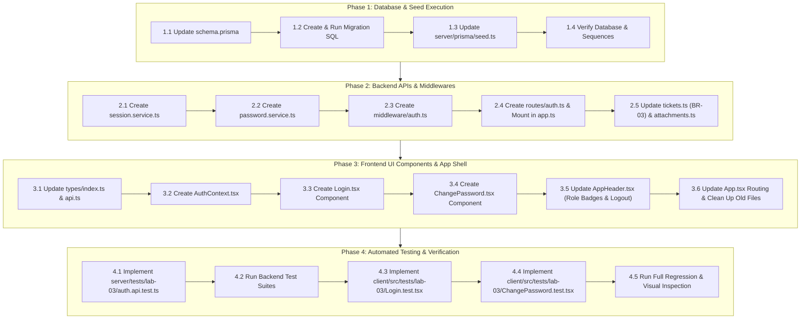

# Technical Implementation Plan: Issue 12 — Authentication Foundation, User Migration & Application Shell Navigation

**Feature Identifier:** Issue 12 (`feature/12-auth-and-shell`)  
**Sprint / Milestone:** TokTickIT Lab 3 (Sprint 3) — Users, Roles, IT Staff Ticketing, and Admin Screens  
**Target Branch:** `feature/12-auth-and-shell` (Base: `lab3-staging`)  
**Specification Version:** 1.0.0  
**Authoritative Contract Reference:** [contract.md](./contract.md)  
**Status:** PROPOSED IMPLEMENTATION PLAN (Awaiting Peer Review)

---

## 1. Target File Inventory

The following table itemizes all files to be created, modified, or removed across the repository.

| Action | File Path | Component / Layer | Responsibility & Key Changes |
| :--- | :--- | :--- | :--- |
| **`[MODIFY]`** | `server/prisma/schema.prisma` | Database / Prisma | Add `Role` enum, `User` model (`users`), repoint `Ticket.requesterId` and `Attachment.removedByUserId` to `User`. |
| **`[NEW]`** | `server/prisma/migrations/20260914000000_init_lab3_auth/migration.sql` | Database / Migration | SQL migration preserving data from `requester_users` into `users`, repointing foreign keys, advancing `users_id_seq`, and dropping `requester_users`. |
| **`[MODIFY]`** | `server/prisma/seed.ts` | Database / Seed | Idempotent upsert of 11 user accounts (Requesters, IT Staff, Administrator) with bcrypt hashes and sequence synchronization. |
| **`[NEW]`** | `server/src/services/session.service.ts` | Backend / Service | Opaque server-side session token generator, session storage, lookup, invalidation, and extraction from cookies/headers. |
| **`[NEW]`** | `server/src/services/password.service.ts` | Backend / Service | Password hashing (`bcryptjs`), comparison, and complexity validation (minimum 8 characters, uppercase, lowercase, digit, special character). |
| **`[NEW]`** | `server/src/middleware/auth.ts` | Backend / Middleware | `authenticate` (session verification & `req.user` attachment) and `requirePasswordChanged` (BR-02 operational route block). |
| **`[NEW]`** | `server/src/routes/auth.ts` | Backend / Router | Handlers for `POST /login`, `POST /logout`, `GET /me`, and `POST /change-password`. |
| **`[MODIFY]`** | `server/src/app.ts` | Backend / App | Mount `/api/v1/auth` and alias `/api/auth`; register auth middleware on operational routes. |
| **`[MODIFY]`** | `server/src/routes/tickets.ts` | Backend / Router | Enforce server-side session derivation of `requesterId = req.user.id` (`BR-03`), ignoring client-supplied IDs. |
| **`[MODIFY]`** | `server/src/routes/attachments.ts` | Backend / Router | Update soft-removal foreign key references to `removedByUserId` from `User`. |
| **`[MODIFY]`** | `client/src/types/index.ts` | Frontend / Types | Define `UserRole`, `AuthUser`, `LoginPayload`, `ChangePasswordPayload`, and updated `Attachment` interface. |
| **`[MODIFY]`** | `client/src/api.ts` | Frontend / API | Implement `loginApi`, `logoutApi`, `getMeApi`, and `changePasswordApi` with credentials and error handling. |
| **`[NEW]`** | `client/src/context/AuthContext.tsx` | Frontend / State | React Context providing authenticated user state, rehydration on mount via `/api/v1/auth/me`, login, logout, and password change methods. |
| **`[NEW]`** | `client/src/components/Login.tsx` | Frontend / View | Login UI card (420px), auto-focus email, password show/hide toggle, busy spinner (`"Signing in..."`), and safe error alert. |
| **`[NEW]`** | `client/src/components/ChangePassword.tsx` | Frontend / View | Mandatory password change form, live dynamic 7-rule checklist, confirmation validation, and navigation lock until updated. |
| **`[MODIFY]`** | `client/src/components/AppHeader.tsx` | Frontend / Shell | Remove Dev Requester selector; display authenticated user name, role badge pill (`Requester`, `IT Staff`, `Administrator`), and Logout action. |
| **`[MODIFY]`** | `client/src/App.tsx` | Frontend / App | Replace `RequesterProvider` with `AuthProvider`; gate rendering between Login, Mandatory Change Password, and Main App Shell. |
| **`[DELETE]`** | `client/src/components/RequesterSelector.tsx` | Frontend / Component | Decommission simulated Lab 2 Dev Requester selector modal and switch controls. |
| **`[DELETE]`** | `client/src/context/RequesterContext.tsx` | Frontend / State | Decommission simulated Lab 2 Requester context in favor of `AuthContext`. |
| **`[NEW]`** | `server/tests/lab-03/auth.api.test.ts` | Tests / Backend | Supertest suite validating API-01 (login), API-02 (safe rejection), API-03 (password change gate), API-04 (logout), API-05 (session-derived requesterId). |
| **`[NEW]`** | `client/src/tests/lab-03/Login.test.tsx` | Tests / Frontend | Vitest + RTL suite validating UI-01 (rendering, validation, busy spinner, safe alert banner, successful submission). |
| **`[NEW]`** | `client/src/tests/lab-03/ChangePassword.test.tsx` | Tests / Frontend | Vitest + RTL suite validating UI-02 (dynamic checklist state machine, confirmation mismatch, submit gating, submission). |

---

## 2. Step-by-Step Execution Sequence



---

### Phase 1: Database & Seed Data Execution

#### Step 1.1: Evolve Prisma Schema (`server/prisma/schema.prisma`)
1. Introduce the `Role` enum:
   ```prisma
   enum Role {
     REQUESTER
     IT_STAFF
     ADMINISTRATOR
   }
   ```
2. Define the `User` model mapping to `users`:
   ```prisma
   model User {
     id                 Int              @id @default(autoincrement())
     email              String           @unique
     passwordHash       String
     name               String
     department         String?
     role               Role             @default(REQUESTER)
     mustChangePassword Boolean          @default(true)
     isActive           Boolean          @default(true)
     createdAt          DateTime         @default(now())
     updatedAt          DateTime         @updatedAt

     requestedTickets   Ticket[]         @relation("RequesterTickets")
     assignedTickets    Ticket[]         @relation("StaffAssignedTickets")
     removedAttachments Attachment[]     @relation("UserRemovedAttachments")

     @@map("users")
   }
   ```
3. Update `Ticket` relations:
   - `requester User @relation("RequesterTickets", fields: [requesterId], references: [id], onDelete: Restrict)`
   - `ownerId Int?`
   - `owner User? @relation("StaffAssignedTickets", fields: [ownerId], references: [id], onDelete: SetNull)`
4. Update `Attachment` relations:
   - `removedByUserId Int?`
   - `removedByUser User? @relation("UserRemovedAttachments", fields: [removedByUserId], references: [id], onDelete: SetNull)`

#### Step 1.2: Prisma Migration Strategy (`server/prisma/migrations/`)
To guarantee **100% zero data loss** on existing ticket and attachment foreign keys:
1. Run `npx prisma migrate dev --create-only --name init_lab3_auth` to generate the migration directory.
2. Customize the generated `migration.sql` with the zero-data-loss transition script from [contract.md](./contract.md#23-migration-strategy--relational-data-preservation):
   - `CREATE TYPE "Role" AS ENUM ('REQUESTER', 'IT_STAFF', 'ADMINISTRATOR');`
   - `CREATE TABLE "users" (...)`
   - Copy all records from `requester_users` into `users` with standard initial hash `$2b$10$wE9l1eF5u51268mX0.9UteS6pZzGZ2yYpP6tF5xN8hT2J1v5mR1qG` (`Password123!`), `mustChangePassword = true`.
   - Update foreign keys on `tickets` and `attachments`.
   - Advance `users_id_seq` with `SELECT setval(pg_get_serial_sequence('users', 'id'), coalesce(max(id), 1)) FROM "users";`.
   - Drop `requester_users` safely.
3. Apply migration with `npx prisma migrate dev`.

#### Step 1.3: Update Database Seed Script (`server/prisma/seed.ts`)
1. Replace `REQUESTER_USERS_SEED` with comprehensive multi-role `USERS_SEED`:
   - **Requesters (4 active, 2 inactive):**
     - `jennifer.anderson@kmutt.ac.th` (Active, Faculty)
     - `michael.brown@kmutt.ac.th` (Active, Staff)
     - `david.lee@kmutt.ac.th` (Active, TA)
     - `sarah.johnson@kmutt.ac.th` (Active, Student)
     - `inactive.user@kmutt.ac.th` (Inactive)
     - `prasert.ina@kmutt.ac.th` (Inactive, Peer persona)
   - **IT Staff (3 active, 1 inactive):**
     - `sompong.it@kmutt.ac.th` (Active, IT Staff)
     - `wichai.it@kmutt.ac.th` (Active, IT Staff)
     - `thana.it@kmutt.ac.th` (Active, IT Staff)
     - `kanya.ina@kmutt.ac.th` (Inactive, IT Staff)
   - **Administrator (1 active):**
     - `admin@kmutt.ac.th` (Active, Administrator)
2. Use `bcryptjs.hashSync("Password123!", 10)` for all seeded passwords.
3. Use idempotent `prisma.user.upsert({ where: { email: user.email.toLowerCase() }, ... })`.
4. Ensure sequence synchronization runs on `users`:
   ```typescript
   await prisma.$executeRawUnsafe(
     `SELECT setval(pg_get_serial_sequence('users', 'id'), coalesce(max(id), 1)) FROM users;`
   );
   ```

---

### Phase 2: Backend Authentication APIs & Middleware

#### Step 2.1: Session Management Service (`server/src/services/session.service.ts`)
1. Implement in-memory/database session store for opaque session tokens.
2. Provide methods:
   - `createSession(userId: number): string` (generates random UUID or crypto hex token).
   - `getSession(token: string): { userId: number; createdAt: Date } | null`.
   - `destroySession(token: string): void`.
   - `extractToken(req: Request): string | null`: reads from signed cookie `toktickit_session` or `Authorization: Bearer <token>`.

#### Step 2.2: Password Hashing & Complexity Service (`server/src/services/password.service.ts`)
1. `hashPassword(plaintext: string): string` using `bcryptjs.hashSync(plaintext, 10)`.
2. `verifyPassword(plaintext: string, hash: string): boolean` using `bcryptjs.compareSync(plaintext, hash)`.
3. `validatePasswordComplexity(newPassword: string, currentPassword?: string): { isValid: boolean; errors: string[] }`:
   - Checks: length $\ge 8$, uppercase `[A-Z]`, lowercase `[a-z]`, digit `[0-9]`, special char `[!@#$%^&*()_+\-=\[\]{};':"\\|,.<>\/?]`.
   - Checks: `newPassword !== currentPassword`.

#### Step 2.3: Security Middleware (`server/src/middleware/auth.ts`)
1. `authenticate`:
   - Extracts session token via `sessionService.extractToken(req)`.
   - If token invalid/absent, returns `401 Unauthorized`:
     ```json
     { "success": false, "error": { "code": "UNAUTHORIZED", "message": "Authentication required." } }
     ```
   - Fetches user from PostgreSQL; verifies `user.isActive === true`.
   - Attaches `req.user = { id: user.id, email: user.email, name: user.name, role: user.role, mustChangePassword: user.mustChangePassword }`.
2. `requirePasswordChanged` (`BR-02`):
   - If `req.user.mustChangePassword === true`, terminates request with `403 Forbidden`:
     ```json
     { "success": false, "error": { "code": "PASSWORD_CHANGE_REQUIRED", "message": "Mandatory password change required before accessing application resources." } }
     ```
   - Whitelists `/api/v1/auth/me`, `/api/v1/auth/change-password`, `/api/v1/auth/logout`.

#### Step 2.4: Auth Router Handlers (`server/src/routes/auth.ts`)
1. `POST /api/v1/auth/login`:
   - Body: `{ email, password }`.
   - Anti-enumeration defense (`BR-01`): lookup lowercase email. If user missing, inactive, or password check fails, return `401 Unauthorized` (`code: "INVALID_CREDENTIALS"`, `"Invalid email address or password."`).
   - If valid: issue session token, set HttpOnly cookie `toktickit_session`, return `200 OK` with user profile and token.
2. `POST /api/v1/auth/logout`:
   - Clears session on server and client (`res.clearCookie('toktickit_session')`); returns `200 OK`.
3. `GET /api/v1/auth/me`:
   - Protected by `authenticate`. Returns `200 OK` with `req.user`.
4. `POST /api/v1/auth/change-password`:
   - Protected by `authenticate`. Body: `{ currentPassword, newPassword, confirmPassword }`.
   - Checks `confirmPassword === newPassword`.
   - Verifies `currentPassword` against database `passwordHash`.
   - Validates complexity via `passwordService`.
   - Updates `passwordHash`, sets `mustChangePassword = false`; returns `200 OK`.

#### Step 2.5: Route Updates & Session-Derived Requester Ownership
1. `server/src/app.ts`: Mount `authRouter` at `/api/v1/auth` and `/api/auth`.
2. `server/src/routes/tickets.ts`:
   - Enforce `BR-03`: In `handleCreateTicket` and ticket listing, if `req.user` is present, strictly set `requesterId = req.user.id`.
   - Maintain legacy fallback (`x-requester-id`) only when unauthenticated to preserve Lab 2 test suite pass status.
3. `server/src/routes/attachments.ts`:
   - Update references to `removedByUserId` from `Attachment` model.

---

### Phase 3: Frontend UI Components & App Shell

#### Step 3.1: Frontend Types & API Client Updates
1. `client/src/types/index.ts`:
   - Export `UserRole` (`"REQUESTER" | "IT_STAFF" | "ADMINISTRATOR"`).
   - Export `AuthUser` (`id`, `email`, `name`, `role`, `mustChangePassword`, `department`).
   - Export `LoginPayload` and `ChangePasswordPayload`.
2. `client/src/api.ts`:
   - Add `loginApi(credentials: LoginPayload)` (`POST /api/v1/auth/login`).
   - Add `logoutApi()` (`POST /api/v1/auth/logout`).
   - Add `getMeApi()` (`GET /api/v1/auth/me`).
   - Add `changePasswordApi(payload: ChangePasswordPayload)` (`POST /api/v1/auth/change-password`).

#### Step 3.2: Authentication State Context (`client/src/context/AuthContext.tsx`)
1. Maintain state: `user: AuthUser | null`, `isLoading: boolean`, `error: string | null`.
2. On initial mount: call `getMeApi()` to rehydrate session from cookie/token.
3. Expose: `login(email, password)`, `logout()`, `changePassword(currentPassword, newPassword, confirmPassword)`.

#### Step 3.3: Login View Component (`client/src/components/Login.tsx`)
1. Centered 420px Zen Green card with brand logo and portal title.
2. Email input (`id="login-email"`, auto-focus, placeholder `user@kmutt.ac.th`).
3. Password input (`id="login-password"`, show/hide toggle button with eye icon).
4. Blur validation: empty invalid field blanks on blur.
5. Primary button `.btn-primary-green`: displays spinner with `"Signing in..."` while submitting.
6. Safe error banner: `.alert .alert-danger` with text `"Invalid email address or password."`.

#### Step 3.4: Mandatory Change Password View (`client/src/components/ChangePassword.tsx`)
1. Displayed when `user.mustChangePassword === true`.
2. Form fields: Current Password, New Password, Confirm New Password.
3. Dynamic interactive 7-rule checklist updating on each keystroke:
   - `[✓] Minimum 8 characters`
   - `[✓] At least 1 uppercase letter (A-Z)`
   - `[✓] At least 1 lowercase letter (a-z)`
   - `[✓] At least 1 number (0-9)`
   - `[✓] At least 1 special character (!@#$%^&*)`
   - `[✓] Different from current password`
   - `[✓] Passwords match`
4. Submit button `.btn-primary-green` disabled until all 7 checklist items pass.
5. Shell navigation links hidden; user cannot bypass the screen.

#### Step 3.5: App Header Upgrades (`client/src/components/AppHeader.tsx`)
1. Remove `useRequester` and `openSwitchModal`. Remove `RequesterSelector` invocation.
2. Render authenticated user info from `useAuth()`:
   - User display name with tooltip (`data-tooltip`).
   - Role badge pill:
     - `Requester`: pale green badge (`#EAF6EF`, text `#006B3C`).
     - `IT Staff`: slate grey badge (`#EEF2F6`, text `#1E293B`).
     - `Administrator`: amber badge (`#FEF3C7`, text `#92400E`).
   - Logout button (`data-testid="logout-button"`): calls `logout()` and returns to Login screen.
3. Role-based nav links:
   - `REQUESTER`: "My Tickets", "+ Create Ticket"
   - `IT_STAFF`: "Ticket Queue", "+ Create Ticket"
   - `ADMINISTRATOR`: "User Management", "Ticket Queue"

#### Step 3.6: Main App Orchestration & Cleanup (`client/src/App.tsx`)
1. Replace `RequesterProvider` with `AuthProvider`.
2. Gated rendering:
   - If `isLoading`: render subtle loading spinner.
   - If `!user`: render `<Login />`.
   - If `user && user.mustChangePassword`: render `<ChangePassword />`.
   - If `user && !user.mustChangePassword`: render `<AppHeader />` and main workspace.
3. Safely remove decommissioned `RequesterSelector.tsx` and `RequesterContext.tsx`.

---

### Phase 4: Automated Test Suite Implementation

#### Step 4.1: Backend API Tests (`server/tests/lab-03/auth.api.test.ts`)
Implement 8 comprehensive test cases using Vitest and Supertest:
1. **API-01 (Happy Path Login):** Valid active user logs in $\rightarrow$ `200 OK`, user profile returned, cookie set.
2. **API-02 (Invalid Password):** Active user with incorrect password $\rightarrow$ `401 Unauthorized` with generic safe error code.
3. **API-02 (Inactive Account):** Deactivated user $\rightarrow$ `401 Unauthorized` with identical generic safe error code.
4. **API-03 (Password Change Gate):** User with `mustChangePassword === true` accesses `/api/v1/tickets` $\rightarrow$ `403 Forbidden` (`PASSWORD_CHANGE_REQUIRED`).
5. **API-03 (Successful Password Change):** Valid current password + complex new password $\rightarrow$ `200 OK`, `mustChangePassword` becomes `false`, subsequent route access succeeds.
6. **API-03 (Password Complexity Rejections):** Weak new password or matching current password $\rightarrow$ `422 Unprocessable Entity`.
7. **API-04 (Logout Invalidation):** Authenticated user calls `/logout` $\rightarrow$ `200 OK`, session cleared, subsequent `/me` returns `401 Unauthorized`.
8. **API-05 (Session-Derived Requester Ownership):** Authenticated Requester posts ticket with spoofed `"requesterId": 999` $\rightarrow$ ticket created with `requesterId = req.user.id`.

#### Step 4.2: Frontend Login Tests (`client/src/tests/lab-03/Login.test.tsx`)
Implement 5 RTL test cases:
1. **UI-01 (Rendering):** Email, password input, show/hide toggle, and Sign In button render properly.
2. **UI-01 (Validation):** Submitting empty form displays validation messages.
3. **UI-01 (Busy State):** Sign In button shows `"Signing in..."` and disables during submission.
4. **UI-01 (Safe Error Alert):** `401` response renders accessible error alert `"Invalid email address or password."`.
5. **UI-01 (Successful Login):** Submitting valid credentials updates context and transitions view.

#### Step 4.3: Frontend Change Password Tests (`client/src/tests/lab-03/ChangePassword.test.tsx`)
Implement 4 RTL test cases:
1. **UI-02 (Checklist State Machine):** Typing dynamically flips individual checklist items between unmet `[ ]` and met `[✓]`.
2. **UI-02 (Password Mismatch):** Differing confirmation password prevents checklist completion.
3. **UI-02 (Submit Button Gating):** Button disabled until all 7 criteria are met.
4. **UI-02 (Submission):** Submitting calls change password API and navigates to app shell.

---

## 3. Verification & Test Execution Commands

Execute the following commands from the root of the workspace to verify 100% test pass status.

### 3.1 Database Migration & Seeding Verification
```powershell
cd server
npx prisma migrate dev
npm run prisma:seed
```

### 3.2 Backend API & Security Test Execution
```powershell
cd server
# Run Issue 12 Auth API test suite
npx vitest run tests/lab-03/auth.api.test.ts

# Run all backend tests to verify 0 regressions on Lab 2 features
npm test
```

### 3.3 Frontend Component Test Execution
```powershell
cd client
# Run Issue 12 Login & Change Password component suites
npx vitest run tests/lab-03/Login.test.tsx
npx vitest run tests/lab-03/ChangePassword.test.tsx

# Run all frontend tests to verify 0 regressions
npm test
```

### 3.4 Full Workspace Validation Gate
```powershell
# From workspace root
npm --prefix server test
npm --prefix client test
```

---

## 4. Definition of Done (DoD) Gate for Issue 12

- [x] Prisma schema updated with `Role` enum and `User` model (`users` table).
- [x] Database migration executed preserving all existing ticket and attachment relationships without data loss.
- [x] Idempotent seed script populates 11 multi-role accounts with bcrypt password hashes.
- [x] `POST /api/v1/auth/login`, `POST /api/v1/auth/logout`, `GET /api/v1/auth/me`, `POST /api/v1/auth/change-password` implemented.
- [x] Anti-enumeration defense (`BR-01`), route gating (`BR-02`), and server-side requester ID derivation (`BR-03`) enforced.
- [x] React `AuthContext` implemented and wired to `/api/v1/auth/*`.
- [x] Login screen and Mandatory Change Password screen built with Zen Green aesthetics and dynamic checklist validation.
- [x] Application Shell header updated: Lab 2 Dev Requester selector removed, active user name and role badge displayed, Logout action functional.
- [x] All automated tests pass 100% with zero disabled or flaky tests (`server/tests/lab-03/auth.api.test.ts`, `client/tests/lab-03/Login.test.tsx`, `client/tests/lab-03/ChangePassword.test.tsx`).

