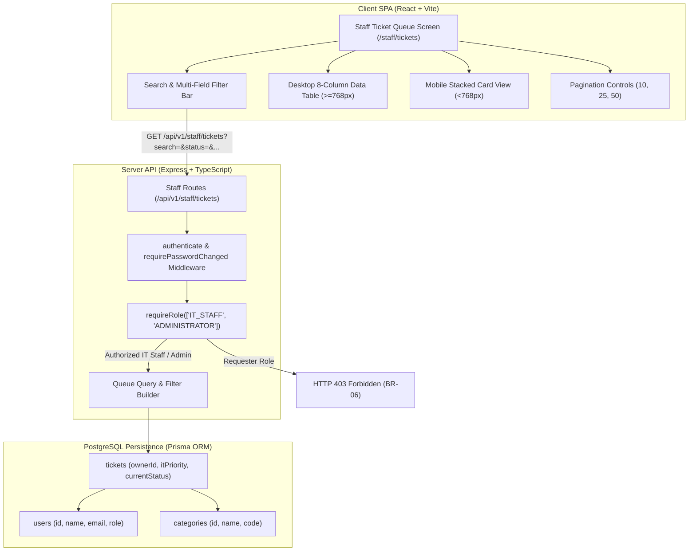
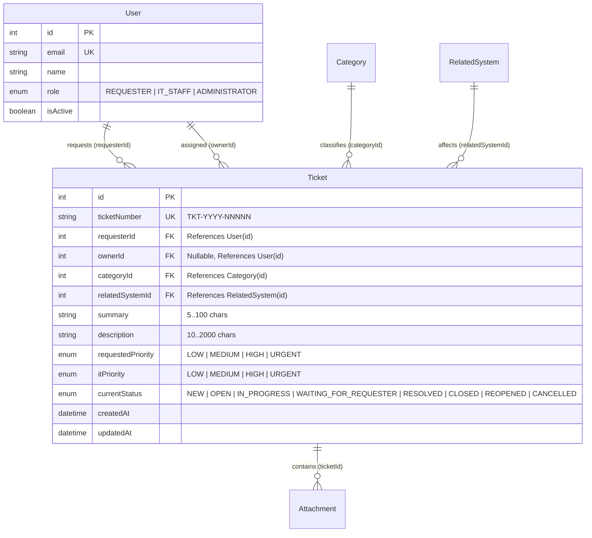
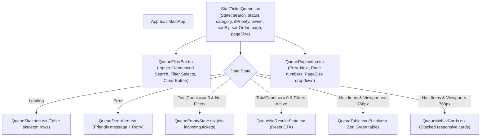
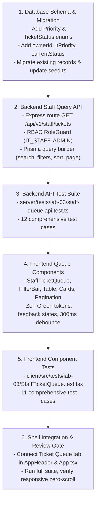

# Feature Engineering Contract: Issue 13 — IT Staff Ticket Queue & List Queries

**Feature Identifier:** Issue 13: IT Staff Ticket Queue & List Queries  
**Target Branch:** `feature/13-staff-ticket-queue`  
**Base Branch:** `lab3-staging`  
**Sprint / Milestone:** TokTickIT Lab 3 (Sprint 3) — Users, Roles, IT Staff Ticketing, and Admin Screens (Sprint Issue 3)  
**Specification Version:** 1.0.0  
**Status:** DRAFT ENGINEERING CONTRACT (Awaiting Review)  

---

## 1. Feature Scope, Purpose & Objectives

### 1.1 Purpose & Objectives
This engineering contract establishes the authoritative technical contract for **Issue 13: IT Staff Ticket Queue & List Queries**.

In Sprint 2, the TokTickIT platform supported Requester ticket submission and a personal ticket list ("My Tickets"). Issue 12 established the production authentication foundation, multi-role user data model (`REQUESTER`, `IT_STAFF`, `ADMINISTRATOR`), and secure session management. 

Issue 13 delivers the central operational engine for IT Service Desk personnel: a shared, cross-organization **IT Staff Ticket Queue**. This capability enables IT Staff and Administrators to efficiently discover, inspect, filter, sort, and paginate through service requests across the campus IT landscape.

Specifically, Issue 13 accomplishes the following core objectives:
1. **Shared Ticket Queue Query API (`GET /api/v1/staff/tickets`):** A high-performance, filterable, and paginated query service restricted to authenticated `IT_STAFF` and `ADMINISTRATOR` roles, enforcing strict role authorization (**BR-06**).
2. **Database Schema Increment for Operational Ticketing:** Updates the PostgreSQL database schema via Prisma to support ticket ownership (`ownerId` referencing `User`), IT priority classification (`itPriority` enum: `LOW`, `MEDIUM`, `HIGH`, `URGENT`), and the full lifecycle status enum (`NEW`, `OPEN`, `IN_PROGRESS`, `WAITING_FOR_REQUESTER`, `RESOLVED`, `CLOSED`, `REOPENED`, `CANCELLED`).
3. **Multi-Criteria Search & Filtering Engine:** Server-side query builder supporting free-text search (case-insensitive substring match on ticket number and summary), status filtering, category filtering, IT priority filtering, and owner assignment filtering (specific user ID or `unassigned`).
4. **Flexible Sorting & Page-Based Pagination:** Configurable sorting by creation timestamp, ticket number, summary, priority, and status; page-based pagination returning standard metadata (`totalCount`, `page`, `pageSize`, `totalPages`).
5. **Zen Green IT Staff Ticket Queue Frontend Screen:** A responsive, accessible desktop table view complying with KMUTT Zen Green design tokens, featuring debounced search, responsive filter bar, semantic status/priority badge pills, pagination controls, and robust UI feedback states (skeletons, empty queue, no results, error alert).
6. **Mobile Responsive Card Presentation:** Automatic transformation for viewports under `768px` from multi-column tables into vertically stacked Zen Green cards, guaranteeing zero horizontal scrolling and accessible touch targets.
7. **Automated Verification:** Comprehensive backend API integration tests (`server/tests/lab-03/staff-queue.api.test.ts`) and frontend React Testing Library tests (`client/src/tests/lab-03/StaffTicketQueue.test.tsx`) mapping 100% to Acceptance Criteria `AC-13.1` through `AC-13.4`.



---

### 1.2 In-Scope Capabilities
* **Database & Schema Updates (`server/prisma/schema.prisma`):**
  - Define `Priority` Enum: `LOW`, `MEDIUM`, `HIGH`, `URGENT`.
  - Define `TicketStatus` Enum: `NEW`, `OPEN`, `IN_PROGRESS`, `WAITING_FOR_REQUESTER`, `RESOLVED`, `CLOSED`, `REOPENED`, `CANCELLED`.
  - Update `Ticket` model with:
    - `ownerId`: Nullable Int foreign key referencing `User.id` with `onDelete: SetNull`.
    - `itPriority`: `Priority` Enum (nullable, initialized to match `requestedPriority` per **BR-07**).
    - `currentStatus`: `TicketStatus` Enum (default `NEW`).
  - Update `User` model with reverse relation `assignedTickets Ticket[] @relation("StaffAssignedTickets")`.
  - Create database indexes: `@@index([ownerId])`, `@@index([currentStatus])`, `@@index([itPriority])`, `@@index([categoryId])`, `@@index([createdAt])`.
* **Backend Staff Queue Query API (`server/src/routes/staff.ts`):**
  - Route: `GET /api/v1/staff/tickets`.
  - Authorization middleware: Authenticated session required; strictly permits `IT_STAFF` and `ADMINISTRATOR` roles; rejects `REQUESTER` with HTTP `403 Forbidden` (**BR-06**). Blocks accounts with `mustChangePassword === true` (**BR-02**).
  - Query parameters:
    - `search`: Substring match on `ticketNumber` OR `summary` (case-insensitive).
    - `status`: Filter by single status from `TicketStatus` enum.
    - `category`: Filter by category ID.
    - `itPriority`: Filter by priority from `Priority` enum.
    - `owner`: Filter by assigned owner user ID, or special token `"unassigned"` (`ownerId IS NULL`).
    - `sortBy`: One of `createdAt`, `ticketNumber`, `summary`, `itPriority`, `status` (default: `createdAt`).
    - `sortOrder`: `asc` or `desc` (default: `desc`).
    - `page`: 1-based page index (default: `1`).
    - `pageSize`: Page size, allowed values: `10`, `25`, `50` (default: `10`).
  - Response envelope: `{ success: true, data: { items: StaffTicketSummaryDTO[], totalCount: number, page: number, pageSize: number, totalPages: number } }`.
* **Frontend Staff Ticket Queue Component (`client/src/components/StaffTicketQueue.tsx`):**
  - Rendered when active user has `IT_STAFF` or `ADMINISTRATOR` role.
  - Search input with 300ms debouncing.
  - Filter bar dropdowns: Status, Category, IT Priority, Owner (All, Unassigned, Me, specific staff).
  - "Clear Filters" action to reset all query parameters to default.
  - Desktop 8-column data table:
    1. Ticket Number (`TKT-YYYY-NNNNN`)
    2. Created Date (`YYYY-MM-DD` or localized format)
    3. Summary (truncated gracefully)
    4. Category badge
    5. Requested Priority badge
    6. IT Priority badge
    7. Status badge
    8. Owner name (or "Unassigned" indicator)
  - Pagination toolbar: "Showing X to Y of Z tickets", Previous button, numbered page pills, Next button, and Page Size selector (10, 25, 50).
  - Row click interaction: Emits navigation or callback to open ticket detail (`/staff/tickets/:id`).
  - UI feedback states: Loading skeleton/spinner, empty queue state (no tickets in system), no-results filter state (filters returned 0 results with reset CTA), and API error alert with retry button.
  - Responsive mobile collapse: On viewports $< 768\text{px}$, tables transform into stacked Zen Green cards (`.card.shadow-sm`) with zero horizontal scrolling.
* **Automated Test Coverage:**
  - `server/tests/lab-03/staff-queue.api.test.ts`: Supertest API tests for authorization, filtering, search, sorting, and pagination.
  - `client/src/tests/lab-03/StaffTicketQueue.test.tsx`: React Testing Library tests for rendering, filtering, debouncing, pagination, empty states, and responsive layout.

---

### 1.3 Explicitly Excluded Scope (Strictly Out of Scope)
To avoid scope creep and honor the architectural boundaries of Sprint 3 (§4.2 and §4.5 of Lab 3 Sheet):
* **No Inline Table Cell Editing:** Modifying status, IT priority, or assigned owner directly within table cells or dropdowns on the queue screen is strictly deferred to Issue 14 (Ticket Detail screen). The queue is a query-only view.
* **No Ticket Detail Screen Operations:** Ticket claim/reassignment mutations, priority update endpoints, status transition executions, Public Comments, and Internal Notes belong to Issue 14 (`feature/14-staff-ticket-detail`).
* **No SLA Calculations or Escalation Rules:** No SLA timers, target resolution deadlines, breach warnings, or automated escalation triggers.
* **No Analytics / KPI Dashboards:** No charts, graphs, MTTR (Mean Time to Resolve) metrics, or ticket volume statistics beyond simple queue count metadata.
* **No Multi-Tenant Organization Filters:** No departmental siloing or multi-tenant organizational partition filters. All IT Staff and Administrators share the unified queue.
* **No Bulk Actions:** No batch ticket selection, bulk status update, or bulk assignment from the queue.
* **No Real-Time WebSockets:** No live streaming of incoming tickets; queue updates occur via page navigation, filter interaction, or manual refresh.

---

### 1.4 Mapped Requirements & Business Rules Traceability

| Requirement / Rule ID | Source Document | Description |
| :--- | :--- | :--- |
| **FR-03** | `docs/lab-03/specification.md` | IT Staff Ticket Queue & List Queries. |
| **FR-03.1** | `docs/lab-03/specification.md` | Accessible only to `IT_STAFF` and `ADMINISTRATOR` roles; Requesters rejected with `403 Forbidden`. |
| **FR-03.2** | `docs/lab-03/specification.md` | Text search across `ticketNumber` and `summary` (case-insensitive partial match). |
| **FR-03.3** | `docs/lab-03/specification.md` | Filtering by `status`, `category`, `itPriority`, and `owner` (including `unassigned`). |
| **FR-03.4** | `docs/lab-03/specification.md` | Sorting by `createdAt`, `ticketNumber`, `summary`, `itPriority`, and `status` (default: `createdAt DESC`). |
| **FR-03.5** | `docs/lab-03/specification.md` | Page-based pagination with allowed sizes (10, 25, 50) and pagination metadata envelope. |
| **BR-06** | `docs/lab-03/specification.md` | Queue role authorization: strictly restricted to IT Staff and Administrator roles. |
| **BR-07** | `docs/lab-03/specification.md` | Default IT Priority initialization: upon ticket creation, `itPriority` defaults to `requestedPriority`. |
| **DEC-UI-06** | `docs/lab-03/ui-spec.md` | Staff Queue Density: 8 key columns displayed cleanly without horizontal clipping on desktop. |
| **DEC-UI-07** | `docs/lab-03/ui-spec.md` | Queue Filters: Filter bar with Search, Status, Category, IT Priority, Owner, and Clear Filters button. |
| **DEC-UI-08** | `docs/lab-03/ui-spec.md` | Queue Pagination: Bottom toolbar with range label, Prev/Next, numbered pills, and Page Size dropdown. |
| **DEC-UI-09** | `docs/lab-03/ui-spec.md` | Mobile Queue: Collapses into stacked Zen Green cards under 768px with zero horizontal scroll. |
| **DEC-UI-19** | `docs/lab-03/ui-spec.md` | Semantic badge conventions pairing colors with text labels and WCAG AA accessibility. |
| **DEC-UI-20** | `docs/lab-03/ui-spec.md` | Responsive breakpoints: Desktop ($\ge 1200\text{px}$), Tablet ($768\text{px}-1024\text{px}$), Mobile ($< 768\text{px}$). |
| **D-01, D-02** | `TokTickIT-System-Level-SDS-v1.0.pdf` | System architecture invariants and standardized ticket status lifecycle. |

---

## 2. Database Schema Increment Specification

### 2.1 Prisma Schema Delta (`server/prisma/schema.prisma`)

The database schema is evolved to introduce explicit enums for priority and status, and to establish the `ownerId` relational foreign key linking `Ticket` to `User`:

```prisma
// ---------------------------------------------------------------------------
// 1. Priority Enum (Standard 4-Tier Severity Scale)
// ---------------------------------------------------------------------------
enum Priority {
  LOW
  MEDIUM
  HIGH
  URGENT
}

// ---------------------------------------------------------------------------
// 2. Ticket Status Enum (Full 8-State Service Desk Lifecycle)
// ---------------------------------------------------------------------------
enum TicketStatus {
  NEW
  OPEN
  IN_PROGRESS
  WAITING_FOR_REQUESTER
  RESOLVED
  CLOSED
  REOPENED
  CANCELLED
}

// ---------------------------------------------------------------------------
// 3. User Model Updates (Reverse relation for assigned tickets)
// ---------------------------------------------------------------------------
model User {
  id                 Int          @id @default(autoincrement())
  email              String       @unique
  passwordHash       String
  name               String
  department         String?
  role               Role         @default(REQUESTER)
  mustChangePassword Boolean      @default(true)
  isActive           Boolean      @default(true)
  createdAt          DateTime     @default(now())
  updatedAt          DateTime     @updatedAt

  // Relationships
  requestedTickets   Ticket[]     @relation("RequesterTickets")
  assignedTickets    Ticket[]     @relation("StaffAssignedTickets") // NEW in Issue 13
  removedAttachments Attachment[] @relation("UserRemovedAttachments")

  @@map("users")
}

// ---------------------------------------------------------------------------
// 4. Ticket Model Updates (Owner FK, IT Priority, TicketStatus Enum)
// ---------------------------------------------------------------------------
model Ticket {
  id                Int           @id @default(autoincrement())
  ticketNumber      String        @unique @db.VarChar(32) // Format: TKT-YYYY-NNNNN
  requesterId       Int
  ownerId           Int?          // NEW in Issue 13: Nullable FK to User
  categoryId        Int
  relatedSystemId   Int
  summary           String        @db.VarChar(100)
  description       String        @db.Text
  requestedPriority Priority      @default(MEDIUM) // Updated to Priority enum
  itPriority        Priority?     // NEW in Issue 13: Nullable Priority enum
  currentStatus     TicketStatus  @default(NEW)    // Updated to TicketStatus enum
  createdAt         DateTime      @default(now())
  updatedAt         DateTime      @updatedAt

  // Relations
  requester         User          @relation("RequesterTickets", fields: [requesterId], references: [id], onDelete: Restrict)
  owner             User?         @relation("StaffAssignedTickets", fields: [ownerId], references: [id], onDelete: SetNull) // NEW
  category          Category      @relation(fields: [categoryId], references: [id], onDelete: Restrict)
  relatedSystem     RelatedSystem @relation(fields: [relatedSystemId], references: [id], onDelete: Restrict)
  attachments       Attachment[]

  // Indexes for high-speed queue filtering & sorting
  @@index([requesterId])
  @@index([ownerId])
  @@index([currentStatus])
  @@index([itPriority])
  @@index([categoryId])
  @@index([createdAt])
  @@map("tickets")
}
```

---

### 2.2 Relational Entity Diagram



---

### 2.3 Migration & Backward Compatibility Strategy

To evolve the database without data loss from existing Lab 2 and Issue 12 records:
1. **Enum Creation:**
   - Create PostgreSQL enums `Priority` (`LOW`, `MEDIUM`, `HIGH`, `URGENT`) and `TicketStatus` (`NEW`, `OPEN`, `IN_PROGRESS`, `WAITING_FOR_REQUESTER`, `RESOLVED`, `CLOSED`, `REOPENED`, `CANCELLED`).
2. **Column Transformation & Normalization:**
   - Add nullable column `ownerId INTEGER REFERENCES users(id) ON DELETE SET NULL`.
   - Safely convert existing string column `requestedPriority` to `Priority` enum with uppercase casting (e.g. `'Medium'` $\rightarrow$ `'MEDIUM'::"Priority"`).
   - Add column `itPriority "Priority"` and populate existing rows with `itPriority = requestedPriority` (**BR-07**).
   - Safely convert existing string column `currentStatus` to `TicketStatus` enum with uppercase mapping:
     - `'New'` $\rightarrow$ `'NEW'::"TicketStatus"`
     - `'Assigned'` $\rightarrow$ `'OPEN'::"TicketStatus"` (or preserve mapped status)
     - `'In Progress'` $\rightarrow$ `'IN_PROGRESS'::"TicketStatus"`
     - `'Pending Requester'` $\rightarrow$ `'WAITING_FOR_REQUESTER'::"TicketStatus"`
     - `'Resolved'` $\rightarrow$ `'RESOLVED'::"TicketStatus"`
     - `'Closed'` $\rightarrow$ `'CLOSED'::"TicketStatus"`
     - `'Cancelled'` $\rightarrow$ `'CANCELLED'::"TicketStatus"`
3. **Foreign Key Integrity:**
   - Establish `tickets_ownerId_fkey` with `ON DELETE SET NULL` so deactivating or removing an IT Staff member never cascades destructive deletes to tickets.
4. **Prisma Client Generation:**
   - Execute `npx prisma generate` to synchronize TypeScript types.

---

### 2.4 Seed Data Invariants (`server/prisma/seed.ts`)

The database seed must be updated so that existing seed tickets reflect realistic operational queue states:
* At least 3 tickets assigned to Sompong IT (User ID 6, `IT_STAFF`).
* At least 2 tickets assigned to Wichai Support (User ID 7, `IT_STAFF`).
* At least 5 tickets with `ownerId: null` (`unassigned`) across various statuses (`NEW`, `OPEN`).
* Distribution across all four priority levels (`LOW`, `MEDIUM`, `HIGH`, `URGENT`).
* Distribution across multiple categories (e.g. Hardware, Software, Network).
* All tickets ensure `itPriority` is populated (defaulting to `requestedPriority` if not explicitly divergent).

---

## 3. API & Authorization Protocols

### 3.1 REST API Endpoint Specification

All staff ticketing endpoints reside under `/api/v1/staff/*`.

#### Staff Ticket Queue Query (`GET /api/v1/staff/tickets`)
* **Access Control:** Strictly restricted to `IT_STAFF` and `ADMINISTRATOR` roles (**BR-06**). Requesters return `403 Forbidden`. Unauthenticated requests return `401 Unauthorized`. Users with `mustChangePassword === true` return `403 Forbidden` (**BR-02**).
* **HTTP Method:** `GET`
* **Path:** `/api/v1/staff/tickets`

---

### 3.2 Query Parameters Specification

| Parameter | Type | Required | Default | Allowed Values / Validation Rules | Description |
| :--- | :--- | :---: | :---: | :--- | :--- |
| `search` | `string` | No | `""` | Trimmed string, max 100 chars | Case-insensitive substring match against `ticketNumber` or `summary`. |
| `status` | `string` | No | `undefined` | `NEW`, `OPEN`, `IN_PROGRESS`, `WAITING_FOR_REQUESTER`, `RESOLVED`, `CLOSED`, `REOPENED`, `CANCELLED` | Filters tickets matching the specific status. If omitted, returns all statuses. |
| `category` | `integer` | No | `undefined` | Positive integer (valid `Category.id`) | Filters tickets classified under this category ID. |
| `itPriority`| `string` | No | `undefined` | `LOW`, `MEDIUM`, `HIGH`, `URGENT` | Filters tickets by current IT priority. |
| `owner` | `string` | No | `undefined` | Numeric string (user ID) OR literal `"unassigned"` | Filters by assigned staff ID, or unassigned (`ownerId IS NULL`). |
| `sortBy` | `string` | No | `"createdAt"`| `createdAt`, `ticketNumber`, `summary`, `itPriority`, `currentStatus` | Field used to sort the result set. |
| `sortOrder` | `string` | No | `"desc"` | `asc`, `desc` (case-insensitive) | Sort direction. |
| `page` | `integer` | No | `1` | Integer $\ge 1$ | 1-based page index. |
| `pageSize` | `integer` | No | `10` | Allowed values: `10`, `25`, `50` | Number of items per page. Defaults to 10 if invalid. |

---

### 3.3 Data Transfer Objects (DTOs)

#### 1. Staff Ticket Summary DTO (`StaffTicketSummaryDTO`)
```typescript
export interface StaffTicketSummaryDTO {
  id: number;
  ticketNumber: string;               // e.g. "TKT-2026-00042"
  summary: string;                    // e.g. "LEB2 gradebook sync hangs"
  createdAt: string;                  // ISO 8601 UTC string
  updatedAt: string;                  // ISO 8601 UTC string
  category: {
    id: number;
    name: string;                     // e.g. "Software"
    code: string | null;              // e.g. "SW"
  };
  relatedSystem: {
    id: number;
    name: string;                     // e.g. "LEB2 Portal"
  };
  requestedPriority: "LOW" | "MEDIUM" | "HIGH" | "URGENT";
  itPriority: "LOW" | "MEDIUM" | "HIGH" | "URGENT";
  currentStatus: "NEW" | "OPEN" | "IN_PROGRESS" | "WAITING_FOR_REQUESTER" | "RESOLVED" | "CLOSED" | "REOPENED" | "CANCELLED";
  owner: {
    id: number;
    name: string;                     // e.g. "Sompong IT"
    email: string;
    role: "IT_STAFF" | "ADMINISTRATOR";
  } | null;                           // null when unassigned
  requester: {
    id: number;
    name: string;                     // e.g. "Sarah Johnson"
    email: string;
    department: string | null;
  };
}
```

#### 2. Staff Queue Response DTO (`StaffQueueResponseDTO`)
```typescript
export interface StaffQueueResponseDTO {
  items: StaffTicketSummaryDTO[];
  totalCount: number;
  page: number;
  pageSize: number;
  totalPages: number;
  pagination?: {
    totalCount: number;
    page: number;
    pageSize: number;
    totalPages: number;
  };
}
```

---

### 3.4 Response Envelopes & HTTP Status Codes

#### Response `200 OK` (Standard Success Envelope)
```json
{
  "success": true,
  "data": {
    "items": [
      {
        "id": 42,
        "ticketNumber": "TKT-2026-00042",
        "summary": "LEB2 gradebook sync hangs",
        "createdAt": "2026-09-12T03:15:00.000Z",
        "updatedAt": "2026-09-12T03:15:00.000Z",
        "category": {
          "id": 3,
          "name": "Software",
          "code": "SW"
        },
        "relatedSystem": {
          "id": 4,
          "name": "LEB2 Portal"
        },
        "requestedPriority": "HIGH",
        "itPriority": "HIGH",
        "currentStatus": "IN_PROGRESS",
        "owner": {
          "id": 6,
          "name": "Sompong IT",
          "email": "sompong.it@kmutt.ac.th",
          "role": "IT_STAFF"
        },
        "requester": {
          "id": 4,
          "name": "Sarah Johnson",
          "email": "sarah.johnson@kmutt.ac.th",
          "department": "Science"
        }
      }
    ],
    "totalCount": 42,
    "page": 1,
    "pageSize": 10,
    "totalPages": 5,
    "pagination": {
      "totalCount": 42,
      "page": 1,
      "pageSize": 10,
      "totalPages": 5
    }
  }
}
```
*Note on Dual Envelope & Status Alias Compatibility:*
1. **Dual Pagination Support:** To satisfy both the prompt/`poc-scope-and-issues.md` specification (`{ items, totalCount, page, pageSize, totalPages }`) and `api-spec.md` §3.1 (`data.pagination`), the API returns pagination fields both directly at `data.*` and inside `data.pagination.*`.
2. **Status Enum Normalization:** The backend query filter normalizes status aliases: `ASSIGNED` maps to `OPEN`, and `PENDING_REQUESTER` maps to `WAITING_FOR_REQUESTER`. Both forms are accepted cleanly without validation errors.

#### Response `401 Unauthorized`
Returned when session cookie or token is missing, invalid, or expired.
```json
{
  "success": false,
  "error": {
    "code": "UNAUTHORIZED",
    "message": "Authentication required to access this resource."
  }
}
```

#### Response `403 Forbidden` (Role Restriction — BR-06)
Returned when an authenticated user with `role === "REQUESTER"` attempts to query the staff queue.
```json
{
  "success": false,
  "error": {
    "code": "FORBIDDEN",
    "message": "Access denied. IT Staff or Administrator role required."
  }
}
```

#### Response `403 Forbidden` (Password Change Required — BR-02)
Returned when an authenticated user has `mustChangePassword === true`.
```json
{
  "success": false,
  "error": {
    "code": "PASSWORD_CHANGE_REQUIRED",
    "message": "You must change your password before accessing the application."
  }
}
```

#### Response `400 Bad Request`
Returned when query parameters fail syntactic validation (e.g. invalid status enum or non-numeric page).
```json
{
  "success": false,
  "error": {
    "code": "INVALID_QUERY_PARAMETERS",
    "message": "Invalid status value provided: UNKNOWN_STATUS",
    "fieldErrors": [
      { "field": "status", "message": "Must be one of the recognized TicketStatus enum values." }
    ]
  }
}
```

---

### 3.5 Database Query Construction & Optimization

To guarantee sub-100ms response times for queues with thousands of tickets:
1. **Prisma `where` Clause Composition:**
   ```typescript
   const where: Prisma.TicketWhereInput = {};

   // 1. Text Search (OR across ticketNumber and summary)
   if (search && search.trim()) {
     const term = search.trim();
     where.OR = [
       { ticketNumber: { contains: term, mode: 'insensitive' } },
       { summary: { contains: term, mode: 'insensitive' } }
     ];
   }

   // 2. Status Filter
   if (status) {
     where.currentStatus = status as TicketStatus;
   }

   // 3. Category Filter
   if (categoryId) {
     where.categoryId = Number(categoryId);
   }

   // 4. IT Priority Filter
   if (itPriority) {
     where.itPriority = itPriority as Priority;
   }

   // 5. Owner Filter (Unassigned vs. User ID)
   if (owner === 'unassigned') {
     where.ownerId = null;
   } else if (owner) {
     where.ownerId = Number(owner);
   }
   ```
2. **Prisma `orderBy` Clause Composition:**
   ```typescript
   const validSortFields = ['createdAt', 'ticketNumber', 'summary', 'itPriority', 'currentStatus'];
   const sortField = validSortFields.includes(sortBy) ? sortBy : 'createdAt';
   const direction: 'asc' | 'desc' = sortOrder?.toLowerCase() === 'asc' ? 'asc' : 'desc';

   const orderBy: Prisma.TicketOrderByWithRelationInput = {
     [sortField]: direction
   };
   ```
3. **Atomic Count & Page Query:**
   Execute `prisma.$transaction([ prisma.ticket.count({ where }), prisma.ticket.findMany({ where, orderBy, skip, take, include: { category: true, relatedSystem: true, owner: true, requester: true } }) ])` to guarantee accurate pagination counts without race conditions.

---

## 4. UI Wireframe, Component Architecture & State Contracts

### 4.1 Zen Green Design System Conformance

All UI components strictly adhere to the KMUTT **Zen Green** visual tokens specified in `docs/lab-03/ui-spec.md` and `client/src/index.css`:
* **Brand Primary:** `--color-primary-green: #006B3C` (Header, primary buttons, brand titles)
* **Interactive Secondary:** `--color-secondary-green: #0B7A46` (Active tabs, focus rings, link hover)
* **Surface Background:** `--color-page-bg: #F5F7F6` (Neutral off-white page body)
* **Card & Container Surface:** `--color-surface-card: #FFFFFF` (Card panels, table surface)
* **Pale Green Accent:** `--color-pale-green: #EAF6EF` (Table row hover, subtle badges)
* **Focus Indicator:** `--focus-ring: 0 0 0 3px rgba(11, 122, 70, 0.2)` (Accessible WCAG AA focus rings)
* **Typography:** System font stack (`system-ui, -apple-system, sans-serif`), labels at 14px/600, cells at 14px/400.

#### Badge Conventions (**DEC-UI-19**)
| Type | Value | Background | Text Color | Border | SVG Icon |
| :--- | :--- | :--- | :--- | :--- | :--- |
| **Status** | `NEW` | `#E0F2FE` | `#0369A1` | `#0284C7` | Circle Sparkle |
| **Status** | `OPEN` / `ASSIGNED` | `#EFF6FF` | `#1D4ED8` | `#3B82F6` | User Arrow |
| **Status** | `IN_PROGRESS` | `#FFFBEB` | `#B45309` | `#F59E0B` | Clock Rotate |
| **Status** | `WAITING_FOR_REQUESTER` | `#FEF3C7` | `#92400E` | `#D97706` | Question Circle |
| **Status** | `RESOLVED` / `CLOSED` | `#EAF6EF` | `#006B3C` | `#006B3C` | Check Circle |
| **Status** | `CANCELLED` | `#F3F4F6` | `#4B5563` | `#9CA3AF` | Ban Circle |
| **Priority**| `LOW` | `#F3F4F6` | `#4B5563` | `#D1D5DB` | Arrow Down |
| **Priority**| `MEDIUM` | `#E0F2FE` | `#0369A1` | `#BAE6FD` | Arrow Right |
| **Priority**| `HIGH` | `#FFFBEB` | `#B45309` | `#FDE68A` | Arrow Up |
| **Priority**| `URGENT` | `#FDF2F2` | `#B3261E` | `#FCA5A5` | Exclamation Triangle |

---

### 4.2 Desktop Queue Wireframe & Layout Specification ($\ge 768\text{px}$)

```
+------------------------------------------------------------------------------------------------------------------------+
| [TokTickIT]  Ticket Queue   + Create Ticket                                         [Sompong IT (IT Staff) v] [Logout] |
+------------------------------------------------------------------------------------------------------------------------+
|                                                                                                                        |
|  IT Staff Ticket Queue                                                                                                 |
|  Manage, prioritize, and assign incoming service requests                                                              |
|                                                                                                                        |
|  +------------------------------------------------------------------------------------------------------------------+  |
|  | [🔍 Search ticket # or summary...]   [Status: All v]   [Cat: All v]   [Priority: All v]   [Owner: All v] [Clear] |  |
|  +------------------------------------------------------------------------------------------------------------------+  |
|                                                                                                                        |
|  +------------------------------------------------------------------------------------------------------------------+  |
|  | Ticket No     | Created Date | Summary                    | Category | Req. Pri | IT Pri   | Status   | Owner      |  |
|  +---------------+--------------+----------------------------+----------+----------+----------+----------+------------+  |
|  | TKT-2026-00042| 2026-09-12   | LEB2 gradebook sync han... | Software | [High]   | [High]   | [In Prog]| Sompong IT |  |
|  | TKT-2026-00041| 2026-09-12   | Wi-Fi connection drops...  | Network  | [Urgent] | [Urgent] | [New]    | Unassigned |  |
|  | TKT-2026-00040| 2026-09-11   | Laptop battery failure ... | Hardware | [Medium] | [Low]    | [Open]   | Wichai S.  |  |
|  +------------------------------------------------------------------------------------------------------------------+  |
|                                                                                                                        |
|  Showing 1 to 10 of 42 tickets                             [Page Size: 10 v]   [< Prev]  [1]  [2]  [3]  [4]  [Next >]  |
+------------------------------------------------------------------------------------------------------------------------+
```

---

### 4.3 Element Identifiers, Test IDs & Accessibility

| Component / Element | DOM Element | `data-testid` | Attributes / Accessible Role |
| :--- | :--- | :--- | :--- |
| **Main Container** | `div` | `staff-queue-container` | `role="region"`, `aria-label="Staff Ticket Queue"` |
| **Page Title** | `h1` | `staff-queue-title` | Text: `"IT Staff Ticket Queue"` |
| **Search Input** | `input` | `queue-search-input` | `type="search"`, `placeholder="Search ticket # or summary..."` |
| **Status Filter** | `select` | `queue-filter-status` | `aria-label="Filter by Status"` |
| **Category Filter** | `select` | `queue-filter-category` | `aria-label="Filter by Category"` |
| **IT Priority Filter**| `select` | `queue-filter-priority` | `aria-label="Filter by IT Priority"` |
| **Owner Filter** | `select` | `queue-filter-owner` | `aria-label="Filter by Owner"` |
| **Clear Filters Button**| `button` | `queue-clear-filters` | `type="button"`, text: `"Clear Filters"` |
| **Data Table** | `table` | `staff-queue-table` | `aria-label="Service desk tickets table"` |
| **Table Row** | `tr` | `ticket-row-{ticketId}` | `tabIndex={0}`, `role="button"` (keyboard accessible Enter/Space) |
| **Ticket No Cell** | `td` | `ticket-number-{ticketId}` | Text: `TKT-YYYY-NNNNN` |
| **Status Badge** | `span` | `ticket-status-badge-{ticketId}`| Class: `.badge.rounded-pill` |
| **IT Priority Badge** | `span` | `ticket-it-priority-badge-{ticketId}`| Class: `.badge.rounded-pill` |
| **Owner Cell** | `td` | `ticket-owner-{ticketId}` | Text: Staff Name or `"Unassigned"` |
| **Pagination Range** | `span` | `queue-pagination-range` | Text: `"Showing X to Y of Z tickets"` |
| **Page Size Select** | `select` | `queue-page-size-select` | `aria-label="Page Size selector"` |
| **Prev Page Button** | `button` | `queue-page-prev` | `aria-label="Previous Page"`, `disabled` on page 1 |
| **Next Page Button** | `button` | `queue-page-next` | `aria-label="Next Page"`, `disabled` on last page |
| **Page Number Button**| `button` | `queue-page-{pageNum}` | `aria-current={isActive ? "page" : undefined}` |
| **Loading Skeleton** | `div` | `queue-loading-skeleton` | `aria-busy="true"`, `aria-live="polite"` |
| **Empty Queue State** | `div` | `queue-empty-state` | Role `status` |
| **No-Results State** | `div` | `queue-no-results-state` | Role `status`, includes Clear CTA |
| **Error Alert** | `div` | `queue-error-alert` | Role `alert`, contains retry button |

---

### 4.4 Component Architecture & State Machine



#### State Transition Logic:
1. **Search Debounce:** User keystroke in search input updates local input state immediately; triggers query fetch after `300ms` debounce, resetting `page = 1`.
2. **Filter Change:** Changing any dropdown (Status, Category, Priority, Owner) triggers query fetch immediately, resetting `page = 1`.
3. **Pagination Change:** Changing page updates `page` state without resetting filters; changing `pageSize` resets `page = 1`.
4. **Row Click / Activation:** Clicking a table row or pressing `Enter` when focused on a row emits `onSelectTicket(ticketId)`.

---

### 4.5 UI Feedback States

1. **Loading State (`data-testid="queue-loading-skeleton"`):**
   - Displays animated pulsing skeleton rows within the table structure (or 3 skeleton cards on mobile) while network requests are in flight.
   - Prevents UI layout shifts.
2. **Empty Queue State (`data-testid="queue-empty-state"`):**
   - Displayed when the entire system has zero tickets (`totalCount === 0` and no search/filter parameters are active).
   - Card displays a peaceful Zen Green inbox icon: *"Ticket queue is clear. No service desk requests are pending."*
3. **No-Results Filter State (`data-testid="queue-no-results-state"`):**
   - Displayed when the active combination of search and filters yields 0 tickets.
   - Card displays a search icon, message *"No tickets match your filter criteria."*, and a prominent Zen Green button: `[ Clear Filters ]`.
4. **Error Alert State (`data-testid="queue-error-alert"`):**
   - Displayed when the API returns an error (`500`, network failure, or `403`).
   - Card displays a styled danger banner (`#FDF2F2`, border `#B3261E`, text `#B3261E`) with message: *"Failed to load ticket queue. Please try again."* and a `[ Retry ]` button.

---

### 4.6 Mobile Responsive Layout Specification ($< 768\text{px}$)

Per **DEC-UI-09** and **DEC-UI-20**, viewports below `768px` must not display the wide 8-column data table and must guarantee **zero horizontal scroll** (`overflow-x: hidden`):

```
+-------------------------------------------------------------+
| [TokTickIT Logo]                     [Sompong (IT)] [Logout]|
+-------------------------------------------------------------+
|                                                             |
|  IT Staff Ticket Queue                                      |
|                                                             |
|  +-------------------------------------------------------+  |
|  | [🔍 Search ticket # or summary...]                    |  |
|  | [Status: All v]   [Cat: All v]                        |  |
|  | [Priority: All v] [Owner: All v]                      |  |
|  | [ Clear Filters ]                                     |  |
|  +-------------------------------------------------------+  |
|                                                             |
|  +-------------------------------------------------------+  |
|  | TKT-2026-00042                             Sep 12, 2026| |
|  | [In Progress] [High Pri] [Software]                  |  |
|  |                                                       |  |
|  | LEB2 gradebook synchronization hangs                  |  |
|  | Requester: Sarah Johnson                              |  |
|  | Assigned: Sompong IT                                  |  |
|  +-------------------------------------------------------+  |
|                                                             |
|  +-------------------------------------------------------+  |
|  | TKT-2026-00041                             Sep 12, 2026| |
|  | [New] [Urgent Pri] [Network]                          |  |
|  |                                                       |  |
|  | Wi-Fi connection drops in Library 4th floor           |  |
|  | Requester: Jennifer Anderson                          |  |
|  | Assigned: [Unassigned]                                |  |
|  +-------------------------------------------------------+  |
|                                                             |
|  Showing 1 to 10 of 42 tickets                              |
|  [Page Size: 10 v]                                          |
|  [< Prev]              Page 1 of 5                 [Next >] |
+-------------------------------------------------------------+
```

#### Mobile Card Invariants:
* Each ticket renders as an independent `.card.shadow-sm.mb-3` with `44px` touch targets.
* Badges wrap cleanly across rows.
* Summary text wraps without horizontal overflow.
* Pagination controls stack cleanly with large touch buttons.

---

## 5. Test Traceability Matrix

### 5.1 Acceptance Criteria Traceability

| Acceptance Criterion | Requirement Description | Planned Test IDs | Test Level | Automated Test File Path |
| :---: | :--- | :---: | :---: | :--- |
| **AC-13.1** | Authenticated IT Staff or Admin receives paginated queue records with status, priority, and owner metadata | `API-06`, `UI-03` | API & UI | `server/tests/lab-03/staff-queue.api.test.ts`<br/>`client/src/tests/lab-03/StaffTicketQueue.test.tsx` |
| **AC-13.2** | Authenticated Requester access to `/api/v1/staff/tickets` is rejected with `403 Forbidden` (**BR-06**) | `API-08` | API | `server/tests/lab-03/staff-queue.api.test.ts` |
| **AC-13.3** | Query filters (search, category, status, priority, owner) return only matching tickets with accurate counts | `API-07`, `UI-03` | API & UI | `server/tests/lab-03/staff-queue.api.test.ts`<br/>`client/src/tests/lab-03/StaffTicketQueue.test.tsx` |
| **AC-13.4** | On viewports $< 768\text{px}$, queue displays as stacked Zen Green cards without horizontal page scroll | `UI-03` | UI | `client/src/tests/lab-03/StaffTicketQueue.test.tsx` |

---

### 5.2 Test Specifications per Target File

#### 1. Backend API Tests: `server/tests/lab-03/staff-queue.api.test.ts`
* **Test Case 1 (AC-13.1: Staff Shared Queue Retrieval & Metadata):**
  - **Given** an authenticated user with role `IT_STAFF` (`sompong.it@kmutt.ac.th`).
  - **When** calling `GET /api/v1/staff/tickets`.
  - **Then** returns HTTP `200 OK`, `success: true`, and payload containing:
    - `items` array with `ticketNumber`, `summary`, `category`, `requestedPriority`, `itPriority`, `currentStatus`, `owner`, `requester`, `createdAt`.
    - `totalCount`, `page: 1`, `pageSize: 10`, `totalPages`.
* **Test Case 2 (AC-13.1: Administrator Queue Retrieval):**
  - **Given** an authenticated user with role `ADMINISTRATOR` (`admin@kmutt.ac.th`).
  - **When** calling `GET /api/v1/staff/tickets`.
  - **Then** returns HTTP `200 OK` with full queue data.
* **Test Case 3 (AC-13.2: Requester Role Rejection — BR-06):**
  - **Given** an authenticated user with role `REQUESTER` (`sarah.johnson@kmutt.ac.th`).
  - **When** calling `GET /api/v1/staff/tickets`.
  - **Then** returns HTTP `403 Forbidden` with error code `FORBIDDEN`.
* **Test Case 4 (AC-13.2: Unauthenticated Request Rejection):**
  - **Given** an unauthenticated request without session cookie or token.
  - **When** calling `GET /api/v1/staff/tickets`.
  - **Then** returns HTTP `401 Unauthorized`.
* **Test Case 5 (AC-13.2: Password Change Gated Rejection — BR-02):**
  - **Given** an authenticated IT Staff user with `mustChangePassword === true`.
  - **When** calling `GET /api/v1/staff/tickets`.
  - **Then** returns HTTP `403 Forbidden` with error code `PASSWORD_CHANGE_REQUIRED`.
* **Test Case 6 (AC-13.3: Free-Text Search Matching):**
  - **Given** tickets with summaries "LEB2 sync issue" and "Wi-Fi in library".
  - **When** calling `GET /api/v1/staff/tickets?search=sync`.
  - **Then** returns only tickets containing "sync" in summary or ticket number, with accurate `totalCount`.
* **Test Case 7 (AC-13.3: Status Multi-Field Filtering):**
  - **When** calling `GET /api/v1/staff/tickets?status=IN_PROGRESS`.
  - **Then** returns only tickets where `currentStatus === "IN_PROGRESS"`.
* **Test Case 8 (AC-13.3: Category & IT Priority Filtering):**
  - **When** calling `GET /api/v1/staff/tickets?category=1&itPriority=URGENT`.
  - **Then** returns only tickets classified under category 1 with `itPriority === "URGENT"`.
* **Test Case 9 (AC-13.3: Unassigned Owner Filtering):**
  - **When** calling `GET /api/v1/staff/tickets?owner=unassigned`.
  - **Then** returns only tickets where `ownerId === null`.
* **Test Case 10 (AC-13.3: Specific Staff Owner Filtering):**
  - **When** calling `GET /api/v1/staff/tickets?owner=6`.
  - **Then** returns only tickets assigned to user ID 6.
* **Test Case 11 (AC-13.1: Pagination Boundary & Sizing):**
  - **When** calling `GET /api/v1/staff/tickets?page=2&pageSize=10`.
  - **Then** returns items 11–20, with `page: 2`, `pageSize: 10`.
* **Test Case 12 (AC-13.1: Dynamic Sorting):**
  - **When** calling `GET /api/v1/staff/tickets?sortBy=ticketNumber&sortOrder=asc`.
  - **Then** returns items sorted in ascending alphabetical order of `ticketNumber`.

---

#### 2. Frontend UI Tests: `client/src/tests/lab-03/StaffTicketQueue.test.tsx`
* **Test Case 1 (AC-13.1: Table Rendering & Key Columns):**
  - **Given** mock queue response with 3 tickets.
  - **When** component mounts with authenticated IT Staff session.
  - **Then** renders table with 8 columns: Ticket No, Created Date, Summary, Category, Req. Priority, IT Priority, Status, Owner.
* **Test Case 2 (AC-13.3: Debounced Text Search Interaction):**
  - **When** typing `"LEB2"` into the search input.
  - **Then** debounces 300ms before making API call with `search=LEB2`.
* **Test Case 3 (AC-13.3: Filter Dropdown Selections):**
  - **When** selecting Status `"In Progress"` and Owner `"Unassigned"`.
  - **Then** calls API with `status=IN_PROGRESS&owner=unassigned` and resets page to 1.
* **Test Case 4 (AC-13.3: Clear Filters Button):**
  - **Given** active search and filter selections.
  - **When** clicking "Clear Filters".
  - **Then** resets search input and dropdowns to defaults and refetches.
* **Test Case 5 (AC-13.1: Pagination Interactions):**
  - **Given** total count 42 tickets on page 1.
  - **When** clicking `[Next >]` button.
  - **Then** updates pagination indicator to page 2 and fetches page 2 data.
  - **When** changing Page Size dropdown from 10 to 25.
  - **Then** fetches with `pageSize=25` and resets to page 1.
* **Test Case 6 (AC-13.1: Loading Skeleton State):**
  - **When** ticket fetch is in flight.
  - **Then** displays `queue-loading-skeleton` and hides the empty state.
* **Test Case 7 (AC-13.1: Empty Queue State):**
  - **Given** totalCount is 0 with no active filters.
  - **Then** displays `queue-empty-state` with no tickets message.
* **Test Case 8 (AC-13.3: No Results State & Reset CTA):**
  - **Given** search query yields 0 results.
  - **Then** displays `queue-no-results-state` and clicking `[ Clear Filters ]` resets the search.
* **Test Case 9 (AC-13.1: API Error & Retry):**
  - **Given** API failure (500).
  - **Then** displays `queue-error-alert` and clicking `[ Retry ]` re-attempts fetch.
* **Test Case 10 (AC-13.4: Mobile Card Presentation):**
  - **Given** viewport width $< 768\text{px}$ (simulated window resize or media query).
  - **When** component renders tickets.
  - **Then** table is hidden or converted into stacked responsive card containers (`.card.shadow-sm`) displaying ticket details with zero horizontal overflow.
* **Test Case 11 (AC-13.1: Ticket Row Click Navigation):**
  - **When** clicking on a ticket row.
  - **Then** invokes `onSelectTicket(ticketId)` callback.

---

## 6. Implementation Plan, Milestones & Definition of Done



### 6.1 Definition of Done Checklist
- [ ] **Database Migration Complete:**
  - `server/prisma/schema.prisma` contains `Priority`, `TicketStatus`, and `ownerId` FK on `Ticket`.
  - Migration runs cleanly with zero data loss on existing tickets.
  - `npm run prisma:seed` creates realistic queue distributions.
- [ ] **Backend API Verified:**
  - `GET /api/v1/staff/tickets` satisfies all query filters, sorting, and pagination.
  - Authorization strictly rejects `REQUESTER` with `403 Forbidden` (**BR-06**).
  - `server/tests/lab-03/staff-queue.api.test.ts` passes 100%.
- [ ] **Frontend Screen Verified:**
  - Responsive Zen Green layout matches `docs/lab-03/ui-spec.md`.
  - Search input debounces at 300ms.
  - Status, Category, Priority, and Owner filter dropdowns update results.
  - Skeletons, empty queue, no-results state, and error alert operate properly.
  - Viewports $< 768\text{px}$ collapse cleanly into stacked cards without horizontal scroll.
  - `client/src/tests/lab-03/StaffTicketQueue.test.tsx` passes 100%.
- [ ] **Regression & Shell Integration:**
  - Requester users can still create and view their tickets on `MyTickets.tsx`.
  - Shell header navigation displays "Ticket Queue" for IT Staff and Administrator users.
  - Zero console errors or unhandled promise rejections.
