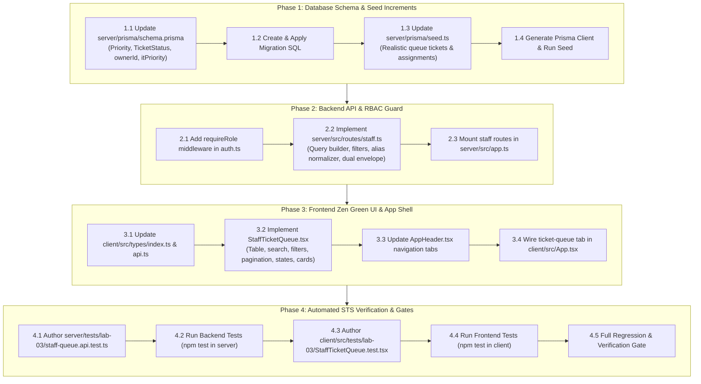

# Technical Implementation Plan: Issue 13 — IT Staff Ticket Queue & List Queries

**Feature Identifier:** Issue 13 (`feature/13-staff-ticket-queue`)  
**Sprint / Milestone:** TokTickIT Lab 3 (Sprint 3) — Users, Roles, IT Staff Ticketing, and Admin Screens (Sprint Issue 3)  
**Target Branch:** `feature/13-staff-ticket-queue` (Base: `lab3-staging`)  
**Specification Version:** 1.0.0  
**Authoritative Contract Reference:** [docs/features/13-staff-ticket-queue/contract.md](file:///c:/Users/xande/Documents/Year%203%20Sem%201/CPE%20334/Lab%201/toktickit/docs/features/13-staff-ticket-queue/contract.md)  
**Status:** PROPOSED IMPLEMENTATION PLAN (Awaiting Approval)  

---

## 1. Target File Inventory

The following table itemizes all files to be created, modified, or verified across `server/`, `client/`, `prisma/`, and `tests/`:

| Action | File Path | Component / Layer | Responsibility & Key Changes |
| :--- | :--- | :--- | :--- |
| **`[MODIFY]`** | `server/prisma/schema.prisma` | Database / Schema | Add `Priority` enum (`LOW`, `MEDIUM`, `HIGH`, `URGENT`), `TicketStatus` enum (`NEW`, `OPEN`, `IN_PROGRESS`, `WAITING_FOR_REQUESTER`, `RESOLVED`, `CLOSED`, `REOPENED`, `CANCELLED`). Add `ownerId Int?` and `itPriority Priority?` on `Ticket` model; add `assignedTickets Ticket[]` on `User` model; add indexing for queue performance. |
| **`[NEW]`** | `server/prisma/migrations/20260915150000_add_staff_queue_schema/migration.sql` | Database / Migration | SQL migration introducing enums, adding nullable `ownerId` FK referencing `users(id)` with `ON DELETE SET NULL`, adding `itPriority`, and transforming status columns with zero data loss. |
| **`[MODIFY]`** | `server/prisma/seed.ts` | Database / Seed | Populate realistic seed tickets across IT Staff owners (Sompong IT, Wichai Support), unassigned tickets, priority levels, categories, and lifecycle statuses. |
| **`[MODIFY]`** | `server/src/middleware/auth.ts` | Backend / Middleware | Implement reusable `requireRole(allowedRoles: Role[])` middleware enforcing role-based access control (RBAC). |
| **`[NEW]`** | `server/src/routes/staff.ts` | Backend / Router | Implement `GET /api/v1/staff/tickets` with search, multi-field filtering (status, category, priority, owner), sorting, pagination, and status alias normalization. |
| **`[MODIFY]`** | `server/src/app.ts` | Backend / App | Mount `staffRouter` at `/api/v1/staff` and backward-compatibility alias `/api/staff`. |
| **`[MODIFY]`** | `client/src/types/index.ts` | Frontend / Types | Define `Priority`, `TicketStatus`, `StaffTicketSummaryDTO`, `StaffQueueResponseDTO`, and `StaffQueueQueryParams`. |
| **`[MODIFY]`** | `client/src/api.ts` | Frontend / API | Implement `getStaffTicketsApi(params: StaffQueueQueryParams): Promise<StaffQueueResponseDTO>` with authenticated credentials transport. |
| **`[NEW]`** | `client/src/components/StaffTicketQueue.tsx` | Frontend / View | Responsive Zen Green staff ticket queue screen featuring 300ms debounced search, filter dropdown bar, 8-column data table, pagination toolbar, feedback states, and stacked cards under 768px. |
| **`[MODIFY]`** | `client/src/components/AppHeader.tsx` | Frontend / Shell | Render role-specific navigation tabs (IT Staff: "Ticket Queue", "+ Create Ticket"; Admin: "User Management", "Ticket Queue"; Requester: "My Tickets", "+ Create Ticket"). |
| **`[MODIFY]`** | `client/src/App.tsx` | Frontend / App | Wire `"ticket-queue"` tab state to render `<StaffTicketQueue />` for IT Staff and Administrator sessions. |
| **`[MODIFY]`** | `client/vite.config.ts` | Client / Tooling | Ensure Vitest includes both `tests/**/*.test.tsx` and `src/tests/**/*.test.tsx`. |
| **`[NEW]`** | `server/tests/lab-03/staff-queue.api.test.ts` | Tests / Backend | Supertest suite validating AC-13.1, AC-13.2 (RBAC 403, unauthenticated 401, password-gated 403), and AC-13.3 (search, filtering, sorting, pagination metadata). |
| **`[NEW]`** | `client/src/tests/lab-03/StaffTicketQueue.test.tsx` | Tests / Frontend | Vitest + RTL suite validating AC-13.1, AC-13.3, and AC-13.4 (table rendering, debounced search, filter interactions, pagination, empty/no-results states, mobile stacked cards). |
| **`[NEW]`** | `client/tests/lab-03/StaffTicketQueue.test.tsx` | Tests / Frontend | Companion test entrypoint to ensure seamless test execution across all test runner directory conventions. |

---

## 2. Step-by-Step Execution Sequence



---

## 3. Detailed Phase Breakdown

### Phase 1: Database Schema Increment & Seeding

#### 1.1 Update Prisma Schema (`server/prisma/schema.prisma`)
1. Define PostgreSQL Enums:
   ```prisma
   enum Priority {
     LOW
     MEDIUM
     HIGH
     URGENT
   }

   enum TicketStatus {
     NEW
     OPEN
     IN_PROGRESS
     WAITING_FOR_REQUESTER
     RESOLVED
     CLOSED
     REOPENED
     CANCELLED
   }
   ```
2. Update `User` model:
   ```prisma
   model User {
     // ... existing fields ...
     assignedTickets Ticket[] @relation("StaffAssignedTickets")
   }
   ```
3. Update `Ticket` model:
   ```prisma
   model Ticket {
     // ... existing fields ...
     ownerId           Int?
     requestedPriority Priority     @default(MEDIUM)
     itPriority        Priority?
     currentStatus     TicketStatus @default(NEW)

     // Relations
     owner             User?        @relation("StaffAssignedTickets", fields: [ownerId], references: [id], onDelete: SetNull)

     // Indexes
     @@index([requesterId])
     @@index([ownerId])
     @@index([currentStatus])
     @@index([itPriority])
     @@index([categoryId])
     @@index([createdAt])
   }
   ```

#### 1.2 Migration & Zero-Data-Loss Strategy
* Create migration SQL script `server/prisma/migrations/20260915150000_add_staff_queue_schema/migration.sql`:
  - Create types `"Priority"` and `"TicketStatus"`.
  - Add nullable column `ownerId INTEGER REFERENCES users(id) ON DELETE SET NULL`.
  - Add column `itPriority "Priority"`.
  - Safely cast existing `requestedPriority` strings to uppercase `"Priority"` values.
  - Populate existing rows: `UPDATE tickets SET "itPriority" = "requestedPriority" WHERE "itPriority" IS NULL;` (**BR-07**).
  - Safely cast existing `currentStatus` strings to `"TicketStatus"` values with uppercase mapping (`'New'` $\rightarrow$ `'NEW'`, `'Assigned'` $\rightarrow$ `'OPEN'`, `'In Progress'` $\rightarrow$ `'IN_PROGRESS'`, `'Pending Requester'` $\rightarrow$ `'WAITING_FOR_REQUESTER'`, `'Resolved'` $\rightarrow$ `'RESOLVED'`, `'Closed'` $\rightarrow$ `'CLOSED'`, `'Cancelled'` $\rightarrow$ `'CANCELLED'`).
  - Create foreign key constraints and indexes.
* Execute `npx prisma migrate dev` and `npx prisma generate`.

#### 1.3 Update Database Seed (`server/prisma/seed.ts`)
* Ensure at least 15 tickets are seeded across diverse operational states:
  - 3+ tickets assigned to Sompong IT (User ID 6, `IT_STAFF`).
  - 2+ tickets assigned to Wichai Support (User ID 7, `IT_STAFF`).
  - 5+ unassigned tickets (`ownerId: null`).
  - Full priority coverage: `LOW`, `MEDIUM`, `HIGH`, `URGENT`.
  - Full status coverage: `NEW`, `OPEN`, `IN_PROGRESS`, `WAITING_FOR_REQUESTER`, `RESOLVED`, `CLOSED`.
  - Categories: Hardware, Software, Network.

---

### Phase 2: Backend API & Authorization Protocols

#### 2.1 Reusable Role Guard Middleware (`server/src/middleware/auth.ts`)
* Implement `requireRole(allowedRoles: Array<"REQUESTER" | "IT_STAFF" | "ADMINISTRATOR">)`:
  - Checks `req.user`. If missing, returns `401 Unauthorized`.
  - Checks `req.user.role`. If not in `allowedRoles`, returns `403 Forbidden` (`code: "FORBIDDEN"`).

#### 2.2 Staff Query Router (`server/src/routes/staff.ts`)
* Define `GET /api/v1/staff/tickets`:
  - Middlewares: `authenticate`, `requirePasswordChanged` (**BR-02**), `requireRole(["IT_STAFF", "ADMINISTRATOR"])` (**BR-06**).
  - Query Parameter Parsing & Validation:
    - `search`: string $\le 100$ chars; applies case-insensitive substring search on `ticketNumber` OR `summary`.
    - `status`: accepts values from `TicketStatus` with alias normalization:
      - `ASSIGNED` maps to `OPEN`
      - `PENDING_REQUESTER` maps to `WAITING_FOR_REQUESTER`
    - `category`: parsed as positive integer `categoryId`.
    - `itPriority`: validated against `Priority` enum (`LOW`, `MEDIUM`, `HIGH`, `URGENT`).
    - `owner`: if `"unassigned"`, filters `ownerId: null`; if numeric string, filters `ownerId: Number(owner)`.
    - `sortBy`: validated against `['createdAt', 'ticketNumber', 'summary', 'itPriority', 'currentStatus']` (default: `'createdAt'`).
    - `sortOrder`: `'asc'` or `'desc'` (default: `'desc'`).
    - `page`: positive integer (default: 1).
    - `pageSize`: restricted to allowed values `[10, 25, 50]` (default: 10).
  - Database Querying:
    - Parallel execution via `prisma.$transaction([ countQuery, findManyQuery ])` with `take: pageSize` and `skip: (page - 1) * pageSize`.
    - Includes relation data: `category`, `relatedSystem`, `owner`, `requester`.
  - Dual Response Envelope Construction:
    ```json
    {
      "success": true,
      "data": {
        "items": [ /* StaffTicketSummaryDTO[] */ ],
        "totalCount": 42,
        "page": 1,
        "pageSize": 10,
        "totalPages": 5,
        "pagination": {
          "totalCount": 42,
          "page": 1,
          "pageSize": 10,
          "totalPages": 5
        }
      }
    }
    ```

#### 2.3 Mount in Express Application (`server/src/app.ts`)
* Import `staffRouter` and mount:
  ```typescript
  app.use("/api/v1/staff", staffRouter);
  app.use("/api/staff", staffRouter); // backward compatibility alias
  ```

---

### Phase 3: Frontend Zen Green UI & Application Shell

#### 3.1 Frontend Types & API Client (`client/src/types/index.ts` & `client/src/api.ts`)
* Define TypeScript types for `StaffTicketSummaryDTO`, `StaffQueueResponseDTO`, and `StaffQueueQueryParams`.
* Implement `getStaffTicketsApi(params: StaffQueueQueryParams)`:
  - Serializes query string using URLSearchParams.
  - Sends request with `credentials: "include"` and `Authorization: Bearer <token>`.
  - Parses standardized `StaffQueueResponseDTO`.

#### 3.2 Staff Ticket Queue Component (`client/src/components/StaffTicketQueue.tsx`)
* **Layout Structure:**
  - Header: Title *"IT Staff Ticket Queue"* and subtitle *"Manage, prioritize, and assign incoming service requests"*.
  - Filter Bar (`data-testid="staff-queue-filter-bar"`):
    - Search input (`data-testid="queue-search-input"`) with 300ms debounce.
    - Status select (`data-testid="queue-filter-status"`): All, New, Open, In Progress, Waiting for Requester, Resolved, Closed, Cancelled.
    - Category select (`data-testid="queue-filter-category"`): Populated dynamically from active categories.
    - IT Priority select (`data-testid="queue-filter-priority"`): All, Low, Medium, High, Urgent.
    - Owner select (`data-testid="queue-filter-owner"`): All, Unassigned, Me (current user ID), and list of active staff.
    - Clear Filters button (`data-testid="queue-clear-filters"`): Resets filters and triggers refetch.
  - Desktop Data Table ($\ge 768\text{px}$, `data-testid="staff-queue-table"`):
    - 8 columns: Ticket No, Created Date, Summary, Category, Req. Priority, IT Priority, Status, Owner.
    - Pale green hover highlight (`var(--color-pale-green)`).
    - Accessible row click and keyboard Enter/Space activation emitting `onSelectTicket(ticket.id)`.
    - WCAG AA compliant semantic badge pills (**DEC-UI-19**) pairing theme background, text color, border, and SVG micro-icon.
  - Mobile Card View ($< 768\text{px}$, `data-testid="staff-queue-mobile-cards"`):
    - Automatically rendered via CSS media queries or responsive breakpoints (`d-md-none`).
    - Stacks tickets as individual Zen Green cards (`.card.shadow-sm.mb-3`) with zero horizontal overflow (**DEC-UI-09**).
    - Minimum $44\text{px} \times 44\text{px}$ touch targets.
  - Pagination Toolbar (`data-testid="staff-queue-pagination"`):
    - Text: *"Showing X to Y of Z tickets"*.
    - Prev button (`data-testid="queue-page-prev"`), numbered page pill buttons (`data-testid="queue-page-{n}"`), Next button (`data-testid="queue-page-next"`).
    - Page size dropdown (`data-testid="queue-page-size-select"`) supporting 10, 25, 50.
  - UI Feedback States:
    - Skeleton loader (`data-testid="queue-loading-skeleton"`) during fetch.
    - Empty queue card (`data-testid="queue-empty-state"`) when totalCount is 0 without active filters.
    - No-results card (`data-testid="queue-no-results-state"`) with *"Clear Filters"* button when filters yield 0 matches.
    - Error alert banner (`data-testid="queue-error-alert"`) with *"Retry"* button on API failure.

#### 3.3 Shell Navigation Integration (`AppHeader.tsx` & `App.tsx`)
* In `AppHeader.tsx`:
  - Update `currentTab` type: `"my-tickets" | "create-ticket" | "ticket-queue"`.
  - Conditional navigation rendering:
    - If user has `IT_STAFF` role: render *"Ticket Queue"* and *"+ Create Ticket"*.
    - If user has `ADMINISTRATOR` role: render *"User Management"* and *"Ticket Queue"*.
    - If user has `REQUESTER` role: render *"My Tickets"* and *"+ Create Ticket"*.
* In `App.tsx`:
  - When user has `IT_STAFF` or `ADMINISTRATOR` role, set default tab to `"ticket-queue"`.
  - In main workspace router, render `<StaffTicketQueue onSelectTicket={...} />` when `activeTab === "ticket-queue"`.

---

### Phase 4: Automated Testing & Verification Gates

#### 4.1 Backend API Test Suite (`server/tests/lab-03/staff-queue.api.test.ts`)
* Implement 12 comprehensive Supertest test cases matching STS specifications:
  1. `API-06`: Staff queue retrieval with 200 OK, full metadata, and pagination.
  2. `API-06`: Administrator queue retrieval with 200 OK.
  3. `API-08`: Requester access rejection with HTTP 403 Forbidden (**BR-06**).
  4. `API-08`: Unauthenticated access rejection with HTTP 401 Unauthorized.
  5. `API-08`: Password-change required user rejection with HTTP 403 Forbidden (**BR-02**).
  6. `API-07`: Free-text search matching on ticket number or summary.
  7. `API-07`: Filter by status (`IN_PROGRESS`) and normalized aliases (`ASSIGNED` $\rightarrow$ `OPEN`).
  8. `API-07`: Filter by category ID and IT priority.
  9. `API-07`: Filter by unassigned tickets (`owner=unassigned`).
  10. `API-07`: Filter by specific staff owner user ID (`owner=6`).
  11. `API-06`: Pagination page and pageSize boundary validation.
  12. `API-06`: Sorting by `ticketNumber` and `createdAt` ascending/descending.

#### 4.2 Frontend UI Component Test Suite (`client/src/tests/lab-03/StaffTicketQueue.test.tsx`)
* Implement 11 React Testing Library test cases:
  1. `UI-03`: 8-column data table rendering with ticket rows and badges.
  2. `UI-03`: 300ms debounced search typing and API query emission.
  3. `UI-03`: Status and Owner filter dropdown selections trigger fetch with `page = 1`.
  4. `UI-03`: Clear Filters button resets form controls and re-queries.
  5. `UI-03`: Pagination Next/Prev button clicks and page size changes.
  6. `UI-03`: Loading skeleton rendering during fetch state.
  7. `UI-03`: Empty queue state rendering when system has 0 tickets.
  8. `UI-03`: No-results state rendering with functional Clear Filters CTA.
  9. `UI-03`: API failure error alert with retry button triggering refetch.
  10. `UI-03` / `AC-13.4`: Mobile responsive layout rendering stacked cards under 768px.
  11. `UI-03`: Table row click triggers `onSelectTicket` callback.

---

## 4. Verification Commands & Quality Gates

### Gate 1: Database Migration & Seed Verification
```powershell
cd server
npx prisma migrate dev
npm run prisma:seed
```
*Expected Result:* Clean migration without table drop errors; seed populates 11 users and 15+ queue tickets.

### Gate 2: Backend API & Authorization Suite
```powershell
cd server
npm test -- tests/lab-03/staff-queue.api.test.ts
```
*Expected Result:* All 12 test cases pass 100%.

### Gate 3: Frontend Component Test Suite
```powershell
cd client
npm test -- src/tests/lab-03/StaffTicketQueue.test.tsx
```
*Expected Result:* All 11 UI test cases pass 100%.

### Gate 4: TypeScript Build Verification
```powershell
cd server
npm run build

cd ..\client
npm run build
```
*Expected Result:* Zero TypeScript compilation or bundling errors.

---

## 5. Rollback & Contingency Plan

If an unexpected regression occurs during execution:
1. **Database Rollback:** The migration adds nullable columns (`ownerId`, `itPriority`) and enums. In the event of a rollback, reverting `schema.prisma` and dropping the added columns preserves all core ticket data.
2. **Backward Compatibility:** All existing Requester ticket endpoints (`GET /api/v1/tickets`, `POST /api/v1/tickets`) remain completely untouched in their contract behaviors, ensuring zero disruption to Requester workflows.
