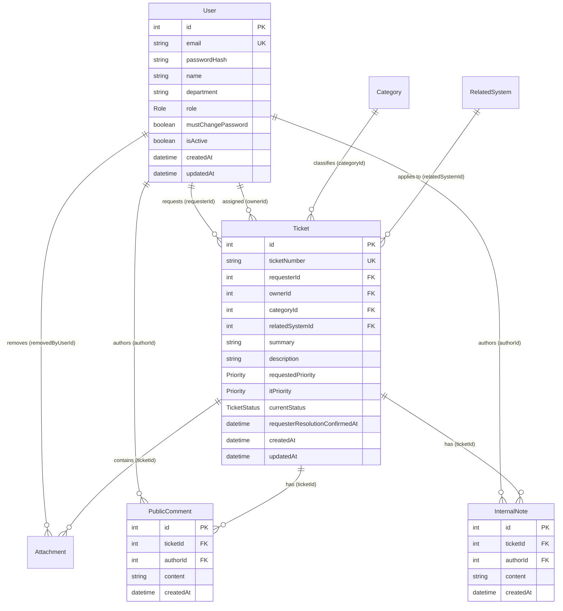
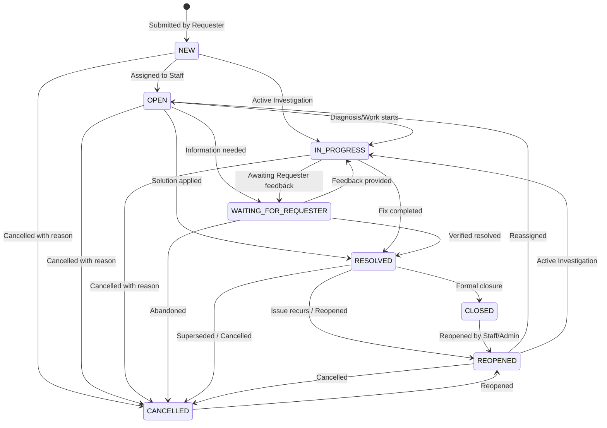
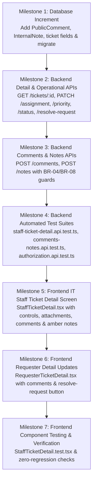

# Feature Engineering Contract: Issue 14 — IT Staff Ticket Detail, Operational Controls, Comments & Notes

**Feature Identifier:** Issue 14: IT Staff Ticket Detail, Operational Controls, Comments & Notes  
**Target Branch:** `feature/14-staff-ticket-detail`  
**Base Branch:** `lab3-staging`  
**Sprint / Milestone:** TokTickIT Lab 3 (Sprint 3) — Users, Roles, IT Staff Ticketing, and Admin Screens (Sprint Issue 4)  
**Specification Version:** 1.0.0  
**Status:** DRAFT ENGINEERING CONTRACT (Awaiting Review)  

---

## 1. Feature Scope, Purpose & Objectives

### 1.1 Purpose & Objectives
This engineering contract establishes the authoritative technical specifications, architectural boundaries, database schema increments, REST API protocols, UI state contracts, and test traceability for **Issue 14: IT Staff Ticket Detail, Operational Controls, Comments & Notes**.

In Sprint 2, the TokTickIT platform established core Requester ticket submission, personal ticket listing ("My Tickets"), and soft-deletion attachment capabilities. Issue 12 delivered production authentication and role modeling (`REQUESTER`, `IT_STAFF`, `ADMINISTRATOR`), and Issue 13 delivered the shared IT Staff Ticket Queue with multi-criteria filtering and pagination.

Issue 14 delivers the operational core of the IT Service Desk lifecycle:
1. **IT Staff Ticket Detail Screen (`/staff/tickets/:id`):** An operational workspace for IT Staff and Administrators to inspect service requests, view Requester contact details, manage attachments, assign/claim ownership, adjust IT Priority, execute valid status workflow transitions, and communicate via public and confidential channels.
2. **Operational Management APIs:** Dedicated endpoints for ownership assignment (`PATCH /api/v1/staff/tickets/:id/assignment`), IT priority management (`PATCH /api/v1/staff/tickets/:id/priority`), and workflow status transitions (`PATCH /api/v1/staff/tickets/:id/status`) enforcing the System SDS Status Transition Matrix.
3. **Public Comments Communication Thread (`POST /api/v1/tickets/:id/comments`):** A shared, chronological, append-only discussion thread visible to all permitted parties (Ticket Requester, IT Staff, and Administrators) to clarify requirements and provide status updates (**BR-04**, **BR-08**).
4. **Confidential Internal Notes Thread (`POST /api/v1/tickets/:id/notes`):** A role-restricted, append-only technical note stream strictly confidential to `IT_STAFF` and `ADMINISTRATOR` roles. Internal notes are strictly stripped from Requester payloads and protected by server-side authorization guards returning HTTP `403 Forbidden` on unauthorized access attempts (**BR-04**, **BR-08**).
5. **Requester Resolution Confirmation ("Problem Appears Resolved"):** A dedicated action (`POST /api/v1/tickets/:id/resolve-request`) enabling Requesters to signal that an issue is resolved from their perspective without granting Requesters formal authority to close tickets or modify system status (**BR-05**).
6. **Requester Ticket Detail Screen Updates (`/tickets/:id`):** Seamless integration of the Public Comments thread and the "Problem Appears Resolved" trigger, while guaranteeing complete, absolute absence of Internal Notes from UI presentation and network traffic.
7. **Zen Green UI & Accessibility Conformance:** KMUTT Zen Green styling with unmistakable visual distinction (amber styling, prominent lock icons, explicit privacy warnings) for Internal Notes to prevent accidental disclosure of confidential diagnostic information.

```mermaid
graph TD
    subgraph ClientSPA ["Client Single Page Application (React + Vite)"]
        StaffDetail["IT Staff Ticket Detail Screen (/staff/tickets/:id)"]
        ReqDetail["Requester Ticket Detail Screen (/tickets/:id)"]
        OpsControls["Operational Controls Rail (Owner, Priority, Status)"]
        PublicThread["Public Comments Component (Shared Thread)"]
        InternalThread["Internal Notes Component (Amber + Lock UI)"]
        ResolveBtn["Problem Appears Resolved Action Button"]
    end

    subgraph ServerAPI ["Server API Layer (Express + TypeScript)"]
        TicketRouter["Tickets Router (/api/v1/tickets)"]
        StaffRouter["Staff Router (/api/v1/staff/tickets)"]
        AuthMiddleware["authenticate & requirePasswordChanged Middleware"]
        RoleGuard["requireRole(['IT_STAFF', 'ADMINISTRATOR'])"]
        OwnerCheck["Requester Ownership Check (ticket.requesterId === req.user.id)"]
        PayloadFilter["Internal Notes Redaction Filter (BR-04)"]
        StatusMatrix["Status Transition Matrix Engine"]
    end

    subgraph Database ["PostgreSQL Persistence (Prisma ORM)"]
        TicketModel["tickets (ownerId, itPriority, currentStatus, requesterResolutionConfirmedAt)"]
        UserModel["users (id, name, email, role)"]
        PublicCommentModel["public_comments (ticketId, authorId, content, createdAt)"]
        InternalNoteModel["internal_notes (ticketId, authorId, content, createdAt)"]
    end

    StaffDetail --> OpsControls
    StaffDetail --> PublicThread
    StaffDetail --> InternalThread
    ReqDetail --> PublicThread
    ReqDetail --> ResolveBtn

    OpsControls -->|PATCH /assignment, /priority, /status| StaffRouter
    ResolveBtn -->|POST /tickets/:id/resolve-request| TicketRouter
    PublicThread -->|POST /tickets/:id/comments| TicketRouter
    InternalThread -->|POST /tickets/:id/notes| TicketRouter

    StaffRouter --> AuthMiddleware --> RoleGuard --> StatusMatrix --> TicketModel
    TicketRouter --> AuthMiddleware
    TicketRouter -->|GET /tickets/:id| OwnerCheck
    OwnerCheck -->|IT Staff / Admin| TicketModel
    OwnerCheck -->|Requester (Owned)| PayloadFilter
    PayloadFilter -->|Strips internalNotes| ReqDetail
    OwnerCheck -->|Requester (Unowned)| Forbidden403["HTTP 403 Forbidden"]

    TicketRouter -->|POST /comments| PublicCommentModel
    TicketRouter -->|POST /notes (Staff/Admin)| InternalNoteModel
    TicketRouter -->|POST /notes (Requester)| ForbiddenNotes["HTTP 403 Forbidden (BR-04)"]
```

---

### 1.2 In-Scope Capabilities

* **Database Modeling Increment (`server/prisma/schema.prisma`):**
  - Define `PublicComment` model: `id`, `ticketId` (FK to `Ticket`), `authorId` (FK to `User`), `content` (text, min 1, max 2000 chars), `createdAt`.
  - Define `InternalNote` model: `id`, `ticketId` (FK to `Ticket`), `authorId` (FK to `User`), `content` (text, min 1, max 2000 chars), `createdAt`.
  - Update `Ticket` model with `requesterResolutionConfirmedAt` (nullable `DateTime`), reverse relations for `publicComments` and `internalNotes`.
  - Update `User` model with reverse relations for `publicComments` and `internalNotes`.
  - Enforce strictly append-only lifecycle for comments and notes (no updates, no deletes).
* **Backend REST APIs & Authorization Protocols:**
  - `GET /api/v1/tickets/:id`:
    - Role-based retrieval: Requesters permitted only for owned tickets (`requesterId === req.user.id`); IT Staff and Administrators permitted for all tickets.
    - Automatic redaction: Public comments included for all permitted users; Internal notes included **only** for IT Staff and Administrators, strictly stripped from Requester responses (**BR-04**).
  - `PATCH /api/v1/staff/tickets/:id/assignment`:
    - Assign ticket to an active IT Staff or Administrator user, reassign ownership, or unassign (`ownerId: null`).
    - Restricted strictly to `IT_STAFF` and `ADMINISTRATOR` roles (**BR-06**).
  - `PATCH /api/v1/staff/tickets/:id/priority`:
    - Update `itPriority` (`LOW`, `MEDIUM`, `HIGH`, `URGENT`).
    - Restricted strictly to `IT_STAFF` and `ADMINISTRATOR` roles (**BR-07**).
  - `PATCH /api/v1/staff/tickets/:id/status`:
    - Enforce valid status transitions against the approved Status Transition Matrix.
    - Restricted strictly to `IT_STAFF` and `ADMINISTRATOR` roles; invalid transitions return HTTP `422 Unprocessable Entity`.
  - `POST /api/v1/tickets/:id/resolve-request`:
    - Allows the ticket Requester to record that the issue appears resolved.
    - Sets `requesterResolutionConfirmedAt = now()`. Does NOT change ticket status to `RESOLVED` or `CLOSED` (**BR-05**).
  - `POST /api/v1/tickets/:id/comments`:
    - Appends a Public Comment. Accessible to ticket Requester (owned tickets), IT Staff, and Administrators.
    - Validates trimmed length between 1 and 2000 characters (**BR-08**).
  - `POST /api/v1/tickets/:id/notes`:
    - Appends an Internal Note. Accessible strictly to IT Staff and Administrators.
    - Returns HTTP `403 Forbidden` for Requesters (**BR-04**).
    - Validates trimmed length between 1 and 2000 characters (**BR-08**).
* **Frontend User Interfaces:**
  - **IT Staff Ticket Detail Screen (`client/src/components/StaffTicketDetail.tsx`):**
    - Clean desktop 2-column split layout ($\ge 1200\text{px}$) and responsive single-column stack on mobile ($< 768\text{px}$).
    - Header with ticket number, summary, created date, requester details, priority and status badges.
    - Operational Controls Rail: Assigned Owner dropdown with one-click "Claim Ticket" shortcut; IT Priority selector; Workflow Status transition dropdown with confirmation modal for terminal states (`RESOLVED`, `CLOSED`, `CANCELLED`).
    - Attachments panel preserving Lab 2 download capabilities.
    - Public Comments thread and comment composer.
    - Confidential Internal Notes section/tab with unmistakable visual differentiation (amber background, lock icon, explicit confidentiality warning) to eliminate accidental public leaks.
  - **Requester Ticket Detail Screen Update (`client/src/components/RequesterTicketDetail.tsx`):**
    - Integrated Public Comments thread and comment composer.
    - "Problem Appears Resolved" action button (with dynamic confirmed state indicator).
    - Total absence of Internal Notes from UI elements, DOM, and network requests.
* **Automated Test Coverage:**
  - `server/tests/lab-03/staff-ticket-detail.api.test.ts`: Supertest API tests for operational controls (assignment, priority, status matrix transitions, requester resolution indication).
  - `server/tests/lab-03/comments-notes.api.test.ts`: Supertest API tests for public comments and internal notes creation, validation, ordering, and append-only constraints.
  - `server/tests/lab-03/authorization.api.test.ts`: Supertest security tests for role-based access control, cross-requester isolation, and confidential internal notes redaction (**BR-04**).
  - `client/src/tests/lab-03/StaffTicketDetail.test.tsx`: React Testing Library tests for operational control interactions, comment/note posting, visual differentiation, and responsive presentation.

---

### 1.3 Explicitly Excluded Scope (Strictly Out of Scope)
In accordance with §4.2 and §4.5 of the Lab 3 Sheet and the System SDS:
* **No "Actions Taken by IT Staff":** The checklist/subsystem for tracking individual operational action items by IT Staff is explicitly deferred to Lab 4.
* **No Blocking Ticket Resolution on Incomplete Actions:** Ticket resolution logic in Lab 3 does not check for incomplete operational action items (deferred to Lab 4).
* **No Editing or Deleting Comments/Notes:** Public Comments and Internal Notes are strictly append-only (**BR-08**). No edit (`PUT`/`PATCH`) or deletion (`DELETE`) endpoints shall be implemented.
* **No Rich-Text or Markdown Editor:** Comments and notes use plain-text inputs with whitespace preservation and line-break rendering. No WYSIWYG or markdown rendering engine is required.
* **No Comment Attachments:** File attachments remain exclusively attached to the parent Ticket (as established in Lab 2). Adding attachments directly to comments or notes is out of scope.
* **No Email/Push Notifications:** Posting comments or changing ticket status does not dispatch automated external emails, SMS, or webhook events.
* **No Real-Time WebSockets:** Ticket updates, new comments, and notes synchronize via standard HTTP request/response lifecycles and manual/component refetching.

---

### 1.4 Mapped Requirements & Business Rules Traceability

| Requirement / Rule ID | Source Document | Description | Implementation Target |
| :--- | :--- | :--- | :--- |
| **FR-04** | `docs/lab-03/specification.md` | IT Staff Ticket Detail & Operational Lifecycle | Ticket Detail Screen & Operational APIs |
| **FR-04.1** | `docs/lab-03/specification.md` | Detailed ticket retrieval with metadata, requester, category, attachments, priority, and status | `GET /api/v1/tickets/:id` |
| **FR-04.2** | `docs/lab-03/specification.md` | Claim unassigned ticket or reassign to active staff/admin | `PATCH /api/v1/staff/tickets/:id/assignment` |
| **FR-04.3** | `docs/lab-03/specification.md` | Update `itPriority` (`LOW`, `MEDIUM`, `HIGH`, `URGENT`) | `PATCH /api/v1/staff/tickets/:id/priority` |
| **FR-04.4** | `docs/lab-03/specification.md` | Execute permitted status workflow transitions | `PATCH /api/v1/staff/tickets/:id/status` |
| **FR-04.5** | `docs/lab-03/specification.md` | Requester indication that problem appears resolved | `POST /api/v1/tickets/:id/resolve-request` |
| **FR-05** | `docs/lab-03/specification.md` | Public Comments & Internal Notes Management | Comments & Notes Endpoints & UI |
| **FR-05.1** | `docs/lab-03/specification.md` | Append-only Public Comments accessible to Requester, Staff, Admin | `POST /api/v1/tickets/:id/comments` |
| **FR-05.2** | `docs/lab-03/specification.md` | Append-only Internal Notes restricted to Staff and Admin | `POST /api/v1/tickets/:id/notes` |
| **FR-05.3** | `docs/lab-03/specification.md` | Requester blocked from viewing/posting notes (`403 Forbidden`); notes omitted from Requester payloads | Middleware & Endpoint Controller |
| **FR-05.4** | `docs/lab-03/specification.md` | Validate content: 1–2000 characters; strictly append-only | Validation logic & DB schema |
| **BR-04** | `docs/lab-03/specification.md` | Comments vs. Notes Visibility Invariant: public thread shared; notes confidential to Staff/Admin | Controller redaction & RBAC middleware |
| **BR-05** | `docs/lab-03/specification.md` | Requester Resolution Indication Boundary: records timestamp without formal resolution authority | Resolve endpoint & status matrix |
| **BR-06** | `docs/lab-03/specification.md` | Queue and operational actions role authorization (IT Staff & Admin only) | `requireRole(['IT_STAFF', 'ADMINISTRATOR'])` |
| **BR-07** | `docs/lab-03/specification.md` | Default IT Priority initialization & Staff modification rights | Priority endpoint |
| **BR-08** | `docs/lab-03/specification.md` | Append-only Comment & Note Lifecycle: 1–2000 chars, no edits, no deletes | Schema & Controller validation |
| **DEC-UI-10** | `docs/lab-03/ui-spec.md` | Staff Ticket Detail split layout (65% ticket stream / 35% operational rail) | `StaffTicketDetail.tsx` CSS layout |
| **DEC-UI-11** | `docs/lab-03/ui-spec.md` | Unmistakable visual differentiation for Internal Notes (amber styling, lock icon, security warning) | Notes styling tokens & component |
| **D-01, D-02** | `TokTickIT-System-Level-SDS-v1.0.pdf` | Status Transition Matrix and system architecture invariants | Status transition engine |

---

## 2. Database Schema Increment Specification

### 2.1 Prisma Schema Delta (`server/prisma/schema.prisma`)

To support Public Comments, Internal Notes, and Requester Resolution confirmation, the Prisma schema is updated as follows:

```prisma
// ---------------------------------------------------------------------------
// 1. User Model Updates (Reverse Relations for Comments & Notes)
// ---------------------------------------------------------------------------
model User {
  id                 Int              @id @default(autoincrement())
  email              String           @unique
  passwordHash       String
  name               String
  department         String?
  role               Role             @default(REQUESTER)
  mustChangePassword Boolean          @default(true)
  isActive           Boolean          @default(true)
  createdAt          DateTime         @default(now())
  updatedAt          DateTime         @updatedAt

  // Relationships
  requestedTickets   Ticket[]         @relation("RequesterTickets")
  assignedTickets    Ticket[]         @relation("StaffAssignedTickets")
  removedAttachments Attachment[]     @relation("UserRemovedAttachments")
  publicComments     PublicComment[]  // NEW in Issue 14: Authored public comments
  internalNotes      InternalNote[]   // NEW in Issue 14: Authored internal notes

  @@map("users")
}

// ---------------------------------------------------------------------------
// 2. Ticket Model Updates (Resolution Timestamp & Comment/Note Relations)
// ---------------------------------------------------------------------------
model Ticket {
  id                             Int             @id @default(autoincrement())
  ticketNumber                   String          @unique @db.VarChar(32) // TKT-YYYY-NNNNN
  requesterId                    Int
  ownerId                        Int?
  categoryId                     Int
  relatedSystemId                Int
  summary                        String          @db.VarChar(100)
  description                    String          @db.Text
  requestedPriority              Priority        @default(MEDIUM)
  itPriority                     Priority?
  currentStatus                  TicketStatus    @default(NEW)
  requesterResolutionConfirmedAt DateTime?       // NEW in Issue 14: BR-05 Requester confirmation
  createdAt                      DateTime        @default(now())
  updatedAt                      DateTime        @updatedAt

  // Relationships
  requester                      User            @relation("RequesterTickets", fields: [requesterId], references: [id], onDelete: Restrict)
  owner                          User?           @relation("StaffAssignedTickets", fields: [ownerId], references: [id], onDelete: SetNull)
  category                       Category        @relation(fields: [categoryId], references: [id], onDelete: Restrict)
  relatedSystem                  RelatedSystem   @relation(fields: [relatedSystemId], references: [id], onDelete: Restrict)
  attachments                    Attachment[]
  publicComments                 PublicComment[] // NEW in Issue 14: Threaded public comments
  internalNotes                  InternalNote[]  // NEW in Issue 14: Confidential internal notes

  @@index([requesterId])
  @@index([ownerId])
  @@index([currentStatus])
  @@index([itPriority])
  @@index([categoryId])
  @@index([createdAt])
  @@map("tickets")
}

// ---------------------------------------------------------------------------
// 3. Public Comment Model (Shared Public Discussion Thread - BR-04, BR-08)
// ---------------------------------------------------------------------------
model PublicComment {
  id        Int      @id @default(autoincrement())
  ticketId  Int
  authorId  Int
  content   String   @db.Text
  createdAt DateTime @default(now())

  // Relationships
  ticket    Ticket   @relation(fields: [ticketId], references: [id], onDelete: Cascade)
  author    User     @relation(fields: [authorId], references: [id], onDelete: Restrict)

  @@index([ticketId])
  @@index([authorId])
  @@map("public_comments")
}

// ---------------------------------------------------------------------------
// 4. Internal Note Model (Confidential Staff-Only Stream - BR-04, BR-08)
// ---------------------------------------------------------------------------
model InternalNote {
  id        Int      @id @default(autoincrement())
  ticketId  Int
  authorId  Int
  content   String   @db.Text
  createdAt DateTime @default(now())

  // Relationships
  ticket    Ticket   @relation(fields: [ticketId], references: [id], onDelete: Cascade)
  author    User     @relation(fields: [authorId], references: [id], onDelete: Restrict)

  @@index([ticketId])
  @@index([authorId])
  @@map("internal_notes")
}
```

---

### 2.2 Relational Entity-Relationship Diagram



---

### 2.3 Migration Strategy & Data Integrity
1. **Prisma Migration:** Execute `npx prisma migrate dev --name add_comments_and_internal_notes` to generate SQL migration scripts.
2. **Referential Integrity:**
   - Deleting a Ticket (if ever performed) cascades to delete its `public_comments` and `internal_notes` via `onDelete: Cascade`.
   - Deleting a User is restricted (`onDelete: Restrict`) if the user has authored comments or notes, preserving audit history.
3. **Strict Append-Only Immutability:** No `updatedAt` field is defined on `PublicComment` or `InternalNote`. The application layer exposes zero update or delete endpoints.

---

### 2.4 Seed Data Invariants (`server/prisma/seed.ts`)
The seed script will be updated to guarantee realistic comment and note data for development and testing:
* **Public Comments:** Seed $\ge 2$ public comments across sample tickets demonstrating dialogue between Requester and IT Staff.
* **Internal Notes:** Seed $\ge 2$ confidential internal notes on assigned tickets authored by IT Staff (e.g. database diagnosis, network trace details).
* **Resolution State:** Seed $\ge 1$ ticket with `requesterResolutionConfirmedAt` populated while status is `IN_PROGRESS` or `WAITING_FOR_REQUESTER` to demonstrate the non-closing resolution signal.

---

## 3. API & Authorization Protocols

### 3.1 Endpoint Summary & Access Matrix

| Endpoint | Method | Role Permissions | Description |
| :--- | :---: | :--- | :--- |
| `/api/v1/tickets/:id` | `GET` | Requester (Owned only), IT Staff, Admin | Detailed ticket view. Internal notes strictly stripped for Requesters (**BR-04**). |
| `/api/v1/staff/tickets/:id/assignment` | `PATCH` | `IT_STAFF`, `ADMINISTRATOR` only | Assign, reassign, or unassign ticket owner. |
| `/api/v1/staff/tickets/:id/priority` | `PATCH` | `IT_STAFF`, `ADMINISTRATOR` only | Update `itPriority` (`LOW`, `MEDIUM`, `HIGH`, `URGENT`). |
| `/api/v1/staff/tickets/:id/status` | `PATCH` | `IT_STAFF`, `ADMINISTRATOR` only | Transition status adhering to the Status Transition Matrix. |
| `/api/v1/tickets/:id/resolve-request` | `POST` | Requester (Owned only) | Requester signals problem appears resolved (**BR-05**). |
| `/api/v1/tickets/:id/comments` | `POST` | Requester (Owned only), IT Staff, Admin | Append Public Comment (1–2000 chars, **BR-08**). |
| `/api/v1/tickets/:id/notes` | `POST` | `IT_STAFF`, `ADMINISTRATOR` only | Append Internal Note (1–2000 chars, **BR-08**). Requester gets `403 Forbidden`. |

---

### 3.2 Endpoint Specifications

#### 3.2.1 Get Ticket Detail (`GET /api/v1/tickets/:id`)
* **Access:** Authenticated.
  - `REQUESTER`: Permitted only if `ticket.requesterId === req.user.id`. Accessing another user's ticket returns HTTP `403 Forbidden`. Internal notes are strictly stripped from response (**BR-04**).
  - `IT_STAFF` / `ADMINISTRATOR`: Permitted for all tickets. Returns complete ticket data including `internalNotes`.
* **Response `200 OK` (for IT Staff / Admin):**
```json
{
  "success": true,
  "data": {
    "id": 42,
    "ticketNumber": "TKT-2026-00042",
    "summary": "LEB2 gradebook sync hangs",
    "description": "When instructors submit grades for course CPE334, the screen freezes at 99%.",
    "requestedPriority": "HIGH",
    "itPriority": "URGENT",
    "currentStatus": "IN_PROGRESS",
    "requesterResolutionConfirmedAt": null,
    "createdAt": "2026-09-12T03:15:00.000Z",
    "updatedAt": "2026-09-12T04:20:00.000Z",
    "category": { "id": 3, "name": "Software", "code": "SW" },
    "relatedSystem": { "id": 4, "name": "LEB2 App" },
    "requester": {
      "id": 4,
      "name": "Sarah Johnson",
      "email": "sarah.johnson@kmutt.ac.th",
      "department": "Science Faculty"
    },
    "owner": {
      "id": 2,
      "name": "Sompong IT",
      "email": "sompong.it@kmutt.ac.th",
      "role": "IT_STAFF"
    },
    "attachments": [
      {
        "id": 10,
        "originalFilename": "error_log.pdf",
        "fileSize": 1245180,
        "mimeType": "application/pdf",
        "isRemoved": false,
        "createdAt": "2026-09-12T03:15:00.000Z"
      }
    ],
    "removedAttachments": [],
    "publicComments": [
      {
        "id": 1,
        "author": { "id": 4, "name": "Sarah Johnson", "role": "REQUESTER" },
        "content": "Still failing this morning after clearing cache.",
        "createdAt": "2026-09-12T04:00:00.000Z"
      }
    ],
    "internalNotes": [
      {
        "id": 1,
        "author": { "id": 2, "name": "Sompong IT", "role": "IT_STAFF" },
        "content": "Investigating deadlock on postgres table student_grades.",
        "createdAt": "2026-09-12T04:15:00.000Z"
      }
    ]
  }
}
```
* **Response `200 OK` (for Requester on owned ticket):**
  - Identical to above, except `internalNotes` is **completely omitted / stripped** from the payload (`"internalNotes": undefined`).
* **Response `403 Forbidden`:** If a Requester requests a ticket where `ticket.requesterId !== req.user.id`:
```json
{
  "success": false,
  "error": {
    "code": "FORBIDDEN_TICKET_ACCESS",
    "message": "Access denied. You do not have permission to view this ticket."
  }
}
```

---

#### 3.2.2 Ticket Ownership Assignment (`PATCH /api/v1/staff/tickets/:id/assignment`)
* **Access:** `IT_STAFF`, `ADMINISTRATOR` only. Requesters receive HTTP `403 Forbidden`.
* **Request Body:**
```json
{
  "ownerId": 2
}
```
*(Pass `"ownerId": null` to unassign the ticket).*
* **Validation & Business Rules:**
  - If `ownerId` is non-null, user must exist, have `isActive === true`, and have role `IT_STAFF` or `ADMINISTRATOR`.
  - Assigning to a `REQUESTER` or inactive user returns HTTP `422 Unprocessable Entity`.
* **Response `200 OK`:**
```json
{
  "success": true,
  "data": {
    "id": 42,
    "ticketNumber": "TKT-2026-00042",
    "ownerId": 2,
    "owner": {
      "id": 2,
      "name": "Sompong IT",
      "email": "sompong.it@kmutt.ac.th",
      "role": "IT_STAFF"
    },
    "updatedAt": "2026-09-12T05:00:00.000Z"
  }
}
```

---

#### 3.2.3 Update IT Priority (`PATCH /api/v1/staff/tickets/:id/priority`)
* **Access:** `IT_STAFF`, `ADMINISTRATOR` only. Requesters receive HTTP `403 Forbidden`.
* **Request Body:**
```json
{
  "itPriority": "URGENT"
}
```
* **Validation & Business Rules:**
  - Must be one of `LOW`, `MEDIUM`, `HIGH`, `URGENT` (case-insensitive normalized).
  - Invalid priority returns HTTP `422 Unprocessable Entity`.
* **Response `200 OK`:**
```json
{
  "success": true,
  "data": {
    "id": 42,
    "ticketNumber": "TKT-2026-00042",
    "itPriority": "URGENT",
    "updatedAt": "2026-09-12T05:05:00.000Z"
  }
}
```

---

#### 3.2.4 Transition Ticket Status (`PATCH /api/v1/staff/tickets/:id/status`)
* **Access:** `IT_STAFF`, `ADMINISTRATOR` only. Requesters receive HTTP `403 Forbidden`.
* **Request Body:**
```json
{
  "targetStatus": "RESOLVED"
}
```
* **Validation & Business Rules:**
  - Evaluates `currentStatus` against `targetStatus` using the Status Transition Matrix Engine.
  - If transition is illegal (e.g. `NEW` $\rightarrow$ `RESOLVED` directly), returns HTTP `422 Unprocessable Entity`.
* **Response `200 OK`:**
```json
{
  "success": true,
  "data": {
    "id": 42,
    "ticketNumber": "TKT-2026-00042",
    "currentStatus": "RESOLVED",
    "updatedAt": "2026-09-12T05:10:00.000Z"
  }
}
```
* **Response `422 Unprocessable Entity` (Illegal Transition):**
```json
{
  "success": false,
  "error": {
    "code": "INVALID_STATUS_TRANSITION",
    "message": "Cannot transition status from NEW to RESOLVED. Permitted target statuses: OPEN, IN_PROGRESS, CANCELLED."
  }
}
```

---

#### 3.2.5 Requester Resolution Indication (`POST /api/v1/tickets/:id/resolve-request`)
* **Access:** Authenticated `REQUESTER` owning the ticket (`ticket.requesterId === req.user.id`).
* **Request Body:** Empty JSON object `{}`.
* **Validation & Business Rules:**
  - Requester can indicate resolution if `requesterResolutionConfirmedAt` is not yet set.
  - Sets `requesterResolutionConfirmedAt = new Date()`.
  - **CRITICAL INVARIANT (BR-05):** Does **NOT** alter `currentStatus` to `RESOLVED` or `CLOSED`. Ticket status remains under IT Staff authority.
* **Response `200 OK`:**
```json
{
  "success": true,
  "data": {
    "requesterResolutionConfirmedAt": "2026-09-12T05:30:00.000Z",
    "message": "Problem resolution indication recorded."
  }
}
```

---

#### 3.2.6 Post Public Comment (`POST /api/v1/tickets/:id/comments`)
* **Access:**
  - `REQUESTER`: Permitted only if `ticket.requesterId === req.user.id`.
  - `IT_STAFF` / `ADMINISTRATOR`: Permitted for all tickets.
* **Request Body:**
```json
{
  "content": "Thank you. The issue has been resolved on my end."
}
```
* **Validation & Business Rules:**
  - `content`: Required string. Trimmed length must be between 1 and 2000 characters (**BR-08**).
  - Empty or whitespace-only content returns HTTP `422 Unprocessable Entity`.
* **Response `201 Created`:**
```json
{
  "success": true,
  "data": {
    "id": 5,
    "ticketId": 42,
    "author": {
      "id": 4,
      "name": "Sarah Johnson",
      "role": "REQUESTER"
    },
    "content": "Thank you. The issue has been resolved on my end.",
    "createdAt": "2026-09-12T05:35:00.000Z"
  }
}
```

---

#### 3.2.7 Post Internal Note (`POST /api/v1/tickets/:id/notes`)
* **Access:** `IT_STAFF`, `ADMINISTRATOR` only.
  - `REQUESTER`: Returns HTTP `403 Forbidden` (**BR-04**).
* **Request Body:**
```json
{
  "content": "Applied connection pool index patch to resolve lock contention."
}
```
* **Validation & Business Rules:**
  - `content`: Required string. Trimmed length must be between 1 and 2000 characters (**BR-08**).
  - Empty or whitespace-only content returns HTTP `422 Unprocessable Entity`.
* **Response `201 Created`:**
```json
{
  "success": true,
  "data": {
    "id": 8,
    "ticketId": 42,
    "author": {
      "id": 2,
      "name": "Sompong IT",
      "role": "IT_STAFF"
    },
    "content": "Applied connection pool index patch to resolve lock contention.",
    "createdAt": "2026-09-12T05:40:00.000Z"
  }
}
```
* **Response `403 Forbidden` (for Requester):**
```json
{
  "success": false,
  "error": {
    "code": "FORBIDDEN_INTERNAL_NOTES",
    "message": "Access denied. Only IT Staff and Administrators may record internal notes."
  }
}
```

---

### 3.3 Status Transition Matrix Engine

TokTickIT implements the standardized 8-status lifecycle mandated by SDS Decision D-02 and Specification §6:



#### Transition Permissibility Table:

| Current Status (`from`) | Permitted Target Statuses (`to`) | Validation Invariants & Guard Conditions |
| :--- | :--- | :--- |
| **`NEW`** | `OPEN`, `IN_PROGRESS`, `CANCELLED` | Transitioning to `OPEN` requires active `ownerId`. Cannot jump directly to `RESOLVED` or `CLOSED`. |
| **`OPEN`** | `IN_PROGRESS`, `WAITING_FOR_REQUESTER`, `RESOLVED`, `CANCELLED` | Transitioning to `RESOLVED` requires confirmation. |
| **`IN_PROGRESS`** | `WAITING_FOR_REQUESTER`, `RESOLVED`, `CANCELLED` | Transitioning to `RESOLVED` requires confirmation. |
| **`WAITING_FOR_REQUESTER`** | `IN_PROGRESS`, `RESOLVED`, `CANCELLED` | Resuming work transitions back to `IN_PROGRESS`. |
| **`RESOLVED`** | `CLOSED`, `REOPENED`, `CANCELLED` | Formal closure restricted to IT Staff/Admin. Reopening re-enters active lifecycle. |
| **`CLOSED`** | `REOPENED` | Terminal state locked. Reopening transitions to `REOPENED`. |
| **`REOPENED`** | `OPEN`, `IN_PROGRESS`, `CANCELLED` | Resumes active handling. |
| **`CANCELLED`** | `REOPENED` | Reopening restores ticket to `REOPENED`. |

*Note on Status Normalization:* The database enum uses `OPEN` (alias `ASSIGNED`) and `WAITING_FOR_REQUESTER` (alias `PENDING_REQUESTER`). Both formats are accepted case-insensitively by the API and normalized server-side.

---

## 4. UI Wireframe, Component Architecture & State Contracts

### 4.1 Zen Green Design System Conformance

All views must strictly adhere to the KMUTT Zen Green design tokens defined in `docs/lab-03/ui-spec.md`:
* **Primary Brand Green:** `#006B3C` (`--zen-primary`)
* **Active Green Accent:** `#0B7A46` (`--zen-primary-hover`)
* **Light Pale Background:** `#EAF6EF` (`--zen-pale-bg`)
* **Canvas Neutral Background:** `#F5F7F6` (`--zen-canvas-bg`)
* **Card Border Token:** `#D0DFD6` (`--zen-border`)

#### Unmistakable Internal Notes Styling Tokens (Confidentiality Protection — DEC-UI-11):
To prevent accidental public disclosure or confusion with public comments, Internal Notes utilize a distinct amber warning theme:
* **Internal Note Card Background:** `#FFFBEB` (Amber 50)
* **Internal Note Card Border:** `#FCD34D` (Amber 300)
* **Internal Note Badge Accent:** `#D97706` (Amber 600)
* **Internal Note Header Text:** `#92400E` (Amber 800)
* **Visual Anchors:** Prominent Lock Icon (🔒) and explicit badge label `"INTERNAL NOTE — CONFIDENTIAL"`.

---

### 4.2 IT Staff Ticket Detail Screen Wireframe (`/staff/tickets/:id`)

```
+---------------------------------------------------------------------------------------------------+
| [TokTickIT]  < Back to Ticket Queue                            [Sompong IT (IT Staff) v] [Logout] |
+---------------------------------------------------------------------------------------------------+
|                                                                                                   |
|  TKT-2026-00042: LEB2 gradebook synchronization hangs                                             |
|  Created on Sep 12, 2026 by Sarah Johnson (Science Faculty)                                       |
|                                                                                                   |
|  +-----------------------------------------------+ +-------------------------------------------+  |
|  | TICKET INFORMATION                            | | OPERATIONAL CONTROLS                      |  |
|  | Summary: LEB2 gradebook sync hangs            | | Assigned Owner:                           |  |
|  | Description: Detailed problem explanation...  | | [ Sompong IT (IT Staff)             v ]   |  |
|  | Category: Software | System: LEB2 App         | | [ Claim Ticket ]                          |  |
|  | Requested Priority: [High]                    | |                                           |  |
|  |                                               | | IT Priority:                              |  |
|  | ATTACHMENTS (2 Active)                        | | [ Urgent                                v ] |  |
|  | 📄 error_log.pdf (1.2 MB) [Download]          | | [ Save Priority ]                         |  |
|  | 🖼️ screenshot.png (450 KB) [Download]         | |                                           |  |
|  |                                               | | Workflow Status:                          |  |
|  | [ Requester signaled: Problem appears resolved | | [ In Progress                           v ] |  |
|  |   on Sep 12, 2026, 11:30 AM ]                 | | [ Update Status ]                         |  |
|  +-----------------------------------------------+ +-------------------------------------------+  |
|                                                                                                   |
|  +---------------------------------------------------------------------------------------------+  |
|  | [ 💬 Public Comments (2) ]        [ 🔒 Internal Notes (1) - CONFIDENTIAL ]                  |  |
|  +---------------------------------------------------------------------------------------------+  |
|  | [TAB 1: PUBLIC COMMENTS]                                                                     |  |
|  | Visible to Requester, IT Staff, and Administrators                                            |  |
|  | ------------------------------------------------------------------------------------------- |  |
|  | Sarah Johnson (Requester) — 10:15 AM                                                        |  |
|  | Still experiencing the freeze at 99% when submitting grades.                                |  |
|  | ------------------------------------------------------------------------------------------- |  |
|  | Sompong IT (IT Staff) — 10:45 AM                                                            |  |
|  | We have identified a database table deadlock and are deploying an index patch.               |  |
|  | ------------------------------------------------------------------------------------------- |  |
|  | [ Write public comment... (0 / 2000)                                                      ] |  |
|  | [ Post Public Comment ]                                                                     |  |
|  +---------------------------------------------------------------------------------------------+  |
|                                                                                                   |
|  +---------------------------------------------------------------------------------------------+  |
|  | [TAB 2: INTERNAL NOTES (CONFIDENTIAL)]                                                      |  |
|  | 🔒 STRICTLY CONFIDENTIAL — Visible ONLY to IT Staff & Admin (Never displayed to Requester)   |  |
|  | ------------------------------------------------------------------------------------------- |  |
|  | Sompong IT (IT Staff) — 10:30 AM                                                            |  |
|  | Database deadlock detected on table student_grades during exam batch commit.                 |  |
|  | ------------------------------------------------------------------------------------------- |  |
|  | [ Write private internal note... (0 / 2000)                                               ] |  |
|  | [ Add Confidential Note ]                                                                   |  |
|  +---------------------------------------------------------------------------------------------+  |
+---------------------------------------------------------------------------------------------------+
```

---

### 4.3 Requester Ticket Detail Screen Updates (`/tickets/:id`)

```
+---------------------------------------------------------------------------------------------------+
| [TokTickIT]  < Back to My Tickets                              [Sarah Johnson (Requester) v]     |
+---------------------------------------------------------------------------------------------------+
|                                                                                                   |
|  TKT-2026-00042: LEB2 gradebook synchronization hangs                                             |
|  Status: [ In Progress ]  |  Priority: [ High ]                                                   |
|                                                                                                   |
|  +---------------------------------------------------------------------------------------------+  |
|  | [ ✓ Problem Appears Resolved ]  <- Click to confirm your issue is resolved                     |  |
|  | (Or: "✓ You confirmed this issue appears resolved on Sep 12, 2026, 11:30 AM")                |  |
|  +---------------------------------------------------------------------------------------------+  |
|                                                                                                   |
|  +---------------------------------------------------------------------------------------------+  |
|  | TICKET DETAILS & ATTACHMENTS (Preserved Lab 2 Functionality)                                |  |
|  +---------------------------------------------------------------------------------------------+  |
|                                                                                                   |
|  +---------------------------------------------------------------------------------------------+  |
|  | 💬 PUBLIC COMMENTS                                                                          |  |
|  | Dialogue between you and the IT Service Desk                                                 |  |
|  | ------------------------------------------------------------------------------------------- |  |
|  | Sarah Johnson (You) — 10:15 AM                                                              |  |
|  | Still experiencing the freeze at 99% when submitting grades.                                |  |
|  | ------------------------------------------------------------------------------------------- |  |
|  | Sompong IT (IT Staff) — 10:45 AM                                                            |  |
|  | We have identified a database table deadlock and are deploying an index patch.               |  |
|  | ------------------------------------------------------------------------------------------- |  |
|  | [ Add a comment or reply to IT Staff... (0 / 2000)                                        ] |  |
|  | [ Post Comment ]                                                                            |  |
|  +---------------------------------------------------------------------------------------------+  |
|                                                                                                   |
|  (NOTE: Internal Notes section is 100% ABSENT from this view, DOM, and network responses)        |  |
+---------------------------------------------------------------------------------------------------+
```

---

### 4.4 Element Identifiers & Test IDs

For robust automated testing with React Testing Library and Playwright, the following `data-testid` attributes must be strictly assigned:

| Area / Component | Element Description | Attribute & Value |
| :--- | :--- | :--- |
| **Operational Controls** | Owner assignment select | `data-testid="owner-select"` |
| **Operational Controls** | "Claim Ticket" button | `data-testid="claim-ticket-btn"` |
| **Operational Controls** | IT Priority select | `data-testid="it-priority-select"` |
| **Operational Controls** | "Save Priority" button | `data-testid="save-priority-btn"` |
| **Operational Controls** | Status transition select | `data-testid="status-transition-select"` |
| **Operational Controls** | "Update Status" button | `data-testid="update-status-btn"` |
| **Operational Controls** | Status confirmation modal | `data-testid="status-confirm-modal"` |
| **Operational Controls** | Modal confirm button | `data-testid="modal-confirm-status-btn"` |
| **Requester View** | "Problem Appears Resolved" button | `data-testid="resolve-request-btn"` |
| **Requester View** | Resolution confirmed banner | `data-testid="resolution-confirmed-banner"` |
| **Public Comments** | Section/Tab container | `data-testid="public-comments-section"` |
| **Public Comments** | Comment textarea | `data-testid="comment-input"` |
| **Public Comments** | Post comment submit button | `data-testid="post-comment-btn"` |
| **Public Comments** | Comment item container | `data-testid="comment-item"` |
| **Internal Notes** | Section/Tab container | `data-testid="internal-notes-section"` |
| **Internal Notes** | Note textarea | `data-testid="note-input"` |
| **Internal Notes** | Add note submit button | `data-testid="add-note-btn"` |
| **Internal Notes** | Note item container | `data-testid="note-item"` |
| **Internal Notes** | Confidential banner / warning | `data-testid="confidential-notes-warning"` |

---

### 4.5 Responsive Layout Adaptations
* **Desktop Viewport ($\ge 1200\text{px}$):** 
  - 2-Column split layout: Left 65% width contains Ticket Information, Attachments, and Comments/Notes tabs. Right 35% width contains Operational Controls Rail (Owner, Priority, Status).
* **Tablet Viewport ($768\text{px} - 1024\text{px}$):**
  - Fluid single-column layout: Operational Controls Rail wraps cleanly above or below Ticket Information.
* **Mobile Viewport ($< 768\text{px}$):**
  - Vertically stacked cards (`card shadow-sm mb-3`).
  - Zero horizontal overflow (`max-width: 100vw`).
  - Buttons and inputs sized for touch ($\ge 44\text{px} \times 44\text{px}$).

---

## 5. Test Workflow & Traceability Matrix

### 5.1 Mandatory Test Execution Rule
> [!IMPORTANT]
> **Mandatory Database Reset Before Testing:**  
> Always execute `npx prisma migrate reset --force` in `server/` prior to running server test suites (`npm test`). This guarantees a clean, predictable database state, runs all migrations, applies seeds, and avoids test contamination or flaky state collisions.

---

### 5.2 Acceptance Criteria Traceability Matrix

| Acceptance Criterion | Requirement Description | Target Test File Path | Test Function / Scenario |
| :---: | :--- | :--- | :--- |
| **AC-14.1** | IT Staff ticket claim, reassignment, IT priority update, and status workflow transitions | `server/tests/lab-03/staff-ticket-detail.api.test.ts`<br/>`client/src/tests/lab-03/StaffTicketDetail.test.tsx` | - Claim ticket updates owner to current user<br/>- Reassign to another active staff<br/>- Unassign ticket (`ownerId: null`)<br/>- Update IT Priority<br/>- Status transition matrix validation (valid vs invalid) |
| **AC-14.2** | Public Comment posting and visibility across Requester, Staff, and Admin | `server/tests/lab-03/comments-notes.api.test.ts`<br/>`client/src/tests/lab-03/StaffTicketDetail.test.tsx` | - Requester posts comment on owned ticket<br/>- Staff/Admin posts comment<br/>- Comment visible in public thread<br/>- Length validation (1–2000 chars) |
| **AC-14.3** | Internal Notes confidentiality: Staff/Admin can post/view; Requester blocked (`403`) and notes stripped | `server/tests/lab-03/comments-notes.api.test.ts`<br/>`server/tests/lab-03/authorization.api.test.ts`<br/>`client/src/tests/lab-03/StaffTicketDetail.test.tsx` | - Staff posts internal note -> 201 Created<br/>- Requester posts internal note -> 403 Forbidden<br/>- Requester `GET /tickets/:id` -> notes stripped<br/>- Amber/lock styling rendered on frontend |
| **AC-14.4** | Requester "Problem Appears Resolved" indication without formal status change | `server/tests/lab-03/staff-ticket-detail.api.test.ts`<br/>`client/src/tests/lab-03/StaffTicketDetail.test.tsx` | - Requester calls `/resolve-request` -> 200 OK<br/>- Sets `requesterResolutionConfirmedAt`<br/>- Verifies status is NOT `RESOLVED`/`CLOSED` |

---

### 5.3 Detailed Test Suite Specifications

#### 1. `server/tests/lab-03/staff-ticket-detail.api.test.ts`
* `PATCH /api/v1/staff/tickets/:id/assignment`:
  - Should allow IT Staff to claim an unassigned ticket.
  - Should allow IT Staff to reassign a ticket to another active IT Staff user.
  - Should allow IT Staff to unassign a ticket by setting `ownerId: null`.
  - Should reject assignment to an inactive user or Requester with `422 Unprocessable Entity`.
  - Should reject assignment attempts by a Requester with `403 Forbidden`.
* `PATCH /api/v1/staff/tickets/:id/priority`:
  - Should allow IT Staff to update `itPriority` to `LOW`, `MEDIUM`, `HIGH`, or `URGENT`.
  - Should reject invalid priority values with `422 Unprocessable Entity`.
  - Should reject priority update attempts by a Requester with `403 Forbidden`.
* `PATCH /api/v1/staff/tickets/:id/status`:
  - Should permit valid transitions from `NEW` to `OPEN` or `IN_PROGRESS`.
  - Should permit valid transitions from `IN_PROGRESS` to `RESOLVED`.
  - Should reject illegal transitions (e.g. `NEW` directly to `RESOLVED`) with `422 Unprocessable Entity`.
  - Should reject status update attempts by a Requester with `403 Forbidden`.
* `POST /api/v1/tickets/:id/resolve-request`:
  - Should allow the owning Requester to record resolution indication timestamp.
  - Should assert that `currentStatus` remains unchanged (does not jump to `RESOLVED` or `CLOSED`).
  - Should reject resolution indication from a non-owning Requester with `403 Forbidden`.

#### 2. `server/tests/lab-03/comments-notes.api.test.ts`
* `POST /api/v1/tickets/:id/comments`:
  - Should allow owning Requester to post a public comment.
  - Should allow IT Staff and Admin to post public comments.
  - Should reject empty or whitespace-only comments with `422 Unprocessable Entity`.
  - Should reject comments exceeding 2000 characters with `422 Unprocessable Entity`.
* `POST /api/v1/tickets/:id/notes`:
  - Should allow IT Staff and Admin to post internal notes.
  - Should reject internal note posting by a Requester with `403 Forbidden`.
  - Should reject empty or > 2000 character notes with `422 Unprocessable Entity`.
* Retrieval & Ordering:
  - Should return public comments in chronological order on `GET /api/v1/tickets/:id`.
  - Should return internal notes in chronological order for IT Staff on `GET /api/v1/tickets/:id`.
* Immutability Checks:
  - Verify that `PUT`, `PATCH`, or `DELETE` requests to `/comments/:id` or `/notes/:id` return `404 Not Found` or `405 Method Not Allowed`.

#### 3. `server/tests/lab-03/authorization.api.test.ts`
* Confidentiality & Redaction:
  - Requester `GET /api/v1/tickets/:id` on owned ticket returns `200 OK` and payload **omits** `internalNotes`.
  - IT Staff `GET /api/v1/tickets/:id` on any ticket returns `200 OK` and payload **includes** `internalNotes`.
  - Requester attempting to access another user's ticket returns `403 Forbidden`.
  - Unauthenticated requests to all ticket endpoints return `401 Unauthorized`.
  - User flagged with `mustChangePassword === true` is blocked from operational ticket endpoints.

#### 4. `client/src/tests/lab-03/StaffTicketDetail.test.tsx`
* Rendering & Operational Controls:
  - Renders ticket summary, description, requester contact, category, and priority badges.
  - Operational controls: allows selecting owner, clicking "Claim Ticket", updating priority, and selecting valid status transitions.
* Comments & Notes UI:
  - Renders Public Comments list and comment submission input.
  - Renders Internal Notes section with unmistakable amber styling, lock icon, and confidentiality warning.
  - Submitting a public comment updates the public discussion list.
  - Submitting an internal note updates the internal notes list.
* Requester UI Regression:
  - Renders Requester Ticket Detail with Public Comments and "Problem Appears Resolved" button.
  - Verifies that Internal Notes and operational controls are **completely absent** from the DOM.

---

## 6. Implementation Plan, Milestones & Definition of Done

### 6.1 Step-by-Step Implementation Sequence



1. **Phase 1 — Database Increment:**
   - Update `server/prisma/schema.prisma` with `PublicComment`, `InternalNote`, and `Ticket.requesterResolutionConfirmedAt`.
   - Run `npx prisma migrate dev --name add_comments_and_internal_notes`.
   - Update `server/prisma/seed.ts` with sample comments, notes, and resolution state.
2. **Phase 2 — Backend Ticket Detail & Operational Controls:**
   - Refactor `GET /api/v1/tickets/:id` in `server/src/routes/tickets.ts` to support both Requester (with `internalNotes` redacted) and IT Staff/Admin (with full notes).
   - Implement `PATCH /api/v1/staff/tickets/:id/assignment` in `server/src/routes/staff.ts`.
   - Implement `PATCH /api/v1/staff/tickets/:id/priority` in `server/src/routes/staff.ts`.
   - Implement `PATCH /api/v1/staff/tickets/:id/status` in `server/src/routes/staff.ts` enforcing the Status Transition Matrix.
   - Implement `POST /api/v1/tickets/:id/resolve-request` in `server/src/routes/tickets.ts` (**BR-05**).
3. **Phase 3 — Comments & Notes Backend Endpoints:**
   - Implement `POST /api/v1/tickets/:id/comments` in `server/src/routes/tickets.ts`.
   - Implement `POST /api/v1/tickets/:id/notes` in `server/src/routes/tickets.ts` with role restriction.
4. **Phase 4 — Backend Verification:**
   - Author and execute `server/tests/lab-03/staff-ticket-detail.api.test.ts`.
   - Author and execute `server/tests/lab-03/comments-notes.api.test.ts`.
   - Author and execute `server/tests/lab-03/authorization.api.test.ts`.
5. **Phase 5 — Frontend Client Implementation:**
   - Define TypeScript interfaces in `client/src/types/index.ts`.
   - Build `client/src/components/StaffTicketDetail.tsx` with split desktop layout and mobile card collapse.
   - Add unmistakable amber styling and lock icons for Internal Notes.
   - Update `client/src/components/RequesterTicketDetail.tsx` with comments thread and "Problem Appears Resolved" trigger.
   - Update `client/src/api.ts` with API helper methods.
   - Wire route `/staff/tickets/:id` in `client/src/App.tsx`.
6. **Phase 6 — Frontend Verification & Polish:**
   - Author and execute `client/src/tests/lab-03/StaffTicketDetail.test.tsx`.
   - Verify zero console errors and 100% test pass rate.

---

### 6.2 Definition of Done Checklist

- [ ] `PublicComment` and `InternalNote` models migrated and append-only.
- [ ] `requesterResolutionConfirmedAt` field added and tested.
- [ ] `GET /api/v1/tickets/:id` strictly strips `internalNotes` for Requesters (**BR-04**).
- [ ] `PATCH /api/v1/staff/tickets/:id/assignment` operational with "Claim Ticket" shortcut.
- [ ] `PATCH /api/v1/staff/tickets/:id/priority` operational.
- [ ] `PATCH /api/v1/staff/tickets/:id/status` enforces the Status Transition Matrix.
- [ ] `POST /api/v1/tickets/:id/resolve-request` records resolution without changing status (**BR-05**).
- [ ] `POST /api/v1/tickets/:id/comments` and `POST /api/v1/tickets/:id/notes` validate 1–2000 chars.
- [ ] Requester receives HTTP `403 Forbidden` when attempting to post or view Internal Notes.
- [ ] Zen Green IT Staff Ticket Detail Screen implemented with 2-column desktop split and mobile collapse.
- [ ] Unmistakable visual differentiation (amber palette `#FFFBEB`, lock icon 🔒, confidential banner) for Internal Notes.
- [ ] Requester Ticket Detail screen updated with public comments and resolution button with zero notes leakage.
- [ ] All 4 test files authored and passing 100%:
  - `server/tests/lab-03/staff-ticket-detail.api.test.ts`
  - `server/tests/lab-03/comments-notes.api.test.ts`
  - `server/tests/lab-03/authorization.api.test.ts`
  - `client/src/tests/lab-03/StaffTicketDetail.test.tsx`
- [ ] `npx prisma migrate reset --force` rule verified before test execution.
