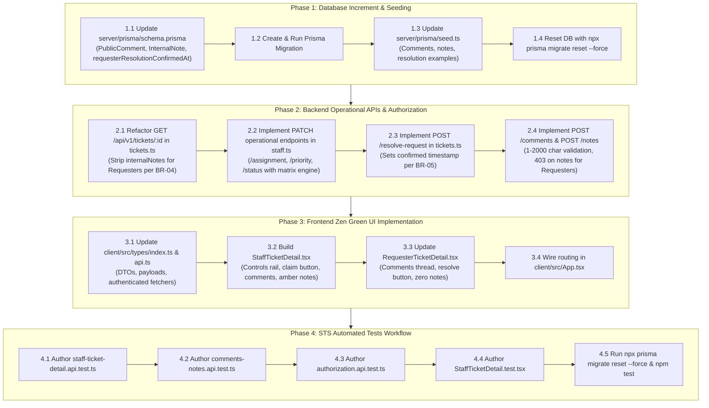

# Technical Implementation Plan: Issue 14 — IT Staff Ticket Detail, Operational Controls, Comments & Notes

**Feature Identifier:** Issue 14 (`feature/14-staff-ticket-detail`)  
**Sprint / Milestone:** TokTickIT Lab 3 (Sprint 3) — Users, Roles, IT Staff Ticketing, and Admin Screens (Sprint Issue 4)  
**Target Branch:** `feature/14-staff-ticket-detail` (Base: `lab3-staging`)  
**Specification Version:** 1.0.0  
**Authoritative Contract Reference:** [docs/features/14-staff-ticket-detail/contract.md](file:///c:/Users/xande/Documents/Year%203%20Sem%201/CPE%20334/Lab%201/toktickit/docs/features/14-staff-ticket-detail/contract.md)  
**Status:** PROPOSED TECHNICAL IMPLEMENTATION PLAN (Awaiting Approval)  

---

## 1. Target File Inventory

The table below itemizes all source code, database migration, API route, React component, and test files to be created or updated across `server/`, `client/`, `prisma/`, and `tests/`:

| Action | File Path | Component / Layer | Responsibility & Key Changes |
| :--- | :--- | :--- | :--- |
| **`[MODIFY]`** | `server/prisma/schema.prisma` | Database / Schema | Add `PublicComment` and `InternalNote` models (append-only); add `requesterResolutionConfirmedAt DateTime?` on `Ticket`; add reverse relations on `Ticket` and `User`. |
| **`[NEW]`** | `server/prisma/migrations/20260916000000_add_comments_and_internal_notes/migration.sql` | Database / Migration | SQL migration creating `public_comments` and `internal_notes` tables with foreign keys and cascade rules, and adding `requesterResolutionConfirmedAt` to `tickets`. |
| **`[MODIFY]`** | `server/prisma/seed.ts` | Database / Seed | Seed realistic Public Comments, confidential Internal Notes, and tickets with resolution confirmed timestamps across roles. |
| **`[MODIFY]`** | `server/src/routes/tickets.ts` | Backend / Router | Refactor `GET /:id` to strip `internalNotes` for Requesters (**BR-04**); implement `POST /:id/resolve-request` (**BR-05**); implement `POST /:id/comments` (**BR-08**); implement `POST /:id/notes` with role guard (**BR-04**, **BR-08**). |
| **`[MODIFY]`** | `server/src/routes/staff.ts` | Backend / Router | Implement operational actions: `PATCH /tickets/:id/assignment` (with unassign/claim), `PATCH /tickets/:id/priority`, and `PATCH /tickets/:id/status` enforcing the Status Transition Matrix. |
| **`[MODIFY]`** | `client/src/types/index.ts` | Frontend / Types | Define `PublicCommentDTO`, `InternalNoteDTO`, `StaffTicketDetailDTO`, operational update payloads (`AssignOwnerPayload`, `UpdatePriorityPayload`, `TransitionStatusPayload`). |
| **`[MODIFY]`** | `client/src/api.ts` | Frontend / API | Implement authenticated API helper methods: `getTicketDetailApi`, `assignTicketOwnerApi`, `updateTicketPriorityApi`, `transitionTicketStatusApi`, `resolveTicketRequestApi`, `postPublicCommentApi`, `postInternalNoteApi`. |
| **`[NEW]`** | `client/src/components/StaffTicketDetail.tsx` | Frontend / View | IT Staff Ticket Detail screen with 2-column split (desktop) / mobile stack: header, ticket info, attachments panel, operational controls rail (owner dropdown, "Claim Ticket" shortcut, priority selector, status transition dropdown with confirmation modal), Public Comments thread, and distinct amber/lock-styled Internal Notes thread. |
| **`[MODIFY]`** | `client/src/components/RequesterTicketDetail.tsx` | Frontend / View | Update Requester view to display Public Comments thread and comment composer, add "Problem Appears Resolved" button & confirmed state banner, while strictly guaranteeing ZERO rendering or leakage of Internal Notes. |
| **`[MODIFY]`** | `client/src/App.tsx` | Frontend / App | Route `selectedTicketId` to render `<StaffTicketDetail />` for `IT_STAFF` / `ADMINISTRATOR` sessions, and `<RequesterTicketDetail />` for `REQUESTER` sessions. |
| **`[NEW]`** | `server/tests/lab-03/staff-ticket-detail.api.test.ts` | Tests / Backend | Supertest suite validating operational controls: owner assignment/claim/unassign, priority updates, status transition matrix enforcement, and requester resolution indication (**AC-14.1**, **AC-14.4**). |
| **`[NEW]`** | `server/tests/lab-03/comments-notes.api.test.ts` | Tests / Backend | Supertest suite validating public comments creation and visibility, internal notes creation, 1–2000 char length validation, chronological ordering, and immutability (**AC-14.2**, **AC-14.3**). |
| **`[NEW]`** | `server/tests/lab-03/authorization.api.test.ts` | Tests / Backend | Supertest security suite validating cross-requester access blocking (`403`), internal notes stripping for Requesters (**BR-04**), note posting rejection for Requesters (`403`), and unauthenticated blocks (`401`). |
| **`[NEW]`** | `client/src/tests/lab-03/StaffTicketDetail.test.tsx` | Tests / Frontend | Vitest + RTL suite validating IT Staff Ticket Detail rendering, operational control interactions (claim, priority, status), comments and notes posting, distinct amber/lock styling, and requester view regression check (**AC-14.1** through **AC-14.4**). |

---

## 2. Step-by-Step Execution Sequence



---

## 3. Detailed Phase Breakdown

### Phase 1: Database & Seed Increments

#### 1.1 Update Prisma Schema (`server/prisma/schema.prisma`)
1. Add `PublicComment` model:
   ```prisma
   model PublicComment {
     id        Int      @id @default(autoincrement())
     ticketId  Int
     authorId  Int
     content   String   @db.Text
     createdAt DateTime @default(now())

     ticket    Ticket   @relation(fields: [ticketId], references: [id], onDelete: Cascade)
     author    User     @relation(fields: [authorId], references: [id], onDelete: Restrict)

     @@index([ticketId])
     @@index([authorId])
     @@map("public_comments")
   }
   ```
2. Add `InternalNote` model:
   ```prisma
   model InternalNote {
     id        Int      @id @default(autoincrement())
     ticketId  Int
     authorId  Int
     content   String   @db.Text
     createdAt DateTime @default(now())

     ticket    Ticket   @relation(fields: [ticketId], references: [id], onDelete: Cascade)
     author    User     @relation(fields: [authorId], references: [id], onDelete: Restrict)

     @@index([ticketId])
     @@index([authorId])
     @@map("internal_notes")
   }
   ```
3. Update `Ticket` model:
   - Add `requesterResolutionConfirmedAt DateTime?`
   - Add `publicComments PublicComment[]`
   - Add `internalNotes InternalNote[]`
4. Update `User` model:
   - Add `publicComments PublicComment[]`
   - Add `internalNotes InternalNote[]`

#### 1.2 Generate and Apply Migration
- Execute:
  ```powershell
  cd server
  npx prisma migrate dev --name add_comments_and_internal_notes
  ```

#### 1.3 Update Seed Script (`server/prisma/seed.ts`)
- Populate realistic public comments between Requesters and IT Staff.
- Populate confidential internal notes on assigned tickets authored by IT Staff (e.g., deadlock diagnostics).
- Set `requesterResolutionConfirmedAt` on at least one in-progress ticket to seed the Requester resolution indication state.

#### 1.4 Mandatory Reset & Verification
- Execute:
  ```powershell
  cd server
  npx prisma migrate reset --force
  ```
- Verifies clean migration application, Prisma client regeneration, and seed data insertion.

---

### Phase 2: Backend Operational APIs & Security

#### 2.1 Refactor Ticket Detail Retrieval (`server/src/routes/tickets.ts`)
- Endpoint: `GET /api/v1/tickets/:id` (and `/api/tickets/:id`).
- Authorization:
  - If `req.user.role === "REQUESTER"`:
    - Verify `ticket.requesterId === req.user.id`. If not matching, return `403 Forbidden`.
    - Include `category`, `relatedSystem`, `requester`, `owner`, `attachments`, and `publicComments`.
    - **CRITICAL INVARIANT (BR-04):** Strictly strip / omit `internalNotes` from the response payload (`data.internalNotes = undefined`).
  - If `req.user.role === "IT_STAFF"` or `"ADMINISTRATOR"`:
    - Permit access to all tickets.
    - Include all fields above, **plus** `internalNotes`.

#### 2.2 Operational Action Endpoints (`server/src/routes/staff.ts`)
- Endpoints mounted under `/api/v1/staff/tickets/:id/*`:
  1. `PATCH /tickets/:id/assignment`:
     - Payload: `{ ownerId: number | null }`.
     - Validates target user is active and has role `IT_STAFF` or `ADMINISTRATOR`.
     - Sets `ownerId`. Supports `ownerId: null` to unassign ticket.
  2. `PATCH /tickets/:id/priority`:
     - Payload: `{ itPriority: string }`.
     - Normalizes and validates priority in `LOW`, `MEDIUM`, `HIGH`, `URGENT`.
     - Updates `itPriority`.
  3. `PATCH /tickets/:id/status`:
     - Payload: `{ targetStatus: string }`.
     - Evaluates against the Status Transition Matrix:
       - `NEW` $\rightarrow$ `OPEN`, `IN_PROGRESS`, `CANCELLED`.
       - `OPEN` $\rightarrow$ `IN_PROGRESS`, `WAITING_FOR_REQUESTER`, `RESOLVED`, `CANCELLED`.
       - `IN_PROGRESS` $\rightarrow$ `WAITING_FOR_REQUESTER`, `RESOLVED`, `CANCELLED`.
       - `WAITING_FOR_REQUESTER` $\rightarrow$ `IN_PROGRESS`, `RESOLVED`, `CANCELLED`.
       - `RESOLVED` $\rightarrow$ `CLOSED`, `REOPENED`, `CANCELLED`.
       - `CLOSED` $\rightarrow$ `REOPENED`.
       - `REOPENED` $\rightarrow$ `OPEN`, `IN_PROGRESS`, `CANCELLED`.
       - `CANCELLED` $\rightarrow$ `REOPENED`.
     - Invalid transitions return HTTP `422 Unprocessable Entity` with an informative error message.
     - Updates `currentStatus`.

#### 2.3 Requester Resolution Confirmation (`server/src/routes/tickets.ts`)
- Endpoint: `POST /api/v1/tickets/:id/resolve-request` (and `/api/tickets/:id/resolve-request`).
- Authorization: Requester must own ticket (`ticket.requesterId === req.user.id`).
- Action: Sets `requesterResolutionConfirmedAt = new Date()`.
- **CRITICAL INVARIANT (BR-05):** Leaves `currentStatus` untouched (does NOT set status to `RESOLVED` or `CLOSED`).

#### 2.4 Comments & Notes Endpoints (`server/src/routes/tickets.ts`)
- `POST /api/v1/tickets/:id/comments`:
  - Accessible to ticket Requester (owned ticket), IT Staff, and Admin.
  - Body: `{ content: string }`.
  - Validates trimmed content between 1 and 2000 characters (**BR-08**).
  - Creates and returns `PublicComment`.
- `POST /api/v1/tickets/:id/notes`:
  - Accessible **strictly** to `IT_STAFF` and `ADMINISTRATOR`.
  - Requesters receive HTTP `403 Forbidden` (**BR-04**).
  - Body: `{ content: string }`.
  - Validates trimmed content between 1 and 2000 characters (**BR-08**).
  - Creates and returns `InternalNote`.

---

### Phase 3: Frontend Zen Green UI Implementation

#### 3.1 Frontend Types & API Client (`client/src/types/index.ts`, `client/src/api.ts`)
1. Extend `TicketDetail` interface in `types/index.ts` to include:
   - `itPriority?: string | null;`
   - `requesterResolutionConfirmedAt?: string | null;`
   - `publicComments?: PublicCommentDTO[];`
   - `internalNotes?: InternalNoteDTO[];`
2. Add DTO interfaces:
   ```typescript
   export interface PublicCommentDTO {
     id: number;
     content: string;
     createdAt: string;
     author: { id: number; name: string; role: string };
   }

   export interface InternalNoteDTO {
     id: number;
     content: string;
     createdAt: string;
     author: { id: number; name: string; role: string };
   }
   ```
3. Add API client functions in `client/src/api.ts`:
   - `getTicketDetailApi(ticketId: number)`
   - `assignTicketOwnerApi(ticketId: number, ownerId: number | null)`
   - `updateTicketPriorityApi(ticketId: number, itPriority: string)`
   - `transitionTicketStatusApi(ticketId: number, targetStatus: string)`
   - `resolveTicketRequestApi(ticketId: number)`
   - `postPublicCommentApi(ticketId: number, content: string)`
   - `postInternalNoteApi(ticketId: number, content: string)`

#### 3.2 Build IT Staff Ticket Detail Component (`client/src/components/StaffTicketDetail.tsx`)
1. **Layout Structure (Zen Green Tokens, DEC-UI-10):**
   - Desktop ($\ge 1200\text{px}$): 2-column split (Left 65% stream / Right 35% operational rail).
   - Mobile ($< 768\text{px}$): Stacked card layout with $\ge 44\text{px}$ touch targets.
2. **Left Column Components:**
   - **Ticket Header & Metadata:** Ticket number badge, summary, created date, requester details, priority and status badges.
   - **Full Description & Categories:** Problem description, Category, Related System.
   - **Attachments Panel:** Active attachments with download links; soft-removed attachments (preserved from Lab 2).
   - **Public Comments Thread:** Chronological public comments list, author badges, timestamp, and composer with character counter (`0 / 2000`).
   - **Internal Notes Section (Unmistakable Visual Differentiation, DEC-UI-11):**
     - Amber styling: background `#FFFBEB`, border `#FCD34D`, header `#92400E`.
     - Prominent Lock Icon (🔒) and bold label `"INTERNAL NOTES (CONFIDENTIAL)"`.
     - Explicit warning: *"Visible ONLY to IT Staff and Administrators — Never shown to Requester"*.
     - Amber note composer with character counter (`0 / 2000`) and "Add Confidential Note" button.
3. **Right Column (Operational Controls Rail):**
   - **Assigned Owner:** Dropdown of active IT Staff and Admin users, "(Unassigned)" option, and 1-click "Claim Ticket" shortcut button.
   - **IT Priority:** Dropdown (`Low`, `Medium`, `High`, `Urgent`) with "Save Priority" button.
   - **Workflow Status:** Current status badge, next status dropdown filtered by permitted transitions, and confirmation modal for terminal states (`RESOLVED`, `CLOSED`, `CANCELLED`).
   - **Requester Resolution Banner:** If `requesterResolutionConfirmedAt` is set, displays an alert: *"Requester indicated problem appears resolved on [timestamp]"*.

#### 3.3 Update Requester Ticket Detail Component (`client/src/components/RequesterTicketDetail.tsx`)
1. Integrate Public Comments thread and comment composer.
2. Integrate "Problem Appears Resolved" action button:
   - If `requesterResolutionConfirmedAt` is null: renders button triggering `resolveTicketRequestApi`.
   - If set: renders confirmed badge with date/time.
3. **Privacy Invariant:** Strict verification that no tabs, buttons, forms, or text referencing Internal Notes appear in the DOM or UI.

#### 3.4 Wire Component in `client/src/App.tsx`
- Conditionally render `<StaffTicketDetail ticketId={selectedTicketId} onBack={() => setSelectedTicketId(null)} />` when user is `IT_STAFF` or `ADMINISTRATOR`.
- Render `<RequesterTicketDetail ticketId={selectedTicketId} onBack={() => setSelectedTicketId(null)} />` when user is `REQUESTER`.

---

### Phase 4: STS Automated Tests Workflow

> [!IMPORTANT]
> **Mandatory Pre-Test Execution Rule:**  
> Before executing server API test suites, the test database must always be reset using `npx prisma migrate reset --force` to guarantee clean state and zero test pollution.

#### 4.1 Author `server/tests/lab-03/staff-ticket-detail.api.test.ts`
- **Owner Assignment Tests:**
  - Claim ticket: sets `ownerId` to authenticated user.
  - Reassign ticket: sets `ownerId` to target active staff.
  - Unassign ticket: sets `ownerId` to `null`.
  - Rejects assignment to Requester or inactive user (`422`).
  - Rejects assignment by Requester (`403`).
- **IT Priority Tests:**
  - Update `itPriority` to `URGENT` (`200 OK`).
  - Rejects invalid priority values (`422`).
  - Rejects priority update by Requester (`403`).
- **Status Matrix Transition Tests:**
  - Valid transition `NEW` $\rightarrow$ `IN_PROGRESS` (`200 OK`).
  - Valid transition `IN_PROGRESS` $\rightarrow$ `RESOLVED` (`200 OK`).
  - Invalid transition `NEW` $\rightarrow$ `RESOLVED` directly (`422 Unprocessable Entity`).
  - Rejects status transition by Requester (`403`).
- **Requester Resolution Confirmation Tests:**
  - Requester sets resolution indication on owned ticket (`200 OK`).
  - Confirms `requesterResolutionConfirmedAt` is populated.
  - Asserts `currentStatus` is NOT changed to `RESOLVED` or `CLOSED` (**BR-05**).
  - Rejects call from non-owning Requester (`403`).

#### 4.2 Author `server/tests/lab-03/comments-notes.api.test.ts`
- **Public Comments Tests:**
  - Owning Requester posts comment (`201 Created`).
  - IT Staff posts comment (`201 Created`).
  - Admin posts comment (`201 Created`).
  - Rejects empty or whitespace-only comment (`422`).
  - Rejects comment > 2000 characters (`422`).
  - Verified in chronological order on `GET /api/v1/tickets/:id`.
- **Internal Notes Tests:**
  - IT Staff posts internal note (`201 Created`).
  - Admin posts internal note (`201 Created`).
  - Rejects empty or whitespace-only note (`422`).
  - Rejects note > 2000 characters (`422`).
  - Verified in chronological order for Staff on `GET /api/v1/tickets/:id`.
- **Immutability Tests:**
  - Direct `PUT`, `PATCH`, or `DELETE` on comment or note URLs return `404` or `405`.

#### 4.3 Author `server/tests/lab-03/authorization.api.test.ts`
- **Confidentiality & RBAC Tests:**
  - Requester `GET /api/v1/tickets/:id` on owned ticket: `200 OK`, `internalNotes` is `undefined` (**BR-04**).
  - IT Staff `GET /api/v1/tickets/:id`: `200 OK`, `internalNotes` is an array (**BR-04**).
  - Requester `POST /api/v1/tickets/:id/notes`: rejected with `403 Forbidden` (**BR-04**).
  - Requester `GET /api/v1/tickets/:id` on another user's ticket: rejected with `403 Forbidden`.
  - Unauthenticated requests to all endpoints return `401 Unauthorized`.
  - User with `mustChangePassword === true` is blocked from operational endpoints.

#### 4.4 Author `client/src/tests/lab-03/StaffTicketDetail.test.tsx`
- **Component Rendering & Interactions:**
  - Renders ticket header, requester info, description, priority and status badges.
  - Renders operational controls: owner select, "Claim Ticket" button, priority select, status transition select.
  - Clicking "Claim Ticket" calls assignment API with current user ID.
  - Changing status invokes transition API and handles confirmation modal for terminal states.
- **Comments & Amber Notes UI:**
  - Renders Public Comments list and form.
  - Submitting public comment updates list.
  - Renders Internal Notes with amber background, lock icon, and confidential warning.
  - Submitting internal note updates notes list.
- **Requester View Regression:**
  - Renders RequesterTicketDetail with public comments and "Problem Appears Resolved" button.
  - Asserts that internal notes elements, tabs, and warnings are completely absent.

---

## 4. Verification & Testing Commands

To verify the implementation end-to-end, execute the following commands in sequence:

```powershell
# 1. Reset database and run migrations with fresh seed data
cd server
npx prisma migrate reset --force

# 2. Run backend test suites (Staff ticket detail, comments/notes, authorization)
npm test

# 3. Run frontend component test suites
cd ../client
npm test

# 4. Verify client production build
npm run build
```

---

## 5. Risk Assessment & Defensive Engineering

| Risk / Failure Mode | Severity | Defensive Mitigation Strategy |
| :--- | :---: | :--- |
| **Accidental Internal Note Leak to Requester** | **CRITICAL** | Server controller explicitly strips `internalNotes` before sending JSON (`data.internalNotes = undefined`); test suite specifically asserts `expect(res.body.data.internalNotes).toBeUndefined()`. |
| **Requester Attempts to Author Internal Note** | **HIGH** | Role guard middleware rejects Requesters with `403 Forbidden` before body processing; tested in `authorization.api.test.ts`. |
| **Requester Bypasses Authority to Close Ticket** | **HIGH** | `resolve-request` endpoint exclusively mutates `requesterResolutionConfirmedAt` and ignores any status alteration; status transitions remain under `requireRole(['IT_STAFF', 'ADMINISTRATOR'])`. |
| **Illegal Status Transition Corrupting Workflow** | **HIGH** | Status Transition Matrix strictly evaluated against database current status in transaction; illegal transitions rejected with `422 Unprocessable Entity`. |
| **Test Database State Contamination** | **MEDIUM** | Strict enforcement of `npx prisma migrate reset --force` prior to test runs ensures deterministic assertions. |

---

## 6. Definition of Done & Hand-off Checklist

- [ ] Database migration `add_comments_and_internal_notes` created and applied cleanly.
- [ ] Prisma models `PublicComment` and `InternalNote` strictly append-only (no `updatedAt`, no delete/update APIs).
- [ ] `requesterResolutionConfirmedAt` populated via `POST /api/v1/tickets/:id/resolve-request` (**BR-05**).
- [ ] `GET /api/v1/tickets/:id` strictly redacts `internalNotes` for Requester sessions (**BR-04**).
- [ ] `PATCH /api/v1/staff/tickets/:id/assignment` operational with "Claim Ticket" shortcut and unassign support.
- [ ] `PATCH /api/v1/staff/tickets/:id/priority` operational with `LOW`, `MEDIUM`, `HIGH`, `URGENT`.
- [ ] `PATCH /api/v1/staff/tickets/:id/status` enforces the Status Transition Matrix.
- [ ] `POST /api/v1/tickets/:id/comments` and `POST /api/v1/tickets/:id/notes` validate 1–2000 chars.
- [ ] Requesters attempting `POST /api/v1/tickets/:id/notes` receive HTTP `403 Forbidden` (**BR-04**).
- [ ] `StaffTicketDetail.tsx` renders 2-column split (desktop) and mobile stack with KMUTT Zen Green design tokens.
- [ ] Internal Notes section renders with unmistakable amber styling, lock icon (🔒), and confidentiality warning banner (**DEC-UI-11**).
- [ ] `RequesterTicketDetail.tsx` updated with Public Comments and "Problem Appears Resolved" button with zero notes leakage.
- [ ] `client/src/App.tsx` routes selected ticket to `StaffTicketDetail` for IT Staff/Admin.
- [ ] All 4 automated test files pass 100%:
  - `server/tests/lab-03/staff-ticket-detail.api.test.ts`
  - `server/tests/lab-03/comments-notes.api.test.ts`
  - `server/tests/lab-03/authorization.api.test.ts`
  - `client/src/tests/lab-03/StaffTicketDetail.test.tsx`
- [ ] `npx prisma migrate reset --force` rule verified before test execution.
