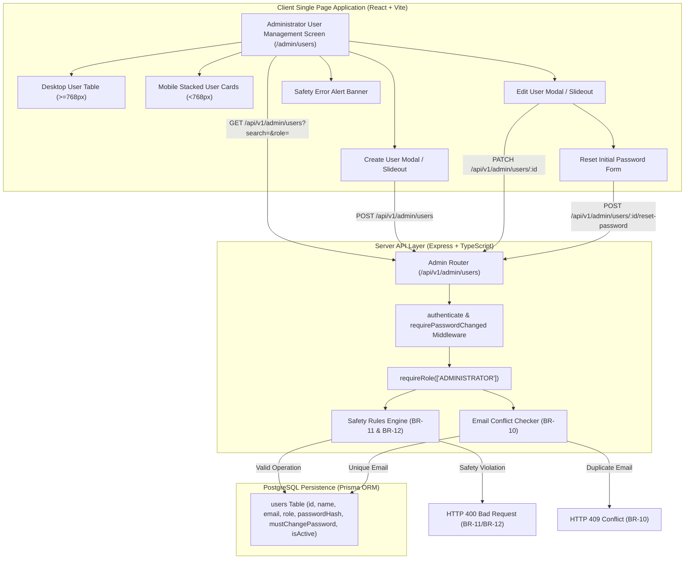
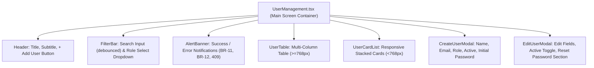

# Feature Engineering Contract: Issue 15 — Administrator User Management & Account Safety

**Feature Identifier:** Issue 15: Administrator User Management & Account Safety  
**Target Branch:** `feature/15-admin-user-management`  
**Base Branch:** `lab3-staging`  
**Sprint / Milestone:** TokTickIT Lab 3 (Sprint 3) — Users, Roles, IT Staff Ticketing, and Admin Screens (Sprint Issue 5)  
**Specification Version:** 1.0.0  
**Status:** DRAFT ENGINEERING CONTRACT (Awaiting Review)  

---

## 1. Feature Scope, Purpose & Objectives

### 1.1 Purpose & Objectives
This engineering contract establishes the authoritative technical specifications, architectural boundaries, database integrity constraints, REST API protocols, UI state contracts, and test traceability for **Issue 15: Administrator User Management & Account Safety**.

In Sprint 2, the TokTickIT platform established core ticket creation, personal ticket listing, and attachment management. In Sprint 3, Issue 12 introduced authenticated sessions and the unified user model (`Role`: `REQUESTER`, `IT_STAFF`, `ADMINISTRATOR`), Issue 13 delivered the shared IT Staff Ticket Queue, and Issue 14 delivered IT Staff Ticket Detail operations with public comments and confidential internal notes.

Issue 15 delivers the governance and account administration subsystem of the TokTickIT platform:
1. **Administrative REST API Layer (`/api/v1/admin/users/*`):** A secure, dedicated management API restricted strictly to the `ADMINISTRATOR` role (**FR-06.1**), providing user listing with keyword search and role filtering, user creation with initial credentials, user profile updates, activation/deactivation toggling, and initial password resets.
2. **Account Safety & System Invariant Protections:** Strict server-side verification preventing self-deactivation or self-demotion by active Administrators (**BR-11**), and preventing the deactivation or demotion of the final remaining active Administrator in the system (**BR-12**).
3. **Identity & Role Integrity Rules:** Strict enforcement of the Single-Role Assignment Policy (**BR-09**) and Case-Insensitive Email Uniqueness (**BR-10**) with proper conflict resolution (`409 Conflict`).
4. **Mandatory First-Login Password Enforcement for Admin-Provisioned Accounts:** All accounts created or password-reset by an Administrator are immediately flagged with `mustChangePassword = true`, seamlessly integrating into Issue 12's forced password rotation flow (**FR-02**, **BR-02**).
5. **Zen Green Administrator User Management Interface (`/admin/users`):** A responsive, accessible desktop table view and mobile card stack matching KMUTT Zen Green design tokens, featuring debounced keyword search, role filtering, a "Create User" slideout/modal, an "Edit User" slideout/modal with integrated password reset, and prominent safety violation alerts.
6. **Automated Verification:** Comprehensive backend API integration tests (`server/tests/lab-03/users-admin.api.test.ts`) and frontend React Testing Library component tests (`client/src/tests/lab-03/UserManagement.test.tsx`) mapping 100% to Acceptance Criteria `AC-15.1` through `AC-15.5`.



---

### 1.2 In-Scope Capabilities

1. **Backend REST APIs (`/api/v1/admin/users/*`):**
   - Strictly restricted to `ADMINISTRATOR` role via `requireRole(["ADMINISTRATOR"])`. Non-admin requests (`REQUESTER`, `IT_STAFF`) immediately return `403 Forbidden` (**FR-06.1**, **AC-15.5**).
   - `GET /api/v1/admin/users`:
     - Returns list of user objects (`id`, `name`, `email`, `role`, `isActive`, `createdAt`, `mustChangePassword`).
     - Password hashes (`passwordHash`) are strictly excluded from all response payloads.
     - Supports optional query parameter `search` performing case-insensitive partial substring match across `name` and `email`.
     - Supports optional query parameter `role` filtering by exact enum value (`REQUESTER`, `IT_STAFF`, `ADMINISTRATOR`).
     - Default ordering by `createdAt DESC` or `id ASC`.
   - `POST /api/v1/admin/users`:
     - Creates user with `name` (2–100 chars), `email` (valid email format, trimmed, lowercase), exactly one `role` (**BR-09**), initial `isActive` boolean (defaults to `true`), and `initialPassword` (min 8 chars).
     - Securely hashes `initialPassword` using bcrypt (cost 10).
     - Automatically sets `mustChangePassword = true` (**FR-06.3**, **AC-15.1**).
     - Detects email collisions case-insensitively and returns `409 Conflict` (**BR-10**, **AC-15.2**).
     - Returns `201 Created` with created user record (excluding password hash).
   - `PATCH /api/v1/admin/users/:id`:
     - Updates `name`, `email`, `role`, and `isActive` state (**FR-06.4**).
     - Enforces **BR-11 Self-Deactivation Prevention**: Rejects any request where `:id === req.user.id` and `isActive === false` with `400 Bad Request` (`CANNOT_DEACTIVATE_SELF`) (**AC-15.3**).
     - Enforces **BR-11 Self-Demotion Prevention**: Rejects any request where `:id === req.user.id` and `role !== undefined && role !== "ADMINISTRATOR"` with `400 Bad Request` (`CANNOT_DEMOTE_SELF`).
     - Enforces **BR-12 Last Active Administrator Preservation**: If target user is currently an active Administrator, and the patch operation sets `isActive = false` or changes `role` to non-admin, verifies that at least one other active Administrator exists in the system. If no other active Administrator exists, rejects with `400 Bad Request` (`LAST_ADMIN_PROTECTION`) (**AC-15.4**).
     - Detects email collision against other accounts and returns `409 Conflict` (**BR-10**, **AC-15.2**).
     - Returns `200 OK` with updated user record.
   - `POST /api/v1/admin/users/:id/reset-password`:
     - Accepts `newInitialPassword` (min 8 chars) (**FR-06.5**).
     - Securely hashes new initial password using bcrypt (cost 10).
     - Sets `mustChangePassword = true` on the target account.
     - Returns `200 OK` with confirmation message.
   - Zero hard user deletion endpoints (deactivation only).

2. **Frontend Administrator User Management Screen (`client/src/components/UserManagement.tsx`):**
   - Dedicated User Management workspace matching Zen Green design tokens (`#006B3C`, `#0B7A46`, `#EAF6EF`, `#F5F7F6`).
   - Integrated into the application navigation shell (`AppHeader.tsx`), visible exclusively when `user?.role === "ADMINISTRATOR"`.
   - Top action bar featuring page title, descriptive subtitle, and "+ Add User" primary action button.
   - Filter bar with debounced keyword search (300ms debounce) and Role filter dropdown (`All Roles`, `Requester`, `IT Staff`, `Administrator`).
   - Responsive presentation:
     - Desktop Viewport ($\ge 768\text{px}$): Full multi-column data table displaying Full Name, Email Address, Role badge, Active/Inactive status badge, and Edit action button.
     - Mobile Viewport ($< 768\text{px}$): Stacked card view with zero horizontal overflow, preserving all data fields and accessible touch targets ($\ge 44\text{px}$).
   - "Create User" slideout/modal:
     - Form inputs: Full Name, Email Address, Department (optional), Role dropdown (`REQUESTER`, `IT_STAFF`, `ADMINISTRATOR`), Active status toggle checkbox, and Initial Password field (with show/hide visibility toggle).
     - Real-time client validation: required fields, email format, minimum 8 characters for password.
     - Server error feedback banner (e.g. duplicate email conflict).
   - "Edit User" slideout/modal:
     - Form inputs: Edit Name, Edit Email, Edit Department, Edit Role, Active Status toggle checkbox.
     - In-modal safety guardrails: When editing the currently authenticated Administrator, the Active toggle and Role dropdown display explicit safety tooltips or disabled indicators preventing accidental self-lockout.
     - Dedicated "Reset Initial Password" expandable section or action inside the modal, prompting for a new initial password.
   - Comprehensive error alerts displaying explicit safety messages when self-deactivation or last-admin violations occur.

---

### 1.3 Explicitly Excluded Scope (Honoring Lab 3 Scope Boundaries)

To adhere strictly to **Lab 3 Specification §3.2** and **poc-scope-and-issues.md §Issue 15**, the following capabilities are explicitly excluded:
* **User Hard Deletion:** No endpoint or UI control for deleting user rows from PostgreSQL; accounts may only be deactivated (`isActive: false`).
* **Bulk User Operations:** No bulk account creation, bulk role updates, or bulk deactivations.
* **Import / Export:** No CSV/JSON import or export of user rosters.
* **Complex Grid Features:** No mandatory server-side pagination or multi-column sorting on the user management list (client-side rendering and search/role filtering is sufficient for the institutional administrative volume in Lab 3).
* **Departments & Organization Hierarchy:** No organization chart, faculty/department trees, or managerial hierarchies.
* **Profile Media:** No user avatar uploads, gravatars, or profile image storage.
* **Email Delivery / Password Reset Links:** No automated outbound SMTP emails with reset tokens or initial credentials; administrators communicate initial passwords directly to users through institutional provisioning protocols.
* **Multiple Roles:** Strict single-role policy; assigning secondary or compound roles is prohibited (**BR-09**).

---

## 2. Master Contract Baseline & Traceability Register

### 2.1 Direct Traceability to Lab 3 Specification, Labsheet & System SDS

| Component | Source Reference | Specification Clause | Issue 15 Contract Implementation |
| :--- | :--- | :--- | :--- |
| **Admin Route Guard** | `docs/lab-03/specification.md` §4 | **FR-06.1** | Restrict all `/api/v1/admin/users/*` routes to `ADMINISTRATOR` via middleware; return `403 Forbidden` for other roles. |
| **User Listing & Search** | `docs/lab-03/specification.md` §4 | **FR-06.2** | `GET /api/v1/admin/users` with optional `search` (name or email) and `role` query filters. |
| **User Creation** | `docs/lab-03/specification.md` §4 | **FR-06.3** | `POST /api/v1/admin/users` with single role, bcrypt hash, and `mustChangePassword = true`. |
| **User Editing** | `docs/lab-03/specification.md` §4 | **FR-06.4** | `PATCH /api/v1/admin/users/:id` updating name, email, role, and active status. |
| **Password Reset** | `docs/lab-03/specification.md` §4 | **FR-06.5** | `POST /api/v1/admin/users/:id/reset-password` updating hash and setting `mustChangePassword = true`. |
| **Administrative Safety** | `docs/lab-03/specification.md` §4 | **FR-06.6** | Rejects self-deactivation/demotion and last-active-admin deactivation/demotion. |
| **Single-Role Policy** | `docs/lab-03/specification.md` §5 | **BR-09** | Enforces exactly one role (`REQUESTER`, `IT_STAFF`, `ADMINISTRATOR`) per user account. |
| **Unique Email Rule** | `docs/lab-03/specification.md` §5 | **BR-10** | Unique, trimmed, case-insensitively normalized emails; rejects duplicates with `409 Conflict`. |
| **Self-Deactivation Guard** | `docs/lab-03/specification.md` §5 | **BR-11** | Blocks admin from deactivating or demoting their own account with `400 Bad Request`. |
| **Last-Admin Preservation**| `docs/lab-03/specification.md` §5 | **BR-12** | Protects system from having 0 active administrators; returns `400 Bad Request` or `409 Conflict`. |
| **Course Labsheet** | `docs/reference/Lab_3_sheet.pdf` | §1, §4.4, §8.5 | Minimalist administrator user management, safety rules, and Zen Green styling. |
| **System SDS** | `docs/reference/TokTickIT-System-Level-SDS-v1.0.pdf` | p. 9, 15 | Identity management, RBAC, safe error responses, and audit readiness. |

---

### 2.2 Acceptance Criteria Traceability Matrix

| AC ID | Level | Given-When-Then Specification Summary | Automated Test Suite Location |
| :---: | :---: | :--- | :--- |
| **AC-15.1** | API / UI | *Given* an Administrator, *when* creating a user with valid details, *then* the account is created with one permitted role, and `mustChangePassword` is set to `true`. | `server/tests/lab-03/users-admin.api.test.ts`<br/>`client/src/tests/lab-03/UserManagement.test.tsx` |
| **AC-15.2** | API / UI | *Given* an email already in use, *when* creating or updating a user, *then* the API rejects the request with HTTP `409 Conflict`. | `server/tests/lab-03/users-admin.api.test.ts`<br/>`client/src/tests/lab-03/UserManagement.test.tsx` |
| **AC-15.3** | API / UI | *Given* an Administrator viewing their own account, *when* attempting to deactivate or demote it, *then* the operation is blocked with HTTP `400 Bad Request` and a clear safety warning. | `server/tests/lab-03/users-admin.api.test.ts`<br/>`client/src/tests/lab-03/UserManagement.test.tsx` |
| **AC-15.4** | API / UI | *Given* only one active Administrator exists in the system, *when* attempting to deactivate or demote that user, *then* the system rejects the operation with HTTP `400 Bad Request` or `409 Conflict`. | `server/tests/lab-03/users-admin.api.test.ts`<br/>`client/src/tests/lab-03/UserManagement.test.tsx` |
| **AC-15.5** | API / UI | *Given* an IT Staff or Requester user, *when* attempting to access `/api/v1/admin/users/*`, *then* the server responds with HTTP `403 Forbidden`. | `server/tests/lab-03/users-admin.api.test.ts`<br/>`client/src/tests/lab-03/UserManagement.test.tsx` |

---

## 3. Architectural Boundaries, Invariants & Security Guardrails

### 3.1 Role Guard & Authorization Invariant
All routes mounted under `/api/v1/admin/users` (and its alias `/api/admin/users`) must be protected by the chain:
1. `authenticate`: Verifies session token or cookie; populates `req.user`. If missing/invalid, responds `401 Unauthorized`.
2. `requirePasswordChanged`: Enforces **BR-02**. If `req.user.mustChangePassword === true`, responds `403 Forbidden` (`PASSWORD_CHANGE_REQUIRED`).
3. `requireRole(["ADMINISTRATOR"])`: Enforces **BR-06** / **FR-06.1**. If `req.user.role !== "ADMINISTRATOR"`, responds `403 Forbidden` (`FORBIDDEN`).

```typescript
// Architectural Invariant: Admin Route Security Chain
adminRouter.use(authenticate);
adminRouter.use(requirePasswordChanged);
adminRouter.use(requireRole(["ADMINISTRATOR"]));
```

---

### 3.2 Safety Invariant 1: Self-Deactivation & Self-Demotion Prevention (BR-11)
An Administrator cannot deactivate their own active account or revoke their own administrator privileges:
* **Condition Check:** When `PATCH /api/v1/admin/users/:id` receives `targetUserId === req.user.id`:
  - If `body.isActive === false`: Immediate rejection with HTTP `400 Bad Request`.
  - If `body.role !== undefined && body.role !== "ADMINISTRATOR"`: Immediate rejection with HTTP `400 Bad Request`.
* **Error Code:** `CANNOT_DEACTIVATE_SELF` / `CANNOT_DEMOTE_SELF`
* **Error Message:** `"Administrators cannot deactivate or demote their own active account."`

---

### 3.3 Safety Invariant 2: Last Active Administrator Preservation (BR-12)
The system must guarantee that at least one active Administrator always exists:
* **Condition Check:** When `PATCH /api/v1/admin/users/:id` targets a user whose current role is `ADMINISTRATOR` and `isActive === true`:
  - If the update specifies `isActive === false` OR (`body.role !== undefined && body.role !== "ADMINISTRATOR"`):
  - The server queries the database for other active administrators:
    ```typescript
    const otherActiveAdminCount = await prisma.user.count({
      where: {
        role: "ADMINISTRATOR",
        isActive: true,
        id: { not: targetUserId },
      },
    });
    ```
  - If `otherActiveAdminCount === 0`: The operation is rejected with HTTP `400 Bad Request` (or `409 Conflict`).
* **Error Code:** `LAST_ADMIN_PROTECTION`
* **Error Message:** `"Cannot deactivate or demote the system's last remaining active Administrator."`

---

### 3.4 Single-Role Policy Invariant (BR-09)
Every user account has exactly one assigned role:
* Allowed roles are strictly the Prisma `Role` enum values: `REQUESTER`, `IT_STAFF`, `ADMINISTRATOR`.
* Arrays, comma-delimited strings, or composite roles are rejected at request validation with HTTP `422 Unprocessable Entity` or `400 Bad Request`.

---

### 3.5 Email Uniqueness & Normalization Protocol (BR-10)
Email addresses represent the unique login credential for TokTickIT accounts:
* **Normalization:** Prior to persistence or lookup, all email strings are trimmed of leading/trailing whitespace and converted to lower case (`email.trim().toLowerCase()`).
* **Collision Detection:**
  - On Create: Check `prisma.user.findFirst({ where: { email: normalizedEmail } })`.
  - On Update: Check `prisma.user.findFirst({ where: { email: normalizedEmail, id: { not: targetUserId } } })`.
* **Conflict Response:** HTTP `409 Conflict` with error code `EMAIL_ALREADY_EXISTS`.

---

### 3.6 Initial Password Provisioning & Forced Password Change Workflow
When an Administrator creates an account or resets an initial password:
1. The plaintext initial password must have a minimum length of 8 characters.
2. The server hashes the password with `bcryptjs.hash(password, 10)`.
3. The server sets `mustChangePassword = true`.
4. When the affected user logs in, Issue 12's `requirePasswordChanged` middleware intercepts their access and forces them to complete the password change form (`/change-password`) before accessing any business endpoints.

---

## 4. Database Schema & Data Modeling Specifications

### 4.1 Existing User Model Integration (`server/prisma/schema.prisma`)

Issue 15 consumes the unified `User` model established in Issue 12 without requiring breaking database migrations:

```prisma
model User {
  id                 Int          @id @default(autoincrement())
  email              String       @unique
  passwordHash       String
  name               String
  department         String?
  role               Role         @default(REQUESTER)
  mustChangePassword Boolean      @default(true)
  isActive           Boolean      @default(true)
  createdAt          DateTime     @default(now())
  updatedAt          DateTime     @updatedAt

  // Relationships
  requestedTickets   Ticket[]        @relation("RequesterTickets")
  assignedTickets    Ticket[]        @relation("StaffAssignedTickets")
  removedAttachments Attachment[]    @relation("UserRemovedAttachments")
  publicComments     PublicComment[]
  internalNotes      InternalNote[]

  @@map("users")
}

enum Role {
  REQUESTER
  IT_STAFF
  ADMINISTRATOR
}
```

### 4.2 Field Specifications & Semantic Rules

| Field Name | Type | Modifiers | Semantic Meaning & Validation Rules |
| :--- | :--- | :--- | :--- |
| `id` | `Int` | `@id @default(autoincrement())` | Primary key identifier. |
| `email` | `String` | `@unique` | Case-insensitively unique institutional email. Normalized lowercase. |
| `passwordHash` | `String` | Not null | Bcrypt hash with salt rounds $\ge 10$. Never exposed over API. |
| `name` | `String` | Not null | User's full display name (2–100 characters). |
| `department` | `String?` | Optional | Optional institutional department/faculty affiliation. |
| `role` | `Role` | `@default(REQUESTER)` | Single permitted role: `REQUESTER`, `IT_STAFF`, or `ADMINISTRATOR` (**BR-09**). |
| `mustChangePassword` | `Boolean` | `@default(true)` | Set to `true` on creation and password reset; flipped to `false` only upon successful user self-service change. |
| `isActive` | `Boolean` | `@default(true)` | Active access flag. When `false`, user is blocked from logging in (**BR-01**). |
| `createdAt` | `DateTime` | `@default(now())` | Account provisioning timestamp. |
| `updatedAt` | `DateTime` | `@updatedAt` | Automatic last modification timestamp. |

---

## 5. REST API Specifications & Error Protocols

### 5.1 Endpoint Overview & Authorization Matrix

| Method | Endpoint Path | Role Allowed | Purpose & Constraints |
| :--- | :--- | :--- | :--- |
| `GET` | `/api/v1/admin/users` | `ADMINISTRATOR` | Retrieve user list with optional search and role filter. |
| `POST` | `/api/v1/admin/users` | `ADMINISTRATOR` | Provision a new user account with initial password. |
| `PATCH` | `/api/v1/admin/users/:id` | `ADMINISTRATOR` | Update name, email, role, or active status (enforcing BR-11 & BR-12). |
| `POST` | `/api/v1/admin/users/:id/reset-password` | `ADMINISTRATOR` | Reset initial password and flag `mustChangePassword = true`. |

*(All endpoints are also available under the backward-compatible `/api/admin/users` alias).*

---

### 5.2 `GET /api/v1/admin/users` (List Users)

* **Access Control:** Strictly `ADMINISTRATOR` only.
* **Query Parameters:**
  - `search` (string, optional): Case-insensitive substring match against `name` OR `email`.
  - `role` (string, optional): Case-sensitive match against `REQUESTER`, `IT_STAFF`, or `ADMINISTRATOR`.
* **Database Query Logic:**
  ```typescript
  const where: Prisma.UserWhereInput = {};
  if (search) {
    where.OR = [
      { name: { contains: search, mode: "insensitive" } },
      { email: { contains: search, mode: "insensitive" } },
    ];
  }
  if (role) {
    where.role = role as Role;
  }
  ```
* **Response `200 OK`:**
  ```json
  {
    "success": true,
    "data": [
      {
        "id": 10,
        "name": "System Administrator",
        "email": "admin@kmutt.ac.th",
        "department": "IT Administration",
        "role": "ADMINISTRATOR",
        "isActive": true,
        "mustChangePassword": true,
        "createdAt": "2026-08-01T00:00:00.000Z"
      },
      {
        "id": 6,
        "name": "Sompong IT",
        "email": "sompong.it@kmutt.ac.th",
        "department": "Central IT",
        "role": "IT_STAFF",
        "isActive": true,
        "mustChangePassword": true,
        "createdAt": "2026-08-01T00:00:00.000Z"
      }
    ]
  }
  ```

---

### 5.3 `POST /api/v1/admin/users` (Create User Account)

* **Access Control:** Strictly `ADMINISTRATOR` only.
* **Request Headers:** `Content-Type: application/json`
* **Request Body Schema:**
  ```json
  {
    "name": "Prasert User",
    "email": "prasert.user@kmutt.ac.th",
    "department": "Engineering",
    "role": "REQUESTER",
    "isActive": true,
    "initialPassword": "InitialPassword123!"
  }
  ```
* **Validation Rules:**
  - `name`: string, required, trimmed length 2 to 100 characters.
  - `email`: string, required, valid email syntax. Normalized lowercase.
  - `role`: string, required, must be exactly one of `"REQUESTER"`, `"IT_STAFF"`, `"ADMINISTRATOR"`.
  - `department`: string, optional, max 100 characters.
  - `isActive`: boolean, optional (defaults to `true`).
  - `initialPassword`: string, required, minimum 8 characters.
* **Processing Steps:**
  1. Check for existing user with `normalizedEmail`. If found $\rightarrow$ return `409 Conflict`.
  2. Hash `initialPassword` with bcrypt (cost 10).
  3. Create record in `users` table with `mustChangePassword: true`.
  4. Return sanitized user object (excluding `passwordHash`).
* **Response `201 Created`:**
  ```json
  {
    "success": true,
    "data": {
      "id": 12,
      "name": "Prasert User",
      "email": "prasert.user@kmutt.ac.th",
      "department": "Engineering",
      "role": "REQUESTER",
      "isActive": true,
      "mustChangePassword": true,
      "createdAt": "2026-09-16T14:00:00.000Z"
    }
  }
  ```
* **Response `409 Conflict`:**
  ```json
  {
    "success": false,
    "error": {
      "code": "EMAIL_ALREADY_EXISTS",
      "message": "A user account with this email address already exists."
    }
  }
  ```

---

### 5.4 `PATCH /api/v1/admin/users/:id` (Update User Account)

* **Access Control:** Strictly `ADMINISTRATOR` only.
* **URL Parameter:** `:id` (integer string, parsed to number).
* **Request Body Schema:**
  ```json
  {
    "name": "Prasert Updated",
    "email": "prasert.updated@kmutt.ac.th",
    "department": "Engineering Operations",
    "role": "IT_STAFF",
    "isActive": false
  }
  ```
* **Validation & Safety Rules:**
  1. **User Existence:** Find user by `:id`. If not found $\rightarrow$ return `404 Not Found`.
  2. **Self-Deactivation Guard (BR-11):** If `targetUser.id === req.user.id` and `body.isActive === false` $\rightarrow$ return `400 Bad Request` (`CANNOT_DEACTIVATE_SELF`).
  3. **Self-Demotion Guard (BR-11):** If `targetUser.id === req.user.id` and `body.role !== undefined && body.role !== "ADMINISTRATOR"` $\rightarrow$ return `400 Bad Request` (`CANNOT_DEMOTE_SELF`).
  4. **Last Active Administrator Guard (BR-12):** If `targetUser.role === "ADMINISTRATOR"` and `targetUser.isActive === true`:
     - If `body.isActive === false` OR (`body.role !== undefined && body.role !== "ADMINISTRATOR"`):
     - Count active administrators where `id !== targetUser.id`.
     - If count is `0` $\rightarrow$ return `400 Bad Request` (`LAST_ADMIN_PROTECTION`).
  5. **Email Conflict Check (BR-10):** If `email` provided, check if another user (`id !== targetUser.id`) has this normalized email. If conflict found $\rightarrow$ return `409 Conflict`.
* **Response `200 OK`:**
  ```json
  {
    "success": true,
    "data": {
      "id": 12,
      "name": "Prasert Updated",
      "email": "prasert.updated@kmutt.ac.th",
      "department": "Engineering Operations",
      "role": "IT_STAFF",
      "isActive": false,
      "mustChangePassword": true,
      "createdAt": "2026-09-16T14:00:00.000Z",
      "updatedAt": "2026-09-16T14:15:00.000Z"
    }
  }
  ```

---

### 5.5 `POST /api/v1/admin/users/:id/reset-password` (Reset Initial Password)

* **Access Control:** Strictly `ADMINISTRATOR` only.
* **URL Parameter:** `:id` (integer string, parsed to number).
* **Request Body Schema:**
  ```json
  {
    "newInitialPassword": "TemporaryPassword456!"
  }
  ```
* **Validation Rules:**
  - `newInitialPassword`: string, required, minimum 8 characters.
* **Processing Steps:**
  1. Find user by `:id`. If not found $\rightarrow$ return `404 Not Found`.
  2. Hash `newInitialPassword` with bcrypt (cost 10).
  3. Update user record: `passwordHash = newHash`, `mustChangePassword = true`.
  4. Invalidate any existing active sessions for this target user if session store tracks by `userId`.
* **Response `200 OK`:**
  ```json
  {
    "success": true,
    "data": {
      "message": "Initial password reset successfully. User must change password upon next login.",
      "userId": 12,
      "mustChangePassword": true
    }
  }
  ```

---

### 5.6 Standard Error Envelopes

All error responses strictly follow the standard TokTickIT error envelope:

```json
{
  "success": false,
  "error": {
    "code": "ERROR_CODE_STRING",
    "message": "Human-readable description."
  }
}
```

| HTTP Status | Error Code | Example Trigger Condition |
| :--- | :--- | :--- |
| `400 Bad Request` | `VALIDATION_ERROR` | Missing required fields, invalid name length (< 2 chars), password < 8 chars. |
| `400 Bad Request` | `CANNOT_DEACTIVATE_SELF` | Administrator attempting to set `isActive: false` on their own account (**BR-11**). |
| `400 Bad Request` | `CANNOT_DEMOTE_SELF` | Administrator attempting to change their own role away from `ADMINISTRATOR` (**BR-11**). |
| `400 Bad Request` | `LAST_ADMIN_PROTECTION` | Attempting to deactivate or demote the final active Administrator in the database (**BR-12**). |
| `401 Unauthorized` | `UNAUTHORIZED` | Request made without active session token or cookie. |
| `403 Forbidden` | `FORBIDDEN` | Request made by a user with role `REQUESTER` or `IT_STAFF` (**FR-06.1**). |
| `403 Forbidden` | `PASSWORD_CHANGE_REQUIRED` | Administrator has not yet changed initial password (**BR-02**). |
| `404 Not Found` | `USER_NOT_FOUND` | Target user `:id` does not exist in database. |
| `409 Conflict` | `EMAIL_ALREADY_EXISTS` | Email address is already registered to another user (**BR-10**). |

---

## 6. UI/UX Specifications, Zen Green Tokens & State Contracts

### 6.1 Administrator User Management Screen Layout & Wireframe

Matching **docs/lab-03/ui-spec.md §3.5**:

```
+---------------------------------------------------------------------------------------------------+
| [TokTickIT]  User Management   Ticket Queue                     [Admin User (Admin) v]  [Logout]  |
+---------------------------------------------------------------------------------------------------+
|                                                                                                   |
|  User Management                                                                [ + Add User ]    |
|  Manage accounts, roles, credentials, and access states                                            |
|                                                                                                   |
|  +---------------------------------------------------------------------------------------------+  |
|  | [🔍 Search by name or email...]               [Filter by Role: All Roles v]                 |  |
|  +---------------------------------------------------------------------------------------------+  |
|                                                                                                   |
|  +---------------------------------------------------------------------------------------------+  |
|  | Full Name        | Email Address             | Role          | Status   | Actions           |  |
|  +------------------+---------------------------+---------------+----------+-------------------+  |
|  | System Admin     | admin@kmutt.ac.th         | Administrator | Active   | [ Edit ]          |  |
|  | Sompong IT       | sompong.it@kmutt.ac.th    | IT Staff      | Active   | [ Edit ]          |  |
|  | Sarah Johnson    | sarah.johnson@kmutt.ac.th | Requester     | Active   | [ Edit ]          |  |
|  | Prasert Inactive | prasert.ina@kmutt.ac.th   | Requester     | Inactive | [ Edit ]          |  |
|  +---------------------------------------------------------------------------------------------+  |
+---------------------------------------------------------------------------------------------------+
```

---

### 6.2 Component Hierarchy & State Decomposition



---

### 6.3 User List Table & Mobile Card Specifications

#### Desktop Table View ($\ge 768\text{px}$)
* **Columns:**
  1. **Full Name:** Text, bold (`fw-semibold`), with small Department subtitle if present.
  2. **Email Address:** Monospace or muted small text (`text-muted`).
  3. **Role:** Semantic pill badge:
     - `ADMINISTRATOR`: Amber tone (`bg-amber-100`, text `var(--color-amber-800)`, border `#d97706`).
     - `IT_STAFF`: Blue tone (`bg-sky-100`, text `var(--color-sky-800)`, border `#0284c7`).
     - `REQUESTER`: Green tone (`bg-emerald-50`, text `var(--color-primary-green)`, border `#006b3c`).
  4. **Status:** Active / Inactive badge:
     - `Active`: Soft green badge (`#dcfce7`, text `#15803d`, icon check).
     - `Inactive`: Muted grey badge (`#f3f4f6`, text `#4b5563`, icon circle-slash).
  5. **Actions:** "[ Edit ]" button (`btn-sm btn-outline-secondary`).
* **Row Hover:** Pale green hover background (`var(--color-table-row-hover)`: `#F5FAF7`).

#### Mobile Card View ($< 768\text{px}$)
* Vertically stacked cards (`card border shadow-sm p-3 mb-3`).
* Header row: Full Name and Role Badge.
* Detail rows: Email address, Department (if any), and Status Badge.
* Bottom action: Full-width "[ Edit User ]" action button with $\ge 44\text{px}$ touch target.
* Guaranteed **zero horizontal scrolling** (`overflow-x: hidden` / `max-width: 100vw`).

---

### 6.4 "Create User" Slideout / Modal Dialog

* **Modal Trigger:** "+ Add User" button in header bar.
* **Header:** "Add New User" with close ("×") button.
* **Form Controls:**
  1. **Full Name:** Input (`type="text"`, required, placeholder: "e.g. Somchai Prasert").
  2. **Email Address:** Input (`type="email"`, required, placeholder: "e.g. somchai.pra@kmutt.ac.th").
  3. **Department / Unit (Optional):** Input (`type="text"`, placeholder: "e.g. Faculty of Engineering").
  4. **Role:** Select dropdown with options:
     - `REQUESTER` (Default)
     - `IT_STAFF`
     - `ADMINISTRATOR`
  5. **Account Status:** Toggle switch or checkbox: "Active Account" (checked by default).
  6. **Initial Password:** Input (`type="password"` with show/hide toggle, required, min 8 chars, helper text: "User will be required to change this password on first login.").
* **Action Footer:**
  - "Cancel" button (`btn-outline-secondary`).
  - "Create User" primary button (`btn-success`, Zen Green `#006B3C`, shows loading spinner while saving).
* **Validation & Error Handling:**
  - Client-side validation validates required inputs and password length.
  - Server `409 Conflict` triggers in-modal warning banner: `"A user account with this email address already exists."`

---

### 6.5 "Edit User" Slideout / Modal Dialog

* **Modal Trigger:** "[ Edit ]" button on any user table row or card.
* **Header:** "Edit User: [User Name]" with user ID pill and close ("×") button.
* **Form Controls:**
  1. **Full Name:** Input (`type="text"`, required).
  2. **Email Address:** Input (`type="email"`, required).
  3. **Department / Unit:** Input (`type="text"`).
  4. **Role:** Select dropdown with `REQUESTER`, `IT_STAFF`, `ADMINISTRATOR`.
     - *Self-Demotion Guard UI:* If editing currently logged-in Admin (`targetUser.id === currentUser.id`), the Role dropdown is disabled with tooltip: `"You cannot change your own role."`
  5. **Account Status:** Toggle switch: "Active Account".
     - *Self-Deactivation Guard UI:* If editing currently logged-in Admin, the toggle is disabled with tooltip: `"You cannot deactivate your own account."`
* **Password Reset Sub-Section:**
  - Distinct styled card inside modal: "Reset Initial Password".
  - Input: "New Initial Password" (min 8 chars) + "Apply Password Reset" action button.
  - Confirms action with inline success alert: `"Password reset! User flagged for mandatory change on next login."`
* **Action Footer:**
  - "Cancel" button.
  - "Save Changes" primary button (`btn-success`).
* **Safety Feedback Alerts:**
  - If the server returns `CANNOT_DEACTIVATE_SELF` or `CANNOT_DEMOTE_SELF`, displays prominent danger banner inside the modal.
  - If the server returns `LAST_ADMIN_PROTECTION`, displays danger banner: `"Operation blocked: TokTickIT requires at least one active Administrator."`

---

### 6.6 Application Shell Navigation Integration

* **`AppHeader.tsx` Update:**
  - When `auth.user?.role === "ADMINISTRATOR"`, render the **User Management** navigation link alongside **Ticket Queue**, **My Tickets**, and **+ Create Ticket**:
    ```tsx
    {activeUser?.role === "ADMINISTRATOR" && (
      <button
        type="button"
        className="btn btn-link text-white text-decoration-none px-2 py-1"
        data-testid="nav-user-management"
        style={{
          fontWeight: currentTab === "admin-users" ? 700 : 400,
          borderBottom: currentTab === "admin-users" ? "2px solid #ffffff" : "2px solid transparent",
          borderRadius: 0,
        }}
        onClick={() => onTabChange && onTabChange("admin-users")}
      >
        User Management
      </button>
    )}
    ```
* **`App.tsx` Update:**
  - Add `"admin-users"` to allowed `activeTab` states.
  - When `activeTab === "admin-users"` and user is an Administrator, render `<UserManagement />`.
  - If a non-admin attempts to access `admin-users`, automatically redirect to `"my-tickets"` or `"ticket-queue"`.

---

### 6.7 Zen Green Design Tokens

| Token Name | Hex Value | Application in Issue 15 |
| :--- | :--- | :--- |
| `Primary Green` | `#006B3C` | Primary buttons ("+ Add User", "Save Changes"), active tab indicators, brand icon. |
| `Hover Green` | `#0B7A46` | Button hover and focus ring states. |
| `Pale Green Tint` | `#EAF6EF` | Table header background, Requester role badge background. |
| `Page Background` | `#F5F7F6` | User management workspace background. |
| `Row Hover` | `#F5FAF7` | Desktop user table row hover state. |
| `Admin Badge BG` | `#FEF3C7` | Administrator role badge pill background. |
| `Admin Badge Text`| `#B45309` | Administrator role badge text and border (`#D97706`). |
| `Staff Badge BG` | `#E0F2FE` | IT Staff role badge pill background. |
| `Staff Badge Text`| `#0369A1` | IT Staff role badge text and border (`#0284C7`). |
| `Active Badge BG` | `#DCFCE7` | Active status badge background (text: `#15803D`). |
| `Inactive Badge BG`| `#F3F4F6` | Inactive status badge background (text: `#4B5563`). |

---

## 7. Acceptance Criteria & Software Test Specification (STS) Traceability

### 7.1 Acceptance Criteria Definitions (Given-When-Then)

* **AC-15.1: Administrator User Creation & Initial Password Configuration**
  - **Given** an authenticated user with role `ADMINISTRATOR`,
  - **When** submitting `POST /api/v1/admin/users` with a unique email, full name, single permitted role, and valid initial password ($\ge 8$ chars),
  - **Then** the server creates the user record, securely hashes the initial password with bcrypt, sets `mustChangePassword = true`, and returns HTTP `201 Created` with the sanitized user entity (excluding `passwordHash`).

* **AC-15.2: Duplicate Email Conflict Rejection**
  - **Given** an email address that already belongs to an existing user (tested with case differences and trailing spaces),
  - **When** an Administrator submits `POST /api/v1/admin/users` or `PATCH /api/v1/admin/users/:id` with that email,
  - **Then** the server rejects the request with HTTP `409 Conflict` and error code `EMAIL_ALREADY_EXISTS`.

* **AC-15.3: Administrator Self-Deactivation & Self-Demotion Prevention**
  - **Given** an authenticated Administrator session (`req.user.id = X`),
  - **When** submitting `PATCH /api/v1/admin/users/X` with `isActive: false` or `role: "IT_STAFF"`,
  - **Then** the server rejects the update with HTTP `400 Bad Request` and error code `CANNOT_DEACTIVATE_SELF` or `CANNOT_DEMOTE_SELF`, and the user remains active and an Administrator.

* **AC-15.4: Last Active Administrator Protection**
  - **Given** the TokTickIT database contains exactly one active Administrator account,
  - **When** an Administrator submits a request to deactivate (`isActive: false`) or demote (`role: "REQUESTER"`) that account,
  - **Then** the server blocks the operation with HTTP `400 Bad Request` (or `409 Conflict`) and error code `LAST_ADMIN_PROTECTION`.

* **AC-15.5: Non-Administrator Role Access Rejection**
  - **Given** an authenticated user with role `REQUESTER` or `IT_STAFF` (or an unauthenticated client),
  - **When** attempting to access any endpoint under `/api/v1/admin/users/*` (`GET`, `POST`, `PATCH`),
  - **Then** the server rejects the request with HTTP `403 Forbidden` (or `401 Unauthorized` for unauthenticated requests).

---

### 7.2 Mandatory Database Reset Rule

> [!IMPORTANT]
> **Mandatory Database Reset Execution Rule:**  
> Always execute `npx prisma migrate reset --force` in `server/` prior to executing server test suites (`npm test`). This guarantees an idempotent database state, ensures standard seed users (IDs 1 through 11) are seeded correctly, and prevents test contamination between runs.

---

### 7.3 Server API Integration Test Suite Specification

**File Path:** `server/tests/lab-03/users-admin.api.test.ts`

| Test ID | AC Trace | Test Description | Assertion Targets |
| :--- | :---: | :--- | :--- |
| `API-ADM-01` | **AC-15.5** | Unauthenticated request rejected | `GET /api/v1/admin/users` returns `401 Unauthorized`. |
| `API-ADM-02` | **AC-15.5** | Requester role rejected | `GET /api/v1/admin/users` with Requester session returns `403 Forbidden`. |
| `API-ADM-03` | **AC-15.5** | IT Staff role rejected | `GET /api/v1/admin/users` with IT Staff session returns `403 Forbidden`. |
| `API-ADM-04` | **AC-15.1** | Admin lists all users | `GET /api/v1/admin/users` returns `200 OK` with list containing all seed users; excludes `passwordHash`. |
| `API-ADM-05` | **FR-06.2** | Search users by keyword | `GET /api/v1/admin/users?search=sompong` returns only matching records. |
| `API-ADM-06` | **FR-06.2** | Filter users by role | `GET /api/v1/admin/users?role=IT_STAFF` returns only IT Staff users. |
| `API-ADM-07` | **AC-15.1** | Create user success | `POST /api/v1/admin/users` returns `201 Created`, `mustChangePassword === true`, single role. |
| `API-ADM-08` | **AC-15.2** | Reject duplicate email on create | `POST /api/v1/admin/users` with existing email returns `409 Conflict` (`EMAIL_ALREADY_EXISTS`). |
| `API-ADM-09` | **AC-15.2** | Reject duplicate email case-insensitively | `POST` with `ADMIN@kmutt.ac.th` returns `409 Conflict`. |
| `API-ADM-10` | **FR-06.3** | Validate create inputs | Missing name, invalid email, or short password returns `400 Bad Request`. |
| `API-ADM-11` | **FR-06.4** | Update user details | `PATCH /api/v1/admin/users/:id` updates name, department, role successfully. |
| `API-ADM-12` | **AC-15.3** | Prevent self-deactivation | Admin patching own ID with `isActive: false` returns `400 Bad Request` (`CANNOT_DEACTIVATE_SELF`). |
| `API-ADM-13` | **AC-15.3** | Prevent self-demotion | Admin patching own ID with `role: "IT_STAFF"` returns `400 Bad Request` (`CANNOT_DEMOTE_SELF`). |
| `API-ADM-14` | **AC-15.4** | Protect last active admin | Attempting to deactivate the single active admin returns `400 Bad Request` (`LAST_ADMIN_PROTECTION`). |
| `API-ADM-15` | **AC-15.4** | Allow deactivating second admin | When 2 active admins exist, deactivating one succeeds. |
| `API-ADM-16` | **FR-06.5** | Reset initial password | `POST /api/v1/admin/users/:id/reset-password` updates hash and sets `mustChangePassword = true`. |
| `API-ADM-17` | **FR-02** | User login after admin reset | User logging in with reset initial password is forced to `/change-password` (**BR-02**). |

---

### 7.4 Client UI Component Test Suite Specification

**File Path:** `client/src/tests/lab-03/UserManagement.test.tsx`

| Test ID | AC Trace | Test Description | Mocking & Assertion Strategy |
| :--- | :---: | :--- | :--- |
| `UI-ADM-01` | **FR-06.2** | User table renders with seed users | Mocks `GET /api/v1/admin/users`; asserts names, emails, role badges, and status pills render. |
| `UI-ADM-02` | **FR-06.2** | Debounced search filters table | Types "Sompong" in search; asserts API called with `?search=Sompong` after debounce delay. |
| `UI-ADM-03` | **FR-06.2** | Role dropdown filters table | Selects "IT Staff"; asserts API called with `?role=IT_STAFF`. |
| `UI-ADM-04` | **AC-15.1** | Create user modal submit flow | Clicks "+ Add User", fills form, clicks submit; asserts `POST` sent and new user appended. |
| `UI-ADM-05` | **AC-15.2** | Displays 409 conflict alert | Mocks `POST` returning `409 Conflict`; asserts duplicate email warning alert appears in modal. |
| `UI-ADM-06` | **AC-15.3** | Self-deactivation UI protection | When editing own profile, Active switch is disabled or shows tooltip preventing self-deactivation. |
| `UI-ADM-07` | **AC-15.4** | Displays last-admin safety alert | Mocks `PATCH` returning `LAST_ADMIN_PROTECTION`; asserts clear safety alert renders. |
| `UI-ADM-08` | **FR-06.5** | Reset password from edit modal | Opens edit modal, types new password, clicks reset; asserts `POST /reset-password` invoked. |
| `UI-ADM-09` | **UX-RESP** | Responsive card rendering | Simulates mobile viewport; asserts table rows collapse into accessible card containers. |

---

## 8. Implementation Plan & File Change Inventory

### 8.1 Backend Implementation Inventory (`server/`)

| Action | Target File Path | Purpose & Key Modifications |
| :--- | :--- | :--- |
| **[NEW]** | `server/src/routes/admin.ts` | Administrator User Management Express router: `GET /users`, `POST /users`, `PATCH /users/:id`, `POST /users/:id/reset-password`. Enforces BR-09, BR-10, BR-11, BR-12. |
| **[MODIFY]** | `server/src/app.ts` | Mount `adminRouter` at `/api/v1/admin` and `/api/admin` with `authenticate`, `requirePasswordChanged`, and `requireRole(["ADMINISTRATOR"])`. |
| **[NEW]** | `server/tests/lab-03/users-admin.api.test.ts` | 17 comprehensive Vitest Supertest API integration tests covering all ACs and safety rules. |

---

### 8.2 Frontend Implementation Inventory (`client/`)

| Action | Target File Path | Purpose & Key Modifications |
| :--- | :--- | :--- |
| **[NEW]** | `client/src/components/UserManagement.tsx` | Main Administrator User Management screen: search bar, role filter, user table/cards, create/edit modals, safety alerts. |
| **[MODIFY]** | `client/src/components/AppHeader.tsx` | Add "User Management" nav button for `ADMINISTRATOR` role (`data-testid="nav-user-management"`). |
| **[MODIFY]** | `client/src/App.tsx` | Integrate `admin-users` tab state and route to `<UserManagement />` when active user is an Administrator. |
| **[MODIFY]** | `client/src/api.ts` | Add client API helper functions: `fetchAdminUsers`, `createAdminUser`, `updateAdminUser`, `resetUserPassword`. |
| **[NEW]** | `client/src/tests/lab-03/UserManagement.test.tsx` | 9 comprehensive Vitest React Testing Library component tests. |

---

## 9. Definition of Done & Quality Gates

To mark Issue 15 complete and ready for PR merge into `lab3-staging`, all following criteria must be 100% satisfied:

- [ ] **Contract Compliance:** `docs/features/15-admin-user-management/contract.md` authored, reviewed, and approved.
- [ ] **RBAC Enforcement:** All `/api/v1/admin/users/*` endpoints return `403 Forbidden` for `REQUESTER` and `IT_STAFF` roles.
- [ ] **Safety Rule BR-11:** Self-deactivation and self-demotion strictly blocked (`400 Bad Request`).
- [ ] **Safety Rule BR-12:** Last active administrator deactivation and demotion strictly blocked (`400 Bad Request` or `409 Conflict`).
- [ ] **Unique Email BR-10:** Case-insensitive duplicate email rejection with `409 Conflict`.
- [ ] **Single-Role BR-09:** Users restricted to exactly one role (`REQUESTER`, `IT_STAFF`, `ADMINISTRATOR`).
- [ ] **Initial Password Flow:** Newly created and reset accounts have `mustChangePassword = true` and are forced to change passwords upon login.
- [ ] **Zen Green UI:** User Management screen strictly adheres to Zen Green color palette and responsive guidelines (clean desktop table, stacked mobile cards $< 768\text{px}$, zero horizontal overflow).
- [ ] **Test Pass Rate:**
  - `npx prisma migrate reset --force` executes cleanly.
  - `npm test` in `server/` passes with 100% success rate (including `users-admin.api.test.ts`).
  - `npm test` in `client/` passes with 100% success rate (including `UserManagement.test.tsx`).
- [ ] **Git Cleanliness:** No temporary files, debug statements, or disabled tests committed.
