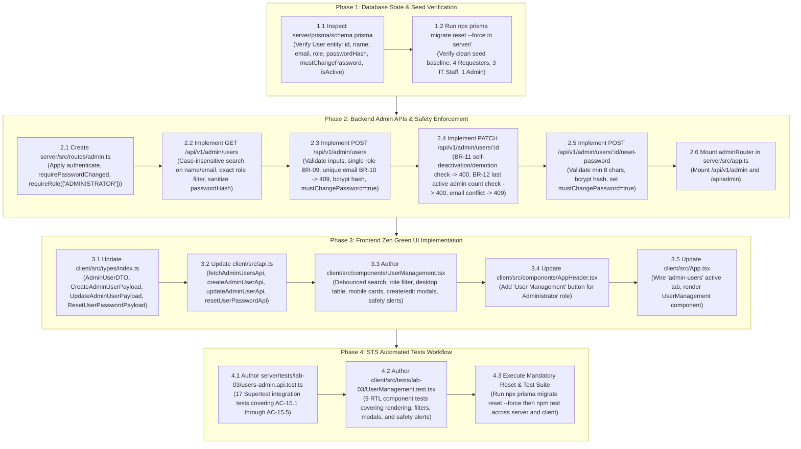

# Technical Implementation Plan: Issue 15 — Administrator User Management & Account Safety

**Feature Identifier:** Issue 15 (`feature/15-admin-user-management`)  
**Sprint / Milestone:** TokTickIT Lab 3 (Sprint 3) — Users, Roles, IT Staff Ticketing, and Admin Screens (Sprint Issue 5)  
**Target Branch:** `feature/15-admin-user-management` (Base: `lab3-staging`)  
**Specification Version:** 1.0.0  
**Authoritative Contract Reference:** [docs/features/15-admin-user-management/contract.md](file:///c:/Users/xande/Documents/Year%203%20Sem%201/CPE%20334/Lab%201/toktickit/docs/features/15-admin-user-management/contract.md)  
**Status:** PROPOSED TECHNICAL IMPLEMENTATION PLAN (Awaiting Approval)  

---

## 1. Target File Inventory

The table below itemizes all source code, API routes, React components, type definitions, and automated test files to be created or modified across `server/`, `client/`, `prisma/`, and `tests/`:

| Action | File Path | Component / Layer | Responsibility & Key Changes |
| :--- | :--- | :--- | :--- |
| **`[NEW]`** | `server/src/routes/admin.ts` | Backend / Router | Express admin router implementing `GET /users` (search/filter), `POST /users` (create with `mustChangePassword=true`), `PATCH /users/:id` (update name/email/role/active with BR-09, BR-10, BR-11, BR-12 safety checks), and `POST /users/:id/reset-password`. Guarded by `authenticate`, `requirePasswordChanged`, and `requireRole(["ADMINISTRATOR"])`. |
| **`[MODIFY]`** | `server/src/app.ts` | Backend / App | Mount `adminRouter` at `/api/v1/admin` and `/api/admin` with authentication, password-change, and administrator role middlewares. |
| **`[MODIFY]`** | `client/src/types/index.ts` | Frontend / Types | Define TypeScript interfaces: `AdminUserDTO`, `CreateAdminUserPayload`, `UpdateAdminUserPayload`, and `ResetUserPasswordPayload`. |
| **`[MODIFY]`** | `client/src/api.ts` | Frontend / API | Implement authenticated client API helper methods: `fetchAdminUsersApi`, `createAdminUserApi`, `updateAdminUserApi`, and `resetUserPasswordApi`. |
| **`[NEW]`** | `client/src/components/UserManagement.tsx` | Frontend / View | Zen Green Administrator User Management screen (`/admin/users`) with search bar, role filter dropdown, desktop data table, mobile stacked cards, "+ Add User" slideout/modal, and "Edit User" slideout/modal with integrated initial password reset. |
| **`[MODIFY]`** | `client/src/components/AppHeader.tsx` | Frontend / Shell | Add "User Management" navigation link visible exclusively to users with `role === "ADMINISTRATOR"` (`data-testid="nav-user-management"`). |
| **`[MODIFY]`** | `client/src/App.tsx` | Frontend / App | Add `"admin-users"` active tab state; render `<UserManagement />` when active tab is selected and active user is an Administrator; redirect non-admins. |
| **`[NEW]`** | `server/tests/lab-03/users-admin.api.test.ts` | Tests / Backend | Comprehensive Vitest + Supertest integration suite (17 test cases) validating RBAC role guards (`403`), user listing, search/filter, user creation, duplicate email rejection (`409`), self-deactivation prevention (**BR-11**), last-admin preservation (**BR-12**), and initial password reset (**AC-15.1** through **AC-15.5**). |
| **`[NEW]`** | `client/src/tests/lab-03/UserManagement.test.tsx` | Tests / Frontend | Comprehensive Vitest + React Testing Library component suite (9 test cases) validating user table rendering, debounced search, role filtering, modal workflows, 409 conflict alerts, self-deactivation UI blocks, and mobile card responsive collapse. |

---

## 2. Step-by-Step Execution Sequence



---

## 3. Detailed Phase Breakdown

### Phase 1: Database State & Seed Verification

#### 1.1 Model & Schema Verification
- Confirm that `server/prisma/schema.prisma` defines the required `User` entity attributes:
  - `id: Int @id @default(autoincrement())`
  - `email: String @unique`
  - `passwordHash: String`
  - `name: String`
  - `department: String?`
  - `role: Role @default(REQUESTER)`
  - `mustChangePassword: Boolean @default(true)`
  - `isActive: Boolean @default(true)`
  - `createdAt: DateTime @default(now())`
  - `updatedAt: DateTime @updatedAt`
- Verify that the `Role` enum defines exactly `REQUESTER`, `IT_STAFF`, `ADMINISTRATOR`.
- Zero database migrations are required for Issue 15 because the unified `User` model established in Issue 12 already contains all required attributes.

#### 1.2 Database Reset Baseline
- Execute `npx prisma migrate reset --force` in `server/` to ensure a clean, idempotent database state.
- Verify that standard seed accounts are loaded from `server/prisma/seed.ts`:
  - `id: 10` $\rightarrow$ `admin@kmutt.ac.th` (Active Administrator)
  - `id: 6` $\rightarrow$ `sompong.it@kmutt.ac.th` (Active IT Staff)
  - `id: 4` $\rightarrow$ `sarah.johnson@kmutt.ac.th` (Active Requester)
  - `id: 5` $\rightarrow$ `inactive.user@kmutt.ac.th` (Inactive Requester)

---

### Phase 2: Backend Admin APIs & Safety Enforcement

#### 2.1 Router Scaffolding (`server/src/routes/admin.ts`)
- Initialize `adminRouter = express.Router()`.
- Apply middleware security chain to all routes:
  1. `authenticate`: Resolves session token or cookie; verifies active account; attaches `req.user`. Returns `401 Unauthorized` if unauthenticated.
  2. `requirePasswordChanged`: Enforces **BR-02**. Rejects requests if `req.user.mustChangePassword === true` with `403 Forbidden` (`PASSWORD_CHANGE_REQUIRED`).
  3. `requireRole(["ADMINISTRATOR"])`: Enforces **BR-06** / **FR-06.1**. Rejects requests if `req.user.role !== "ADMINISTRATOR"` with `403 Forbidden` (`FORBIDDEN`).

#### 2.2 Endpoint: `GET /api/v1/admin/users` (List Users)
- Parse optional query parameters:
  - `search`: string, trimmed. If present, construct Prisma case-insensitive `OR` filter on `name` and `email`.
  - `role`: string, trimmed. If present, validate against permitted `Role` enum; filter by exact role.
- Query database with `prisma.user.findMany`:
  - Sanitize output: `select` `id`, `name`, `email`, `department`, `role`, `isActive`, `mustChangePassword`, `createdAt`, `updatedAt` (explicitly omit `passwordHash`).
  - Order by `createdAt: "desc"`.
- Return `200 OK` with `{ success: true, data: users }`.

#### 2.3 Endpoint: `POST /api/v1/admin/users` (Create User)
- Parse request body: `{ name, email, department, role, isActive, initialPassword }`.
- Validate required fields:
  - `name`: string, trimmed length between 2 and 100 characters. If invalid $\rightarrow$ return `400 Bad Request` (`VALIDATION_ERROR`).
  - `email`: string, valid email format. Normalized via `email.trim().toLowerCase()`.
  - `role`: string, must strictly match one of `Role.REQUESTER`, `Role.IT_STAFF`, `Role.ADMINISTRATOR` (**BR-09** Single-Role Policy).
  - `initialPassword`: string, minimum 8 characters. If missing or $< 8$ chars $\rightarrow$ return `400 Bad Request` (`VALIDATION_ERROR`).
  - `isActive`: boolean, defaults to `true`.
- Check email uniqueness (**BR-10**):
  - Query `prisma.user.findFirst({ where: { email: { equals: normalizedEmail, mode: "insensitive" } } })`.
  - If existing account found $\rightarrow$ return `409 Conflict` (`EMAIL_ALREADY_EXISTS`, message: `"A user account with this email address already exists."`).
- Secure credential hashing:
  - Compute `passwordHash = await bcryptjs.hash(initialPassword, 10)`.
- Persist record via `prisma.user.create`:
  - Set `mustChangePassword: true` unconditionally.
- Return `201 Created` with sanitized user entity (`{ success: true, data: newUser }`).

#### 2.4 Endpoint: `PATCH /api/v1/admin/users/:id` (Update User & Safety Guardrails)
- Parse `targetUserId = parseInt(req.params.id, 10)`. If invalid integer $\rightarrow$ return `400 Bad Request`.
- Find target user: `prisma.user.findUnique({ where: { id: targetUserId } })`. If not found $\rightarrow$ return `404 Not Found` (`USER_NOT_FOUND`).
- Parse and validate optional update attributes: `name`, `email`, `department`, `role`, `isActive`.
- **Enforce Safety Rule BR-11 (Self-Deactivation & Self-Demotion Prevention):**
  - Check if `targetUserId === req.user!.id`:
    - If `isActive === false`: return `400 Bad Request` (`CANNOT_DEACTIVATE_SELF`, message: `"Administrators cannot deactivate their own active account."`).
    - If `role !== undefined && role !== "ADMINISTRATOR"`: return `400 Bad Request` (`CANNOT_DEMOTE_SELF`, message: `"Administrators cannot demote their own account role."`).
- **Enforce Safety Rule BR-12 (Last Active Administrator Preservation):**
  - Check if `targetUser.role === "ADMINISTRATOR"` and `targetUser.isActive === true`:
    - If `isActive === false` OR (`role !== undefined && role !== "ADMINISTRATOR"`):
    - Count remaining active administrators:
      ```typescript
      const otherActiveAdminCount = await prisma.user.count({
        where: {
          role: "ADMINISTRATOR",
          isActive: true,
          id: { not: targetUserId },
        },
      });
      ```
    - If `otherActiveAdminCount === 0`: return `400 Bad Request` (`LAST_ADMIN_PROTECTION`, message: `"Cannot deactivate or demote the system's last remaining active Administrator."`).
- **Enforce BR-10 (Email Conflict on Update):**
  - If `email` provided, normalize and query for conflicting user (`id: { not: targetUserId }`).
  - If conflicting record found $\rightarrow$ return `409 Conflict` (`EMAIL_ALREADY_EXISTS`).
- Persist updates via `prisma.user.update` and return `200 OK` with sanitized updated user.

#### 2.5 Endpoint: `POST /api/v1/admin/users/:id/reset-password` (Reset Initial Password)
- Parse `targetUserId = parseInt(req.params.id, 10)`. Find target user; return `404 Not Found` if missing.
- Parse `newInitialPassword` from body. Validate minimum 8 characters; return `400 Bad Request` if invalid.
- Hash password: `newHash = await bcryptjs.hash(newInitialPassword, 10)`.
- Update user: `passwordHash = newHash`, `mustChangePassword = true`.
- Return `200 OK` with `{ success: true, data: { message: "Initial password reset successfully.", userId: targetUserId, mustChangePassword: true } }`.

#### 2.6 Server Mounting (`server/src/app.ts`)
- Import `adminRouter` from `./routes/admin.js`.
- Mount router at `/api/v1/admin` and alias `/api/admin`.

---

### Phase 3: Frontend Zen Green UI Implementation

#### 3.1 Type Definitions (`client/src/types/index.ts`)
- Export interfaces:
  ```typescript
  export interface AdminUserDTO {
    id: number;
    name: string;
    email: string;
    department?: string | null;
    role: UserRole;
    isActive: boolean;
    mustChangePassword?: boolean;
    createdAt: string;
    updatedAt?: string;
  }

  export interface CreateAdminUserPayload {
    name: string;
    email: string;
    department?: string;
    role: UserRole;
    isActive?: boolean;
    initialPassword: string;
  }

  export interface UpdateAdminUserPayload {
    name?: string;
    email?: string;
    department?: string;
    role?: UserRole;
    isActive?: boolean;
  }

  export interface ResetUserPasswordPayload {
    newInitialPassword: string;
  }
  ```

#### 3.2 Client API Helpers (`client/src/api.ts`)
- Implement:
  - `fetchAdminUsersApi(params?: { search?: string; role?: string }): Promise<AdminUserDTO[]>`
  - `createAdminUserApi(payload: CreateAdminUserPayload): Promise<AdminUserDTO>`
  - `updateAdminUserApi(id: number, payload: UpdateAdminUserPayload): Promise<AdminUserDTO>`
  - `resetUserPasswordApi(id: number, payload: ResetUserPasswordPayload): Promise<{ message: string; mustChangePassword: boolean }>`
- Ensure all requests include session cookie (`credentials: "include"`) and `Authorization: Bearer <token>` header if available.
- Parse structured error envelopes on non-2xx responses.

#### 3.3 Main Component (`client/src/components/UserManagement.tsx`)
- **Header & Action Bar:** Title "User Management", descriptive subtitle, "+ Add User" primary button (`btn-success`, `#006B3C`).
- **Filter Bar:**
  - Search input with 300ms debounce (`data-testid="admin-search-input"`).
  - Role filter select dropdown (`All Roles`, `Requester`, `IT Staff`, `Administrator`) (`data-testid="admin-role-filter"`).
- **Desktop Table View ($\ge 768\text{px}$):**
  - Table with pale green header (`#EAF6EF`).
  - Columns: Full Name (with department), Email Address, Role badge, Status badge, Actions.
  - Role badges:
    - `ADMINISTRATOR`: Amber tone (`#FEF3C7`, text `#B45309`, border `#D97706`).
    - `IT_STAFF`: Sky blue tone (`#E0F2FE`, text `#0369A1`, border `#0284C7`).
    - `REQUESTER`: Zen Green tone (`#EAF6EF`, text `#006B3C`, border `#006B3C`).
  - Status badges:
    - `Active`: Soft green (`#DCFCE7`, text `#15803D`).
    - `Inactive`: Gray (`#F3F4F6`, text `#4B5563`).
  - Row hover pale green `#F5FAF7`.
  - "[ Edit ]" action button per row (`data-testid="edit-user-btn-${user.id}"`).
- **Mobile Card View ($< 768\text{px}$):**
  - Vertically stacked cards (`card border shadow-sm p-3 mb-3`) with zero horizontal scroll.
  - Displays all user details with full-width "[ Edit User ]" button ($\ge 44\text{px}$ touch target).
- **"Create User" Slideout / Modal:**
  - Inputs: Full Name, Email Address, Department, Role selector, Active toggle (checked by default), Initial Password (with show/hide eye toggle).
  - Client validation & server error alert banner (e.g. duplicate email 409).
- **"Edit User" Slideout / Modal:**
  - Inputs: Name, Email, Department, Role, Active toggle.
  - Self-deactivation UI guard: If editing current logged-in admin (`user.id === currentUser.id`), Active toggle and Role dropdown are disabled with explanatory helper text.
  - Sub-section: "Reset Initial Password" with input and "Apply Reset" button.
  - Safety alert banner displaying backend error messages (`CANNOT_DEACTIVATE_SELF`, `LAST_ADMIN_PROTECTION`, `EMAIL_ALREADY_EXISTS`).

#### 3.4 Navigation Shell Integration (`AppHeader.tsx` & `App.tsx`)
- In `AppHeader.tsx`:
  - When `activeUser?.role === "ADMINISTRATOR"`, render the "User Management" nav button (`data-testid="nav-user-management"`).
  - Highlight active tab when `currentTab === "admin-users"`.
- In `App.tsx`:
  - Add `"admin-users"` to active tab type union: `"my-tickets" | "create-ticket" | "ticket-queue" | "admin-users"`.
  - Render `<UserManagement />` when `activeTab === "admin-users"` and user is an Administrator.
  - Redirect non-admin users attempting to view `admin-users`.

---

### Phase 4: STS Automated Tests Workflow

#### 4.1 Server Integration Tests (`server/tests/lab-03/users-admin.api.test.ts`)
- Implement 17 Supertest test cases mapping to `contract.md` §7.3:
  1. `API-ADM-01`: Rejects unauthenticated request with `401 Unauthorized`.
  2. `API-ADM-02`: Rejects Requester access with `403 Forbidden`.
  3. `API-ADM-03`: Rejects IT Staff access with `403 Forbidden`.
  4. `API-ADM-04`: Allows Administrator to list users (excludes `passwordHash`).
  5. `API-ADM-05`: Filters user list by keyword search (`?search=sompong`).
  6. `API-ADM-06`: Filters user list by role (`?role=IT_STAFF`).
  7. `API-ADM-07`: Creates user with single role and `mustChangePassword: true` (`201 Created`).
  8. `API-ADM-08`: Rejects duplicate email on create with `409 Conflict`.
  9. `API-ADM-09`: Rejects duplicate email case-insensitively (`ADMIN@kmutt.ac.th`).
  10. `API-ADM-10`: Rejects invalid inputs (short name, invalid email, password < 8 chars).
  11. `API-ADM-11`: Updates user details via `PATCH /api/v1/admin/users/:id`.
  12. `API-ADM-12`: Blocks Administrator from deactivating their own account (**BR-11**, `400 Bad Request`).
  13. `API-ADM-13`: Blocks Administrator from demoting their own role (**BR-11**, `400 Bad Request`).
  14. `API-ADM-14`: Blocks deactivation of the last active Administrator (**BR-12**, `400 Bad Request`).
  15. `API-ADM-15`: Allows deactivating an administrator when a second active admin exists.
  16. `API-ADM-16`: Resets user initial password and sets `mustChangePassword = true`.
  17. `API-ADM-17`: Verifies that user logging in with reset password is forced to `/change-password` (**BR-02**).

#### 4.2 Client Component Tests (`client/src/tests/lab-03/UserManagement.test.tsx`)
- Implement 9 React Testing Library test cases mapping to `contract.md` §7.4:
  1. `UI-ADM-01`: Renders user table with names, emails, role badges, and status pills.
  2. `UI-ADM-02`: Triggers debounced search when user types in search input.
  3. `UI-ADM-03`: Triggers role filtering when role dropdown option changes.
  4. `UI-ADM-04`: Opens Create User modal, submits valid form, appends new user to list.
  5. `UI-ADM-05`: Displays `409 Conflict` duplicate email warning banner inside modal.
  6. `UI-ADM-06`: Disables Active toggle or shows guard helper when editing currently logged-in Admin.
  7. `UI-ADM-07`: Displays `LAST_ADMIN_PROTECTION` safety error banner on rejected update.
  8. `UI-ADM-08`: Invokes initial password reset API from inside edit modal.
  9. `UI-ADM-09`: Renders responsive card layout on mobile viewports.

#### 4.3 Test Execution & Clean State Verification
- **Mandatory Pre-Test Rule:** Run `npx prisma migrate reset --force` in `server/`.
- Run server test suite: `npm test` in `server/` (runs Vitest with Supertest).
- Run client test suite: `npm test` in `client/` (runs Vitest with React Testing Library).
- Ensure 100% test pass rate with zero skips or failures.

---

## 4. Definition of Done & Quality Gates

Before declaring Issue 15 complete and opening a Pull Request into `lab3-staging`:
- [ ] `server/src/routes/admin.ts` created and mounted in `server/src/app.ts`.
- [ ] All endpoints enforce `ADMINISTRATOR` role guard (`403 Forbidden` for other roles).
- [ ] All safety rules (**BR-09**, **BR-10**, **BR-11**, **BR-12**) strictly enforced by server logic.
- [ ] Password hashes never leaked in any response payload.
- [ ] Zen Green UI implemented in `UserManagement.tsx`, integrated into `AppHeader.tsx` and `App.tsx`.
- [ ] Desktop table ($\ge 768\text{px}$) and mobile stacked cards ($< 768\text{px}$) verified for zero horizontal overflow.
- [ ] Mandatory database reset executed: `npx prisma migrate reset --force`.
- [ ] Server tests (`server/tests/lab-03/users-admin.api.test.ts`) pass 100%.
- [ ] Client tests (`client/src/tests/lab-03/UserManagement.test.tsx`) pass 100%.
- [ ] Full existing test regression passes (`npm test` in both `server/` and `client/`).
- [ ] Git working directory is clean with no untracked scratch files.
