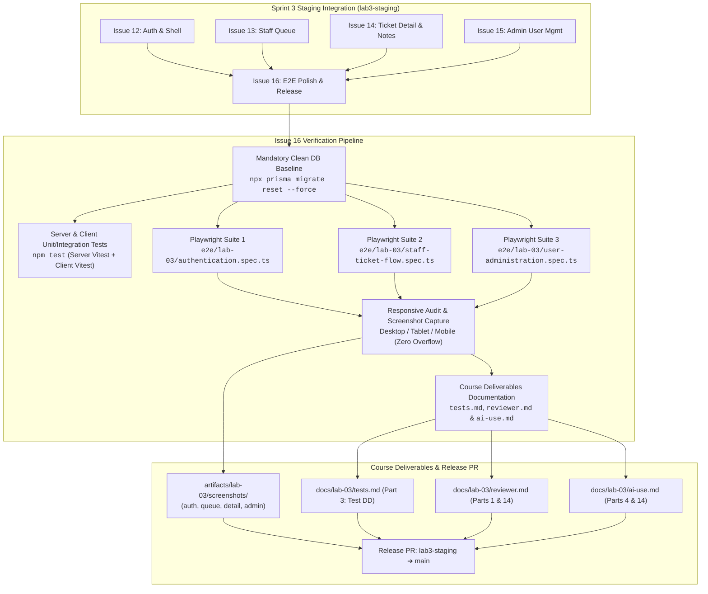
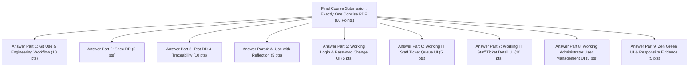

# Feature Engineering Contract: Issue 16 — End-to-End Test Suite, Responsive Polish & Staged Release Verification

**Feature Identifier:** Issue 16: End-to-End Test Suite, Responsive Polish & Staged Release Verification  
**Target Branch:** `feature/16-e2e-polish-release`  
**Base Branch:** `lab3-staging`  
**Sprint / Milestone:** TokTickIT Lab 3 (Sprint 3) — Users, Roles, IT Staff Ticketing, and Admin Screens (Sprint Issue 6 — Final Release Synthesis)  
**Specification Version:** 1.0.0  
**Status:** PROPOSED CONTRACT (Awaiting Review)  

---

## 1. Feature Scope, Architecture & Objectives

### 1.1 Purpose & Objectives
This engineering contract establishes the authoritative technical specifications, browser test scenarios, responsive layout standards, screenshot evidence pipelines, documentation deliverables, and release verification protocols for **Issue 16: End-to-End Test Suite, Responsive Polish & Staged Release Verification**.

In Sprint 3, TokTickIT transitioned from a single-persona prototype simulation into an enterprise-grade, role-based IT Service Desk application:
* **Issue 12 (`feature/12-auth-and-shell`)**: Replaced the temporary Lab 2 Requester selector with secure authentication, bcrypt password hashing, opaque session management, unified user modeling (`Role`: `REQUESTER`, `IT_STAFF`, `ADMINISTRATOR`), and mandatory first-login password rotation (**FR-01**, **FR-02**, **BR-01**, **BR-02**, **BR-03**).
* **Issue 13 (`feature/13-staff-ticket-queue`)**: Delivered the shared IT Staff Ticket Queue with multi-criteria text search, category/status/priority/owner filtering, dynamic multi-column sorting, and pagination (**FR-03**, **BR-06**).
* **Issue 14 (`feature/14-staff-ticket-detail`)**: Delivered operational ticket controls (claiming/reassigning ownership, IT priority adjustments, valid status transitions via the SDS Status Transition Matrix), public comment discussions, amber-styled confidential internal notes, and Requester "Problem Appears Resolved" indication (**FR-04**, **FR-05**, **BR-04**, **BR-05**, **BR-07**, **BR-08**).
* **Issue 15 (`feature/15-admin-user-management`)**: Delivered administrator user management (`/admin/users`) with account creation, editing, active status toggling, initial password resets, and strict administrative safety rules preventing self-deactivation and last-admin destruction (**FR-06**, **BR-09**, **BR-10**, **BR-11**, **BR-12**).

**Issue 16 serves as the capstone integration, visual polish, and automated verification milestone of Sprint 3:**
1. **Automated Playwright E2E Suite (`e2e/lab-03/`)**: Construct three deterministic, comprehensive browser walkthrough test files covering the complete end-to-end lifecycles across all three system roles (`REQUESTER`, `IT_STAFF`, `ADMINISTRATOR`).
2. **Zen Green Responsive Visual Audit & Layout Polish**: Validate and refine all application screens across Desktop ($\ge 1200\text{px}$), Tablet ($768\text{px} - 1024\text{px}$), and Mobile ($< 768\text{px}$) viewports to guarantee 100% adherence to KMUTT Zen Green design tokens, touch targets $\ge 44 \times 44\text{px}$, non-color badge compliance (WCAG 2.2 AA), and strictly zero horizontal overflow.
3. **Automated Submission Screenshot Pipeline**: Generate high-fidelity visual screenshot artifacts saved under `artifacts/lab-03/screenshots/` across four core functional areas (`authentication/`, `staff-queue/`, `staff-ticket-detail/`, `user-management/`) satisfying the course grading submission rubric (Parts 5, 6, 7, 8, and 9).
4. **Course Deliverables & Documentation Finalization**: Complete [`docs/lab-03/tests.md`](file:///c:/Users/xande/Documents/Year%203%20Sem%201/CPE%20334/Lab%201/toktickit/docs/lab-03/tests.md) (Software Test Specification: transition all Planned tests to `PASS`, document test pass counts across Server Supertest, Client Vitest, and Playwright E2E, and complete visual verification checklist), finalize [`docs/lab-03/reviewer.md`](file:///c:/Users/xande/Documents/Year%203%20Sem%201/CPE%20334/Lab%201/toktickit/docs/lab-03/reviewer.md) with complete PR links, review verdicts, and comment dialogues, and complete [`docs/lab-03/ai-use.md`](file:///c:/Users/xande/Documents/Year%203%20Sem%201/CPE%20334/Lab%201/toktickit/docs/lab-03/ai-use.md) with 8 key prompt traces and developer reflections.
5. **Deterministic Staged Release Verification**: Enforce a clean database reset protocol (`npx prisma migrate reset --force`) before running server unit/integration tests and Playwright E2E tests, verifying zero regressions across `lab3-staging` before opening the final release PR into `main`.



---

### 1.2 In-Scope Capabilities

1. **Playwright End-to-End Browser Walkthroughs (`e2e/lab-03/`)**:
   - `e2e/lab-03/authentication.spec.ts`: Valid/invalid credentials, inactive account rejection without leakage, mandatory first-login password rotation flow, shell user pill/role badge rendering, and logout session termination.
   - `e2e/lab-03/staff-ticket-flow.spec.ts`: IT Staff authentication, Ticket Queue multi-criteria query/sorting/pagination, Ticket Detail inspection, claiming ownership, updating IT Priority, status transition matrix traversal, public comments thread, amber-styled internal notes confidentiality, and Requester "Problem Appears Resolved" indication.
   - `e2e/lab-03/user-administration.spec.ts`: Administrator login, user directory search/filter, account provisioning with single role, editing user details, active status toggling, safety invariant enforcement (self-deactivation and last active admin blocks), initial password resets, and subsequent first-login password enforcement.
2. **Responsive Visual & Geometry Audit**:
   - Verification across Desktop ($\ge 1200\text{px}$, standard $1280 \times 800$), Tablet ($768\text{px} - 1024\text{px}$, standard $768 \times 1024$), and Mobile ($< 768\text{px}$, standard $375 \times 667$ / $390 \times 844$).
   - Strict zero horizontal overflow (`overflow-x: hidden` / `clip` with no unintended document scrollbars).
   - Touch targets $\ge 44 \times 44\text{px}$ on mobile screens for all buttons, select menus, and interactive triggers.
   - Accessibility compliance: badges combine approved Zen Green palette with explicit text labels and semantic SVG micro-icons (non-color-only dependency per WCAG 2.2 AA).
   - Responsive mobile navigation: clean hamburger toggle menu (`navbar-toggler`) collapsing header links cleanly without clipping.
   - Responsive table transformation: desktop data tables collapse into stacked cards with clear field metadata on mobile viewports.
3. **Automated Submission Screenshot Pipeline**:
   - Integration of full-page automated screenshot captures directly within the Playwright test lifecycle.
   - Organized storage under `artifacts/lab-03/screenshots/` matching course submission specifications:
     - `authentication/`: Login screen, password change interface, validation states.
     - `staff-queue/`: Multi-column queue table (Desktop), stacked queue cards (Mobile), filter states.
     - `staff-ticket-detail/`: Two-column workspace (Desktop), stacked operational rail (Mobile), amber internal notes, Requester resolved banner.
     - `user-management/`: Administrator user table (Desktop), stacked user cards (Mobile), create modal, safety invariant alert.
4. **Documentation & Course Artifact Finalization**:
   - `docs/lab-03/tests.md`: Complete Software Test Specification (STS) deliverable (Part 3 — 10 points) by transitioning all test statuses from `Planned` to `PASS`, documenting automated test execution commands, recording comprehensive test execution counts and results across Server API, Client UI, and Playwright E2E suites, and validating the 10-point Responsive & Visual Verification Checklist.
   - `docs/lab-03/reviewer.md`: Complete recording of all PR numbers, author/reviewer identities, review comments, and approval timestamps for Sprint 3.
   - `docs/lab-03/ai-use.md`: Complete recording of 8 key prompts guiding Issues 11–16, paired with developer reflections on SDD, AI pair programming, and architectural safety invariants.
5. **Staged Release Integration**:
   - Full automated test suite execution and clean run validation on `lab3-staging`.
   - Preparation and validation of the final release Pull Request from `lab3-staging` into `main`.

---

### 1.3 Explicit Exclusions (Strictly Out of Scope)

To guarantee adherence to **Lab_03_labsheet.pdf §4.2** and prevent scope creep:
* **No Functional Feature Additions**: No new business requirements, endpoints, or entity models outside Sprint 3 scope (Issues 11–15).
* **No External Auth or Email Integration**: No real SMTP email delivery, magic links, OAuth/SSO, or Multi-Factor Authentication (MFA).
* **No Requester Self-Registration**: All user accounts remain provisioned strictly through the Administrator subsystem.
* **No "Actions Taken" Subsystem**: Formal IT Staff action tracking and resolution gating remain strictly deferred to Lab 4.
* **No SLA Engine or Notification Daemon**: No SLA timers, escalation triggers, or automated email/SMS push alerts.
* **No Cloud Deployment / Infrastructure Setup**: No AWS/GCP/Azure production hosting configs or Kubernetes orchestration manifests.
* **No Arbitrary Themes**: Strictly adhere to the KMUTT Zen Green color palette; no unapproved dark themes or custom skinning.

---

## 2. Playwright E2E Test Suite Specification

The automated E2E test harness uses **Playwright** (`@playwright/test`) configured in `playwright.config.ts`. Tests execute against the live client (`http://localhost:5173`) and server (`http://localhost:3000`) processes with clean, deterministic database fixtures.

### 2.1 Test Suite Organization & Execution Environment

```
e2e/
├── fixtures/
│   ├── battery_diagnostic.png      (Image upload fixture)
│   └── system_specs.pdf            (Document upload fixture)
├── lab-02/
│   └── requester-ticket-flow.spec.ts
└── lab-03/
    ├── authentication.spec.ts       (E2E-01: Auth, Inactive, First-Login, Logout)
    ├── staff-ticket-flow.spec.ts    (E2E-02: Queue, Filters, Claim, Status, Comments, Notes, Resolved)
    └── user-administration.spec.ts  (E2E-03: Admin User List, Create, Edit, Safety Invariants, Reset)
```

#### Deterministic Test Personas (from `USERS_SEED`)
| Persona Name | Email | Default Password | Role | Initial State |
| :--- | :--- | :--- | :--- | :--- |
| **System Administrator** | `admin@kmutt.ac.th` | `Password123!` | `ADMINISTRATOR` | `mustChangePassword: true`, `isActive: true` |
| **Sompong IT** | `sompong.it@kmutt.ac.th` | `Password123!` | `IT_STAFF` | `mustChangePassword: true`, `isActive: true` |
| **Wichai Support** | `wichai.sup@kmutt.ac.th` | `Password123!` | `IT_STAFF` | `mustChangePassword: true`, `isActive: true` |
| **Sarah Johnson** | `sarah.johnson@kmutt.ac.th` | `Password123!` | `REQUESTER` | `mustChangePassword: true`, `isActive: true` |
| **Prasert Inactive** | `inactive.user@kmutt.ac.th` | `Password123!` | `REQUESTER` | `mustChangePassword: true`, `isActive: false` |
| **Test Active Requester** | `test.requester@kmutt.ac.th` | `Password123!` | `REQUESTER` | `mustChangePassword: false`, `isActive: true` |

---

### 2.2 Specification: `e2e/lab-03/authentication.spec.ts`

**Target File:** `e2e/lab-03/authentication.spec.ts`  
**Test Suite Description:** `Lab 3 E2E: User Authentication, Session Lifecycle & Password Governance`  
**Mapped Acceptance Criteria:** `AC-01`, `AC-02`, `AC-03`, `AC-05`, `AC-16.1`

#### Test Scenario 1.1: Standard Authenticated Login & Header Profile Pill
* **Given** an active user with `mustChangePassword === false` (`test.requester@kmutt.ac.th`).
* **When** navigating to `/` and submitting valid credentials (`test.requester@kmutt.ac.th` / `Password123!`).
* **Then**:
  - The login card is dismissed, and the user enters the main application workspace.
  - The header displays the active user name "Test Active Requester" (`data-testid="active-user-name"`).
  - The header renders the role pill badge with text "Requester" (`data-testid="user-role-badge"`).
  - Authorized navigation tabs are visible ("My Tickets", "+ Create Ticket").
  - Unauthorized tabs ("Ticket Queue", "User Management") are NOT present in the DOM.

#### Test Scenario 1.2: Invalid Credentials Safe Rejection
* **Given** the login screen at `/`.
* **When** submitting an invalid password for an existing account (`test.requester@kmutt.ac.th` / `WrongPass999!`), or submitting a non-existent email (`nonexistent@kmutt.ac.th` / `Password123!`).
* **Then**:
  - The server rejects with HTTP `401 Unauthorized`.
  - The client displays the safe error alert (`data-testid="login-error"`): *"Invalid email address or password."*
  - The error message strictly avoids leaking whether the account exists (**DEC-UI-04**, **AC-02**).
  - The user remains unauthenticated on the login screen.

#### Test Scenario 1.3: Inactive Account Rejection
* **Given** an inactive user account (`inactive.user@kmutt.ac.th` / `isActive === false`).
* **When** attempting to log in with the correct password `Password123!`.
* **Then**:
  - The server rejects with HTTP `401 Unauthorized`.
  - The client displays the exact same safe error alert (`data-testid="login-error"`): *"Invalid email address or password."*
  - No indication of account inactive status or existence is leaked to the user.

#### Test Scenario 1.4: Mandatory First-Login Password Change Intercept & Rotation
* **Given** a provisioned user with `mustChangePassword === true` (`sarah.johnson@kmutt.ac.th`).
* **When** logging in with initial credentials (`sarah.johnson@kmutt.ac.th` / `Password123!`).
* **Then**:
  - The application immediately redirects to the Mandatory Change Password interface (`/change-password`).
  - Access to standard operational tabs ("My Tickets", "+ Create Ticket", "Ticket Queue") is blocked.
  - An interactive 6-rule checklist is displayed (min 8 chars, 1 uppercase, 1 lowercase, 1 digit, 1 special character, confirmation matches).
  - Entering invalid or partial passwords dynamically updates checklist indicator icons.
  - Entering current password `Password123!`, new password `NewSecurePass2026!`, and matching confirmation enables the "Update Password" button.
  - Submitting the form updates credentials on the backend (`mustChangePassword` becomes `false`).
  - The user is transitioned into the application shell with active tickets visible.
  - Subsequent logout and login with `NewSecurePass2026!` immediately enters the application without intercept.

#### Test Scenario 1.5: Logout & Session Invalidation
* **Given** an active authenticated session.
* **When** clicking the "Log out" button (`data-testid="logout-button"`).
* **Then**:
  - The session cookie is invalidated on the backend (`POST /api/v1/auth/logout`).
  - The client clears local user state and redirects to the login screen.
  - Reloading the page or navigating back maintains the unauthenticated login state.

---

### 2.3 Specification: `e2e/lab-03/staff-ticket-flow.spec.ts`

**Target File:** `e2e/lab-03/staff-ticket-flow.spec.ts`  
**Test Suite Description:** `Lab 3 E2E: IT Staff Ticket Queue, Operations, Discussion & Confidential Notes`  
**Mapped Acceptance Criteria:** `AC-06`, `AC-07`, `AC-08`, `AC-09`, `AC-10`, `AC-11`, `AC-12`, `AC-13`, `AC-16.1`

#### Test Scenario 2.1: IT Staff Authentication & Queue Workspace Entry
* **Given** an IT Staff user (`sompong.it@kmutt.ac.th` / `Password123!`).
* **When** logging in, completing first-login password rotation (to `SompongSecure123!`), and entering the application.
* **Then**:
  - The application defaults to the "Ticket Queue" view (`data-testid="nav-ticket-queue"`).
  - The header displays "Sompong IT" with role badge "IT Staff".
  - The shared Ticket Queue loads displaying 8 columns: Ticket Number, Created Date, Summary, Category, Requested Priority, IT Priority, Status, and Owner.

#### Test Scenario 2.2: Ticket Queue Multi-Criteria Search, Filtering & Sorting
* **Given** the loaded IT Staff Ticket Queue.
* **When** executing search and filter operations:
  - Entering a search query into `#queue-search` (`data-testid="queue-search-input"`): asserts debounced filtering matching ticket number or summary keywords.
  - Selecting Status dropdown `#queue-status` (`data-testid="queue-filter-status"`): asserts only tickets with matching status appear.
  - Selecting Category dropdown `#queue-category` (`data-testid="queue-filter-category"`): asserts category isolation.
  - Selecting IT Priority dropdown `#queue-it-priority`: asserts priority isolation.
  - Clicking column header for Ticket Number or Created Date: asserts ordering toggles between ascending and descending.
* **Then**:
  - Table dynamically refreshes and pagination count indicator matches filtered results count.

#### Test Scenario 2.3: Ticket Detail Inspection & Ownership Claiming
* **Given** the filtered Ticket Queue containing an unassigned ticket.
* **When** clicking on the ticket row or ticket number.
* **Then**:
  - The view switches to the 2-Column IT Staff Ticket Detail layout.
  - Left column displays read-only Ticket Information (number, summary, description, attachments, requester department).
  - Right column displays the Operational Controls rail.
  - Under "Ticket Owner", clicking the "Claim Ticket" shortcut button sends `PATCH /api/v1/staff/tickets/:id/assignment`.
  - The owner immediately updates to "Sompong IT", and the button switches to disabled state reading "Assigned to You".

#### Test Scenario 2.4: IT Priority Setting & Status Workflow Transitions
* **Given** the claimed ticket in `NEW` or `OPEN` status.
* **When** performing operational updates:
  - Changing the "IT Priority" dropdown from current value to `URGENT`: asserts success feedback banner and priority badge updates to Urgent (`#FEE2E2` / `#991B1B`).
  - Selecting a valid next status from "Transition Workflow Status" dropdown (e.g., `OPEN` $\rightarrow$ `IN_PROGRESS`) and clicking "Confirm Status Change": asserts status transitions cleanly.
* **Then**:
  - The status badge updates to "In Progress" (`#FFF8E1` / `#B26A00`).
  - The allowed transitions dropdown recalculates permitted next states per the System SDS Status Transition Matrix.

#### Test Scenario 2.5: Public Comments Discussion Thread
* **Given** the IT Staff Ticket Detail screen.
* **When** composing a public message in `#staff-public-comment-input` (*"Diagnostic test complete. Hardware replacement ordered."*) and clicking "Post Public Comment".
* **Then**:
  - Comment is appended to the Public Comments thread with author "Sompong IT", role badge "IT Staff", and ISO timestamp.
  - Character counter updates dynamically (enforcing $\le 2000$ characters).

#### Test Scenario 2.6: Confidential Internal Notes & Strict Role Confidentiality
* **Given** the IT Staff Ticket Detail screen.
* **When** composing a confidential note in `#staff-internal-note-input` (*"Vendor warranty RMA #99482 approved. Unit replacement arriving Tuesday."*) and clicking "Post Internal Note".
* **Then**:
  - The note is appended to the amber-styled "Confidential Internal Notes" thread (`#FFFBEB` background, `#D97706` border, 🔒 lock icon).
  - IT Staff logs out.
  - Ticket Requester logs in and opens the same ticket in Requester Ticket Detail view (`/tickets/:id`).
  - **Verification:** The public comment is fully visible in the Requester's thread.
  - **Strict Security Verification:** The Internal Notes card, form, and content are 100% absent from the DOM, and no internal note data exists in the client network response payload (**BR-04**, **AC-12**).

#### Test Scenario 2.7: Requester "Problem Appears Resolved" Indication
* **Given** the Requester viewing their owned active ticket.
* **When** clicking the green "Problem Appears Resolved" button in the resolution callout banner.
* **Then**:
  - The callout updates to a confirmed state: *"Problem Appears Resolved: You indicated resolution on [Date]. IT Staff will review and finalize the ticket."*
  - The ticket status remains `IN_PROGRESS` (Requesters cannot directly close tickets — **BR-05**).
  - Logging back in as IT Staff and opening the ticket reveals the prominent resolution notice: *"Requester Confirmed Resolution: The requester reported that this problem appears resolved."*

---

### 2.4 Specification: `e2e/lab-03/user-administration.spec.ts`

**Target File:** `e2e/lab-03/user-administration.spec.ts`  
**Test Suite Description:** `Lab 3 E2E: Administrator User Management, Account Safety & First-Login Enforcement`  
**Mapped Acceptance Criteria:** `AC-14`, `AC-15`, `AC-16.1`

#### Test Scenario 3.1: Administrator Login & Navigation
* **Given** an Administrator user (`admin@kmutt.ac.th` / `Password123!`).
* **When** logging in, completing first-login password rotation (to `AdminMaster2026!`), and entering the application.
* **Then**:
  - The header displays role badge "Administrator" (`#fef3c7` / `#b45309`).
  - The "User Management" navigation link (`data-testid="nav-user-management"`) is visible and active.
  - Clicking "User Management" renders the Administrator User Directory screen (`/admin/users`).

#### Test Scenario 3.2: User Directory Search & Filtering
* **Given** the Administrator User Directory screen.
* **When** typing search query "Sarah" into the user search input:
  - Table filters down to Sarah Johnson.
* **When** clearing search and selecting "Role: IT Staff":
  - Table displays only users with role `IT_STAFF`.
* **Then**:
  - All matching user rows display Name, Email, Role badge, Status pill (`Active` / `Inactive`), and an "Edit" action button.

#### Test Scenario 3.3: User Provisioning with Initial Credentials
* **Given** the User Directory screen.
* **When** clicking the "+ Add User" button (`data-testid="add-user-btn"`):
  - Accessible modal dialog opens with focus trapped.
  - Administrator fills Name: *"Kittisak Engineering"*, Email: *"kittisak.eng@kmutt.ac.th"*, Role: *"IT_STAFF"*, Active: `true`, and Initial Password: *"Welcome2026!"*.
  - Administrator submits the form.
* **Then**:
  - Server returns HTTP `201 Created`.
  - Modal closes, success banner displays, and Kittisak Engineering appears in the user list with role "IT Staff" and badge "Active".

#### Test Scenario 3.4: User Editing & Active Status Deactivation
* **Given** the user list containing "Kittisak Engineering".
* **When** clicking the "Edit" button for Kittisak:
  - Edit modal opens pre-populated with user details.
  - Administrator toggles "Account Active" to `false` and saves changes.
* **Then**:
  - Server returns HTTP `200 OK`.
  - Kittisak's status updates in the table to display the gray "Inactive" badge (`data-testid="status-badge-inactive"`).
  - Attempting to log in as Kittisak with `Welcome2026!` immediately returns safe HTTP `401 Unauthorized` without status leak.

#### Test Scenario 3.5: Administrator Safety Invariant Enforcement (BR-11 & BR-12)
* **Given** the logged-in Administrator ("System Administrator").
* **When** clicking "Edit" on their own user row:
  - The modal opens with a warning notice: *"You are editing your own account."*
  - The Active toggle switch is disabled or deactivation is prevented with an inline safety warning: *"You cannot deactivate your own account"* (**BR-11**, **AC-15.3**).
* **When** attempting to deactivate or demote the only active Administrator in the system:
  - The system strictly blocks the operation, displaying safety alert: *"Cannot deactivate the last active Administrator"* (**BR-12**, **AC-15.4**).
* **Then**:
  - System invariants remain intact; at least one active administrator is perpetually preserved.

#### Test Scenario 3.6: Initial Password Reset & Subsequent First-Login Rotation
* **Given** the user Kittisak re-activated by the Administrator.
* **When** opening Kittisak's Edit modal, entering new initial password *"ResetTemp2026!"* in the "Reset Initial Password" sub-form, and clicking "Reset Password".
* **Then**:
  - Server hashes the new password, updates the record, and flags `mustChangePassword = true` (**FR-06.5**).
  - Administrator logs out.
  - Kittisak logs in using `kittisak.eng@kmutt.ac.th` and `ResetTemp2026!`.
  - Kittisak is immediately intercepted by the Mandatory Change Password interface.
  - Kittisak rotates password to `KittisakPersonal2026!` and enters the application shell.

---

## 3. Responsive Visual & Submission Evidence Requirements

### 3.1 Zen Green Design System Compliance

All screens and component states must adhere strictly to the design specifications defined in `docs/lab-03/ui-spec.md` and `TokTickIT-System-Level-SDS-v1.0.pdf`:

| Token / Style Property | Required Specification | Verification Rule |
| :--- | :--- | :--- |
| **Primary Green** | `#006B3C` (`var(--color-primary-green)`) | Header bar, primary action buttons, brand icons |
| **Secondary Green** | `#0B7A46` (`var(--color-secondary-green)`) | Active tab indicators, focus rings, link hover states |
| **Pale Green** | `#EAF6EF` (`var(--color-pale-green)`) | Alert success banners, selected row highlights, soft badges |
| **Canvas Background** | `#F5F7F6` (`var(--color-page-bg)`) | Clean muted background across all viewports |
| **Card Surface** | `#FFFFFF` (`var(--color-surface-card)`) | Clean white card panels with 8px border radius |
| **Internal Notes Accent**| `#D97706` border, `#FEF3C7` background | Prominent amber styling with 🔒 lock icon for confidentiality |
| **Card Geometry** | `border: 1px solid #E5E7EB; border-radius: 8px;` | Consistent elevation across all cards and modal dialogs |
| **Button Hierarchy** | Primary: `#006B3C`, Outline/Neutral: `#E5E7EB` | Touch target $\ge 44 \times 44\text{px}$ on mobile screens |
| **Status & Role Badges** | Paired background, text label, and SVG micro-icon | WCAG 2.2 AA non-color-only compliance across all states |

---

### 3.2 Viewport Target Standards & Responsive Behavior

The interface is formally audited across three standardized viewport tiers:

```mermaid
graph LR
    subgraph DesktopView ["Desktop (>= 1200px)"]
        D_Queue["8-Column Data Table"]
        D_Detail["2-Column Split Layout (65% / 35%)"]
        D_Admin["5-Column User Table + Header Actions"]
    end

    subgraph TabletView ["Tablet (768px - 1024px)"]
        T_Queue["Fluid 8-Column Table with Horizontal Padding"]
        T_Detail["Adaptive 2-Column or Clean Stacked Layout"]
        T_Admin["Fluid User Table with Compact Actions"]
    end

    subgraph MobileView ["Mobile (< 768px)"]
        M_Nav["Accessible Hamburger Toggle Menu"]
        M_Queue["Stacked Zen Green Cards with Badges"]
        M_Detail["Vertically Stacked Single-Column Layout"]
        M_Admin["Stacked User Cards with Full-Width Edit Action"]
    end

    DesktopView --> TabletView
    TabletView --> MobileView
```



1. **Desktop ($\ge 1200\text{px}$, Standard: $1280 \times 800$)**:
   - Ticket Queue displays 8 columns without cell truncation or horizontal scrolling.
   - Staff Ticket Detail displays 2 columns (left: information, attachments, comments, notes; right: operational controls rail).
   - Admin User Management displays 5-column table with aligned search/filter toolbar.
2. **Tablet ($768\text{px} - 1024\text{px}$, Standard: $768 \times 1024$)**:
   - Header navigation remains fully accessible.
   - Filter grids wrap gracefully into 2-column blocks.
   - Control buttons maintain full touch clearance.
3. **Mobile ($< 768\text{px}$, Standard: $375 \times 667$ / $390 \times 844$)**:
   - **Zero Horizontal Overflow**: `document.documentElement.scrollWidth === window.innerWidth`.
   - **Header**: Navigation links collapse into an accessible hamburger menu (`navbar-toggler`).
   - **Data Tables $\rightarrow$ Stacked Cards**: Ticket Queue and Admin User Management tables collapse into stacked cards with clear field metadata and prominent status badges.
   - **Touch Targets**: Minimum $44 \times 44\text{px}$ touch target size on all interactive buttons and inputs.

---

### 3.3 Automated Visual Screenshot Artifact Plan

The Playwright test execution script captures timestamped, full-page PNG screenshots across viewports to populate `artifacts/lab-03/screenshots/` for grading verification, strictly aligned with **Lab_03_labsheet.pdf §14 (Parts 5, 6, 7, 8, and 9)**:

```
artifacts/lab-03/screenshots/
├── authentication/
│   ├── login-desktop.png             (1280x800 - Valid login screen with email, password, sign-in)
│   ├── login-invalid.png             (1280x800 - Safe error alert for invalid credentials)
│   ├── login-inactive.png            (1280x800 - Inactive account rejection without status leak)
│   ├── login-mobile.png              (375x667 - Mobile centered login card with zero overflow)
│   ├── change-password-desktop.png   (1280x800 - Mandatory password change with dynamic checklist)
│   ├── change-password-mobile.png    (375x667 - Mobile change password layout)
│   ├── app-shell-header-desktop.png  (1280x800 - Authenticated user name & role pill in header)
│   └── logout-access-blocked.png     (1280x800 - Direct access blocked after logout)
├── staff-queue/
│   ├── queue-desktop.png             (1280x800 - 8-column table with realistic data & badges)
│   ├── queue-search-filtered.png     (1280x800 - Active keyword search and dropdown filters)
│   ├── queue-tablet.png              (768x1024 - Fluid tablet layout with responsive columns)
│   ├── queue-mobile.png              (375x667 - Stacked Zen Green queue cards, 0 horizontal scroll)
│   └── queue-empty-feedback.png      (1280x800 - Empty / no-results state feedback)
├── staff-ticket-detail/
│   ├── detail-desktop.png            (1280x800 - 2-column operational workspace)
│   ├── detail-claim-action.png       (1280x800 - Ownership claim button & assigned state)
│   ├── detail-priority-update.png    (1280x800 - IT Priority update and badge reflection)
│   ├── detail-status-transition.png  (1280x800 - Permitted status transitions per matrix)
│   ├── detail-public-comments.png    (1280x800 - Shared Public Comments thread with counter)
│   ├── detail-internal-notes.png     (1280x800 - Amber confidential section with lock 🔒)
│   ├── requester-resolved-banner.png (1280x800 - Requester resolution indication alert)
│   ├── direct-api-auth-evidence.png  (1280x800 - Terminal / test log showing 403 Forbidden on notes/queue)
│   └── detail-mobile.png             (375x667 - Stacked mobile operational view)
└── user-management/
    ├── admin-table-desktop.png       (1280x800 - 5-column administrator user table with badges)
    ├── admin-search-filter.png       (1280x800 - User directory search & role filter)
    ├── admin-create-modal.png        (1280x800 - Create user modal with focus trap)
    ├── admin-edit-modal.png          (1280x800 - Edit modal with active toggle & reset form)
    ├── admin-safety-self-deact.png   (1280x800 - BR-11 Self-deactivation blocked alert)
    ├── admin-safety-last-admin.png   (1280x800 - BR-12 Last active admin blocked alert)
    ├── admin-cards-mobile.png        (375x667 - Stacked mobile user cards with touch targets >=44px)
    └── admin-forbidden-access.png    (1280x800 - Non-admin 403 Forbidden access blocked)
```

---

## 4. Course Submission & Review Documentation Protocol

### 4.1 Peer Review Record (`docs/lab-03/reviewer.md`)
The peer review file tracks reciprocal pull request reviews between the student author and designated peer reviewer:
* **Author:** Al Xander James Codino Ybanez — 67070503450 (`@ShortXander101205`)
* **Peer Reviewer:** Muhammad Asad Aziz — 67070503472 (`@Muhammad-Asad-Aziz`)

#### Required Content Updates for Issue 16:
1. **Pull Request Index Table**: Complete entry for PR #6 (Issue 16) linking `feature/16-e2e-polish-release` to `lab3-staging`.
2. **Review Dialogues**: Detailed review comments and author responses for Issue 16 covering test assertions, responsive card collapsing, and screenshot outputs.
3. **Partner PR Review Records**: Complete review verdicts and comments provided for partner's corresponding feature PRs.

---

### 4.2 AI Assistance & Prompt Reflection (`docs/lab-03/ai-use.md`)
The AI reflection document records the human-AI pair programming methodology:
* **Primary AI Tool:** Google Antigravity IDE
* **Models Used:** Gemini 3.8 Flash (High) and Claude 3.5 Sonnet

#### Required Content Updates for Issue 16:
1. **Key Prompt Table**: Complete all 8 entries in Section 2, specifically detailing Prompt #8:
   - *Phase:* E2E Testing & Release Verification
   - *Target Issue:* Issue 16: Playwright E2E & Responsive Polish
   - *Prompt Summary:* Prompt instructing AI to author the 3 Playwright specs, audit zero overflow, and execute the clean database reset protocol.
   - *AI Response & Output:* Summary of generated test suites, screenshot helpers, and verification logs.
   - *Value / What It Solved:* End-to-end regression elimination, multi-viewport layout validation, and automated grading artifact generation.
2. **Section 3: My Reflection**: Complete a thorough, thoughtful retrospective reflecting on:
   - Spec-Driven Development (SDD) effectiveness in preventing scope creep.
   - The role of automated E2E tests in catching multi-role session and authorization regressions.
   - Lessons learned implementing administrative safety invariants (self-deactivation and last-admin protections).

---

### 4.3 Software Test Specification Deliverable (`docs/lab-03/tests.md`)
The Software Test Specification (STS) established in Issue 11 serves as an authoritative graded course deliverable (Part 3: Test DD & Traceability — 10 points per `Lab_3_sheet.pdf` §10, §14). As the final sprint synthesis issue, Issue 16 must finalize and certify this document:

#### Required Content Updates for Issue 16:
1. **Planned Tests Table Finalization (Section 2)**:
   - Transition status for all 27 planned tests from `Planned` to `PASS`:
     - Backend API Tests: `API-01` through `API-18` (all 18 passing across 6 test suites in `server/tests/lab-03/`).
     - Frontend UI Component Tests: `UI-01` through `UI-06` (all passing across `client/src/tests/lab-03/`).
     - Playwright E2E Tests: `E2E-01`, `E2E-02`, and `E2E-03` (all passing across `e2e/lab-03/`).
   - Validate that each test entry explicitly cites its automated test file path and corresponding `FR`/`BR` IDs.
2. **Acceptance-Criterion Traceability Matrix Certification (Section 3)**:
   - Verify that all Acceptance Criteria (`AC-01` through `AC-15`) and `AC-16.1` through `AC-16.3` trace directly to passing automated test suites at Unit, API, UI, or E2E levels.
3. **Responsive & Visual Verification Checklist Certification (Section 4)**:
   - Audit and mark all 10 checklist verification targets as `VERIFIED` across Desktop, Tablet, and Mobile viewports.
   - Reference the corresponding screenshot artifacts in `artifacts/lab-03/screenshots/` proving zero clipping, touch target compliance ($\ge 44\text{px}$), and Zen Green token adherence.
4. **Execution Commands & Verified Pass Counts (Section 5)**:
   - Document exact execution commands and record actual test summary statistics (Server Supertest passing test count, Client Vitest passing test count, and Playwright E2E passing test count).

---

### 4.4 Section 14 PDF Submission Architecture & 60-Point Rubric Alignment

To maximize points and strictly satisfy **Lab_03_labsheet.pdf §14 ("Submit One PDF File")**, the release integration phase establishes the complete evidence package for the single PDF submission. The PDF must use the exact mandatory headings **"Answer Part 1" through "Answer Part 9"** in sequential order:



#### Detailed Evidence Checklist to Maximize Points Across All 9 Parts:

| Heading | Points | Rubric Requirements (§14) | Required Evidence Artifacts & Verification in Issue 16 |
| :--- | :---: | :--- | :--- |
| **Answer Part 1** | **10** | • Commit-history evidence showing feature branches merged into `lab3-staging` and then `main`.<br/>• Final GitHub Project/Kanban with all Issues in `Done`.<br/>• Rendered `reviewer.md` with reviewer identity, PR links, comments, responses, approvals.<br/>• README and `.gitignore` evidence.<br/>• Repository directory structure. | 1. Git log output (`git log --graph --oneline`) verifying merge of Issues 11–16 into `lab3-staging` and release PR into `main`.<br/>2. High-res screenshot of GitHub Project Kanban board showing all 6 issues in `Done`.<br/>3. Rendered markdown of completed [`docs/lab-03/reviewer.md`](file:///c:/Users/xande/Documents/Year%203%20Sem%201/CPE%20334/Lab%201/toktickit/docs/lab-03/reviewer.md).<br/>4. Root `README.md` and `.gitignore` inspection snippet.<br/>5. ASCII repository tree matching §12. |
| **Answer Part 2** | **5** | • Link to and rendered `docs/lab-03/specification.md`.<br/>• Show numbered FRs, BRs, authorization matrix/rules, ACs, migration decisions, Product Definition of Done.<br/>• Evidence that specification existed before main implementation PRs completed. | 1. Working clickable link and rendered [`docs/lab-03/specification.md`](file:///c:/Users/xande/Documents/Year%203%20Sem%201/CPE%20334/Lab%201/toktickit/docs/lab-03/specification.md).<br/>2. Visible sections for `FR-01`..`FR-06`, `BR-01`..`BR-12`, Role Authorization Matrix, `AC-01`..`AC-15`, and DoD.<br/>3. Git log / PR #1 merge timestamp proving specification was frozen before Feature 12–15 implementations. |
| **Answer Part 3** | **10** | • Link to and rendered `docs/lab-03/tests.md`.<br/>• Include planned tests, AC traceability, actual test-file paths, final status.<br/>• Complete unit, API/integration, UI, authorization, regression, and E2E passing test output from `main`. | 1. Clickable link and rendered [`docs/lab-03/tests.md`](file:///c:/Users/xande/Documents/Year%203%20Sem%201/CPE%20334/Lab%201/toktickit/docs/lab-03/tests.md) with all 27 tests marked `PASS`.<br/>2. Complete terminal execution logs from `main`:<br/>   - Server tests (`npm test` in server: 6 API test files, 100% pass).<br/>   - Client RTL tests (`npm test` in client: 3 component test files, 100% pass).<br/>   - Playwright E2E tests (`npx playwright test e2e/lab-03/`: 3 spec files, 100% pass). |
| **Answer Part 4** | **5** | • Rendered `docs/lab-03/ai-use.md` naming LLM used.<br/>• Show 6–10 selected key prompts.<br/>• Brief "My Reflection" on specification-agent and coding-agent use. | 1. Working clickable link and rendered [`docs/lab-03/ai-use.md`](file:///c:/Users/xande/Documents/Year%203%20Sem%201/CPE%20334/Lab%201/toktickit/docs/lab-03/ai-use.md).<br/>2. Table identifying Google Antigravity IDE, Gemini 3.8 Flash, and Claude 3.5 Sonnet.<br/>3. 8 comprehensive key prompt entries logging prompts, outputs, and solved value.<br/>4. High-quality personal reflection analyzing SDD, safety invariants, and lessons learned. |
| **Answer Part 5** | **5** | • Demonstrate valid and invalid login.<br/>• Inactive-account handling.<br/>• Busy and safe failure feedback.<br/>• Mandatory first-password change.<br/>• Authenticated user/role display.<br/>• Logout and direct access blocked after logout. | High-res readable screenshots from `artifacts/lab-03/screenshots/authentication/`:<br/>• `login-desktop.png` (valid credentials form)<br/>• `login-invalid.png` (safe error banner `data-testid="login-error"`)<br/>• `login-inactive.png` (inactive account rejection without status leak)<br/>• `change-password-desktop.png` (dynamic checklist validation)<br/>• `app-shell-header-desktop.png` (active user & role pill in header)<br/>• `logout-access-blocked.png` (route blocked after logout). |
| **Answer Part 6** | **5** | • Demonstrate realistic queue data.<br/>• Search, filters, sorting, pagination.<br/>• Assigned/unassigned ownership.<br/>• Status and priority badges.<br/>• Open-detail action.<br/>• Empty/no-results/failure feedback.<br/>• Responsive behavior. | High-res readable screenshots from `artifacts/lab-03/screenshots/staff-queue/`:<br/>• `queue-desktop.png` (8-column table with realistic data & badges)<br/>• `queue-search-filtered.png` (active search and dropdown filters)<br/>• `queue-empty-feedback.png` (no results found banner)<br/>• `queue-tablet.png` (fluid tablet layout)<br/>• `queue-mobile.png` (stacked cards with zero horizontal scroll). |
| **Answer Part 7** | **10** | • Demonstrate claim/reassign, IT Priority, permitted status changes.<br/>• Public Comments, Internal Notes, Attachment continuity.<br/>• Requester resolution indication.<br/>• Role restrictions and safe failure behavior.<br/>• **Direct API authorization evidence**. | High-res readable screenshots from `artifacts/lab-03/screenshots/staff-ticket-detail/`:<br/>• `detail-desktop.png` (2-column workspace)<br/>• `detail-claim-action.png` (claim shortcut & assigned state)<br/>• `detail-priority-update.png` (IT Priority update)<br/>• `detail-status-transition.png` (status workflow transitions)<br/>• `detail-public-comments.png` (Public Comments thread)<br/>• `detail-internal-notes.png` (amber section with 🔒 lock icon)<br/>• `requester-resolved-banner.png` (resolution indication alert)<br/>• `direct-api-auth-evidence.png` (**Direct API Authorization Evidence**: terminal log showing Requester blocked with HTTP `403 Forbidden` on `/staff/tickets` and `/notes`). |
| **Answer Part 8** | **5** | • Minimalist User Management screen (Name, Email, Role, Status, Edit).<br/>• Search by name or email, optional role filtering.<br/>• Create user with 1 role and initial password.<br/>• Duplicate-email and invalid-input validation.<br/>• Edit name, email, role, activation state.<br/>• Set new initial password and demonstrate required change at next login.<br/>• Prevention of self-deactivation and removing last active admin.<br/>• Forbidden access for non-Administrators.<br/>• Responsive Zen Green presentation. | High-res readable screenshots from `artifacts/lab-03/screenshots/user-management/`:<br/>• `admin-table-desktop.png` (5-column user list with badges)<br/>• `admin-search-filter.png` (active search & role filter)<br/>• `admin-create-modal.png` (user creation with initial password)<br/>• `admin-edit-modal.png` (editing & initial password reset)<br/>• `admin-safety-self-deact.png` (BR-11 Self-deactivation blocked alert)<br/>• `admin-safety-last-admin.png` (BR-12 Last admin protection alert)<br/>• `admin-forbidden-access.png` (Non-admin 403 Forbidden evidence)<br/>• `admin-cards-mobile.png` (mobile stacked cards). |
| **Answer Part 9** | **5** | • Rendered `docs/lab-03/ui-spec.md`.<br/>• Desktop, tablet, and mobile screenshots for all major Lab 3 screens.<br/>• Completed visual checklist for design consistency, role navigation, badges, editable/read-only fields, validation placement, focus, clipping, overlap, and horizontal overflow. | 1. Working clickable link and rendered [`docs/lab-03/ui-spec.md`](file:///c:/Users/xande/Documents/Year%203%20Sem%201/CPE%20334/Lab%201/toktickit/docs/lab-03/ui-spec.md).<br/>2. Multi-viewport screenshot comparisons for Desktop ($1280\text{px}$), Tablet ($768\text{px}$), and Mobile ($375\text{px}$) across Login, Queue, Detail, and User Management.<br/>3. Fully verified 10-point Visual Verification Checklist certifying zero clipping, zero overlap, touch targets $\ge 44\text{px}$, and **strictly zero horizontal overflow**. |
| **Total** | **60** | | **All 9 parts fully satisfied to achieve 60/60 points.** |

---

## 5. Test Workflow & Execution Protocol

### 5.1 Mandatory Database Reset Protocol

> [!IMPORTANT]
> **Mandatory Execution Rule:**  
> The database MUST be reset to its clean seed baseline prior to running the test pipeline:
> ```powershell
> cd server
> npx prisma migrate reset --force
> ```
> **Rationale:** Integration and E2E tests depend on predictable initial user IDs (1–11), known initial passwords (`Password123!`), specific initial `mustChangePassword` states, and clean ticket/comment relational trees. Running tests against a dirty or mutated database causes false failures and test non-determinism.

---

### 5.2 Test Execution Sequence

The complete verification sequence consists of three strict sequential stages:

```powershell
# Stage 1: Clean Database Baseline Reset
cd server
npx prisma migrate reset --force

# Stage 2: Server API & Security Integration Tests
npm test

# Stage 3: Client Component Tests
cd ../client
npm test

# Stage 4: Playwright End-to-End Multi-Role Browser Tests
cd ..
npx playwright test e2e/lab-03/
```

#### Pass Gate Criteria
| Test Suite Category | Runner | Target Directory / Files | Required Pass Criteria |
| :--- | :--- | :--- | :---: |
| **Server API & Security** | Vitest + Supertest | `server/tests/lab-03/*.test.ts` (6 files) | **100% PASS** |
| **Client UI Components** | Vitest + RTL | `client/src/tests/lab-03/*.test.tsx` (3 files) | **100% PASS** |
| **Playwright E2E Tests** | Playwright | `e2e/lab-03/*.spec.ts` (3 files) | **100% PASS** |
| **Responsive Visual Audit**| Playwright Engine | Desktop ($1280\text{px}$), Tablet ($768\text{px}$), Mobile ($375\text{px}$) | **0 Overflow / All Required Screenshots** |

---

## 6. Test Traceability Matrix

### 6.1 Issue 16 Acceptance Criteria Mapping

| Acceptance Criterion | Requirement Summary | Verification Mechanism | Target Evidence / File Path |
| :---: | :--- | :--- | :--- |
| **AC-16.1** | All feature branches merged into `lab3-staging`; Playwright E2E test suite executes and passes 100% across authentication, staff workflow, and user administration. | Playwright CLI runner (`npx playwright test e2e/lab-03/`) | `e2e/lab-03/authentication.spec.ts`<br/>`e2e/lab-03/staff-ticket-flow.spec.ts`<br/>`e2e/lab-03/user-administration.spec.ts` |
| **AC-16.2** | Responsive layouts verified across Desktop ($\ge 1200\text{px}$), Tablet ($768\text{px} - 1024\text{px}$), and Mobile ($< 768\text{px}$) with zero horizontal scroll or clipping; all Section 14 screenshot artifacts generated. | Automated screenshot captures via Playwright full-page viewports | `artifacts/lab-03/screenshots/authentication/`<br/>`artifacts/lab-03/screenshots/staff-queue/`<br/>`artifacts/lab-03/screenshots/staff-ticket-detail/`<br/>`artifacts/lab-03/screenshots/user-management/` |
| **AC-16.3** | Course deliverables and documentation completed (`docs/lab-03/tests.md`, `docs/lab-03/reviewer.md`, `docs/lab-03/ai-use.md`); final release PR from `lab3-staging` into `main` submitted and verified. | File inspection, Git PR link verification, and rubric audit | `docs/lab-03/tests.md` (Part 3: Test DD)<br/>`docs/lab-03/reviewer.md` (Part 1: Git Use)<br/>`docs/lab-03/ai-use.md` (Part 4: AI Use)<br/>Release PR on GitHub |

---

### 6.2 Full Sprint 3 E2E Specification Traceability Matrix

| Sprint AC | Requirement Description | Mapped E2E Test Suite | Specific Scenario in E2E Suite |
| :---: | :--- | :--- | :--- |
| **AC-01** | Valid user authentication & session issuance | `e2e/lab-03/authentication.spec.ts` | Scenario 1.1: Standard Authenticated Login |
| **AC-02** | Inactive account & invalid password safe rejection | `e2e/lab-03/authentication.spec.ts` | Scenario 1.2: Invalid Credentials Safe Rejection<br/>Scenario 1.3: Inactive Account Rejection |
| **AC-03** | Mandatory first-login password change | `e2e/lab-03/authentication.spec.ts` | Scenario 1.4: Mandatory Password Change Intercept |
| **AC-04** | Session-derived Requester ownership isolation | `e2e/lab-03/authentication.spec.ts` | Scenario 1.1: Header Profile Pill & Tab Isolation |
| **AC-05** | Logout session invalidation | `e2e/lab-03/authentication.spec.ts` | Scenario 1.5: Logout & Session Invalidation |
| **AC-06** | IT Staff shared queue retrieval & pagination | `e2e/lab-03/staff-ticket-flow.spec.ts` | Scenario 2.1: IT Staff Authentication & Queue Entry |
| **AC-07** | Staff queue multi-criteria search, filter, and sort | `e2e/lab-03/staff-ticket-flow.spec.ts` | Scenario 2.2: Multi-Criteria Search, Filtering & Sorting |
| **AC-08** | Requester forbidden from Staff queue (`403`) | `e2e/lab-03/staff-ticket-flow.spec.ts` | Scenario 2.6: Requester Profile & Route Isolation |
| **AC-09** | Staff ticket ownership claim & reassignment | `e2e/lab-03/staff-ticket-flow.spec.ts` | Scenario 2.3: Ticket Detail & Ownership Claiming |
| **AC-10** | IT Priority & permitted status transitions | `e2e/lab-03/staff-ticket-flow.spec.ts` | Scenario 2.4: IT Priority Setting & Status Transitions |
| **AC-11** | Public comment posting & multi-role visibility | `e2e/lab-03/staff-ticket-flow.spec.ts` | Scenario 2.5: Public Comments Discussion Thread |
| **AC-12** | Internal Notes confidentiality & Requester block | `e2e/lab-03/staff-ticket-flow.spec.ts` | Scenario 2.6: Confidential Notes & Requester Absence |
| **AC-13** | Requester "Problem Appears Resolved" indication | `e2e/lab-03/staff-ticket-flow.spec.ts` | Scenario 2.7: Problem Appears Resolved Indication |
| **AC-14** | Admin user creation, unique email & role policy | `e2e/lab-03/user-administration.spec.ts` | Scenario 3.3: User Provisioning with Initial Credentials |
| **AC-15** | Admin safety rules (self & last admin protection) | `e2e/lab-03/user-administration.spec.ts` | Scenario 3.5: Administrator Safety Invariants |

---

## 7. Definition of Done & Staged Release Verification Checklist

Prior to merging `feature/16-e2e-polish-release` into `lab3-staging` and opening the release PR into `main`, the following quality gates must be satisfied:

- [ ] **Clean Baseline Execution**: `npx prisma migrate reset --force` executes cleanly and seeds initial accounts.
- [ ] **Server Test Suite Pass**: All 6 API test files in `server/tests/lab-03/` pass with zero failures (`npm test` in `server`).
- [ ] **Client Test Suite Pass**: All 3 component test files in `client/src/tests/lab-03/` pass with zero failures (`npm test` in `client`).
- [ ] **E2E Test Suite Pass**: All 3 Playwright specs in `e2e/lab-03/` pass with 100% green assertions (`npx playwright test e2e/lab-03/`).
- [ ] **Responsive Verification**: Zero horizontal scrolling across Desktop ($1280\text{px}$), Tablet ($768\text{px}$), and Mobile ($375\text{px}$). Touch targets $\ge 44\text{px}$.
- [ ] **Screenshot Artifacts**: All required screenshot PNGs exist in `artifacts/lab-03/screenshots/` and match Section 14 grading standards.
- [ ] **Direct API Authorization Evidence (Part 7)**: Automated test / terminal output demonstrating HTTP `403 Forbidden` for Requesters accessing staff queue or posting internal notes.
- [ ] **Software Test Specification (Part 3)**: `docs/lab-03/tests.md` fully finalized with all 27 test statuses marked `PASS`, visual checklist verified, and complete execution summary logs recorded.
- [ ] **Peer Review Record (Part 1)**: `docs/lab-03/reviewer.md` fully completed with PR entries, review comments, and approval signatures.
- [ ] **AI Use Record (Part 4)**: `docs/lab-03/ai-use.md` fully completed with 8 key prompt logs and reflective analysis.
- [ ] **Code Quality & Git Cleanliness**: Zero leftover debugging statements, zero console errors, clean Git status.
- [ ] **Staging PR & Final Release PR**: PR from `feature/16-e2e-polish-release` to `lab3-staging` approved and merged; final release PR from `lab3-staging` to `main` opened with complete verification evidence.
- [ ] **Post-Merge Main Test Verification (Part 3)**: Full test suite executed on `main` branch after release PR merge, and clean passing test outputs captured for the final PDF submission.
- [ ] **Section 14 PDF Submission Ready**: All 9 parts ("Answer Part 1" through "Answer Part 9") compiled with working links, readable screenshots, and complete evidence to guarantee full 60/60 points.
