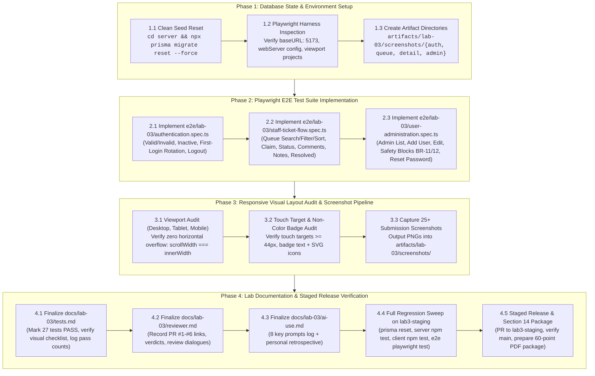

# Technical Implementation Plan: Issue 16 — End-to-End Test Suite, Responsive Polish & Staged Release Verification

**Feature Identifier:** Issue 16 (`feature/16-e2e-polish-release`)  
**Sprint / Milestone:** TokTickIT Lab 3 (Sprint 3) — Final Milestone Synthesis & Staged Release Verification (Sprint Issue 6)  
**Target Branch:** `feature/16-e2e-polish-release` (Base: `lab3-staging`)  
**Specification Version:** 1.0.0  
**Authoritative Contract Reference:** [docs/features/16-e2e-polish-release/contract.md](file:///c:/Users/xande/Documents/Year%203%20Sem%201/CPE%20334/Lab%201/toktickit/docs/features/16-e2e-polish-release/contract.md)  
**Status:** PROPOSED TECHNICAL IMPLEMENTATION PLAN (Awaiting Approval)  

---

## 1. Target File Inventory

The table below itemizes all test specifications, visual screenshot artifacts, course documentation files, and configuration adjustments to be created or modified across the repository:

| Action | File / Directory Path | Component / Layer | Responsibility & Key Changes |
| :--- | :--- | :--- | :--- |
| **`[NEW]`** | `e2e/lab-03/authentication.spec.ts` | E2E Tests / Playwright | Browser E2E suite covering valid/invalid login, inactive account rejection without existence leak, mandatory initial password change flow with dynamic checklist, header user pill/role badge rendering, and logout session termination. |
| **`[NEW]`** | `e2e/lab-03/staff-ticket-flow.spec.ts` | E2E Tests / Playwright | Browser E2E suite covering IT Staff login, Queue search/filtering/sorting/pagination, Ticket Detail inspection, claiming ticket ownership, IT Priority adjustment, permitted status workflow transitions, Public Comments thread, Confidential Internal Notes role restriction (verified absent from Requester UI & payload), and Requester "Problem Appears Resolved" indication. |
| **`[NEW]`** | `e2e/lab-03/user-administration.spec.ts` | E2E Tests / Playwright | Browser E2E suite covering Administrator login, user directory search/filter, account creation with single role, editing user details, active status toggle, administrative safety rules enforcement (**BR-11** self-deactivation block and **BR-12** last active admin protection), and initial password reset with forced rotation. |
| **`[NEW]`** | `artifacts/lab-03/screenshots/authentication/*` | Visual Artifacts | Automated full-page PNG screenshots capturing: `login-desktop.png`, `login-invalid.png`, `login-inactive.png`, `login-mobile.png`, `change-password-desktop.png`, `change-password-mobile.png`, `app-shell-header-desktop.png`, and `logout-access-blocked.png`. |
| **`[NEW]`** | `artifacts/lab-03/screenshots/staff-queue/*` | Visual Artifacts | Automated full-page PNG screenshots capturing: `queue-desktop.png`, `queue-search-filtered.png`, `queue-tablet.png`, `queue-mobile.png`, and `queue-empty-feedback.png`. |
| **`[NEW]`** | `artifacts/lab-03/screenshots/staff-ticket-detail/*` | Visual Artifacts | Automated full-page PNG screenshots capturing: `detail-desktop.png`, `detail-claim-action.png`, `detail-priority-update.png`, `detail-status-transition.png`, `detail-public-comments.png`, `detail-internal-notes.png` (amber styling with 🔒 lock), `requester-resolved-banner.png`, `direct-api-auth-evidence.png` (403 logs), and `detail-mobile.png`. |
| **`[NEW]`** | `artifacts/lab-03/screenshots/user-management/*` | Visual Artifacts | Automated full-page PNG screenshots capturing: `admin-table-desktop.png`, `admin-search-filter.png`, `admin-create-modal.png`, `admin-edit-modal.png`, `admin-safety-self-deact.png`, `admin-safety-last-admin.png`, `admin-cards-mobile.png`, and `admin-forbidden-access.png`. |
| **`[MODIFY]`** | `docs/lab-03/tests.md` | Course Deliverable (Part 3) | Finalize Software Test Specification (STS): transition all 27 planned tests (`API-01`..`API-18`, `UI-01`..`UI-06`, `E2E-01`..`E2E-03`) from `Planned` to `PASS`, verify 100% AC traceability, certify the 10-point Responsive & Visual Verification Checklist as `VERIFIED`, and document test execution commands and final pass counts. |
| **`[MODIFY]`** | `docs/lab-03/reviewer.md` | Course Deliverable (Part 1) | Complete Peer Review Record: update PR table with all 6 PR links (#1 to #6), review verdicts, detailed review dialogues for Issues 11–16, and partner review records. |
| **`[MODIFY]`** | `docs/lab-03/ai-use.md` | Course Deliverable (Part 4) | Complete AI Assistance Record: model metadata (Antigravity IDE, Gemini 3.8 Flash, Claude 3.5 Sonnet), log all 8 key prompts covering Sprint 3 issues, and write the personal retrospective in "My Reflection". |
| **`[MODIFY if needed]`** | `client/src/index.css` / Components | UI Polish / Bug Fixes | Minor layout styling adjustments if responsive inspection detects any horizontal overflow or touch target sizing defects. |

---

## 2. Step-by-Step Execution Sequence



---

## 3. Detailed Phase Breakdown

### Phase 1: Database State & Environment Setup

#### 1.1 Database Baseline Reset
- Execute the mandatory database reset rule:
  ```powershell
  cd server
  npx prisma migrate reset --force
  ```
- Verify that `USERS_SEED` deterministic accounts are populated:
  - Account 10: `admin@kmutt.ac.th` (Role: `ADMINISTRATOR`, `mustChangePassword: true`)
  - Account 6: `sompong.it@kmutt.ac.th` (Role: `IT_STAFF`, `mustChangePassword: true`)
  - Account 7: `wichai.sup@kmutt.ac.th` (Role: `IT_STAFF`, `mustChangePassword: true`)
  - Account 4: `sarah.johnson@kmutt.ac.th` (Role: `REQUESTER`, `mustChangePassword: true`)
  - Account 5: `inactive.user@kmutt.ac.th` (Role: `REQUESTER`, `isActive: false`)
  - Account 11: `test.requester@kmutt.ac.th` (Role: `REQUESTER`, `mustChangePassword: false`)

#### 1.2 Playwright Harness Configuration Inspection
- Verify `playwright.config.ts`:
  - Base URL: `http://localhost:5173`
  - WebServer setup: starts server (`http://localhost:3000/api/health`) and client (`http://localhost:5173`)
  - Timeout: 60,000ms per test; expect timeout: 10,000ms
  - Workers: 1 (single-threaded deterministic sequential execution to avoid database race conditions)

#### 1.3 Screenshot Directory Scaffolding
- Ensure screenshot directories exist under `artifacts/lab-03/screenshots/`:
  - `artifacts/lab-03/screenshots/authentication/`
  - `artifacts/lab-03/screenshots/staff-queue/`
  - `artifacts/lab-03/screenshots/staff-ticket-detail/`
  - `artifacts/lab-03/screenshots/user-management/`

---

### Phase 2: Playwright E2E Test Suite Implementation

#### 2.1 File 1: `e2e/lab-03/authentication.spec.ts`
Implement test scenarios mapped to **AC-01**, **AC-02**, **AC-03**, **AC-05**, and **AC-16.1**:
1. **Valid Login & App Shell Header Verification**:
   - Log in as `test.requester@kmutt.ac.th` with `Password123!`.
   - Assert navigation to workspace.
   - Assert header displays `data-testid="active-user-name"` reading "Test Active Requester".
   - Assert role badge `data-testid="user-role-badge"` displays "Requester" with green styling.
   - Assert Requester navigation links are visible ("My Tickets", "+ Create Ticket") and Admin/Staff links are absent.
2. **Invalid Credentials Safe Rejection**:
   - Attempt login with invalid password `WrongPassword123!`.
   - Assert error banner `data-testid="login-error"` displays: *"Invalid email address or password."*
   - Attempt login with unseeded email `unknown@kmutt.ac.th`.
   - Assert exact same error message without leaking account existence (**AC-02**, **DEC-UI-04**).
3. **Inactive Account Rejection**:
   - Attempt login with `inactive.user@kmutt.ac.th` and `Password123!`.
   - Assert safe error banner `data-testid="login-error"` without leaking account inactive status.
4. **Mandatory First-Login Password Change Flow**:
   - Log in as `sarah.johnson@kmutt.ac.th` (`mustChangePassword: true`).
   - Assert immediate intercept redirect to `/change-password`.
   - Assert normal operational tabs are blocked.
   - Type invalid/partial new password; assert interactive checklist indicators update dynamically.
   - Fill current password `Password123!`, new password `SarahSecure2026!`, and confirmation.
   - Click "Update Password"; assert success toast and transition into workspace.
   - Log out and log back in with `SarahSecure2026!`; assert direct entry without password-change intercept.
5. **Logout Session Invalidation**:
   - Click `data-testid="logout-button"`.
   - Assert redirect to `/login` and header user pill cleared.
   - Reload page; assert user remains on `/login`.

#### 2.2 File 2: `e2e/lab-03/staff-ticket-flow.spec.ts`
Implement test scenarios mapped to **AC-06** through **AC-13** and **AC-16.1**:
1. **IT Staff Authentication & Default Queue Navigation**:
   - Log in as `sompong.it@kmutt.ac.th`.
   - Rotate initial password to `Sompong2026!` if prompted.
   - Assert application defaults to "Ticket Queue" view (`data-testid="nav-ticket-queue"`).
   - Assert role badge displays "IT Staff" with blue styling.
2. **Queue Search, Filtering, Sorting & Pagination**:
   - Type query in `#queue-search` (`data-testid="queue-search-input"`); assert debounced table filter.
   - Select Status dropdown `#queue-status` (`data-testid="queue-filter-status"`); assert filtered rows match status.
   - Select Category dropdown `#queue-category` (`data-testid="queue-filter-category"`); assert category isolation.
   - Select IT Priority dropdown `#queue-it-priority`; assert priority isolation.
   - Click table column header to toggle sort order; assert rows reorder dynamically.
   - Verify bottom pagination toolbar shows total tickets count and page buttons.
3. **Ticket Detail Inspection & Ownership Claiming**:
   - Click on an unassigned ticket row to open IT Staff Ticket Detail view.
   - Assert 2-column layout (left: ticket info & threads; right: operational controls rail).
   - Click "Claim Ticket" shortcut button; assert API `PATCH /assignment` succeeds.
   - Assert owner updates to "Sompong IT" and button switches to disabled "Assigned to You".
4. **IT Priority Update & Status Workflow Transitions**:
   - Select "IT Priority" dropdown, choose `URGENT`; assert priority badge updates to Urgent (`#FEE2E2`).
   - Select permitted target status from transition dropdown (e.g. `OPEN` $\rightarrow$ `IN_PROGRESS`) and confirm.
   - Assert status badge updates to In Progress (`#FFF8E1`).
5. **Public Comments Communication Thread**:
   - Enter text into `#staff-public-comment-input` (*"Diagnostic completed, waiting on replacement part."*).
   - Click "Post Public Comment"; assert comment renders with author "Sompong IT", role badge, and timestamp.
   - Verify character counter updates dynamically.
6. **Confidential Internal Notes Thread & Role Confidentiality**:
   - Enter text into `#staff-internal-note-input` (*"Confidential RMA #88412 approved. Unit dispatched."*).
   - Click "Post Internal Note"; assert note appears in amber section (`#FFFBEB`, `#D97706`, 🔒 icon).
   - Log out Sompong IT.
   - Log in as the ticket's Requester and open the ticket in Requester Ticket Detail view.
   - **Strict Verification:** Public comment is visible; Internal Notes section, card, and data are 100% absent from DOM and network response payload (**BR-04**, **AC-12**).
7. **Requester "Problem Appears Resolved" Indication**:
   - While logged in as Requester, click the green "Problem Appears Resolved" button.
   - Assert confirmation alert appears: *"You indicated resolution on [Date]. IT Staff will review and finalize."*
   - Assert ticket status remains `IN_PROGRESS` (Requester cannot close tickets — **BR-05**).
   - Log back in as IT Staff, open ticket; assert prominent green banner: *"Requester Confirmed Resolution"*.

#### 2.3 File 3: `e2e/lab-03/user-administration.spec.ts`
Implement test scenarios mapped to **AC-14**, **AC-15**, and **AC-16.1**:
1. **Administrator Login & Navigation**:
   - Log in as `admin@kmutt.ac.th`.
   - Rotate initial password to `AdminMaster2026!` if prompted.
   - Assert role badge displays "Administrator" with amber styling.
   - Assert `data-testid="nav-user-management"` is visible; click to navigate to `/admin/users`.
2. **User Directory Search & Filtering**:
   - Search by name or email in `#user-search`; assert table filters in real time.
   - Filter by Role (`IT_STAFF`, `REQUESTER`, `ADMINISTRATOR`); assert rows match selected role.
3. **User Account Creation**:
   - Click `data-testid="add-user-btn"`; assert create modal opens with focus trap.
   - Fill Name (*"Kittisak Engineering"*), Email (*"kittisak.eng@kmutt.ac.th"*), Role (*"IT_STAFF"*), Active (*true*), Initial Password (*"Welcome2026!"*).
   - Submit form; assert HTTP 201 Created and new user row displays in table.
4. **User Editing & Active Status Deactivation**:
   - Click "Edit" button on Kittisak's row; toggle Active to `false`; save changes.
   - Assert Kittisak's status badge updates to `data-testid="status-badge-inactive"` ("○ Inactive").
   - Attempt to log in as Kittisak; assert safe HTTP 401 rejection without leaking inactive status.
5. **Administrator Safety Invariants Enforcement (BR-11 & BR-12)**:
   - Click "Edit" on the logged-in Administrator's row.
   - Assert self-deactivation is disabled or toggle triggers inline safety alert: *"You cannot deactivate your own account"* (**BR-11**, **AC-15.3**).
   - Attempt to deactivate or demote the only active Administrator; assert safety block: *"Cannot deactivate the last active Administrator"* (**BR-12**, **AC-15.4**).
6. **Initial Password Reset & Forced Change Flow**:
   - Re-activate Kittisak; open Edit modal; enter new initial password *"ResetTemp2026!"* in reset sub-form; submit.
   - Log out Admin; log in as Kittisak using `ResetTemp2026!`.
   - Assert Kittisak is intercepted by Mandatory Change Password interface.
   - Rotate password to `KittisakPass2026!`; assert successful continuation into workspace.

---

### Phase 3: Responsive Layout Audit & Screenshot Pipeline

#### 3.1 Viewport Audit (Desktop, Tablet, Mobile)
- Test each screen across three explicit viewports:
  - **Desktop:** Viewport $1280 \times 800$ ($\ge 1200\text{px}$)
  - **Tablet:** Viewport $768 \times 1024$ ($768\text{px} - 1024\text{px}$)
  - **Mobile:** Viewport $375 \times 667$ / $390 \times 844$ ($< 768\text{px}$)
- Execute automated horizontal overflow assertion on all pages:
  ```typescript
  const hasHorizontalScroll = await page.evaluate(() => {
    return document.documentElement.scrollWidth > window.innerWidth;
  });
  expect(hasHorizontalScroll).toBe(false);
  ```

#### 3.2 Touch Target & Non-Color Badge Audit
- Verify minimum touch targets $\ge 44 \times 44\text{px}$ on mobile screens for all buttons and inputs.
- Verify status, priority, and role badges pair theme colors with visible text labels and semantic SVG micro-icons (WCAG 2.2 AA non-color dependency).

#### 3.3 Automated Screenshot Pipeline Execution
Integrate full-page automated screenshot captures into the Playwright tests, generating all artifacts required by **Section 14**:
- `artifacts/lab-03/screenshots/authentication/`:
  - `login-desktop.png`
  - `login-invalid.png`
  - `login-inactive.png`
  - `login-mobile.png`
  - `change-password-desktop.png`
  - `change-password-mobile.png`
  - `app-shell-header-desktop.png`
  - `logout-access-blocked.png`
- `artifacts/lab-03/screenshots/staff-queue/`:
  - `queue-desktop.png`
  - `queue-search-filtered.png`
  - `queue-tablet.png`
  - `queue-mobile.png`
  - `queue-empty-feedback.png`
- `artifacts/lab-03/screenshots/staff-ticket-detail/`:
  - `detail-desktop.png`
  - `detail-claim-action.png`
  - `detail-priority-update.png`
  - `detail-status-transition.png`
  - `detail-public-comments.png`
  - `detail-internal-notes.png`
  - `requester-resolved-banner.png`
  - `direct-api-auth-evidence.png`
  - `detail-mobile.png`
- `artifacts/lab-03/screenshots/user-management/`:
  - `admin-table-desktop.png`
  - `admin-search-filter.png`
  - `admin-create-modal.png`
  - `admin-edit-modal.png`
  - `admin-safety-self-deact.png`
  - `admin-safety-last-admin.png`
  - `admin-cards-mobile.png`
  - `admin-forbidden-access.png`

---

### Phase 4: Lab Documentation & Staged Release Verification

#### 4.1 Finalize `docs/lab-03/tests.md` (Part 3 Deliverable — 10 Points)
- Update Planned Tests Table: change status of all 27 tests (`API-01`..`API-18`, `UI-01`..`UI-06`, `E2E-01`..`E2E-03`) from `Planned` to `PASS`.
- Verify 100% Acceptance-Criterion Traceability Matrix (`AC-01` through `AC-15`, `AC-16.1` through `AC-16.3`).
- Mark all 10 items in the Responsive & Visual Verification Checklist as `VERIFIED` with references to captured screenshots.
- Document exact execution commands and final test summary statistics.

#### 4.2 Finalize `docs/lab-03/reviewer.md` (Part 1 Deliverable — 10 Points)
- Update PR Index Table with all 6 PR numbers (#1 to #6), branch names, review verdicts, and merger signatures (`Muhammad Asad Aziz`).
- Record complete review dialogues (reviewer comments and author responses) for Issues 11 through 16.
- Record reciprocal partner PR review table and dialogues.

#### 4.3 Finalize `docs/lab-03/ai-use.md` (Part 4 Deliverable — 5 Points)
- Confirm AI Tool and Model information (Google Antigravity IDE, Gemini 3.8 Flash, Claude 3.5 Sonnet).
- Fill in all 8 key prompt entries with Prompt Summary, AI Response, and Value / What It Solved.
- Write a comprehensive personal reflection in "My Reflection" analyzing SDD rigor, role-based security, administrative safety invariants, and AI pair programming benefits.

#### 4.4 Full Staging Regression Sweep
Execute the full test verification sweep on `lab3-staging`:
```powershell
# 1. Reset DB
cd server
npx prisma migrate reset --force

# 2. Server API Tests (6 suites, 100% pass)
npm test

# 3. Client UI Tests (3 suites, 100% pass)
cd ../client
npm test

# 4. Playwright Browser E2E Tests (3 specs, 100% pass)
cd ..
npx playwright test e2e/lab-03/
```

#### 4.5 Staged Release & Section 14 PDF Compilation Package
- Open PR from `feature/16-e2e-polish-release` to `lab3-staging`; obtain review approval and merge.
- On `lab3-staging`, open final Release PR to `main`.
- Merge into `main` and run post-merge test verification on `main` to capture clean passing test logs.
- Assemble the single submission PDF with headings **"Answer Part 1" through "Answer Part 9"** satisfying all criteria for the full 60/60 points.

---

## 4. Verification & Quality Gates

| Verification Gate | Success Standard | Verification Command / Tool |
| :--- | :--- | :--- |
| **Prisma Clean Seed** | Users 1–11 seeded; tickets & categories populated | `npx prisma migrate reset --force` |
| **Server API Tests** | 6 test files pass, 0 failures | `cd server && npm test` |
| **Client RTL Tests** | 3 test files pass, 0 failures | `cd client && npm test` |
| **Playwright E2E Tests** | 3 spec files pass, 0 failures | `npx playwright test e2e/lab-03/` |
| **Zero Overflow** | `scrollWidth === innerWidth` on desktop, tablet, mobile | Playwright page evaluation |
| **Screenshot Evidence** | 25+ PNG files saved in `artifacts/lab-03/screenshots/` | File inspection |
| **Direct API Auth** | 403 Forbidden verified for non-authorized roles | Supertest logs in `tests.md` |
| **Documentation Deliverables** | `tests.md`, `reviewer.md`, `ai-use.md` fully completed | Markdown inspection |
| **Section 14 PDF Ready** | Answer Part 1 through Answer Part 9 fully documented | Rubric audit against §14 |
