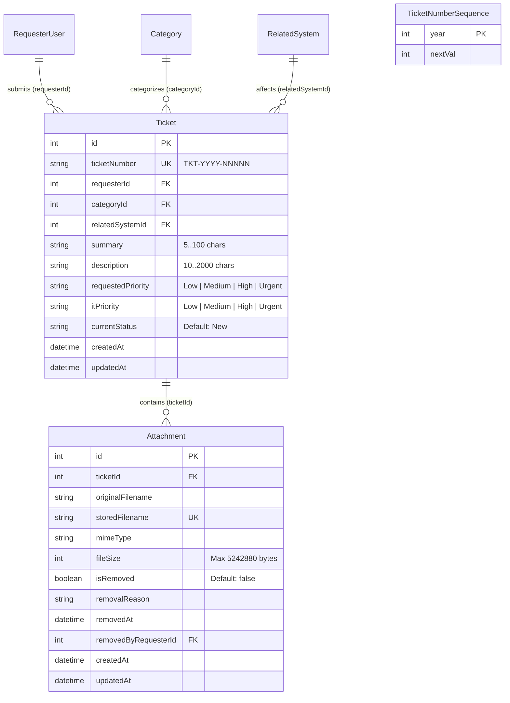
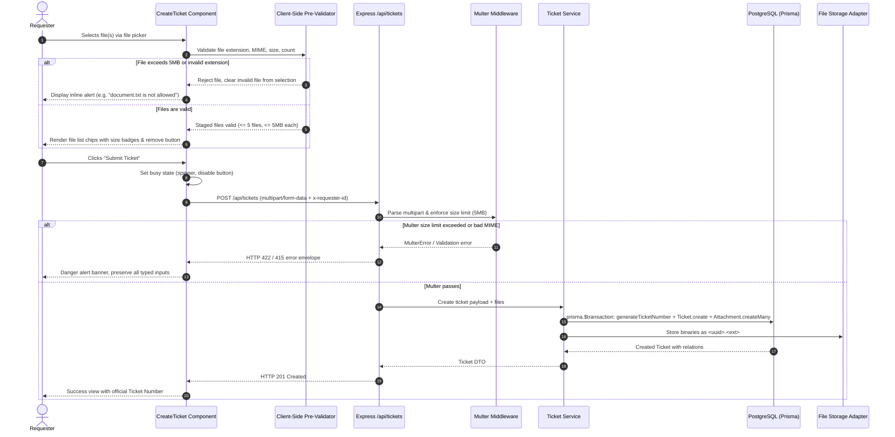

# Feature Engineering Contract: Create Ticket Form & Validation

**Feature Identifier:** Feature 7: Create Ticket Form & Validation (Branch: `feature/7-create-ticket`)  
**Sprint / Milestone:** TokTickIT Lab 2 (Sprint 2) — Requester MVP (Sprint Issue 3)  
**Target Branch:** `feature/7-create-ticket` (Base: `lab2-staging`)  
**Specification Version:** 1.0.0  
**Status:** DRAFT CONTRACT (AWAITING HUMAN REVIEW)  

---

## 1. Purpose, Scope, and Exclusions

### 1.1 Purpose
This engineering contract defines the authoritative specification for **Feature 7: Create Ticket Form & Validation**. This feature delivers:
1. The **Create Ticket Form** user interface adhering strictly to KMUTT's **Zen Green** visual design standard (`Lab_02_labsheet.pdf` Section 7, 8.2 & 8.3; `TokTickIT-System-Level-SDS-v1.0.pdf` p. 12–14).
2. The **Automatic Ticket Number Generation** service executing transactionally in PostgreSQL to produce formatted identifiers matching `TKT-YYYY-NNNNN` with an annual sequence reset (*SDS Approved Decision D-10*; *BR-01*).
3. Strict **Attachment Upload & Boundary Validation** on both client and server: permitted file types (JPG, PNG, WEBP, PDF), maximum 5 MB per file, and maximum 5 active attachments per ticket (*BR-06*).
4. **Graceful Frontend Recovery on API Failure**: resilient error handling ensuring that if the backend service is unreachable or returns an error, all user-entered form data (Summary, Description, Category, Related System, Priority, selected files) is strictly preserved without data loss (*BR-10*; *SDS p. 13*).
5. The unauthenticated/simulated-authenticated **Create Ticket API endpoint** (`POST /api/tickets`, aliased at `POST /api/v1/tickets`) accepting both `application/json` (tickets without attachments) and `multipart/form-data` (tickets with attachments), validating payload constraints, auto-assigning initial status `New` (*BR-02*; *D-02*), setting `itPriority` to match `requestedPriority` (*BR-04*), and persisting the record under the active `RequesterUser` (*BR-08*).

### 1.2 In-Scope Capabilities
* **Interactive Create Ticket Screen & Form Layout:**
  * System-generated read-only displays: Ticket Number placeholder (`TKT-YYYY-NNNNN` / *"System Generated upon submission"*), Ticket Date (current date), and Requester Name/Email (sourced directly from `RequesterContext`).
  * Dropdown selection for **Category** (`ACC`, `HW`, `SW`, `NET`), populated from `GET /api/categories`.
  * Dropdown selection for **Related System** (`Email`, `Campus Wi-Fi`, `VPN`, `LEB2 App`, `Grade Submission App`, `Printer`, `Corporate Laptop`), populated from `GET /api/related-systems`.
  * Selection for **Requested Priority** (`Low`, `Medium`, `High`, `Urgent` — default: `Medium`).
  * Text input for **Summary** (min 5, max 100 characters, single-line).
  * Textarea for **Description** (min 10, max 2000 characters, multiline with vertical resize).
  * Multi-file input for **Attachments** with immediate client-side validation against allowed extensions, size, and file count.
* **Form Interaction & Validation Norms:**
  * **Blur Validation Rule:** Fields with invalid inputs during general data entry clear/blank out on blur.
  * **Submit-Triggered Validation:** Form-level validation messages and field error indicators are displayed exclusively when the user clicks the explicit "Submit Ticket" button.
  * **Busy & Duplicate Prevention State:** Clicking "Submit Ticket" disables the button, displays a spinner, and updates text to *"Submitting..."*, preventing double submissions.
* **Backend Transactional Ticket Number Generation:**
  * Atomic incrementing using `ticket_number_sequences` table (`year Int @id`, `nextVal Int @default(1)`).
  * Annual sequence rollover to 1 when the calendar year increments.
  * 5-digit zero-padding format (`TKT-YYYY-NNNNN`).
* **Attachment Pipeline & Validation:**
  * Strict file type checking: `image/jpeg` (`.jpg`, `.jpeg`), `image/png` (`.png`), `image/webp` (`.webp`), `application/pdf` (`.pdf`).
  * File size boundary: $\le 5\text{ MB}$ ($5,242,880$ bytes) per file. Files $\ge 5,242,881$ bytes are rejected.
  * Attachment quantity boundary: Maximum 5 files per ticket. Selecting $> 5$ files is rejected.
  * Safe storage naming: Unique stored filename generation (`<uuid>.<ext>`) isolating physical storage from client filenames.
* **Resilient API Failure Handling:**
  * React client catches network timeouts, connection drops, and HTTP 4xx/5xx responses.
  * Displays a prominent danger alert callout with descriptive recovery guidance.
  * Retains 100% of user inputs in form state so users can correct errors or retry without re-typing.
* **Success Presentation & Navigation:**
  * Prominent confirmation view/modal displaying the official system-generated `ticketNumber`.
  * Action buttons: *"View in My Tickets"* (navigates to ticket listing) and *"Create Another Ticket"* (resets form to blank for a new ticket).
* **Automated Test Coverage (STS):**
  * Unit tests for ticket number formatting, padding, annual reset, and concurrent generation.
  * Unit tests for attachment MIME and file size validation.
  * API integration tests for `POST /api/tickets` (JSON & multipart, boundaries, 201, 400, 415, 422).
  * Component tests for Create Ticket form rendering, validation triggers, submit busy states, attachment boundary rejection, and input retention on API failure.

### 1.3 Explicit Exclusions (Out of Scope)
To prevent feature creep and honor course milestone boundaries:
* **No Lifecycle Status Transitions Beyond "New":** Newly created tickets strictly receive status `"New"`. Requesters cannot resolve, close, assign, or cancel tickets.
* **No Requester Modification of IT Priority:** `itPriority` is automatically initialized by the backend to match `requestedPriority`. Requesters have no UI control to alter `itPriority`.
* **No Ticket Assignment or Owner Selection:** The `ticketOwner` field is unassigned (`null`) upon creation. Assignment workflows are deferred to IT Staff labs.
* **No Collaboration / Commenting Features:** Public Comments, Internal Notes, and Actions Taken tabs/forms are strictly excluded.
* **No Standalone Attachment Management in this Issue:** Soft-removal of attachments, removal reason modals, and streaming downloads are part of Feature 5 (`feature/5-ticket-detail`) and excluded here.
* **No Real Authentication, Passwords, or JWT:** The feature consumes the simulated `x-requester-id` header provided by `RequesterContext` established in Feature 2.

---

## 2. Data Model & Database Invariants

The data models for tickets, sequences, and attachments were established in the database foundation (`server/prisma/schema.prisma`):



### 2.1 Database Invariants & Rules
1. **Ticket Number Uniqueness:** `ticketNumber` has a `@unique` constraint in PostgreSQL (`@db.VarChar(32)`).
2. **Mandatory Foreign Keys:** `requesterId`, `categoryId`, and `relatedSystemId` must reference existing active records in `requester_users`, `categories`, and `related_systems` respectively with `onDelete: Restrict`.
3. **Status Default:** `currentStatus` defaults to `"New"` and cannot be overridden by client input during ticket creation.
4. **Optimistic Concurrency Baseline:** `createdAt` and `updatedAt` are timestamped in UTC.
5. **Attachment Foreign Key & Cascade:** `Attachment.ticketId` references `Ticket.id` with `onDelete: Cascade`.

---

## 3. Domain Logic & Business Rules

### 3.1 Automatic Ticket Number Generation (`TKT-YYYY-NNNNN`)
* **Format Definition (BR-01, D-10):**
  $$\text{Ticket Number} = \text{"TKT-"} + \text{YYYY} + \text{"-"} + \text{NNNNN}$$
  * `YYYY`: 4-digit calendar year derived from the server's current UTC time (e.g., `2026`).
  * `NNNNN`: 5-digit sequential integer zero-padded up to 5 digits (e.g., `00001`, `00042`, `10000`).
* **Annual Sequence Reset Rule:**
  * On January 1st 00:00:00 UTC of each year, sequence counting restarts at `1` for the new year.
  * The `ticket_number_sequences` table stores one row per calendar year:
    * `year` (`Int`, Primary Key)
    * `nextVal` (`Int`, next counter value to be assigned)
* **Transactional Concurrency Logic:**
  * Ticket number allocation occurs strictly inside a PostgreSQL transaction (`prisma.$transaction`) executing serializable or locked row updates:
    ```typescript
    export async function generateTicketNumber(tx: Prisma.TransactionClient): Promise<string> {
      const currentYear = new Date().getUTCFullYear();
      
      // Upsert annual sequence counter atomically
      const sequence = await tx.ticketNumberSequence.upsert({
        where: { year: currentYear },
        update: { nextVal: { increment: 1 } },
        create: { year: currentYear, nextVal: 2 }, // 1 is assigned, nextVal becomes 2
      });

      // If record was just created, assigned value is 1; otherwise, nextVal - 1
      const assignedSeq = sequence.nextVal === 2 
        ? 1 
        : sequence.nextVal - 1;

      const paddedNumber = String(assignedSeq).padStart(5, '0');
      return `TKT-${currentYear}-${paddedNumber}`;
    }
    ```
  * **Client Form Presentation:** The Ticket Number is strictly **read-only** on the client. Before submission, the form displays a placeholder badge or disabled input indicating: *"System Generated upon submission"*.

### 3.2 Field Length & Boundary Rules (BR-05)
* **Summary (`summary`):**
  * Required string.
  * Trimming: Trim leading and trailing whitespace before validation.
  * Length: Minimum **5** characters, maximum **100** characters.
  * Rejection: Any string with trimmed length $< 5$ or $> 100$ produces HTTP 422 with message: *"Summary must be between 5 and 100 characters."*
* **Description (`description`):**
  * Required string.
  * Trimming: Trim leading and trailing whitespace before validation.
  * Length: Minimum **10** characters, maximum **2000** characters.
  * Rejection: Any string with trimmed length $< 10$ or $> 2000$ produces HTTP 422 with message: *"Description must be between 10 and 2000 characters."*
* **Priority Alignment (BR-04, D-03):**
  * Permitted `requestedPriority` values: `"Low"`, `"Medium"`, `"High"`, `"Urgent"`.
  * `itPriority` is automatically set by the server to match `requestedPriority` upon creation.
  * Default selection on the client form: `"Medium"`.

---

## 4. Strict Attachment Rules & Architecture

### 4.1 Permitted MIME Types & Extensions (BR-06)
Attachments must strictly conform to the following whitelist:

| File Type | Allowed Extensions | Canonical MIME Type | Magic Number / Signature Verification |
| :--- | :--- | :--- | :--- |
| **JPEG Image** | `.jpg`, `.jpeg` | `image/jpeg` | `FF D8 FF` |
| **PNG Image** | `.png` | `image/png` | `89 50 4E 47 0D 0A 1A 0A` |
| **WEBP Image** | `.webp` | `image/webp` | `52 49 46 46 ... 57 45 42 50` |
| **PDF Document** | `.pdf` | `application/pdf` | `25 50 44 46` (`%PDF`) |

* Any file with an extension or MIME type not in this whitelist (e.g., `.exe`, `.txt`, `.docx`, `.zip`, `.sh`) must be rejected immediately on both client and server boundaries.

### 4.2 Size & Quantity Limits (BR-06)
1. **Maximum File Size:**
   * Exactly **5 MB** per file:
     $$\text{Max Bytes} = 5 \times 1024 \times 1024 = 5,242,880 \text{ bytes}$$
   * Files with size $> 5,242,880$ bytes (e.g. 5.1 MB or 6 MB) are rejected.
2. **Maximum Active Attachments:**
   * Exactly **5 active attachments** per ticket.
   * If a user selects more than 5 files during ticket creation, the submission is rejected.

### 4.3 Validation Architecture: Client vs. Server



### 4.4 File Storage Abstraction
* Binary files are stored in the local storage directory (`server/uploads/attachments/` or configured `ATTACHMENT_STORAGE_DIR`).
* Files are written using unique UUID filenames (`${crypto.randomUUID()}${ext}`) to prevent collisions, directory traversal attacks, or OS filesystem encoding issues.
* The original client filename is preserved strictly in the `originalFilename` column of the `attachments` database table.

---

## 5. API Contract

### 5.1 Protocol Standards
* **Route:** `POST /api/tickets`
* **Specification Alias:** `POST /api/v1/tickets`
* **Authentication:** Unauthenticated in Lab 2 simulated mode; identity passed via header:
  ```http
  x-requester-id: <number>
  ```
* **Supported Content Types:**
  1. `application/json` (when no attachments are included)
  2. `multipart/form-data` (when one or more attachments are included)

---

### 5.2 Request Formats

#### Option A: JSON Request (`Content-Type: application/json`)
Used when creating a ticket without attachments.

```json
{
  "summary": "Campus Wi-Fi drops intermittently in Building 3",
  "description": "Every 15 minutes the connection to KMUTT-Secure drops and requires reconnecting.",
  "categoryId": 4,
  "relatedSystemId": 2,
  "requestedPriority": "High"
}
```

#### Option B: Multipart Request (`Content-Type: multipart/form-data`)
Used when creating a ticket with 1 to 5 attachments.

* **Form Fields:**
  * `summary` (`string`): Problem summary (5–100 characters).
  * `description` (`string`): Problem description (10–2000 characters).
  * `categoryId` (`string` / `number`): ID of selected Category.
  * `relatedSystemId` (`string` / `number`): ID of selected Related System.
  * `requestedPriority` (`string`): Priority (`Low`, `Medium`, `High`, `Urgent`).
* **File Part(s):**
  * Field name: `attachments` or `files` (array of 1 to 5 files, each $\le 5\text{ MB}$, JPG/PNG/WEBP/PDF).

---

### 5.3 Response Schemas

#### Successful Response (`HTTP 201 Created`)
```json
{
  "success": true,
  "data": {
    "id": 12,
    "ticketNumber": "TKT-2026-00001",
    "summary": "Campus Wi-Fi drops intermittently in Building 3",
    "description": "Every 15 minutes the connection to KMUTT-Secure drops and requires reconnecting.",
    "categoryId": 4,
    "categoryName": "Network",
    "relatedSystemId": 2,
    "relatedSystemName": "Campus Wi-Fi",
    "requestedPriority": "High",
    "itPriority": "High",
    "currentStatus": "New",
    "requesterId": 1,
    "requesterName": "Jennifer Anderson",
    "createdAt": "2026-09-05T14:30:00.000Z",
    "updatedAt": "2026-09-05T14:30:00.000Z",
    "attachments": [
      {
        "id": 1,
        "originalFilename": "wifi_signal.png",
        "mimeType": "image/png",
        "fileSize": 145020,
        "createdAt": "2026-09-05T14:30:00.000Z"
      }
    ]
  }
}
```

#### Error Response: Missing Header (`HTTP 400 Bad Request`)
```json
{
  "success": false,
  "error": {
    "code": "MISSING_REQUESTER_HEADER",
    "message": "The 'x-requester-id' header is required to identify the submitting requester.",
    "details": []
  }
}
```

#### Error Response: Validation Failure (`HTTP 422 Unprocessable Entity`)
```json
{
  "success": false,
  "error": {
    "code": "VALIDATION_ERROR",
    "message": "The submitted ticket data failed validation constraints.",
    "details": [
      {
        "field": "summary",
        "message": "Summary must be between 5 and 100 characters."
      },
      {
        "field": "categoryId",
        "message": "Selected category does not exist or is inactive."
      }
    ]
  }
}
```

#### Error Response: Unsupported File Format (`HTTP 415 Unsupported Media Type`)
```json
{
  "success": false,
  "error": {
    "code": "UNSUPPORTED_MEDIA_TYPE",
    "message": "File 'logs.txt' has an unsupported format. Allowed formats: JPG, PNG, WEBP, PDF.",
    "details": [
      {
        "field": "attachments",
        "message": "Invalid file type 'text/plain'. Only JPG, PNG, WEBP, and PDF are accepted."
      }
    ]
  }
}
```

#### Error Response: File Too Large (`HTTP 422 Unprocessable Entity`)
```json
{
  "success": false,
  "error": {
    "code": "FILE_TOO_LARGE",
    "message": "File 'video_recording.mp4' exceeds the maximum allowed size of 5 MB (5,242,880 bytes).",
    "details": [
      {
        "field": "attachments",
        "message": "Maximum size per file is 5 MB."
      }
    ]
  }
}
```

---

## 6. UI Specifications & KMUTT "Zen Green" Style

### 6.1 Design System Integration & CSS Tokens
The Create Ticket form strictly inherits the CSS variables defined in `client/src/index.css`:
* Primary Action / Brand: `--color-primary-green` (`#006B3C`)
* Secondary Action / Focus Ring: `--color-secondary-green` (`#0B7A46`)
* Pale Surface Highlight: `--color-pale-green` (`#EAF6EF`)
* Page Background: `--color-page-bg` (`#F5F7F6`)
* White Card Container: `--color-surface-card` (`#FFFFFF`)
* Primary Text: `--color-text-primary` (`#1F2937`)
* Muted Text: `--color-text-muted` (`#5B6573`)
* Read-Only Field Background: `--color-field-readonly-bg` (`#F5F7F6`)
* Read-Only Border: `--color-field-readonly-border` (`#E5E7EB`)
* Danger / Error Text & Border: `--color-danger` (`#B3261E`)
* Danger Alert Background: `--color-danger-bg` (`#FDF2F2`)
* Focus Ring: `--focus-ring` (`0 0 0 3px rgba(11, 122, 70, 0.2)`)

### 6.2 Form Layout Geometry
* **Desktop Container ($\ge 992\text{px}$):**
  * Centered layout (`max-width: 960px` or `container-xl`), white card container with `border-radius: 8px`, `box-shadow: var(--shadow-card)`, and padding `2rem` (32px) (**DEC-UI-03**).
* **Tablet (768–991px):**
  * 2-column grid for Category and Related System; Priority and read-only fields adapt gracefully.
* **Mobile (< 768px):**
  * Single-column stacked fields with zero horizontal scroll (**DEC-UI-11**). Padding `1rem` (16px).

```
+---------------------------------------------------------------------------------------------+
|                                  Create Support Ticket                                      |
|  Submit an IT incident or service request. Fields marked with an asterisk (*) are required. |
+---------------------------------------------------------------------------------------------+
|                                                                                             |
|  [!] System-Generated Metadata (Read-Only)                                                  |
|  +-----------------------------------+----------------------------------------------------+  |
|  | Ticket Number:                    | Ticket Date:                                       |  |
|  | [ TKT-YYYY-NNNNN (Auto-Generated)]| [ 2026-09-05                                     ] |  |
|  +-----------------------------------+----------------------------------------------------+  |
|  | Requester:                                                                             |  |
|  | [ Jennifer Anderson (jennifer.anderson@kmutt.ac.th)                                  ] |  |
|  +----------------------------------------------------------------------------------------+  |
|                                                                                             |
|  Category *                                Related System *                                 |
|  +--------------------------------------+  +---------------------------------------------+  |
|  | Hardware                           v |  | Corporate Laptop                          v |  |
|  +--------------------------------------+  +---------------------------------------------+  |
|                                                                                             |
|  Requested Priority *                                                                       |
|  ( ) Low      (*) Medium      ( ) High      ( ) Urgent                                      |
|                                                                                             |
|  Ticket Summary * (5-100 characters)                                                        |
|  +---------------------------------------------------------------------------------------+  |
|  | Laptop battery drains quickly                                                         |  |
|  +---------------------------------------------------------------------------------------+  |
|  [!] Error text placed immediately below if invalid                                         |
|                                                                                             |
|  Detailed Description * (10-2000 characters)                                                |
|  +---------------------------------------------------------------------------------------+  |
|  | My corporate laptop battery depletes from 100% to 10% in under 30 minutes even when    |  |
|  | only running basic applications.                                                      |  |
|  +---------------------------------------------------------------------------------------+  |
|                                                                                             |
|  Attachments (Optional - Max 5 files, 5 MB each; JPG, PNG, WEBP, PDF)                       |
|  +---------------------------------------------------------------------------------------+  |
|  | [ Choose Files ]  1 file selected                                                     |  |
|  +---------------------------------------------------------------------------------------+  |
|  * battery_diagnostics.pdf (1.2 MB) [ Remove x ]                                            |
|                                                                                             |
|  +---------------------------------------------------------------------------------------+  |
|  | [ Cancel / Reset ]                                    [ Submit Ticket -> ]            |  |
|  +---------------------------------------------------------------------------------------+  |
+---------------------------------------------------------------------------------------------+
```

### 6.3 Field Hierarchy & Controls
1. **System Metadata Group (Read-Only):**
   * Shaded with `--color-field-readonly-bg` (`#F5F7F6`) and `--color-field-readonly-border` (`#E5E7EB`).
   * `cursor: not-allowed`.
   * Displays Ticket Number placeholder, Ticket Date, and Requester display name.
2. **Category Select (`#category-select`):**
   * Populated dynamically from `GET /api/categories`.
   * Default prompt: `<option value="">-- Select Category --</option>`.
   * Height: `38px`, `border-radius: 6px`. Required asterisk (`*`).
3. **Related System Select (`#system-select`):**
   * Populated dynamically from `GET /api/related-systems`.
   * Default prompt: `<option value="">-- Select Related System --</option>`.
   * Height: `38px`, `border-radius: 6px`. Required asterisk (`*`).
4. **Requested Priority Selector:**
   * Rendered as segmented radio buttons or styled select with options: `Low`, `Medium`, `High`, `Urgent`.
   * Default: `Medium`.
   * Visual indicators pair color with text labels (**DEC-UI-19**).
5. **Summary Input (`#summary-input`):**
   * Standard single-line input (`input[type="text"]`), height `38px`, `border-radius: 6px`.
   * Placeholder: *"Brief summary of the issue (5–100 characters)"*.
   * Character count / boundary feedback.
6. **Description Textarea (`#description-textarea`):**
   * Multiline textarea (`rows="5"`), `min-height: 120px`, `resize: vertical`.
   * Placeholder: *"Provide detailed steps to reproduce, symptoms, or error messages (10–2000 characters)"*.
7. **Attachments File Input (`#attachment-input`):**
   * Standard file input with `accept=".jpg,.jpeg,.png,.webp,.pdf"` and `multiple`.
   * Drag-and-drop or file picker button with clear helper text: *"Max 5 files, 5 MB each (JPG, PNG, WEBP, PDF)"*.
   * Chip/list preview showing selected filename, formatted file size, and an `[ x ]` remove button.

### 6.4 Developer Work Norm: Blur Validation Rule & Submit Error Placement
To conform strictly with workspace engineering work norms (`AGENTS.md`):
1. **Blur Validation Rule:**
   * During general data entry, if a user enters an invalid format into a field and triggers `onBlur`, invalid inputs clear/blank out on blur.
   * For file selection: if an invalid file (e.g. `6MB` file or `.txt` file) is picked, the file input clears/drops the invalid file on change/blur and alerts the user.
2. **Submit-Triggered Validation:**
   * Field-level validation messages and red borders are **only displayed upon clicking the explicit "Submit Ticket" button**.
   * Validation messages are placed **immediately below** the invalid input field in Dark Red text (`#B3261E`, `0.75rem`, `font-weight: 500`) with an exclamation circle SVG icon (**DEC-UI-13**).
   * Input border transitions to `border: 1px solid var(--color-danger)`.

### 6.5 Submitting, Busy & Disabled States (BR-09, DEC-UI-14)
* When the user clicks "Submit Ticket":
  1. The Submit button is immediately disabled (`disabled={isSubmitting}`).
  2. The button maintains its exact layout dimensions.
  3. Displays an animated SVG spinner (`spinner-border spinner-border-sm me-2`).
  4. Button text changes to *"Submitting..."*.
  5. Form inputs are temporarily locked (`disabled={isSubmitting}`) to prevent in-flight modification or double submissions.

### 6.6 Graceful Frontend Recovery on API Failure (BR-10)
* If the submission fails due to:
  * Network disconnection / server offline
  * Backend timeout
  * HTTP 4xx or 5xx error
* **UI Behavior:**
  1. A prominent alert banner (`alert alert-danger`) appears at the top of the form:
     * Surface: `background-color: var(--color-danger-bg); border: 1px solid var(--color-danger); color: var(--color-danger);`
     * Message: *"Unable to submit ticket: [Reason / Server Offline]. Your entered information has been preserved. Please check your connection and try again."*
  2. **Data Retention Invariant:** React component state strictly retains:
     * `summary`
     * `description`
     * `categoryId`
     * `relatedSystemId`
     * `requestedPriority`
     * Staged `attachmentFiles`
  3. The Submit button is re-enabled so the user can immediately retry without re-entering data.

### 6.7 Successful Creation Alert & Navigation
* Upon receiving `HTTP 201 Created`:
  1. An animated, prominent Zen Green success panel or modal is displayed:
     * Surface: `background: var(--color-pale-green); border: 1px solid var(--color-primary-green); border-radius: 8px; padding: 1.5rem;`
     * Title: *"Ticket Created Successfully!"*
     * Highlight: Official Ticket Number (e.g. `TKT-2026-00001`) in bold 24px primary green text with a copy-to-clipboard action.
     * Metadata: Summary, category, priority, and date.
  2. **Action Buttons:**
     * `[ View in My Tickets ]`: Calls `onTabChange("my-tickets")` to navigate to the ticket history view.
     * `[ + Create Another Ticket ]`: Clears the form state and returns to a fresh blank ticket creation screen.

---

## 7. Software Test Specification (STS)

### 7.1 Traceability Matrix
All automated tests trace directly back to approved Requirements (FR), Business Rules (BR), and Acceptance Criteria (AC):

| AC ID | Requirement Description | Verification Level | Automated Test File Path |
| :--- | :--- | :--- | :--- |
| **AC-03-01** | Valid ticket creation with auto-generated `TKT-YYYY-NNNNN` | API Integration & Unit | `server/tests/lab-02/ticket-number.test.ts`<br/>`server/tests/lab-02/create-ticket.api.test.ts` |
| **AC-03-02** | Field-level validation on empty/invalid fields (summary < 5, etc.) | API Integration & Component | `server/tests/lab-02/create-ticket.api.test.ts`<br/>`client/tests/lab-02/CreateTicket.test.tsx` |
| **AC-03-03** | Submit busy state & double-submission prevention | UI Component | `client/tests/lab-02/CreateTicket.test.tsx` |
| **AC-03-04** | Form input preservation on network/server failure | UI Component | `client/tests/lab-02/CreateTicket.test.tsx` |
| **AC-03-05** | Success confirmation with generated Ticket Number & navigation | UI Component | `client/tests/lab-02/CreateTicket.test.tsx` |
| **AC-13** | Valid attachment upload with ticket creation | API Integration | `server/tests/lab-02/create-ticket.api.test.ts` |
| **AC-14** | Attachment rejection on file > 5 MB or invalid extension (e.g. `.txt`) | Unit, API, Component | `server/tests/lab-02/attachment-validator.test.ts`<br/>`server/tests/lab-02/create-ticket.api.test.ts`<br/>`client/tests/lab-02/CreateTicket.test.tsx` |
| **AC-15** | Attachment rejection on > 5 active attachments per ticket | Unit, API, Component | `server/tests/lab-02/attachment-validator.test.ts`<br/>`server/tests/lab-02/create-ticket.api.test.ts`<br/>`client/tests/lab-02/CreateTicket.test.tsx` |

---

### 7.2 Test Suite 1: Ticket Number Generator Unit Tests
**File:** `server/tests/lab-02/ticket-number.test.ts`  
**Runner:** Vitest against test PostgreSQL instance.

```typescript
import { describe, it, expect, beforeEach } from 'vitest';
import { PrismaClient } from '@prisma/client';
import { generateTicketNumber } from '../../src/services/ticketNumber.service.js';

const prisma = new PrismaClient();

describe('Unit: Ticket Number Generator Service', () => {
  beforeEach(async () => {
    // Clean sequence records before test runs
    await prisma.ticketNumberSequence.deleteMany();
  });

  it('generates the first ticket number in format TKT-YYYY-00001', async () => {
    const currentYear = new Date().getUTCFullYear();
    const ticketNumber = await prisma.$transaction(async (tx) => {
      return generateTicketNumber(tx);
    });
    expect(ticketNumber).toBe(`TKT-${currentYear}-00001`);
  });

  it('generates sequentially incremented numbers with 5-digit zero padding', async () => {
    const currentYear = new Date().getUTCFullYear();
    const numbers: string[] = [];

    for (let i = 0; i < 5; i++) {
      const num = await prisma.$transaction(async (tx) => {
        return generateTicketNumber(tx);
      });
      numbers.push(num);
    }

    expect(numbers).toEqual([
      `TKT-${currentYear}-00001`,
      `TKT-${currentYear}-00002`,
      `TKT-${currentYear}-00003`,
      `TKT-${currentYear}-00004`,
      `TKT-${currentYear}-00005`,
    ]);
  });

  it('handles annual reset correctly when year increments', async () => {
    // Simulate past year sequence
    await prisma.ticketNumberSequence.create({
      data: { year: 2025, nextVal: 450 },
    });

    // Generate for current year (2026)
    const ticketNumber = await prisma.$transaction(async (tx) => {
      return generateTicketNumber(tx);
    });

    const currentYear = new Date().getUTCFullYear();
    expect(ticketNumber).toBe(`TKT-${currentYear}-00001`);

    // Ensure past year remains unaffected
    const pastYear = await prisma.ticketNumberSequence.findUnique({ where: { year: 2025 } });
    expect(pastYear?.nextVal).toBe(450);
  });

  it('maintains strict uniqueness under concurrent generation', async () => {
    const count = 10;
    const promises = Array.from({ length: count }, () =>
      prisma.$transaction(async (tx) => generateTicketNumber(tx))
    );

    const results = await Promise.all(promises);
    const uniqueSet = new Set(results);
    expect(uniqueSet.size).toBe(count);
  });
});
```

---

### 7.3 Test Suite 2: Attachment Validator Unit Tests
**File:** `server/tests/lab-02/attachment-validator.test.ts`  
**Runner:** Vitest.

```typescript
import { describe, it, expect } from 'vitest';
import { validateAttachmentFile, validateAttachmentQuantity } from '../../src/services/attachmentValidator.js';

describe('Unit: Attachment Validation Utility', () => {
  it('accepts permitted MIME types and extensions (JPG, PNG, WEBP, PDF)', () => {
    expect(validateAttachmentFile('test.jpg', 'image/jpeg', 1024).valid).toBe(true);
    expect(validateAttachmentFile('photo.png', 'image/png', 2048).valid).toBe(true);
    expect(validateAttachmentFile('graphic.webp', 'image/webp', 5000).valid).toBe(true);
    expect(validateAttachmentFile('doc.pdf', 'application/pdf', 1048576).valid).toBe(true);
  });

  it('rejects forbidden file extensions (e.g. .txt, .exe, .docx, .zip)', () => {
    const txtResult = validateAttachmentFile('logs.txt', 'text/plain', 500);
    expect(txtResult.valid).toBe(false);
    expect(txtResult.error).toMatch(/unsupported/i);

    const exeResult = validateAttachmentFile('virus.exe', 'application/x-msdownload', 500);
    expect(exeResult.valid).toBe(false);
  });

  it('rejects files exceeding 5 MB (5,242,880 bytes)', () => {
    const exactLimit = 5 * 1024 * 1024; // 5,242,880
    expect(validateAttachmentFile('large.pdf', 'application/pdf', exactLimit).valid).toBe(true);

    const overLimit = exactLimit + 1; // 5,242,881
    const res = validateAttachmentFile('toobig.png', 'image/png', overLimit);
    expect(res.valid).toBe(false);
    expect(res.error).toMatch(/exceeds/i);
  });

  it('enforces maximum 5 active attachments limit', () => {
    expect(validateAttachmentQuantity(0, 5).valid).toBe(true);
    expect(validateAttachmentQuantity(4, 1).valid).toBe(true);
    expect(validateAttachmentQuantity(5, 1).valid).toBe(false);
    expect(validateAttachmentQuantity(3, 3).valid).toBe(false);
  });
});
```

---

### 7.4 Test Suite 3: Backend API Integration Tests
**File:** `server/tests/lab-02/create-ticket.api.test.ts`  
**Runner:** Vitest + Supertest against PostgreSQL.

```typescript
import { describe, it, expect, beforeAll } from 'vitest';
import request from 'supertest';
import { PrismaClient } from '@prisma/client';
import app from '../../src/app.js';
import { seed } from '../../prisma/seed.js';

const prisma = new PrismaClient();

describe('API: POST /api/tickets (Feature 7 Create Ticket)', () => {
  beforeAll(async () => {
    await seed(prisma);
  });

  describe('Happy Path: Valid Ticket Creation', () => {
    it('creates a ticket with status New, itPriority matching requestedPriority, and returns HTTP 201', async () => {
      const res = await request(app)
        .post('/api/tickets')
        .set('x-requester-id', '1')
        .send({
          summary: 'VPN disconnects every hour',
          description: 'The remote SSL VPN gateway terminates session after exactly 60 minutes of active use.',
          categoryId: 4, // Network
          relatedSystemId: 3, // VPN
          requestedPriority: 'High',
        });

      expect(res.status).toBe(201);
      expect(res.body.success).toBe(true);
      expect(res.body.data.ticketNumber).toMatch(/^TKT-\d{4}-\d{5}$/);
      expect(res.body.data.currentStatus).toBe('New');
      expect(res.body.data.requestedPriority).toBe('High');
      expect(res.body.data.itPriority).toBe('High');
      expect(res.body.data.requesterId).toBe(1);
    });

    it('creates a ticket with an uploaded attachment via multipart/form-data', async () => {
      const dummyBuffer = Buffer.from('fake png binary content');

      const res = await request(app)
        .post('/api/tickets')
        .set('x-requester-id', '1')
        .field('summary', 'Broken printer in CB2')
        .field('description', 'Paper jam error cannot be resolved through normal tray clearance.')
        .field('categoryId', '2') // Hardware
        .field('relatedSystemId', '6') // Printer
        .field('requestedPriority', 'Medium')
        .attach('attachments', dummyBuffer, {
          filename: 'jam_photo.png',
          contentType: 'image/png',
        });

      expect(res.status).toBe(201);
      expect(res.body.success).toBe(true);
      expect(res.body.data.attachments).toHaveLength(1);
      expect(res.body.data.attachments[0].originalFilename).toBe('jam_photo.png');
      expect(res.body.data.attachments[0].mimeType).toBe('image/png');
    });
  });

  describe('Validation & Boundary Enforcement', () => {
    it('returns HTTP 400 when x-requester-id header is missing', async () => {
      const res = await request(app)
        .post('/api/tickets')
        .send({
          summary: 'Valid summary here',
          description: 'Valid description text that is long enough.',
          categoryId: 1,
          relatedSystemId: 1,
          requestedPriority: 'Medium',
        });

      expect(res.status).toBe(400);
      expect(res.body.success).toBe(false);
      expect(res.body.error.code).toBe('MISSING_REQUESTER_HEADER');
    });

    it('returns HTTP 422 when summary is less than 5 characters', async () => {
      const res = await request(app)
        .post('/api/tickets')
        .set('x-requester-id', '1')
        .send({
          summary: 'Fail', // 4 chars
          description: 'Valid description text that is long enough.',
          categoryId: 1,
          relatedSystemId: 1,
          requestedPriority: 'Medium',
        });

      expect(res.status).toBe(422);
      expect(res.body.success).toBe(false);
      expect(res.body.error.details.some((d: any) => d.field === 'summary')).toBe(true);
    });

    it('returns HTTP 422 when description is less than 10 characters', async () => {
      const res = await request(app)
        .post('/api/tickets')
        .set('x-requester-id', '1')
        .send({
          summary: 'Valid summary',
          description: 'Short', // 5 chars
          categoryId: 1,
          relatedSystemId: 1,
          requestedPriority: 'Medium',
        });

      expect(res.status).toBe(422);
      expect(res.body.success).toBe(false);
      expect(res.body.error.details.some((d: any) => d.field === 'description')).toBe(true);
    });

    it('returns HTTP 415 when uploading an unpermitted file format (.txt)', async () => {
      const textBuffer = Buffer.from('plain text log content');

      const res = await request(app)
        .post('/api/tickets')
        .set('x-requester-id', '1')
        .field('summary', 'Invalid file test')
        .field('description', 'Attempting upload of forbidden text file.')
        .field('categoryId', '3')
        .field('relatedSystemId', '1')
        .field('requestedPriority', 'Low')
        .attach('attachments', textBuffer, {
          filename: 'error.txt',
          contentType: 'text/plain',
        });

      expect(res.status).toBe(415);
      expect(res.body.success).toBe(false);
      expect(res.body.error.message).toMatch(/unsupported/i);
    });

    it('returns HTTP 422 when uploading a file exceeding 5 MB', async () => {
      // Create a 5.5MB buffer (5.5 * 1024 * 1024)
      const largeBuffer = Buffer.alloc(5.5 * 1024 * 1024);

      const res = await request(app)
        .post('/api/tickets')
        .set('x-requester-id', '1')
        .field('summary', 'Oversized file test')
        .field('description', 'Attempting upload of 5.5MB PDF.')
        .field('categoryId', '3')
        .field('relatedSystemId', '1')
        .field('requestedPriority', 'Low')
        .attach('attachments', largeBuffer, {
          filename: 'oversized.pdf',
          contentType: 'application/pdf',
        });

      expect([413, 422]).toContain(res.status);
      expect(res.body.success).toBe(false);
    });
  });
});
```

---

### 7.5 Test Suite 4: Frontend Component Tests
**File:** `client/tests/lab-02/CreateTicket.test.tsx`  
**Runner:** Vitest + React Testing Library.

```typescript
import { describe, it, expect, vi, beforeEach } from 'vitest';
import { render, screen, fireEvent, waitFor } from '@testing-library/react';
import userEvent from '@testing-library/user-event';
import { CreateTicket } from '../../src/components/CreateTicket.js';
import { RequesterContext } from '../../src/context/RequesterContext.js';

const mockRequester = {
  id: 1,
  name: 'Jennifer Anderson',
  email: 'jennifer.anderson@kmutt.ac.th',
  isActive: true,
};

const mockCategories = [
  { id: 1, name: 'Account and Access' },
  { id: 2, name: 'Hardware' },
  { id: 3, name: 'Software' },
  { id: 4, name: 'Network' },
];

const mockSystems = [
  { id: 1, name: 'Email' },
  { id: 2, name: 'Campus Wi-Fi' },
];

function renderCreateTicket(onSuccess = vi.fn(), onCancel = vi.fn()) {
  return render(
    <RequesterContext.Provider
      value={{
        currentRequester: mockRequester,
        setCurrentRequester: vi.fn(),
        requesters: [mockRequester],
        isLoading: false,
        error: null,
        isSwitchModalOpen: false,
        openSwitchModal: vi.fn(),
        closeSwitchModal: vi.fn(),
        refreshRequesters: vi.fn(),
        selectRequester: vi.fn(),
        clearRequester: vi.fn(),
      }}
    >
      <CreateTicket onSuccess={onSuccess} onCancel={onCancel} />
    </RequesterContext.Provider>
  );
}

describe('Component: CreateTicket Form', () => {
  beforeEach(() => {
    vi.clearAllMocks();
    vi.spyOn(global, 'fetch').mockImplementation(async (url: any) => {
      const urlStr = url.toString();
      if (urlStr.includes('/categories')) {
        return { ok: true, json: async () => ({ success: true, data: mockCategories }) } as any;
      }
      if (urlStr.includes('/related-systems')) {
        return { ok: true, json: async () => ({ success: true, data: mockSystems }) } as any;
      }
      return { ok: true, json: async () => ({ success: true, data: {} }) } as any;
    });
  });

  it('renders read-only system generated fields and populated dropdowns', async () => {
    renderCreateTicket();

    // Read-only displays
    expect(screen.getByText(/Jennifer Anderson/i)).toBeInTheDocument();
    expect(screen.getByDisplayValue(/Auto-Generated/i)).toBeDisabled();

    // Wait for reference dropdowns to load
    await waitFor(() => {
      expect(screen.getByText('Account and Access')).toBeInTheDocument();
      expect(screen.getByText('Campus Wi-Fi')).toBeInTheDocument();
    });
  });

  it('displays field errors only on submit attempt when fields are empty', async () => {
    renderCreateTicket();

    const submitBtn = screen.getByRole('button', { name: /submit ticket/i });
    fireEvent.click(submitBtn);

    // Form-level validation displays
    await waitFor(() => {
      expect(screen.getByText(/summary must be between 5 and 100 characters/i)).toBeInTheDocument();
      expect(screen.getByText(/description must be between 10 and 2000 characters/i)).toBeInTheDocument();
      expect(screen.getByText(/please select a category/i)).toBeInTheDocument();
      expect(screen.getByText(/please select a related system/i)).toBeInTheDocument();
    });
  });

  it('blur validation rule: invalid input clears on blur during general entry', async () => {
    renderCreateTicket();

    const summaryInput = screen.getByLabelText(/summary/i);
    // User enters invalid text (e.g. whitespace only) and blurs
    fireEvent.change(summaryInput, { target: { value: '   ' } });
    fireEvent.blur(summaryInput);

    expect((summaryInput as HTMLInputElement).value).toBe('');
  });

  it('submitting busy state: disables button and displays spinner', async () => {
    // Hang API response
    vi.spyOn(global, 'fetch').mockImplementationOnce(() => new Promise(() => {}));

    renderCreateTicket();

    // Fill valid data
    fireEvent.change(screen.getByLabelText(/category/i), { target: { value: '1' } });
    fireEvent.change(screen.getByLabelText(/related system/i), { target: { value: '1' } });
    fireEvent.change(screen.getByLabelText(/summary/i), { target: { value: 'Valid summary for test' } });
    fireEvent.change(screen.getByLabelText(/description/i), { target: { value: 'Valid description that has more than ten characters.' } });

    const submitBtn = screen.getByRole('button', { name: /submit ticket/i });
    fireEvent.click(submitBtn);

    await waitFor(() => {
      expect(screen.getByText(/submitting\.\.\./i)).toBeInTheDocument();
      expect(submitBtn).toBeDisabled();
    });
  });

  it('graceful recovery on API failure: preserves typed inputs in form state', async () => {
    // Mock server error on ticket submit
    vi.spyOn(global, 'fetch').mockImplementation(async (url: any) => {
      const urlStr = url.toString();
      if (urlStr.includes('/categories')) return { ok: true, json: async () => ({ success: true, data: mockCategories }) } as any;
      if (urlStr.includes('/related-systems')) return { ok: true, json: async () => ({ success: true, data: mockSystems }) } as any;
      if (urlStr.includes('/tickets')) {
        return {
          ok: false,
          status: 500,
          json: async () => ({ success: false, error: { message: 'Internal Server Error' } }),
        } as any;
      }
      return { ok: true, json: async () => ({ success: true }) } as any;
    });

    renderCreateTicket();

    // Fill valid data
    const summaryInput = screen.getByLabelText(/summary/i);
    const descInput = screen.getByLabelText(/description/i);

    fireEvent.change(screen.getByLabelText(/category/i), { target: { value: '2' } });
    fireEvent.change(screen.getByLabelText(/related system/i), { target: { value: '1' } });
    fireEvent.change(summaryInput, { target: { value: 'My Preserved Summary' } });
    fireEvent.change(descInput, { target: { value: 'My Preserved Description content that remains.' } });

    const submitBtn = screen.getByRole('button', { name: /submit ticket/i });
    fireEvent.click(submitBtn);

    // Verify error banner is displayed
    await waitFor(() => {
      expect(screen.getByText(/unable to submit ticket/i)).toBeInTheDocument();
    });

    // Verify input retention
    expect((summaryInput as HTMLInputElement).value).toBe('My Preserved Summary');
    expect((descInput as HTMLTextAreaElement).value).toBe('My Preserved Description content that remains.');
  });

  it('rejects upload of unsupported file types (.txt) on the client', async () => {
    renderCreateTicket();

    const fileInput = screen.getByLabelText(/attachments/i);
    const invalidFile = new File(['dummy content'], 'report.txt', { type: 'text/plain' });

    await userEvent.upload(fileInput, invalidFile);

    await waitFor(() => {
      expect(screen.getByText(/report\.txt is not an allowed format/i)).toBeInTheDocument();
      expect(screen.queryByText('report.txt (')).not.toBeInTheDocument();
    });
  });

  it('rejects upload of files exceeding 5 MB on the client', async () => {
    renderCreateTicket();

    const fileInput = screen.getByLabelText(/attachments/i);
    // Create a 6MB dummy file
    const largeFile = new File([new Uint8Array(6 * 1024 * 1024)], 'huge.png', { type: 'image/png' });

    await userEvent.upload(fileInput, largeFile);

    await waitFor(() => {
      expect(screen.getByText(/huge\.png exceeds the 5 mb size limit/i)).toBeInTheDocument();
    });
  });
});
```

---

## 8. Definition of Ready (DoR) Checklist

- [x] Scope bounded to ticket creation with initial status `"New"` and attachments; all editing, triage, IT priority modifications, and status transitions excluded.
- [x] KMUTT "Zen Green" design language, responsive layout, CSS tokens, and field geometry specified.
- [x] Transactional auto-generated `TKT-YYYY-NNNNN` sequential numbering logic documented with annual reset and concurrency safety.
- [x] Strict attachment rules specified: JPG/PNG/WEBP/PDF, max 5 MB per file, max 5 active attachments per ticket.
- [x] Blur validation rule and submit-triggered validation error placement documented.
- [x] Graceful API failure handling and typed input preservation behavior fully defined.
- [x] API contract for `POST /api/tickets` (JSON & multipart) specified with complete request/response schemas.
- [x] Software Test Specification (STS) planned with unit, API integration, and component tests mapped directly to Acceptance Criteria.
- [x] Zero application source code written before contract review and approval.
