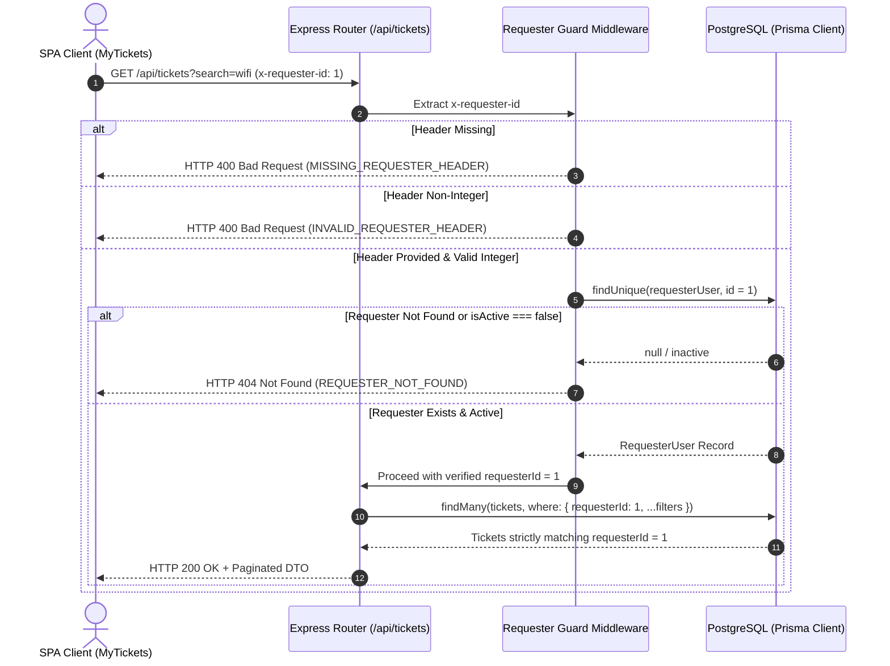

# Feature Engineering Contract: My Tickets Screen & Filtering

**Feature Identifier:** Feature 8: My Tickets Screen & Filtering (Branch: `feature/8-my-tickets`)  
**Sprint Issue:** TokTickIT Lab 2 (Sprint 2) — Issue 4: My Tickets Page & Filtering  
**Target Branch:** `feature/8-my-tickets` (Base: `lab2-staging`)  
**Specification Version:** 1.0.0  
**Status:** DRAFT PROPOSED CONTRACT (Awaiting Review)  

---

## 1. Purpose, Scope, and Exclusions

### 1.1 Purpose
This engineering contract establishes the formal specification for **Feature 8: My Tickets Screen & Filtering**. The feature delivers:
1. The **My Tickets History & Filtering** user interface adhering strictly to KMUTT's **Zen Green** visual design language (`Lab_02_labsheet.pdf` Section 7, 8.4, 8.7; `TokTickIT-System-Level-SDS-v1.0.pdf` p. 10–13; `docs/lab-02/ui-spec.md`).
2. The **Paginated Ticket Retrieval API** (`GET /api/tickets`, aliased at `GET /api/v1/tickets`) supporting keyword search, multi-field filtering, column sorting, and pagination metadata.
3. **Strict Requester Isolation (Ownership Protection)**: Backend architectural enforcement guaranteeing that a Requester can only retrieve, view, and search tickets submitted under their own `requesterId` (*BR-08*; *SDS p. 10*; *AC-04-01*).
4. **Client-Side Search Debouncing**: Smooth, responsive search input handling with client-side debouncing (300ms) to prevent excessive backend queries during active keystrokes.
5. **Multi-Criteria Filter Bar & Sorting**: Dropdown controls for Category, Requested Priority, IT Priority, and Status with a "Clear Filters" reset trigger, combined with interactive column header sorting (ASC/DESC).
6. **Responsive Layouts & Visual States**: A 9-column desktop table grid ($\ge 992\text{px}$), adaptive tablet layout (768–991px), and mobile stacked ticket cards ($< 768\text{px}$) with zero horizontal scrolling, complete with dedicated Skeleton Loading, 0-Ticket Empty State, 0-Match No-Results State, and safe API Error State.
7. **Instant Context Synchronization**: Immediate reactivity to changes in `RequesterContext` from the application shell header, instantly purging previously loaded tickets and loading the newly active requester's history.

---

### 1.2 In-Scope Capabilities
* **Backend Endpoint (`GET /api/tickets` & `GET /api/v1/tickets`):**
  * Extraction and strict validation of mandatory `x-requester-id` header.
  * SQL/Prisma query scoping strictly enforcing `WHERE requesterId = currentRequesterId`.
  * Multi-field search parameter `search`: case-insensitive partial match across `ticketNumber`, `summary`, and `description`.
  * Dedicated filter parameters: `category` (`categoryId`), `requestedPriority`, `itPriority`, and `status` (`currentStatus`).
  * Sort parameters: `sortBy` (whitelisted against `ticketNumber`, `createdAt`, `updatedAt`, `currentStatus`; default: `createdAt`) and `sortOrder` (`asc` | `desc`; default: `desc`).
  * 1-indexed pagination parameters: `page` (default: 1) and `pageSize` (default: 10; allowed: 10, 25, 50).
  * Structured pagination metadata envelope returning `totalCount` (and `totalItems`), `totalPages`, `currentPage`, and `pageSize`.
* **Frontend UI Components (`client/src/components/MyTickets.tsx`):**
  * **Search Bar:** Input field with magnifying glass icon, placeholder *"Search by ticket number or summary..."*, clear button, and 300ms debouncing.
  * **Filter Bar:** 4 dropdown selectors with default options:
    * Category: *"All Categories"* + active categories fetched from `GET /api/categories`.
    * Requested Priority: *"All Requested Priorities"* + `Low`, `Medium`, `High`, `Urgent`.
    * IT Priority: *"All IT Priorities"* + `Low`, `Medium`, `High`, `Urgent`.
    * Status: *"All Statuses"* + `New`, `Assigned`, `In Progress`, `Pending Requester`, `Resolved`, `Closed`, `Cancelled`.
    * Action button: *"Clear Filters"* (neutral secondary outline) that clears search text, resets all 4 dropdowns to "All", and resets pagination to page 1.
  * **Primary Navigation Action:** Prominent `+ Create Ticket` primary green button navigating directly to the ticket creation form.
  * **Desktop Data Grid ($\ge 992\text{px}$):** Structured table displaying 9 columns:
    1. `Ticket No` (sortable, monospace font, clickable navigation to detail)
    2. `Created Date` (sortable, formatted `YYYY-MM-DD HH:mm`)
    3. `Summary` (truncated with ellipsis if length > 45 chars on table)
    4. `Category` (category name badge)
    5. `Requested Priority` (pill badge with micro-icon and text)
    6. `IT Priority` (pill badge with micro-icon and text)
    7. `Status` (pill badge with micro-icon and text)
    8. `Ticket Owner` (staff name or *"Unassigned"*)
    9. `Last Updated` (sortable, formatted date/time)
  * **Interactive Column Sorting:** Clickable table headers for sortable fields displaying directional sort arrows ($\blacktriangle$ / $\blacktriangledown$), maintaining accessibility via `aria-sort`.
  * **Pagination Bar:** Centered or right-aligned pagination controls with "Previous", numeric page buttons with active page indicator, "Next", and an items-per-page selector (`10`, `25`, `50`).
  * **Mobile Stacked Cards ($< 768\text{px}$):** Converts tabular rows into individual clean cards displaying Ticket No, status badge, priority badge, category, summary, created date, and a "View Details" touch target, completely eliminating horizontal scrolling.
  * **System & Interaction States:**
    * *Loading State:* Shimmering skeleton rows (`.placeholder-glow`) matching column widths.
    * *Empty State (0 total tickets):* Centered illustration/card *"No Support Tickets Yet"* with *"You have not submitted any IT support tickets yet."* and `+ Create Ticket` button.
    * *No-Results State (0 filter matches):* Centered illustration/card *"No matching tickets found"* with *"No tickets match your search keyword or selected filters."* and `"Clear Filters"` button.
    * *API Error State:* Top alert banner with retry action, preserving filter selections.
  * **Instant Context Switching:** Seamlessly listening to `currentRequester` from `useRequester()`. Changing the active persona instantly updates the ticket list without full page reloads.

---

### 1.3 Explicit Exclusions (Out of Scope)
To maintain strict sprint boundaries and prevent architectural creep:
* **No Global IT Staff Triage Queue:** Requesters cannot see tickets submitted by other users under any circumstances. There is no global unassigned queue or ticket claiming view in this issue.
* **No In-Line Ticket Mutation or Status Transitions:** Requesters cannot change status (Resolve, Close, Cancel, Reopen) or edit priorities/summaries from the My Tickets list.
* **No Ticket Owner Assignment:** Tickets are created with `ticketOwner = null` (displayed as *"Unassigned"*). Assignment is an IT Staff capability reserved for subsequent labs.
* **No Collaboration / Commenting Views:** No public comments, internal notes, or audit history displays within the list view.
* **No Ticket Detail Screen Implementation in this Issue:** Clicking a ticket row or ticket number navigates or emits a callback to open the detail view; the full Ticket Detail and Attachment Management screen is bounded to Issue 5 (`feature/5-ticket-detail`).
* **No Real User Authentication or Passwords:** Operates entirely with the simulated development identity provided by `RequesterContext` via the `x-requester-id` header.

---

## 2. Strict Requester Isolation & Security Model (Ownership Protection)

### 2.1 Ownership Invariant
In accordance with **BR-08** and the System SDS Authorization Model (p. 10):
$$\forall \, t \in \text{TicketsReturned} \implies t.\text{requesterId} = \text{ActiveRequester}.\text{id}$$

A Requester user is strictly an end-user entity with zero administrative or cross-tenant query privileges. Under no scenario—regardless of query parameters, search strings, or forged client requests—shall the backend return or aggregate records belonging to any other `requesterId`.

### 2.2 Backend Validation & Header Enforcement
Every request to `GET /api/tickets` (and `GET /api/v1/tickets`) must undergo the following validation sequence prior to database query execution:



### 2.3 Database Query Construction & SQL Query Assertion
To guarantee that cross-requester data leakage is mathematically impossible at the database layer:

1. **Top-Level Conjunction Invariant:** The Prisma `where` clause MUST place `requesterId` at the root of the query filter object.
2. **Search Term Isolation:** Keyword search across `ticketNumber`, `summary`, and `description` is nested inside an `AND` conjunction with `requesterId`, preventing search `OR` clauses from bypassing requester scoping:
   ```typescript
   // Correct Isolated Query Construction:
   const whereClause: Prisma.TicketWhereInput = {
     requesterId: verifiedRequesterId, // INVARIANT: Strict root ownership filter
     ...(categoryId ? { categoryId } : {}),
     ...(requestedPriority ? { requestedPriority } : {}),
     ...(itPriority ? { itPriority } : {}),
     ...(status ? { currentStatus: status } : {}),
     ...(searchTerm ? {
       OR: [
         { ticketNumber: { contains: searchTerm, mode: "insensitive" } },
         { summary: { contains: searchTerm, mode: "insensitive" } },
         { description: { contains: searchTerm, mode: "insensitive" } },
       ],
     } : {}),
   };
   ```
3. **SQL Translation Guarantee:** The underlying SQL executed by Prisma PostgreSQL engine will always evaluate:
   ```sql
   SELECT t.* FROM tickets t
   WHERE t.requester_id = $1
     AND (t.category_id = $2 OR $2 IS NULL)
     AND (t.requested_priority = $3 OR $3 IS NULL)
     AND (t.it_priority = $4 OR $4 IS NULL)
     AND (t.current_status = $5 OR $5 IS NULL)
     AND (
       t.ticket_number ILIKE $6
       OR t.summary ILIKE $6
       OR t.description ILIKE $6
     )
   ORDER BY ...
   LIMIT $7 OFFSET $8;
   ```
4. **SQL Query Assertion for Automated STS:** Automated integration tests (`my-tickets.api.test.ts`) must execute explicit assertions verifying that when Requester A queries tickets with filters matching a ticket owned by Requester B, the returned ticket array is strictly empty (`[]`) and `totalCount === 0`.

---

## 3. Backend API Contract (`GET /api/tickets`)

### 3.1 Route Definition & Protocols
* **Path:** `GET /api/tickets`
* **Path Alias:** `GET /api/v1/tickets`
* **Content-Type:** `application/json`
* **Required Header:**
  ```http
  x-requester-id: <integer>
  ```

---

### 3.2 Query Parameters Specification

| Parameter Name | Data Type | Default | Allowed Values / Constraints | Description |
| :--- | :--- | :--- | :--- | :--- |
| `search` | `string` | *(empty)* | Min length: 1, Max length: 100 | Case-insensitive keyword matching `ticketNumber`, `summary`, or `description`. Leading/trailing whitespace trimmed. |
| `category` | `integer` | *(all)* | Valid `Category.id` integer | Exact match on `categoryId`. Non-numeric values produce HTTP 400. |
| `requestedPriority` | `string` | *(all)* | `Low`, `Medium`, `High`, `Urgent` | Exact match on `requestedPriority`. Case-insensitive normalized. |
| `itPriority` | `string` | *(all)* | `Low`, `Medium`, `High`, `Urgent` | Exact match on `itPriority`. Case-insensitive normalized. |
| `status` | `string` | *(all)* | `New`, `Assigned`, `In Progress`, `Pending Requester`, `Resolved`, `Closed`, `Cancelled` | Exact match on `currentStatus`. |
| `sortBy` | `string` | `createdAt` | Whitelist: `ticketNumber`, `createdAt`, `updatedAt`, `currentStatus` | Field to sort results by. Values outside whitelist produce HTTP 400. |
| `sortOrder` | `string` | `desc` | `asc`, `desc` | Sort direction. Case-insensitive normalized; defaults to `desc`. |
| `page` | `integer` | `1` | $\ge 1$ | 1-indexed page number. Non-integers or values $< 1$ default to 1. |
| `pageSize` | `integer` | `10` | Whitelist: `10`, `25`, `50` | Number of items per page. Values outside whitelist default to 10. |

---

### 3.3 Pagination Mathematics & Edge Handling
Given:
* $N = \text{totalCount}$ (total matching tickets in DB for active requester)
* $S = \text{pageSize}$ (selected page size: 10, 25, or 50)
* $P = \text{page}$ (requested page number, $\ge 1$)

The backend calculates:
1. **Total Pages:**
   $$\text{totalPages} = \begin{cases} 1 & \text{if } N = 0 \\ \lceil N / S \rceil & \text{if } N > 0 \end{cases}$$
2. **Database Offset:**
   $$\text{offset} = (P - 1) \times S$$
3. **Out-of-Bounds Page Request:**
   * If a client requests $P > \text{totalPages}$ when $N > 0$, the API returns HTTP 200 with `data: []` (empty array) and accurate metadata (`currentPage: P, totalPages, totalCount: N`). It does NOT throw an error.
   * If $N = 0$, the API returns `data: []`, `totalCount: 0`, `totalPages: 1`, `currentPage: 1`.

---

### 3.4 Response Schemas

#### Success Response (`HTTP 200 OK`)
```json
{
  "success": true,
  "data": [
    {
      "id": 1,
      "ticketNumber": "TKT-2026-00001",
      "summary": "Laptop battery drains quickly",
      "description": "My laptop battery is draining much faster than usual even when idle.",
      "categoryId": 2,
      "categoryName": "Hardware",
      "relatedSystemId": 7,
      "relatedSystemName": "Corporate Laptop",
      "requestedPriority": "Medium",
      "itPriority": "Medium",
      "currentStatus": "New",
      "ticketOwner": null,
      "createdAt": "2026-09-03T11:00:00.000Z",
      "updatedAt": "2026-09-03T11:00:00.000Z"
    }
  ],
  "pagination": {
    "totalCount": 1,
    "totalItems": 1,
    "totalPages": 1,
    "currentPage": 1,
    "pageSize": 10
  }
}
```

#### Error Response: Missing Header (`HTTP 400 Bad Request`)
```json
{
  "success": false,
  "error": {
    "code": "MISSING_REQUESTER_HEADER",
    "message": "The 'x-requester-id' header is required to identify the submitting requester.",
    "details": []
  }
}
```

#### Error Response: Invalid Query Parameter (`HTTP 400 Bad Request`)
```json
{
  "success": false,
  "error": {
    "code": "INVALID_QUERY_PARAMETER",
    "message": "Invalid query parameters supplied.",
    "details": [
      {
        "field": "sortBy",
        "message": "Invalid sortBy field 'password'. Allowed fields: ticketNumber, createdAt, updatedAt, currentStatus."
      }
    ]
  }
}
```

#### Error Response: Inactive or Non-Existent Requester (`HTTP 404 Not Found`)
```json
{
  "success": false,
  "error": {
    "code": "REQUESTER_NOT_FOUND",
    "message": "Requester not found or is inactive.",
    "details": []
  }
}
```

---

## 4. Frontend Filter, Search, and Sort Controls

### 4.1 Layout & Visual Hierarchy in "Zen Green" Design Language
The My Tickets view is housed inside a centered desktop container (`max-width: 1200px`, `container-xl`), inheriting tokens from `client/src/index.css`:
* **Header / Filter Bar:** Clean white card (`background-color: var(--color-surface-card); box-shadow: var(--shadow-card); border-radius: 8px; padding: 1.25rem; margin-bottom: 1.5rem;`).
* **Table Card Surface:** White card housing the table, headers with soft borders (`border-bottom: 2px solid var(--color-pale-green)`), and row hover styling (`background-color: #F4FAF6`).
* **Action Accents:**
  * Primary Green (`#006B3C`): `+ Create Ticket` button, active page pagination item, focused column header.
  * Secondary Green (`#0B7A46`): Filter selector focus rings, active links.
  * Neutral Outline (`border: 1px solid #D1D5DB`): `Clear Filters` button, page buttons.

```
+---------------------------------------------------------------------------------------------------------+
|  My Tickets                                                                          [ + Create Ticket ]|
|  Track, search, and manage your submitted IT service desk requests.                                     |
+---------------------------------------------------------------------------------------------------------+
| [Search...]                                                                                             |
| [ Category: All v ]  [ Req Priority: All v ]  [ IT Priority: All v ]  [ Status: All v ] [ Clear Filters]|
+---------------------------------------------------------------------------------------------------------+
| Ticket No ^ | Created Date v | Summary          | Category | Req Prio | IT Prio | Status | Last Updated |
|-------------+----------------+------------------+----------+----------+---------+--------+--------------|
| TKT-2026... | 2026-09-03     | Laptop battery...| Hardware | [Medium] | [Medium]| [New]  | 2026-09-03   |
| TKT-2026... | 2026-09-02     | Wi-Fi login fail | Network  | [High]   | [High]  | [New]  | 2026-09-02   |
+---------------------------------------------------------------------------------------------------------+
| Showing 1 - 2 of 2 tickets                                     [ < Prev ] [ 1 ] [ Next > ] [ 10 / page v]|
+---------------------------------------------------------------------------------------------------------+
```

---

### 4.2 Search Input with Client-Side Debouncing
* **Input Specifications:** Standard height `38px`, `border-radius: 6px`, magnifying glass leading icon.
* **Debounce Implementation Rule:**
  * The search input maintains a local immediate state (`searchTerm`) for zero-latency keystroke rendering.
  * A `useDebounce` hook (or debounced `useEffect` timer) delays updating the active query state (`debouncedSearch`) by exactly **300ms**.
  * Any subsequent keystroke within 300ms clears the pending timer and restarts it.
  * When `debouncedSearch` changes, the active page resets to `1` and the API request is triggered.
  * An inline "✕" button allows users to immediately clear the search text without waiting for backspaces.

---

### 4.3 Multi-Criteria Filter Bar Controls
The filter bar arranges 4 dropdown selectors and 1 reset action:
1. **Category Dropdown (`category`):**
   * Loaded dynamically from `GET /api/categories`.
   * Options: `<option value="">All Categories</option>` followed by active categories (e.g. `Account and Access`, `Hardware`, `Software`, `Network`).
2. **Requested Priority Dropdown (`requestedPriority`):**
   * Options: `<option value="">All Requested Priorities</option>`, `Low`, `Medium`, `High`, `Urgent`.
3. **IT Priority Dropdown (`itPriority`):**
   * Options: `<option value="">All IT Priorities</option>`, `Low`, `Medium`, `High`, `Urgent`.
4. **Status Dropdown (`status`):**
   * Options: `<option value="">All Statuses</option>`, `New`, `Assigned`, `In Progress`, `Pending Requester`, `Resolved`, `Closed`, `Cancelled`.
5. **"Clear Filters" Action Button:**
   * Styled with secondary neutral outline (`btn btn-outline-secondary`).
   * Clicking resets:
     * `searchTerm` $\rightarrow$ `""`
     * `categoryId` $\rightarrow$ `""`
     * `requestedPriority` $\rightarrow$ `""`
     * `itPriority` $\rightarrow$ `""`
     * `status` $\rightarrow$ `""`
     * `page` $\rightarrow$ `1`
   * Triggering "Clear Filters" immediately re-fetches tickets using default unfiltered criteria.

---

### 4.4 Interactive Column Header Sorting
* **Sortable Columns:** `Ticket No` (`ticketNumber`), `Created Date` (`createdAt`), `Status` (`currentStatus`), and `Last Updated` (`updatedAt`).
* **Header Interaction:**
  * Clicking an inactive column sets `sortBy = <column>` and `sortOrder = "desc"` (or `"asc"` for `ticketNumber`).
  * Clicking the currently active sort column toggles `sortOrder` between `"asc"` and `"desc"`.
  * Visual indicators display adjacent to the column label:
    * Ascending: $\blacktriangle$ (or Chevron Up icon) in `var(--color-primary-green)`.
    * Descending: $\blacktriangledown$ (or Chevron Down icon) in `var(--color-primary-green)`.
    * Inactive sortable columns: $\updownarrow$ (neutral muted dual arrow).
* **Accessibility:** Headers include `role="columnheader"`, `aria-sort="ascending" | "descending" | "none"`, and are navigable via `tabIndex={0}` with `Enter` / `Space` activation.

---

### 4.5 Accessible Pagination Controls
* **Pagination Bar Placement:** Positioned immediately below the ticket table/cards.
* **Metadata Display:** Left side displays: *"Showing X to Y of Z tickets"*.
* **Control Triggers:**
  * **[ < Previous ]**: Disabled when `currentPage === 1`.
  * **Numeric Page Buttons**: Display page numbers (e.g. `1`, `2`, `3`). Active page has solid primary green background (`#006B3C`) with white text.
  * **[ Next > ]**: Disabled when `currentPage === totalPages` or `totalCount === 0`.
  * **Page Size Dropdown**: Allows toggling between `10`, `25`, and `50` items per page. Changing page size resets `currentPage = 1`.

---

## 5. Responsive Presentation & System Component States

### 5.1 Desktop Layout ($\ge 992\text{px}$)
* Wrapped in `.table-responsive` with class `d-none d-md-block`.
* Displays full 9-column grid:
  1. **Ticket No:** Monospace badge (e.g., `TKT-2026-00001`), primary link styling with underline on hover.
  2. **Created Date:** Formatted date string (e.g., `2026-09-03 11:00`).
  3. **Summary:** Maximum 45 characters with ellipsis (`text-truncate`).
  4. **Category:** Styled category badge.
  5. **Requested Priority:** Pill badge pairing color + text + micro-icon (DEC-UI-19).
  6. **IT Priority:** Pill badge pairing color + text + micro-icon (DEC-UI-19).
  7. **Status:** Zen Green compliant status badge (e.g., `New` is soft blue with clock icon).
  8. **Ticket Owner:** Muted text showing staff assignee or *"Unassigned"*.
  9. **Last Updated:** Relative or formatted timestamp.
* Row hover applies pale green highlight (`#F4FAF6`) and `cursor: pointer`. Clicking the row navigates to ticket details.

---

### 5.2 Mobile Stacked Card Design ($< 768\text{px}$)
* Desktop table is hidden (`d-none d-md-table` or CSS media query); mobile card container is rendered (`d-block d-md-none`) (**DEC-UI-11**).
* Each ticket renders as a stacked card (`card shadow-sm border-0 mb-3 p-3`):
  * **Card Header:** Flex container with `Ticket No` (bold, green text) on the left, and `Status Badge` on the right.
  * **Card Body:**
    * Summary displayed in bold font (`font-weight: 600; color: var(--color-text-primary)`).
    * Metadata row: Category chip, Requested Priority badge, and IT Priority badge.
    * Date row: *"Created: 2026-09-03"* and *"Updated: 2026-09-03"*.
  * **Card Footer:** Full-width touch-friendly button/link: *"View Details →"*.
* Zero horizontal overflow: All flex rows wrap gracefully on 320px viewport widths.

---

### 5.3 Empty State vs. No-Results State
To ensure clear, unambiguous user feedback (**DEC-UI-16**):

```
+---------------------------------------------------+  +---------------------------------------------------+
|               [ Empty Inbox Icon ]                |  |               [ Filter Search Icon ]              |
|                                                   |  |                                                   |
|             No Support Tickets Yet                |  |             No Matching Tickets Found             |
|   You have not submitted any IT support tickets   |  |   No tickets match your search keyword or active  |
|   yet. Need help with hardware, software, or      |  |   filters. Try adjusting your search term or      |
|   network access?                                 |  |   clearing your filters.                          |
|                                                   |  |                                                   |
|             [ + Create Ticket ]                   |  |                 [ Clear Filters ]                 |
+---------------------------------------------------+  +---------------------------------------------------+
             (Empty State: 0 Total Tickets)                     (No-Results State: Active Filter Yields 0)
```

1. **Empty State:**
   * Condition: Requester has **0 total tickets** in the system ($N = 0$) and no filters/search are applied.
   * Icon: Inbox SVG icon in pale green circle.
   * Title: *"No Support Tickets Yet"*.
   * Description: *"You have not submitted any IT support tickets yet. Need help with hardware, software, or network access?"*
   * CTA: Primary green `+ Create Ticket` button navigating to `CreateTicket`.
2. **No-Results State:**
   * Condition: Total tickets exist ($N_{\text{total}} > 0$), but current search or filter combination matches 0 tickets ($N_{\text{filtered}} = 0$).
   * Icon: Magnifying glass / filter funnel SVG icon.
   * Title: *"No matching tickets found"*.
   * Description: *"No tickets match your search keyword or selected filters."*
   * CTA: Neutral outline `Clear Filters` button that resets all filters and reloads tickets.

---

### 5.4 Instant Context Synchronization (Requester Switching)
* `MyTickets` consumes `currentRequester` from `useRequester()`.
* When the user clicks "Change Requester" in the app header and selects another persona:
  1. `currentRequester` changes in React Context.
  2. An internal `useEffect` listening to `currentRequester?.id` triggers:
     * Resets `page` to `1`.
     * Resets `searchTerm` to `""`.
     * Resets filter dropdowns to defaults.
     * Fires `GET /api/tickets` with the new requester's `id` in `x-requester-id`.
  3. All data previously displayed from the prior requester is immediately cleared from the DOM, eliminating any risk of cross-requester data leakage during context transitions.

---

## 6. Software Test Specification (STS) & Acceptance Traceability

### 6.1 Acceptance Criteria Traceability Matrix

| Acceptance Criterion | Requirement Ref | Test Description | Automated Test File Path | Test Type |
| :--- | :--- | :--- | :--- | :--- |
| **AC-04-01** | FR-06, BR-08 | **Requester Ownership Scoping:** Queries with `x-requester-id: 1` return only Requester 1's tickets; Requester 2 tickets are strictly omitted. | `server/tests/lab-02/my-tickets.api.test.ts` | Supertest / API |
| **AC-04-02** | FR-02, AC-06 | **Context Switch Isolation:** Switching requester context in the header reloads data and displays only the new requester's tickets. | `client/tests/lab-02/MyTickets.test.tsx` | Vitest / RTL |
| **AC-04-03** | FR-07, FR-08 | **Search & Filter Querying:** Applying keyword search or category/priority/status filters narrows results accurately with updated pagination math. | `server/tests/lab-02/my-tickets.api.test.ts` | Supertest / API |
| **AC-04-04** | AC-10, DEC-UI-16 | **Empty vs No-Results States:** Displays 0-ticket card when user has no tickets; displays 0-match card with "Clear Filters" when filters match nothing. | `client/tests/lab-02/MyTickets.test.tsx` | Vitest / RTL |
| **AC-04-05** | DEC-UI-19 | **Accessible Badges & Sort:** Status and priority badges render text and micro-icons; table headers allow toggling sort direction. | `client/tests/lab-02/MyTickets.test.tsx` | Vitest / RTL |

---

### 6.2 Backend API Integration Test Suite (`server/tests/lab-02/my-tickets.api.test.ts`)
The test file must contain these explicit test cases:

```typescript
import { describe, it, expect, beforeAll } from "vitest";
import request from "supertest";
import app from "../../src/app.js";
import { getPrisma } from "../../src/prisma.js";
import { seed } from "../../prisma/seed.js";

const prisma = getPrisma();

describe("API: GET /api/tickets (Feature 8 My Tickets - AC-04-01, AC-04-03)", () => {
  beforeAll(async () => {
    await seed(prisma);
    // Seed isolated test tickets for Requester 1 and Requester 2
    // Requester 1: 3 tickets (e.g. Wi-Fi issue, VPN issue, Hardware issue)
    // Requester 2: 2 tickets (e.g. Printer issue, Email issue)
  });

  describe("Strict Requester Isolation & Security", () => {
    it("returns HTTP 200 with only tickets belonging to the active requester (AC-04-01)", async () => {
      const res = await request(app)
        .get("/api/tickets")
        .set("x-requester-id", "1");

      expect(res.status).toBe(200);
      expect(res.body.success).toBe(true);
      expect(res.body.data.length).toBeGreaterThan(0);
      res.body.data.forEach((ticket: any) => {
        expect(ticket.requesterId).toBe(1);
      });
    });

    it("returns HTTP 400 when x-requester-id header is missing", async () => {
      const res = await request(app).get("/api/tickets");
      expect(res.status).toBe(400);
      expect(res.body.success).toBe(false);
      expect(res.body.error.code).toBe("MISSING_REQUESTER_HEADER");
    });

    it("asserts SQL query isolation: searching for another requester's ticket number yields zero results", async () => {
      // Requester 2 owns a ticket with number 'TKT-2026-00099'
      // Requester 1 queries specifically for 'TKT-2026-00099'
      const res = await request(app)
        .get("/api/tickets?search=TKT-2026-00099")
        .set("x-requester-id", "1");

      expect(res.status).toBe(200);
      expect(res.body.data).toEqual([]);
      expect(res.body.pagination.totalCount).toBe(0);
    });
  });

  describe("Filtering, Search & Sorting Query Capabilities (AC-04-03)", () => {
    it("filters tickets by category ID", async () => {
      const res = await request(app)
        .get("/api/tickets?category=1")
        .set("x-requester-id", "1");

      expect(res.status).toBe(200);
      res.body.data.forEach((ticket: any) => {
        expect(ticket.categoryId).toBe(1);
      });
    });

    it("filters tickets by status", async () => {
      const res = await request(app)
        .get("/api/tickets?status=New")
        .set("x-requester-id", "1");

      expect(res.status).toBe(200);
      res.body.data.forEach((ticket: any) => {
        expect(ticket.currentStatus).toBe("New");
      });
    });

    it("searches across summary and description case-insensitively", async () => {
      const res = await request(app)
        .get("/api/tickets?search=wifi")
        .set("x-requester-id", "1");

      expect(res.status).toBe(200);
      res.body.data.forEach((ticket: any) => {
        const matches =
          ticket.ticketNumber.toLowerCase().includes("wifi") ||
          ticket.summary.toLowerCase().includes("wifi") ||
          ticket.description.toLowerCase().includes("wifi");
        expect(matches).toBe(true);
      });
    });

    it("sorts tickets by createdAt ascending and descending", async () => {
      const resDesc = await request(app)
        .get("/api/tickets?sortBy=createdAt&sortOrder=desc")
        .set("x-requester-id", "1");
      const resAsc = await request(app)
        .get("/api/tickets?sortBy=createdAt&sortOrder=asc")
        .set("x-requester-id", "1");

      expect(resDesc.status).toBe(200);
      expect(resAsc.status).toBe(200);
      if (resDesc.body.data.length >= 2) {
        const firstDesc = new Date(resDesc.body.data[0].createdAt).getTime();
        const secondDesc = new Date(resDesc.body.data[1].createdAt).getTime();
        expect(firstDesc).toBeGreaterThanOrEqual(secondDesc);
      }
    });

    it("rejects non-whitelisted sortBy field with HTTP 400", async () => {
      const res = await request(app)
        .get("/api/tickets?sortBy=invalidField")
        .set("x-requester-id", "1");

      expect(res.status).toBe(400);
      expect(res.body.error.code).toBe("INVALID_QUERY_PARAMETER");
    });
  });

  describe("Pagination Math & Out-of-Bounds Handling", () => {
    it("returns correct page size and pagination metadata", async () => {
      const res = await request(app)
        .get("/api/tickets?page=1&pageSize=10")
        .set("x-requester-id", "1");

      expect(res.status).toBe(200);
      expect(res.body.pagination.currentPage).toBe(1);
      expect(res.body.pagination.pageSize).toBe(10);
      expect(res.body.pagination).toHaveProperty("totalCount");
      expect(res.body.pagination).toHaveProperty("totalPages");
    });

    it("handles out-of-bounds page requests gracefully by returning empty data", async () => {
      const res = await request(app)
        .get("/api/tickets?page=999&pageSize=10")
        .set("x-requester-id", "1");

      expect(res.status).toBe(200);
      expect(res.body.data).toEqual([]);
      expect(res.body.pagination.currentPage).toBe(999);
    });
  });
});
```

---

### 6.3 Frontend Component Test Suite (`client/tests/lab-02/MyTickets.test.tsx`)
The test file must contain these explicit test cases:

```typescript
import { describe, it, expect, vi, beforeEach } from "vitest";
import { render, screen, fireEvent, waitFor } from "@testing-library/react";
import userEvent from "@testing-library/user-event";
import { MyTickets } from "../../src/components/MyTickets.js";
import { RequesterContext } from "../../src/context/RequesterContext.js";

const mockRequester1 = {
  id: 1,
  name: "Jennifer Anderson",
  email: "jennifer.anderson@kmutt.ac.th",
  department: "Computer Engineering",
  isActive: true,
};

const mockRequester2 = {
  id: 2,
  name: "Michael Brown",
  email: "michael.brown@kmutt.ac.th",
  department: "Information Technology",
  isActive: true,
};

const mockTickets = [
  {
    id: 1,
    ticketNumber: "TKT-2026-00001",
    summary: "Laptop battery drains quickly",
    description: "Detailed description of battery problem",
    categoryId: 2,
    categoryName: "Hardware",
    requestedPriority: "Medium",
    itPriority: "Medium",
    currentStatus: "New",
    ticketOwner: null,
    createdAt: "2026-09-03T11:00:00.000Z",
    updatedAt: "2026-09-03T11:00:00.000Z",
  },
  {
    id: 2,
    ticketNumber: "TKT-2026-00002",
    summary: "Wi-Fi connection drops in Library",
    description: "Wi-Fi disconnecting every 10 minutes",
    categoryId: 4,
    categoryName: "Network",
    requestedPriority: "High",
    itPriority: "High",
    currentStatus: "In Progress",
    ticketOwner: "Sompong IT",
    createdAt: "2026-09-04T09:00:00.000Z",
    updatedAt: "2026-09-04T10:00:00.000Z",
  },
];

function renderMyTickets(requester = mockRequester1, onSelectTicket = vi.fn(), onCreateTicket = vi.fn()) {
  return render(
    <RequesterContext.Provider
      value={{
        currentRequester: requester,
        setCurrentRequester: vi.fn(),
        requesters: [mockRequester1, mockRequester2],
        isLoading: false,
        isSwitchModalOpen: false,
        openSwitchModal: vi.fn(),
        closeSwitchModal: vi.fn(),
        logout: vi.fn(),
      }}
    >
      <MyTickets onSelectTicket={onSelectTicket} onCreateTicket={onCreateTicket} />
    </RequesterContext.Provider>
  );
}

describe("Component: MyTickets (Feature 8)", () => {
  beforeEach(() => {
    vi.clearAllMocks();
  });

  it("renders the 9-column desktop table with ticket data (AC-04-01)", async () => {
    vi.spyOn(global, "fetch").mockResolvedValueOnce({
      ok: true,
      json: async () => ({
        success: true,
        data: mockTickets,
        pagination: { totalCount: 2, totalPages: 1, currentPage: 1, pageSize: 10 },
      }),
    } as any);

    renderMyTickets();

    await waitFor(() => {
      expect(screen.getByText("TKT-2026-00001")).toBeInTheDocument();
      expect(screen.getByText("Laptop battery drains quickly")).toBeInTheDocument();
      expect(screen.getByText("TKT-2026-00002")).toBeInTheDocument();
      expect(screen.getByText("Wi-Fi connection drops in Library")).toBeInTheDocument();
    });
  });

  it("debounces keyword search before calling API", async () => {
    const fetchSpy = vi.spyOn(global, "fetch").mockResolvedValue({
      ok: true,
      json: async () => ({
        success: true,
        data: [],
        pagination: { totalCount: 0, totalPages: 1, currentPage: 1, pageSize: 10 },
      }),
    } as any);

    renderMyTickets();

    const searchInput = screen.getByPlaceholderText(/search by ticket number or summary/i);
    await userEvent.type(searchInput, "battery");

    // Immediately after typing, fetch should not have fired for every single char
    expect(fetchSpy).toHaveBeenCalledTimes(1); // initial mount load

    // After debounce interval (300ms+), fetch is called with search query
    await waitFor(
      () => {
        expect(fetchSpy).toHaveBeenCalledWith(expect.stringContaining("search=battery"), expect.anything());
      },
      { timeout: 1000 }
    );
  });

  it("resets search and filters when 'Clear Filters' button is clicked (AC-04-03)", async () => {
    vi.spyOn(global, "fetch").mockResolvedValue({
      ok: true,
      json: async () => ({
        success: true,
        data: mockTickets,
        pagination: { totalCount: 2, totalPages: 1, currentPage: 1, pageSize: 10 },
      }),
    } as any);

    renderMyTickets();

    const clearBtn = screen.getByRole("button", { name: /clear filters/i });
    fireEvent.click(clearBtn);

    await waitFor(() => {
      const searchInput = screen.getByPlaceholderText(/search by ticket number or summary/i) as HTMLInputElement;
      expect(searchInput.value).toBe("");
    });
  });

  it("renders Empty State when user has 0 total tickets (AC-04-04)", async () => {
    vi.spyOn(global, "fetch").mockResolvedValueOnce({
      ok: true,
      json: async () => ({
        success: true,
        data: [],
        pagination: { totalCount: 0, totalPages: 1, currentPage: 1, pageSize: 10 },
      }),
    } as any);

    renderMyTickets();

    await waitFor(() => {
      expect(screen.getByText(/no support tickets yet/i)).toBeInTheDocument();
      expect(screen.getByRole("button", { name: /\+ create ticket/i })).toBeInTheDocument();
    });
  });

  it("renders No-Results State when filters match 0 tickets (AC-04-04)", async () => {
    // Return empty results when a filter was applied
    vi.spyOn(global, "fetch").mockResolvedValueOnce({
      ok: true,
      json: async () => ({
        success: true,
        data: [],
        pagination: { totalCount: 0, totalPages: 1, currentPage: 1, pageSize: 10 },
      }),
    } as any);

    renderMyTickets();

    // Apply a search term
    const searchInput = screen.getByPlaceholderText(/search by ticket number or summary/i);
    fireEvent.change(searchInput, { target: { value: "nonexistent query" } });

    await waitFor(() => {
      expect(screen.getByText(/no matching tickets found/i)).toBeInTheDocument();
      expect(screen.getByRole("button", { name: /clear filters/i })).toBeInTheDocument();
    });
  });

  it("updates instantly and re-fetches when requester context switches (AC-04-02)", async () => {
    const fetchSpy = vi.spyOn(global, "fetch").mockResolvedValue({
      ok: true,
      json: async () => ({
        success: true,
        data: [],
        pagination: { totalCount: 0, totalPages: 1, currentPage: 1, pageSize: 10 },
      }),
    } as any);

    const { rerender } = renderMyTickets(mockRequester1);

    await waitFor(() => {
      expect(fetchSpy).toHaveBeenCalledWith(
        expect.anything(),
        expect.objectContaining({
          headers: expect.objectContaining({ "x-requester-id": "1" }),
        })
      );
    });

    // Re-render with Requester 2 context
    rerender(
      <RequesterContext.Provider
        value={{
          currentRequester: mockRequester2,
          setCurrentRequester: vi.fn(),
          requesters: [mockRequester1, mockRequester2],
          isLoading: false,
          isSwitchModalOpen: false,
          openSwitchModal: vi.fn(),
          closeSwitchModal: vi.fn(),
          logout: vi.fn(),
        }}
      >
        <MyTickets onSelectTicket={vi.fn()} onCreateTicket={vi.fn()} />
      </RequesterContext.Provider>
    );

    await waitFor(() => {
      expect(fetchSpy).toHaveBeenCalledWith(
        expect.anything(),
        expect.objectContaining({
          headers: expect.objectContaining({ "x-requester-id": "2" }),
        })
      );
    });
  });
});
```

---

## 7. Definition of Ready (DoR) & Definition of Done (DoD) Checklist

### 7.1 Definition of Ready (DoR)
- [x] Scope strictly bounded to My Tickets listing, search, filtering, sorting, pagination, and requester isolation.
- [x] All status change mutations, IT staff queues, commenting tabs, and ticket detail editing explicitly excluded.
- [x] Requester isolation invariant ($\text{requesterId} = \text{activeRequesterId}$) mathematically specified.
- [x] `GET /api/tickets` and `/api/v1/tickets` query parameters, defaults, and response envelopes fully defined.
- [x] Zen Green design tokens, desktop table geometry, and mobile stacked card layouts specified.
- [x] Empty state (0 total tickets) vs. No-Results state (0 filter matches) visual distinctions defined.
- [x] Client-side search debouncing (300ms) specified.
- [x] Software Test Specification (STS) complete with explicit API and component test cases.
- [x] Zero application source code written before contract approval.

### 7.2 Definition of Done (DoD)
- [ ] Backend route `GET /api/tickets` implemented with strict `requesterId` isolation, search, filtering, sorting, and pagination.
- [ ] Backend route aliased at `GET /api/v1/tickets` for API version compatibility.
- [ ] Frontend `MyTickets` component constructed with Zen Green styling, debounced search, 4 filter dropdowns, Clear Filters button, and sorting headers.
- [ ] Desktop table ($\ge 992\text{px}$) and responsive mobile stacked cards ($< 768\text{px}$) verified with zero horizontal overflow.
- [ ] Empty state and No-Results state rendered correctly based on ticket counts and filter activity.
- [ ] Changing active requester in the header instantly refreshes ticket list with no residual data.
- [ ] `server/tests/lab-02/my-tickets.api.test.ts` passes 100% with zero skipped or flaky tests.
- [ ] `client/tests/lab-02/MyTickets.test.tsx` passes 100% with zero skipped or flaky tests.
- [ ] Git commit and branch `feature/8-my-tickets` created according to repository workflow conventions.

---

## 8. Peer Review & Acceptance Record

| Role | Name | Status | Timestamp / Notes |
| :--- | :--- | :--- | :--- |
| **Author (AI Developer)** | Antigravity AI Agent | Proposed | 2026-09-06 |
| **Peer Reviewer / Student** | *(Pending Human Review)* | Awaiting Review | Pending approval before coding |
