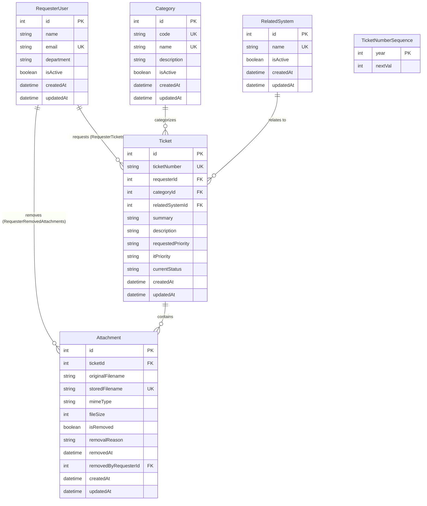

# Feature Engineering Contract: Development Requester Context & Database Foundation

**Feature Identifier:** Feature 2 (`feature/6-data-and-requester`)  
**Sprint / Milestone:** TokTickIT Lab 2 (Sprint 2) — Requester MVP  
**Target Branch:** `feature/6-data-and-requester` (Base: `lab2-staging`)  
**Specification Version:** 1.1.0  
**Status:** APPROVED ENGINEERING CONTRACT  

---

## 1. Purpose, Scope, and Exclusions

### 1.1 Purpose
This engineering contract governs the implementation of **Feature 2: Development Requester Context & Database Foundation**. The feature delivers:
1. The authoritative **PostgreSQL relational database schema** using Prisma ORM for the TokTickIT core domain models (`RequesterUser`, `RelatedSystem`, `Category`, `Ticket`, `Attachment`, and `TicketNumberSequence`).
2. An **idempotent database seeding script** (`server/prisma/seed.ts`) that populates required reference catalogs and development user identities safely without duplicate key violations or PostgreSQL sequence desynchronization.
3. Three unauthenticated **REST reference data endpoints** (`GET /api/requesters`, `GET /api/related-systems`, and `GET /api/categories`) enabling the client SPA to retrieve required master records.
4. The **Development Requester Context Selector** component, global state provider (`RequesterContext`), and application header integration adhering strictly to KMUTT's **Zen Green** visual design standard and `Lab_02_labsheet.pdf` (Section 8.1, Figure on p. 9).

This feature establishes the baseline identity context for all subsequent Lab 2 requester operations (Ticket Creation, My Tickets listing, and Attachment management).

### 1.2 In-Scope Capabilities
* **Prisma Schema Definition:** Defining structural fields, data types, constraints, defaults, and foreign-key relations for `RequesterUser`, `RelatedSystem`, `Category`, `Ticket`, `Attachment`, and `TicketNumberSequence` in `server/prisma/schema.prisma`.
* **Idempotent Seeding Pipeline:** Safe, repeatable upsert logic seeding 4 Categories, 7 Related Systems, 4 Active Development Requesters, and 1 Inactive Development Requester, exporting a programmatic `seed(prisma)` function and performing PostgreSQL autoincrement sequence synchronization.
* **Reference Data APIs:**
  * `GET /api/requesters` (queries PostgreSQL, strictly filters `where: { isActive: true }`, orders by name). Alias `/api/development-requesters` maintained for full spec compatibility.
  * `GET /api/related-systems` (queries active systems, returns id, name, isActive, timestamps).
  * `GET /api/categories` (queries active categories, returns id, code, name, description, isActive, timestamps).
* **Simulated Login Context Selector:**
  * Modal/screen dropdown populated with active requesters fetched from `/api/requesters`.
  * **Dual Modal Modes:**
    * *Mandatory First-Time Mode (no user active):* Blocking unclosable overlay, Cancel button hidden, Continue button enabled upon selecting an active persona.
    * *Context-Switch Mode (active user exists):* Shows both `[ Cancel ]` and `[ Continue ]`. Clicking `Cancel` aborts switching and preserves the active user.
  * Informational notice banner explicitly stating this is a simulated development selector for Lab 2 grading.
  * Loading spinner, empty user selection fallback, and API failure error boundary.
* **Global Context State (`RequesterContext`):**
  * React Context storing `currentRequester`.
  * `sessionStorage` synchronization (`toktickit_active_requester`) to preserve active identity on page reload (`F5`).
  * Stale identity validation: Automatically purges `sessionStorage` and prompts the selector if the stored user is absent or inactive in the database.
  * Application header persona pill displaying the active user's identity.
  * Non-destructive "Change Requester" escape action that opens the selector dialog without prematurely invalidating active session state.
* **Automated Verification:** Complete API integration tests (`server/tests/lab-02/requesters.api.test.ts`) and React component tests (`client/tests/lab-02/RequesterSelector.test.tsx`) verifying filtering, context state, sequence safety, and modal lifecycle.

### 1.3 Explicit Exclusions (Out of Scope)
To prevent assumptions or premature architecture creep, the following capabilities are **strictly excluded** from this feature:
* **No Passwords or Password Hashing:** No plaintext passwords, Argon2id, bcrypt, PBKDF2, or password validation fields.
* **No Authentication Tokens or JWT:** No JSON Web Tokens, Bearer auth headers, token signing keys, or token verification middleware.
* **No Server-Side Sessions or Cookies:** No session tables (`Session` model), Redis session store, Express session cookies, or CSRF cookie tokens (deferred to Sprint 3 per approved baseline D-04/D-05).
* **No Role-Based Access Control (RBAC):** No IT Staff, Administrator, or Agent role routing or permissions. All simulated users in this issue operate purely in the Requester persona.
* **No User Registration or Profile Management:** No sign-up forms, profile editing, email verification, or administrative user CRUD.
* **No Ticket or Attachment Mutation APIs:** No `POST /api/tickets`, `GET /api/tickets`, or attachment upload/delete endpoints (deferred to subsequent issues `feature/3-create-ticket`, `feature/4-my-tickets`, and `feature/5-ticket-detail`).

---

## 2. Data Model Design (Prisma)

The persistence layer is implemented in PostgreSQL via Prisma ORM (`server/prisma/schema.prisma`). All primary entities utilize explicit integer primary keys (`autoincrement()`), UTC timestamps, referential integrity constraints, and camelCase database column conventions aligned with the peer reviewer and course standard.



### 2.1 Priority & Status Standards

To ensure database schema interoperability across peer reviewer workstations without custom PostgreSQL enum dependencies, ticket priorities and lifecycle statuses are stored as `String` columns in PostgreSQL, with values validated by domain services:

* **`requestedPriority` & `itPriority` Values:** `"Low"`, `"Medium"`, `"High"`, `"Urgent"` (default: `"Medium"`).
* **`currentStatus` Values:** `"New"`, `"Assigned"`, `"In Progress"`, `"Pending Requester"`, `"Resolved"`, `"Closed"`, `"Cancelled"` (default: `"New"`).

### 2.2 Model Specifications

#### 1. `RequesterUser`
Represents an authorized university requester (student, faculty, or staff) participating in IT support interactions.

```prisma
model RequesterUser {
  id                 Int          @id @default(autoincrement())
  name               String
  email              String       @unique
  department         String?
  isActive           Boolean      @default(true)
  createdAt          DateTime     @default(now())
  updatedAt          DateTime     @updatedAt

  // Relational Integrity
  tickets            Ticket[]     @relation("RequesterTickets")
  removedAttachments Attachment[] @relation("RequesterRemovedAttachments")

  @@map("requester_users")
}
```

* **Field Specifications:**
  * `id`: `Int` (Autoincrementing primary key).
  * `name`: `String` (Full display name, e.g., "Jennifer Anderson" / "Sompong IT").
  * `email`: `String` (Unique institutional email, case-insensitive comparison enforced via lowercase normalization in domain service).
  * `department`: `String?` (Optional department identifier, e.g., "Information Technology Office").
  * `isActive`: `Boolean` (Default `true`. Soft-deactivation flag; inactive users are strictly excluded from the context selector).
  * `createdAt`: `DateTime` (Automatic UTC timestamp).
  * `updatedAt`: `DateTime` (Automatic UTC timestamp updated on mutation).

#### 2. `RelatedSystem`
Reference catalog of IT systems, services, or platforms affected by support incidents.

```prisma
model RelatedSystem {
  id        Int      @id @default(autoincrement())
  name      String   @unique
  isActive  Boolean  @default(true)
  createdAt DateTime @default(now())
  updatedAt DateTime @updatedAt

  // Relational Integrity
  tickets   Ticket[]

  @@map("related_systems")
}
```

* **Field Specifications:**
  * `id`: `Int` (Autoincrementing primary key).
  * `name`: `String` (Unique platform name, e.g., "Campus Wi-Fi", "LEB2 App").
  * `isActive`: `Boolean` (Default `true`. Reference data activation flag).
  * `createdAt` / `updatedAt`: `DateTime` (Automatic UTC timestamps).

#### 3. `Category`
Functional ticket classification domain taxonomy.

```prisma
model Category {
  id          Int      @id @default(autoincrement())
  code        String?  @unique
  name        String   @unique
  description String?
  isActive    Boolean  @default(true)
  createdAt   DateTime @default(now())
  updatedAt   DateTime @updatedAt

  // Relational Integrity
  tickets     Ticket[]

  @@map("categories")
}
```

* **Field Specifications:**
  * `id`: `Int` (Autoincrementing primary key, preserves Lab 1 compatibility).
  * `code`: `String?` (Unique short code, e.g., "ACC", "HW", "SW", "NET").
  * `name`: `String` (Unique human-readable title, e.g., "Account and Access").
  * `description`: `String?` (Optional descriptive text explaining category scope).
  * `isActive`: `Boolean` (Default `true`. Allows deactivating categories without breaking historical ticket foreign keys).
  * `createdAt` / `updatedAt`: `DateTime` (Automatic UTC timestamps).

#### 4. `Ticket`
Core service desk incident or request record.

```prisma
model Ticket {
  id                Int           @id @default(autoincrement())
  ticketNumber      String        @unique @db.VarChar(32) // Format: TKT-YYYY-NNNNN
  requesterId       Int
  categoryId        Int
  relatedSystemId   Int
  summary           String        @db.VarChar(100)
  description       String        @db.Text
  requestedPriority String        // Low, Medium, High, Urgent
  itPriority        String?       // Low, Medium, High, Urgent
  currentStatus     String        @default("New")
  createdAt         DateTime      @default(now())
  updatedAt         DateTime      @updatedAt

  // Relations
  requester         RequesterUser @relation("RequesterTickets", fields: [requesterId], references: [id], onDelete: Restrict)
  category          Category      @relation(fields: [categoryId], references: [id], onDelete: Restrict)
  relatedSystem     RelatedSystem @relation(fields: [relatedSystemId], references: [id], onDelete: Restrict)
  attachments       Attachment[]

  @@index([requesterId])
  @@index([currentStatus])
  @@map("tickets")
}
```

* **Field Specifications:**
  * `id`: `Int` (Autoincrementing integer primary key).
  * `ticketNumber`: `String` (Unique human-readable format `TKT-YYYY-NNNNN`, `@db.VarChar(32)`).
  * `requesterId`: `Int` (FK referencing `RequesterUser.id`).
  * `categoryId`: `Int` (FK referencing `Category.id`).
  * `relatedSystemId`: `Int` (FK referencing `RelatedSystem.id`).
  * `summary`: `String` (Short problem summary, constrained to 5–100 characters).
  * `description`: `String` (Detailed problem description, `@db.Text`).
  * `requestedPriority`: `String` (Domain-validated: `"Low"`, `"Medium"`, `"High"`, `"Urgent"`).
  * `itPriority`: `String?` (Nullable staff priority: `"Low"`, `"Medium"`, `"High"`, `"Urgent"`).
  * `currentStatus`: `String` (Default `"New"`, domain-validated lifecycle statuses).
  * `createdAt` / `updatedAt`: `DateTime` (Automatic UTC timestamps).

#### 5. `Attachment`
Uploaded supporting files bound to a ticket, supporting soft-removal auditability.

```prisma
model Attachment {
  id                   Int            @id @default(autoincrement())
  ticketId             Int
  originalFilename     String
  storedFilename       String         @unique
  mimeType             String
  fileSize             Int            // Size in bytes
  isRemoved            Boolean        @default(false)
  removalReason        String?        @db.Text
  removedAt            DateTime?
  removedByRequesterId Int?
  createdAt            DateTime       @default(now())
  updatedAt            DateTime       @updatedAt

  // Relations
  ticket               Ticket         @relation(fields: [ticketId], references: [id], onDelete: Cascade)
  removedByRequester   RequesterUser? @relation("RequesterRemovedAttachments", fields: [removedByRequesterId], references: [id], onDelete: SetNull)

  @@index([ticketId])
  @@map("attachments")
}
```

* **Field Specifications:**
  * `id`: `Int` (Autoincrementing integer primary key).
  * `ticketId`: `Int` (FK referencing `Ticket.id`).
  * `originalFilename`: `String` (Sanitized client filename, e.g., "vpn_error.png").
  * `storedFilename`: `String` (**`@unique`** generated internal storage key / file identifier, e.g., `<uuid>.png`, preventing duplicate storage collisions).
  * `mimeType`: `String` (Validated MIME type: `image/jpeg`, `image/png`, `image/webp`, `application/pdf`).
  * `fileSize`: `Int` (Size in bytes; maximum permitted 5,242,880 bytes / 5 MB).
  * `isRemoved`: `Boolean` (Default `false`. Soft-removal flag).
  * `removalReason`: `String?` (Required upon soft-removal, min 5 chars, `@db.Text`).
  * `removedAt`: `DateTime?` (Timestamp when soft-removal occurred).
  * `removedByRequesterId`: `Int?` (FK referencing `RequesterUser.id`).
  * `createdAt`: `DateTime` (Upload timestamp).
  * `updatedAt`: `DateTime` (Update timestamp).

#### 6. `TicketNumberSequence`
Foundational annual sequence counter for atomic `TKT-YYYY-NNNNN` generation.

```prisma
model TicketNumberSequence {
  year    Int @id
  nextVal Int @default(1)

  @@map("ticket_number_sequences")
}
```

---

## 3. Idempotent Database Seeding

### 3.1 Idempotency Architecture
The database seed script (`server/prisma/seed.ts`) must be safe to execute multiple consecutive times without throwing unique constraint violations (`P2002`), corrupting autoincrement sequences, or deleting active test data.

**Key Invariants:**
1. **Never Call `deleteMany()` or `TRUNCATE`:** The seed script must NEVER purge tables. This guarantees that running `npx prisma db seed` on an existing database will not violate foreign-key constraints on active tickets or attachments.
2. **Deterministic Upsert Keying:**
   * `Category`: Upsert keyed strictly on `code`.
   * `RelatedSystem`: Upsert keyed strictly on `name`.
   * `RequesterUser`: Upsert keyed strictly on `email`.
3. **PostgreSQL Sequence Synchronization:** Whenever records with explicit integer IDs are inserted/upserted, PostgreSQL's internal sequence must be explicitly advanced to avoid `P2002` errors during subsequent application inserts:
   ```sql
   SELECT setval(pg_get_serial_sequence('requester_users', 'id'), coalesce(max(id), 1)) FROM requester_users;
   SELECT setval(pg_get_serial_sequence('categories', 'id'), coalesce(max(id), 1)) FROM categories;
   SELECT setval(pg_get_serial_sequence('related_systems', 'id'), coalesce(max(id), 1)) FROM related_systems;
   ```
4. **Exported Programmatic Function:** To enable in-process Vitest verification without spawning shell processes, `server/prisma/seed.ts` must export a named programmatic function:
   ```typescript
   export async function seed(prisma: PrismaClient): Promise<void>
   ```

```typescript
// Conceptual Seed Implementation (server/prisma/seed.ts)
import { PrismaClient } from '@prisma/client';

export async function seed(prisma: PrismaClient): Promise<void> {
  // 1. Seed Categories (Keyed on unique code)
  for (const cat of CATEGORIES_DATA) {
    await prisma.category.upsert({
      where: { code: cat.code },
      update: { name: cat.name, description: cat.description, isActive: cat.isActive },
      create: cat,
    });
  }

  // 2. Seed Related Systems (Keyed on unique name)
  for (const sys of RELATED_SYSTEMS_DATA) {
    await prisma.relatedSystem.upsert({
      where: { name: sys.name },
      update: { isActive: sys.isActive },
      create: sys,
    });
  }

  // 3. Seed Requester Users (Keyed on unique email)
  for (const user of REQUESTER_USERS_DATA) {
    await prisma.requesterUser.upsert({
      where: { email: user.email.toLowerCase() },
      update: { name: user.name, isActive: user.isActive },
      create: { ...user, email: user.email.toLowerCase() },
    });
  }

  // 4. Synchronize PostgreSQL Sequences
  await prisma.$executeRawUnsafe(
    `SELECT setval(pg_get_serial_sequence('categories', 'id'), coalesce(max(id), 1)) FROM categories;`
  );
  await prisma.$executeRawUnsafe(
    `SELECT setval(pg_get_serial_sequence('related_systems', 'id'), coalesce(max(id), 1)) FROM related_systems;`
  );
  await prisma.$executeRawUnsafe(
    `SELECT setval(pg_get_serial_sequence('requester_users', 'id'), coalesce(max(id), 1)) FROM requester_users;`
  );
}

// CLI runner
if (require.main === module) {
  const prisma = new PrismaClient();
  seed(prisma)
    .then(() => {
      console.log('Database seeded successfully.');
      return prisma.$disconnect();
    })
    .catch(async (e) => {
      console.error('Seeding error:', e);
      await prisma.$disconnect();
      process.exit(1);
    });
}
```

### 3.2 Exact Seed Catalog

#### Categories (4 Entities)
| ID | Code | Name | Description | isActive |
| :--- | :--- | :--- | :--- | :--- |
| 1 | `ACC` | Account and Access | User credentials, single sign-on, institutional permissions, and directory access | `true` |
| 2 | `HW` | Hardware | Physical desktop computers, laptops, monitors, classroom equipment, and peripherals | `true` |
| 3 | `SW` | Software | University software packages, operating systems, educational licenses, and utilities | `true` |
| 4 | `NET` | Network | Campus Wi-Fi, Ethernet outlets, DNS, VPN connectivity, and network firewall rules | `true` |

#### Related Systems (7 Entities — meets "at least 6")
| ID | Name | Description | isActive |
| :--- | :--- | :--- | :--- |
| 1 | `Email` | KMUTT Microsoft 365 Exchange & Webmail routing | `true` |
| 2 | `Campus Wi-Fi` | KMUTT-Secure, KMUTT-WiFi, and eduroam wireless infrastructure | `true` |
| 3 | `VPN` | Remote access SSL-VPN gateway for off-campus library & internal access | `true` |
| 4 | `LEB2 App` | Learning Environment for B-Learning course management portal | `true` |
| 5 | `Grade Submission App` | Registrar academic evaluation and final grade processing platform | `true` |
| 6 | `Printer` | Departmental networked multi-function printers and papercut billing | `true` |
| 7 | `Corporate Laptop` | University-issued faculty and staff Windows and macOS devices | `true` |

#### Development Requesters (Inclusive Seed Catalog: 8 Active, 2 Inactive)

##### Thai Development Personas (Peer Reviewer Program)
| Name | Email | Department | isActive | Purpose / Persona |
| :--- | :--- | :--- | :--- | :--- |
| `Sompong IT` | `sompong.it@kmutt.ac.th` | Information Technology Office | `true` | IT Staff persona (Peer compatibility) |
| `Anong Staff` | `anong.sta@kmutt.ac.th` | Academic Affairs Office | `true` | Academic staff persona (Peer compatibility) |
| `Kittisak Student` | `kittisak.stu@kmutt.ac.th` | Computer Engineering Dept | `true` | Student persona (Peer compatibility) |
| `Wichai Faculty` | `wichai.fac@kmutt.ac.th` | Department of Mathematics | `true` | Faculty persona (Peer compatibility) |
| `Prasert Inactive` | `prasert.ina@kmutt.ac.th` | Human Resources Office | `false` | Inactive HR persona (Filtered out) |

##### Baseline Development Personas
| Name | Email | Department | isActive | Purpose / Persona |
| :--- | :--- | :--- | :--- | :--- |
| `Jennifer Anderson` | `jennifer.anderson@kmutt.ac.th` | Computer Engineering | `true` | Faculty / Professor (Primary Happy-Path persona) |
| `Michael Brown` | `michael.brown@kmutt.ac.th` | Information Technology | `true` | Staff / Admin Officer (Cross-user isolation persona) |
| `David Lee` | `david.lee@kmutt.ac.th` | Electrical Engineering | `true` | Teaching Assistant (Multi-ticket persona) |
| `Sarah Johnson` | `sarah.johnson@kmutt.ac.th` | Science Faculty | `true` | Undergraduate Student (Zero-ticket empty state persona) |
| `Inactive Test User` | `inactive.user@kmutt.ac.th` | Registrar Office | `false` | Deactivated Staff (Must be strictly filtered out) |

---

## 4. API Contracts

All endpoints return uniform JSON envelopes adhering to the System-Level SDS (Section 1.3). All dates are formatted as ISO 8601 UTC strings.

### 4.1 Endpoint 1: Retrieve Active Requesters
* **Route:** `GET /api/requesters`
* **Alias (Specification Compatibility):** `GET /api/development-requesters`
* **Method:** `GET`
* **Authentication:** Unauthenticated / Public (Lab 2 Simulated Selector)
* **Query Parameters:** None
* **Request Body:** None
* **Validation & Filtering Parameters:**
  * Must query PostgreSQL `RequesterUser` table.
  * Must strictly filter `where: { isActive: true }`. Inactive requesters (`isActive: false`) must never be returned.
  * Sorted alphabetically: `orderBy: { name: 'asc' }`.
* **Successful Response (`200 OK`):**
```json
{
  "success": true,
  "data": [
    {
      "id": 3,
      "name": "David Lee",
      "email": "david.lee@kmutt.ac.th",
      "isActive": true,
      "createdAt": "2026-09-04T00:00:00.000Z",
      "updatedAt": "2026-09-04T00:00:00.000Z"
    },
    {
      "id": 1,
      "name": "Jennifer Anderson",
      "email": "jennifer.anderson@kmutt.ac.th",
      "isActive": true,
      "createdAt": "2026-09-04T00:00:00.000Z",
      "updatedAt": "2026-09-04T00:00:00.000Z"
    },
    {
      "id": 2,
      "name": "Michael Brown",
      "email": "michael.brown@kmutt.ac.th",
      "isActive": true,
      "createdAt": "2026-09-04T00:00:00.000Z",
      "updatedAt": "2026-09-04T00:00:00.000Z"
    },
    {
      "id": 4,
      "name": "Sarah Johnson",
      "email": "sarah.johnson@kmutt.ac.th",
      "isActive": true,
      "createdAt": "2026-09-04T00:00:00.000Z",
      "updatedAt": "2026-09-04T00:00:00.000Z"
    }
  ]
}
```
* **Error Response (`500 Internal Server Error`):**
```json
{
  "success": false,
  "error": {
    "code": "DATABASE_ERROR",
    "message": "Failed to retrieve active requesters.",
    "details": []
  }
}
```

---

### 4.2 Endpoint 2: Retrieve Related Systems
* **Route:** `GET /api/related-systems`
* **Method:** `GET`
* **Authentication:** Unauthenticated / Public
* **Query Parameters:** None
* **Request Body:** None
* **Validation & Filtering Parameters:**
  * Queries `RelatedSystem` table.
  * Filters `where: { isActive: true }`.
  * Sorted: `orderBy: { name: 'asc' }`.
* **Successful Response (`200 OK`):**
```json
{
  "success": true,
  "data": [
    {
      "id": 2,
      "name": "Campus Wi-Fi",
      "isActive": true,
      "createdAt": "2026-09-04T00:00:00.000Z",
      "updatedAt": "2026-09-04T00:00:00.000Z"
    },
    {
      "id": 7,
      "name": "Corporate Laptop",
      "isActive": true,
      "createdAt": "2026-09-04T00:00:00.000Z",
      "updatedAt": "2026-09-04T00:00:00.000Z"
    },
    {
      "id": 1,
      "name": "Email",
      "isActive": true,
      "createdAt": "2026-09-04T00:00:00.000Z",
      "updatedAt": "2026-09-04T00:00:00.000Z"
    },
    {
      "id": 5,
      "name": "Grade Submission App",
      "isActive": true,
      "createdAt": "2026-09-04T00:00:00.000Z",
      "updatedAt": "2026-09-04T00:00:00.000Z"
    },
    {
      "id": 4,
      "name": "LEB2 App",
      "isActive": true,
      "createdAt": "2026-09-04T00:00:00.000Z",
      "updatedAt": "2026-09-04T00:00:00.000Z"
    },
    {
      "id": 6,
      "name": "Printer",
      "isActive": true,
      "createdAt": "2026-09-04T00:00:00.000Z",
      "updatedAt": "2026-09-04T00:00:00.000Z"
    },
    {
      "id": 3,
      "name": "VPN",
      "isActive": true,
      "createdAt": "2026-09-04T00:00:00.000Z",
      "updatedAt": "2026-09-04T00:00:00.000Z"
    }
  ]
}
```
* **Error Response (`500 Internal Server Error`):**
```json
{
  "success": false,
  "error": {
    "code": "DATABASE_ERROR",
    "message": "Failed to retrieve related systems.",
    "details": []
  }
}
```

---

### 4.3 Endpoint 3: Retrieve Categories
* **Route:** `GET /api/categories`
* **Method:** `GET`
* **Authentication:** Unauthenticated / Public
* **Query Parameters:** None
* **Request Body:** None
* **Validation & Filtering Parameters:**
  * Queries `Category` table.
  * Filters `where: { isActive: true }`.
  * Sorted: `orderBy: { id: 'asc' }`.
* **Successful Response (`200 OK`):**
```json
{
  "success": true,
  "data": [
    {
      "id": 1,
      "code": "ACC",
      "name": "Account and Access",
      "description": "User credentials, single sign-on, institutional permissions, and directory access",
      "isActive": true,
      "createdAt": "2026-09-04T00:00:00.000Z",
      "updatedAt": "2026-09-04T00:00:00.000Z"
    },
    {
      "id": 2,
      "code": "HW",
      "name": "Hardware",
      "description": "Physical desktop computers, laptops, monitors, classroom equipment, and peripherals",
      "isActive": true,
      "createdAt": "2026-09-04T00:00:00.000Z",
      "updatedAt": "2026-09-04T00:00:00.000Z"
    },
    {
      "id": 3,
      "code": "SW",
      "name": "Software",
      "description": "University software packages, operating systems, educational licenses, and utilities",
      "isActive": true,
      "createdAt": "2026-09-04T00:00:00.000Z",
      "updatedAt": "2026-09-04T00:00:00.000Z"
    },
    {
      "id": 4,
      "code": "NET",
      "name": "Network",
      "description": "Campus Wi-Fi, Ethernet outlets, DNS, VPN connectivity, and network firewall rules",
      "isActive": true,
      "createdAt": "2026-09-04T00:00:00.000Z",
      "updatedAt": "2026-09-04T00:00:00.000Z"
    }
  ]
}
```
* **Error Response (`500 Internal Server Error`):**
```json
{
  "success": false,
  "error": {
    "code": "DATABASE_ERROR",
    "message": "Failed to retrieve categories.",
    "details": []
  }
}
```

---

## 5. UI Specifications & Zen Green Theme

### 5.1 Design System Integration
The Requester Context Selector adheres strictly to KMUTT's **Zen Green** visual standard as formalized in `docs/lab-02/ui-spec.md` and `Lab_02_labsheet.pdf` (Section 8.1).

* **Color Tokens Used:**
  * Application Background: `--color-page-bg` (`#F5F7F6`).
  * Modal Surface: `--color-surface-card` (`#FFFFFF`).
  * Primary Action: `--color-primary-green` (`#006B3C`).
  * Secondary Hover / Accent: `--color-secondary-green` (`#0B7A46`).
  * Pale Surface Accent: `--color-pale-green` (`#EAF6EF`).
  * Text Colors: Primary `--color-text-primary` (`#1F2937`), Muted `--color-text-muted` (`#5B6573`).
  * Border Colors: `--color-field-border` (`#D1D5DB`), Focus Ring `0 0 0 3px rgba(11, 122, 70, 0.2)`.
  * Error State: Text `--color-danger` (`#B3261E`), Background `--color-danger-bg` (`#FDF2F2`).

### 5.2 Development Requester Selection Screen / Modal Layout

The modal dialog operates in two explicit modes:

#### Mode A: Mandatory First-Time Selection (No Active Requester)
When no active requester is present in state or storage, an unclosable blocking overlay is presented before any ticketing view is rendered.
* `[ Cancel ]` button is **hidden**.
* Modal cannot be dismissed by clicking backdrop or pressing `Escape`.
* `[ Continue ]` button is **disabled** until an active requester is selected from the dropdown.

#### Mode B: Context-Switch Selection (Active Requester Exists)
When invoked from the application header's "Change Requester" button:
* Both `[ Cancel ]` and `[ Continue ]` buttons are visible (matching `Lab_02_labsheet.pdf` Figure 8.1, p. 9).
* Pressing `Escape` or clicking `[ Cancel ]` dismisses the dialog **without modifying `currentRequester` or `sessionStorage`**.
* The dropdown is pre-populated with the currently active requester's ID.
* Context invalidation is **delayed**: previous ticket lists and caches are only purged if the user selects a *different* requester and clicks `[ Continue ]`.

```
+------------------------------------------------------------------+
|                      [ TokTickIT Logo ]                          |
|                 Select Development Requester                     |
|                                                                  |
|  [i] Lab 2 Notice: This selector simulates requester login for   |
|      grading and development. Full authentication is deferred.   |
|                                                                  |
|  Development Requester *                                         |
|  +------------------------------------------------------------+  |
|  | Jennifer Anderson (jennifer.anderson@kmutt.ac.th)        v |  |
|  +------------------------------------------------------------+  |
|                                                                  |
|               [ Cancel ]           [ -> Continue ]               |
+------------------------------------------------------------------+
```

* **Overlay Geometry (DEC-UI-17):**
  * `background: rgba(0, 0, 0, 0.5)` with `backdrop-filter: blur(2px)`.
  * Card container centered vertically and horizontally, `max-width: 480px`, `border-radius: 8px`, inner padding `1.5rem` (24px) (**DEC-UI-03**), `box-shadow: var(--shadow-modal)`.
* **Header & Informational Banner:**
  * Title: `H1` (24px, bold, `#1F2937`), *"Select Development Requester"*.
  * Notice: Light green badge/alert container (`background: var(--color-pale-green); border-left: 4px solid var(--color-primary-green); padding: 0.75rem 1rem; border-radius: 4px; font-size: 0.8125rem; color: #1F2937; margin-bottom: 1.25rem;`).
* **Dropdown Control:**
  * Label: *"Development Requester"* `<span class="text-danger">*</span>` (`font-weight: 600; font-size: 0.875rem;`).
  * Control: `<select id="requester-select" class="form-select">`, height `38px`, `border-radius: 6px`.
  * Default Option (in Mode A): `<option value="">-- Choose a Requester --</option>`.
  * Option Text Format: `${user.name} (${user.email})`.
* **Action Buttons:**
  * `[ Cancel ]`: Neutral button (`btn btn-outline-secondary`), height `38px`, `border-radius: 6px`, visible only in Mode B (Context-Switch). Closes modal without modifying context.
  * `[ -> Continue ]`: Primary button (`btn btn-primary`), height `38px`, `border-radius: 6px`, `font-weight: 600`, `background-color: var(--color-primary-green); border: none;`. Disabled when dropdown value is empty (`""`).

### 5.3 Global State Management (`RequesterContext`)
* **Context Type Definition:**
```typescript
export interface RequesterUser {
  id: number;
  name: string;
  email: string;
  isActive: boolean;
  createdAt: string;
  updatedAt: string;
}

export interface RequesterContextType {
  currentRequester: RequesterUser | null;
  setCurrentRequester: (user: RequesterUser | null) => void;
  requesters: RequesterUser[];
  isLoading: boolean;
  error: string | null;
  isSwitchModalOpen: boolean;
  openSwitchModal: () => void;
  closeSwitchModal: () => void;
  refreshRequesters: () => Promise<void>;
  selectRequester: (user: RequesterUser) => void;
  clearRequester: () => void;
}
```

* **Session Persistence & Stale Identity Validation:**
  * Key: `toktickit_active_requester` stored in `window.sessionStorage`.
  * **Provider Lifecycle & Integrity Check:**
    1. On mount: Attempt reading `toktickit_active_requester` from `sessionStorage`. If valid JSON exists, set tentative `currentRequester`.
    2. Concurrently call `GET /api/requesters`.
    3. When API resolves, cross-reference the tentative user against the returned active users list.
    4. **Stale / Deactivated Purge Rule:** If the stored user is absent from the API response (or has `isActive === false`), `RequesterContext` immediately purges `sessionStorage.removeItem('toktickit_active_requester')`, sets `currentRequester = null`, and triggers the blocking selection modal.
    5. If the stored user is confirmed active, retain `currentRequester`.
* **HTTP Header Interceptor:**
  * All downstream API requests in `client/src/services/api.ts` automatically inject the active requester's ID:
  ```http
  x-requester-id: 1
  ```
* **Server Failure Resilience Rule:**
  * Backend API failures or server reboots during ticket creation or fetching must **NEVER** clear `currentRequester` or purge `sessionStorage`. Identity context is preserved while localized error alerts handle the operational failure.

### 5.4 App Shell Header Integration & "Change Requester" Action
Once a requester is confirmed, the application shell renders the persistent Zen Green header:

```
+-----------------------------------------------------------------------------------+
| TokTickIT  IT Service Desk   |  My Tickets   + Create Ticket   | (U) Jennifer A. [Change] |
+-----------------------------------------------------------------------------------+
```

* **Header Background:** `background: var(--color-primary-green); height: 56px; padding: 0.75rem 1.5rem; color: #FFFFFF;`.
* **Active Persona Badge:**
  * Rendered on the right side of the navigation bar.
  * Displays user avatar icon, the active user's `name` (e.g., "Jennifer Anderson"), and an outlined "Change" button (`btn btn-sm btn-outline-light ms-2; font-size: 0.75rem; padding: 0.2rem 0.6rem;`).
* **"Change Requester" Workflow:**
  * Clicking "Change" invokes `openSwitchModal()`.
  * Opens the Selection Modal in **Mode B (Context-Switch)** with the `[ Cancel ]` button visible.
  * If the user clicks `[ Cancel ]`: Modal closes; current requester remains unchanged.
  * If the user chooses a new requester and clicks `[ Continue ]`:
    1. Calls `selectRequester(newUser)`.
    2. Overwrites `sessionStorage` with the new user record.
    3. Updates React state, triggering immediate re-render of dependent ticket lists and clearing stale ticket filters.

### 5.5 Visual Patterns for System States
1. **Loading State:**
   * While `GET /api/requesters` is in-flight, display an animated spinner (`spinner-border text-success spinner-border-sm me-2`) with text *"Loading available requesters..."*.
   * Dropdown and "Continue" button are disabled during loading.
2. **Empty User Selection State:**
   * If the API returns zero active requesters (`data.length === 0`), render a warning card:
     * Surface: `background: #FFF8E1; border: 1px solid #FFC72C; color: #B26A00; border-radius: 6px; padding: 1rem;`.
     * Message: *"No active development requesters found in database. Please run `npx prisma db seed` on the server."*
     * Continue button remains permanently disabled.
3. **API Connectivity Error Boundary:**
   * If the network fails or the server returns HTTP 500:
     * Surface: `alert alert-danger` (`background: var(--color-danger-bg); color: var(--color-danger); border: 1px solid var(--color-danger);`).
     * Message: *"Unable to reach the server to load test requesters."*
     * Action: A secondary retry button *"Retry Connection"* calling `refreshRequesters()`.

---

## 6. Software Test Specification (STS)

All automated tests map directly to the feature's Acceptance Criteria and enforce 100% requirements-to-tests traceability.

### 6.1 Traceability Matrix
| AC ID | Acceptance Criterion Description | Verification Level | Automated Test File Path |
| :--- | :--- | :--- | :--- |
| **AC-02-01** | Database seed executes idempotently without duplicate key errors or sequence desync | Integration / Database | `server/tests/lab-02/requesters.api.test.ts` |
| **AC-02-02** | `GET /api/requesters` returns active users and excludes inactive users | API Integration | `server/tests/lab-02/requesters.api.test.ts` |
| **AC-02-03** | `GET /api/categories` returns 4 seeded categories with code & name | API Integration | `server/tests/lab-02/requesters.api.test.ts` |
| **AC-02-04** | `GET /api/related-systems` returns at least 6 active systems | API Integration | `server/tests/lab-02/requesters.api.test.ts` |
| **AC-02-05** | Mandatory Mode blocks main app without Cancel button; requires selection | UI Component | `client/tests/lab-02/RequesterSelector.test.tsx` |
| **AC-02-06** | Switch Mode renders Cancel button; clicking Cancel preserves active requester | UI Component | `client/tests/lab-02/RequesterSelector.test.tsx` |
| **AC-02-07** | Confirming selection updates `RequesterContext` & synchronizes `sessionStorage` | UI Component | `client/tests/lab-02/RequesterSelector.test.tsx` |
| **AC-02-08** | Stale / deactivated user in `sessionStorage` is purged upon API list load | Context Integration | `client/tests/lab-02/RequesterSelector.test.tsx` |
| **AC-02-09** | Empty or failing API response renders safe error boundary & retry action | UI Component | `client/tests/lab-02/RequesterSelector.test.tsx` |

---

### 6.2 Test Suite 1: Backend API Integration Tests
**File:** `server/tests/lab-02/requesters.api.test.ts`  
**Runner:** Vitest + Supertest against dedicated test PostgreSQL instance.

```typescript
import { describe, it, expect, beforeAll } from 'vitest';
import request from 'supertest';
import { PrismaClient } from '@prisma/client';
import app from '../../src/app';
import { seed } from '../../prisma/seed';

const prisma = new PrismaClient();

describe('Feature 2: Requester Context & Reference Data APIs', () => {
  beforeAll(async () => {
    await seed(prisma);
  });

  describe('GET /api/requesters', () => {
    it('returns HTTP 200 with an array of active development requesters', async () => {
      const res = await request(app).get('/api/requesters');
      expect(res.status).toBe(200);
      expect(res.body.success).toBe(true);
      expect(res.body.data.length).toBeGreaterThanOrEqual(4);
      expect(res.body.data.every((u: any) => u.isActive === true)).toBe(true);
    });

    it('strictly filters out inactive requesters (isActive = false)', async () => {
      const res = await request(app).get('/api/requesters');
      expect(res.status).toBe(200);
      const inactive = res.body.data.find((u: any) => u.email === 'inactive.user@kmutt.ac.th');
      expect(inactive).toBeUndefined();
    });

    it('returns requesters sorted alphabetically by name', async () => {
      const res = await request(app).get('/api/requesters');
      const names = res.body.data.map((u: any) => u.name);
      const sorted = [...names].sort((a, b) => a.localeCompare(b));
      expect(names).toEqual(sorted);
    });

    it('responds correctly via specification alias /api/development-requesters', async () => {
      const res = await request(app).get('/api/development-requesters');
      expect(res.status).toBe(200);
      expect(res.body.success).toBe(true);
      expect(res.body.data.length).toBeGreaterThanOrEqual(4);
    });
  });

  describe('GET /api/categories', () => {
    it('returns HTTP 200 with all 4 seeded categories with code and name', async () => {
      const res = await request(app).get('/api/categories');
      expect(res.status).toBe(200);
      expect(res.body.success).toBe(true);
      expect(res.body.data).toHaveLength(4);
      const codes = res.body.data.map((c: any) => c.code).sort();
      expect(codes).toEqual(['ACC', 'HW', 'NET', 'SW']);
    });
  });

  describe('GET /api/related-systems', () => {
    it('returns HTTP 200 with at least 6 active related systems', async () => {
      const res = await request(app).get('/api/related-systems');
      expect(res.status).toBe(200);
      expect(res.body.success).toBe(true);
      expect(res.body.data.length).toBeGreaterThanOrEqual(6);
      expect(res.body.data.every((s: any) => s.isActive === true)).toBe(true);
    });
  });

  describe('Database Idempotency & Sequence Safety', () => {
    it('re-executing seed script does not throw unique constraint violations', async () => {
      await expect(seed(prisma)).resolves.not.toThrow();
    });

    it('creating a user after seeding succeeds without autoincrement sequence collision', async () => {
      const created = await prisma.requesterUser.create({
        data: {
          name: 'Dynamic Test Requester',
          email: 'dynamic.test@kmutt.ac.th',
          isActive: true,
        },
      });
      expect(created.id).toBeGreaterThan(5);

      // Cleanup dynamic record
      await prisma.requesterUser.delete({ where: { id: created.id } });
    });
  });
});
```

---

### 6.3 Test Suite 2: Frontend Client Component Tests
**File:** `client/tests/lab-02/RequesterSelector.test.tsx`  
**Runner:** Vitest + React Testing Library.

```typescript
import { describe, it, expect, vi, beforeEach } from 'vitest';
import { render, screen, fireEvent, waitFor } from '@testing-library/react';
import { RequesterSelector } from '../../src/components/RequesterSelector';
import { RequesterProvider, useRequester } from '../../src/context/RequesterContext';

describe('Feature 2: RequesterSelector Component & Context', () => {
  beforeEach(() => {
    window.sessionStorage.clear();
    vi.clearAllMocks();
  });

  it('renders loading spinner while fetching active requesters', () => {
    render(
      <RequesterProvider>
        <RequesterSelector />
      </RequesterProvider>
    );
    expect(screen.getByText(/loading available requesters/i)).toBeInTheDocument();
  });

  it('Mode A (First-Time): Cancel button is not rendered; Continue disabled until selection', async () => {
    render(
      <RequesterProvider>
        <RequesterSelector />
      </RequesterProvider>
    );
    await waitFor(() => expect(screen.queryByText(/loading/i)).not.toBeInTheDocument());

    // Cancel button must not exist in mandatory first-time selection
    expect(screen.queryByRole('button', { name: /cancel/i })).not.toBeInTheDocument();

    const continueBtn = screen.getByRole('button', { name: /continue/i });
    expect(continueBtn).toBeDisabled();

    // Select requester
    const select = screen.getByLabelText(/development requester/i);
    fireEvent.change(select, { target: { value: '1' } });
    expect(continueBtn).toBeEnabled();
  });

  it('Mode B (Context-Switch): Cancel button is visible and clicking Cancel aborts without changes', async () => {
    const onCancel = vi.fn();
    render(
      <RequesterSelector
        isSwitchMode={true}
        onCancel={onCancel}
      />
    );
    await waitFor(() => expect(screen.queryByText(/loading/i)).not.toBeInTheDocument());

    const cancelBtn = screen.getByRole('button', { name: /cancel/i });
    expect(cancelBtn).toBeInTheDocument();

    fireEvent.click(cancelBtn);
    expect(onCancel).toHaveBeenCalledTimes(1);
  });

  it('confirming selection stores identity in sessionStorage and calls context updater', async () => {
    const TestConsumer = () => {
      const { currentRequester } = useRequester();
      return <div>Active: {currentRequester ? currentRequester.name : 'None'}</div>;
    };

    render(
      <RequesterProvider>
        <RequesterSelector />
        <TestConsumer />
      </RequesterProvider>
    );
    await waitFor(() => expect(screen.queryByText(/loading/i)).not.toBeInTheDocument());

    const select = screen.getByLabelText(/development requester/i);
    fireEvent.change(select, { target: { value: '1' } });

    const continueBtn = screen.getByRole('button', { name: /continue/i });
    fireEvent.click(continueBtn);

    await waitFor(() => {
      expect(screen.getByText(/Active: Jennifer Anderson/i)).toBeInTheDocument();
      expect(window.sessionStorage.getItem('toktickit_active_requester')).toContain('Jennifer Anderson');
    });
  });

  it('stale or deactivated user in sessionStorage is purged when active list loads', async () => {
    window.sessionStorage.setItem(
      'toktickit_active_requester',
      JSON.stringify({ id: 999, name: 'Ghost User', email: 'ghost@kmutt.ac.th', isActive: true })
    );

    render(
      <RequesterProvider>
        <RequesterSelector />
      </RequesterProvider>
    );

    // After API resolves, the stale ID 999 is detected as invalid and purged
    await waitFor(() => {
      expect(window.sessionStorage.getItem('toktickit_active_requester')).toBeNull();
    });
  });

  it('renders safe alert boundary with retry button when API returns 500', async () => {
    // Mock server error
    vi.spyOn(global, 'fetch').mockRejectedValueOnce(new Error('Network Error'));

    render(
      <RequesterProvider>
        <RequesterSelector />
      </RequesterProvider>
    );

    await waitFor(() => {
      expect(screen.getByText(/unable to reach the server/i)).toBeInTheDocument();
      expect(screen.getByRole('button', { name: /retry connection/i })).toBeInTheDocument();
    });
  });
});
```

---

## 7. Traceability, Discrepancy Analysis & Open Clarifications

### 7.1 Cross-Document Reconciliation
1. **Ticket Identifier Field:** Standardized on `ticketNumber` across both API and Prisma schema.
2. **Ticket Status Field:** Standardized on `currentStatus` with default `"New"` across API and Prisma schema.
3. **Database Casing Conventions:** Standardized on camelCase column naming matching peer-reviewer database configurations.
4. **Attachment Metadata Fields:** Standardized on `storedFilename` (`@unique`), `fileSize`, `isRemoved`, `removalReason`, `removedAt`, and `removedByRequesterId`.
5. **API Endpoint Pathing:** Express routes register canonical `GET /api/requesters` and specification alias `GET /api/development-requesters`.
6. **Modal Cancel Action Alignment:** Aligns 100% with `Lab_02_labsheet.pdf` (Figure on p. 9) by providing a Cancel button in Context-Switch mode while keeping Mandatory mode unclosable.

---

## 8. Definition of Ready (DoR) Checklist
- [x] All 6 Prisma models (`RequesterUser`, `RelatedSystem`, `Category`, `Ticket`, `Attachment`, `TicketNumberSequence`) fully specified with types and unique constraints.
- [x] Exclusions (passwords, tokens, JWT, sessions, cookies, RBAC) explicitly locked down.
- [x] Idempotent seed data parameters documented with exact 4 categories, 7 related systems, inclusive active/inactive requesters, sequence sync, and no-`deleteMany` rule.
- [x] API contracts for `GET /api/requesters`, `GET /api/related-systems`, and `GET /api/categories` completely specified with success and error payloads.
- [x] Zen Green UI specifications documented for dual-mode modal, Cancel action in switch mode, Continue action, header persona badge, loading, empty, and error states.
- [x] Software Test Specification (STS) defined with programmatic supertest and component test outlines mapped 1-to-1 to Acceptance Criteria.
- [x] Zero application implementation code written prior to human review and approval.
