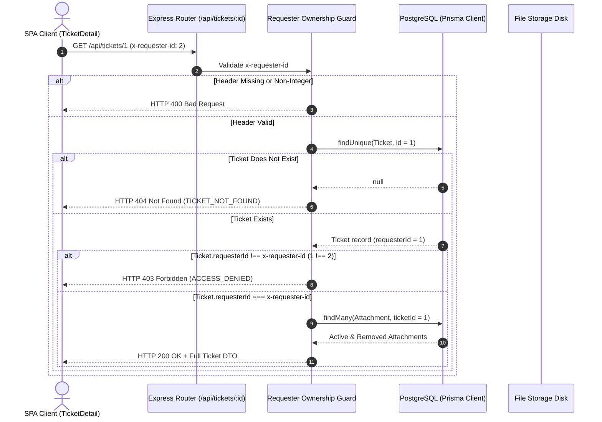
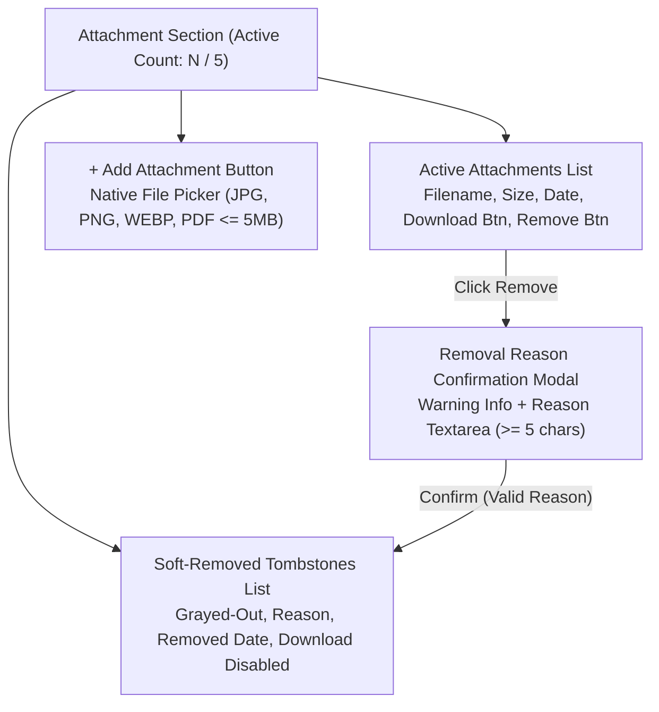
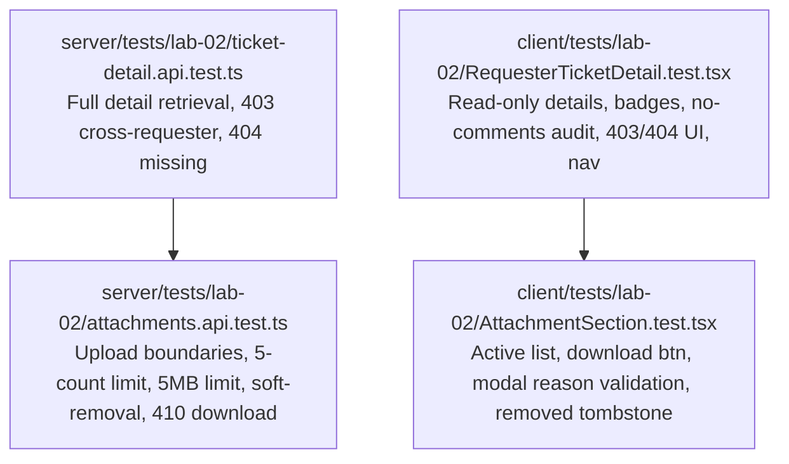

# Feature Engineering Contract: Ticket Detail & Attachment Management

**Feature Identifier:** Feature 9: Ticket Detail & Attachment Management (Branch: `feature/9-ticket-detail-attachments`)  
**Sprint Issue:** TokTickIT Lab 2 (Sprint 2) — Issue 5: Ticket Details & Attachment Management / Soft Removal (GitHub Issue #9)  
**Target Branch:** `feature/9-ticket-detail-attachments` (Base: `lab2-staging`)  
**Specification Version:** 1.0.0  
**Status:** PROPOSED CONTRACT (Awaiting Review)  

---

## 1. Purpose, Scope, and Exclusions

### 1.1 Purpose
This engineering contract establishes the formal specification for **Feature 9: Ticket Detail & Attachment Management**. The feature delivers:
1. The **Ticket Detail View** adhering strictly to KMUTT's **Zen Green** visual design language (`Lab_02_labsheet.pdf` Section 7, 8.5, 8.7; `TokTickIT-System-Level-SDS-v1.0.pdf` p. 10–15; `docs/lab-02/ui-spec.md`).
2. A **Read-Only Ticket Header & Details Card** providing clean, immutable presentation of all ticket attributes (ticket number, submission timestamp, requester persona, classification, system, priority badges, current status, owner, summary, and description).
3. An **Interactive Attachment Workspace** enabling Requesters to:
   - Inspect active attachments with metadata (original filename, formatted file size, upload timestamp).
   - Stream/download active attachment files.
   - Upload additional permitted attachments directly to an existing ticket (subject to strict validation and active count boundaries).
   - Perform audited **Soft-Removal** of attachments with a mandatory non-empty removal reason.
   - Inspect soft-removed attachments displayed as grayed-out tombstone records with download actions strictly disabled.
4. **Strict Requester Isolation & Authorization Protection**: Backend and frontend enforcement guaranteeing that a Requester can only retrieve, view, download, upload to, or soft-remove attachments from tickets submitted under their own `requesterId` (*BR-08*; *SDS p. 10*; *AC-11, AC-12, AC-18*).
5. **Physical Binary Purging upon Soft-Removal**: Immediate, transactional deletion of the binary payload from storage upon confirmed soft-removal while preserving the database metadata record for audit traceability (*BR-07*; *SDS Approved Decision D-11*).
6. **Resilient Error UI & Safe Navigation**: Clear, structured message panels for unauthorized access (403 Forbidden) or missing tickets (404 Not Found), paired with clean "Back to My Tickets" navigation.

---

### 1.2 In-Scope Capabilities

* **Backend REST API Endpoints:**
  * `GET /api/tickets/:id` (and `/api/v1/tickets/:id`):
    - Validates `x-requester-id` header.
    - Retrieves full ticket details joined with Category and RelatedSystem.
    - Retrieves both active attachments (`isRemoved = false`) and soft-removed attachments (`isRemoved = true`).
    - Strictly enforces ownership: returns HTTP 403 Forbidden (or 404 Not Found) if the ticket belongs to a different requester.
  * `POST /api/tickets/:id/attachments` (and `/api/v1/tickets/:id/attachments`):
    - Validates `x-requester-id` header and verifies ticket ownership.
    - Accepts `multipart/form-data` file upload.
    - Validates file constraints: allowed extensions (`.jpg`, `.jpeg`, `.png`, `.webp`, `.pdf`), allowed MIME types (`image/jpeg`, `image/png`, `image/webp`, `application/pdf`), and maximum file size ($\le 5\text{ MB} = 5,242,880$ bytes).
    - Enforces active quantity limit: total active attachments on the ticket must not exceed 5. Rejects with HTTP 422 if 5 active attachments already exist.
    - Writes binary to storage with unique UUID filename; persists `Attachment` record; returns HTTP 201 Created.
  * `GET /api/attachments/:id/download` (and `/api/v1/attachments/:id/download`):
    - Validates `x-requester-id` header.
    - Verifies that the caller owns the parent ticket of the attachment. Rejects with HTTP 403 Forbidden if not the owner.
    - Soft-removal guard: If `attachment.isRemoved === true` or `attachment.removedAt !== null`, returns HTTP 410 Gone (or 404 Not Found).
    - Streams active binary file with appropriate `Content-Type`, `Content-Disposition`, and `Content-Length` headers.
  * `DELETE /api/attachments/:id` (and `/api/v1/attachments/:id`):
    - Validates `x-requester-id` header.
    - Verifies ownership: caller must own the parent ticket. Rejects with HTTP 403 if unauthorized.
    - Validates required JSON payload: `{ "reason": string }` where trimmed `reason` length $\ge 5$ characters. Rejects with HTTP 422 if invalid.
    - Transactional soft-removal:
      1. Updates `Attachment` row: `isRemoved = true`, `removalReason = reason`, `removedAt = new Date()`, `removedByRequesterId = requesterId`.
      2. Immediately deletes the physical stored binary file from disk/storage (*SDS Decision D-11*).
    - Permanently blocks all subsequent downloads of this attachment ID.
    - Returns HTTP 200 OK with success confirmation and updated attachment metadata.

* **Frontend UI Components (`client/src/components/RequesterTicketDetail.tsx` & `AttachmentSection.tsx`):**
  * **Navigation Header:** Clean "← Back to My Tickets" button (neutral secondary outline) returning user to the My Tickets dashboard.
  * **Read-Only Ticket Header Card:**
    - Structured, responsive card styled with KMUTT Zen Green tokens.
    - Displays:
      1. `Ticket No` (prominent monospace badge, e.g. `TKT-2026-00001`)
      2. `Ticket Date` (formatted `YYYY-MM-DD HH:mm`)
      3. `Requester` (name and email)
      4. `Category` (category name badge)
      5. `Related System` (system name)
      6. `Requested Priority` (Zen Green pill badge with micro-icon)
      7. `IT Priority` (Zen Green pill badge with micro-icon)
      8. `Current Status` (Zen Green status pill badge with micro-icon)
      9. `Ticket Owner` (staff name or *"Unassigned"*)
      10. `Summary` (full summary text)
      11. `Description` (full multiline description with preserved formatting)
  * **Interactive Attachment Section:**
    - Header with active count indicator (e.g. *"Attachments (2/5)"*).
    - **Active Attachments List:**
      - File icon, original filename, formatted size (`KB`/`MB`), upload date.
      - Visible "Download" button triggering file download.
      - "Remove" button (danger outline) on each active file triggering removal confirmation modal.
    - **Add Attachment Action:**
      - "+ Add Attachment" button with hidden/native file input (`accept=".jpg,.jpeg,.png,.webp,.pdf"`).
      - Immediate client-side validation for file size ($\le 5\text{ MB}$) and file type.
      - Disabled when 5 active attachments already exist with an explicit helper notice (*"Maximum of 5 active attachments reached"*).
      - Upload busy spinner and progress/uploading state.
    - **Soft-Removal Confirmation Modal:**
      - Accessible modal dialog centered with blurred backdrop (`DEC-UI-17`).
      - Displays target file name and size in a warning callout (`DEC-UI-20`).
      - Required `<textarea>` for "Removal Reason" (`rows="3"`, placeholder *"Please explain why this attachment is being removed..."*) with live character counter showing minimum 5 characters.
      - "Remove Attachment" destructive action button remains disabled until $\ge 5$ non-whitespace characters are entered.
      - Cancel button and `Escape` key support dismissing modal and returning focus.
    - **Soft-Removed Attachments List (Audit Tombstones):**
      - Rendered in a distinct, grayed-out sub-panel below active files.
      - Shows original filename, strikethrough/gray styling, removal timestamp, removed by requester name, and the documented removal reason.
      - Download action is completely disabled and hidden.
  * **Visual States & Error Resilience:**
    - *Loading State:* Shimmering skeleton placeholders (`.placeholder-glow`) for header and attachment panels.
    - *Unauthorized Error State (403):* Structured error panel stating access is denied because the ticket belongs to another requester, with a "Back to My Tickets" button.
    - *Not Found Error State (404):* Structured error panel stating the requested ticket could not be found, with a "Back to My Tickets" button.
    - *Network / Server Failure:* Alert banner with retry option.
  * **Context Synchronization:** Switching the active persona via `RequesterContext` immediately purges the loaded ticket detail and navigates back or checks ownership.

---

### 1.3 Explicit Exclusions (Strictly Out of Scope)

To maintain strict course milestone boundaries and prevent architectural creep:
* **Strictly Read-Only Header Fields (No Ticket Mutation):** Requesters CANNOT edit Summary, Description, Category, Related System, or Priorities on the Ticket Detail screen. All header fields are immutable in this view.
* **No Ticket Lifecycle Status Transitions:** Requesters CANNOT resolve, close, reopen, or cancel tickets. No status transition buttons (e.g. "Resolve Ticket", "Close Ticket", "Reopen") shall be implemented.
* **No Collaboration Features:** Public Comments, Internal Notes, and Actions Taken tabs or forms are strictly excluded.
* **No Ticket Owner Assignment:** Requesters cannot assign or reassign tickets. `ticketOwner` remains read-only (*"Unassigned"*).
* **No IT Staff Queue or Triage:** Requesters cannot access administrative queues or view tickets belonging to other requesters.
* **No Real User Authentication or Passwords:** Operates entirely with the simulated development identity provided by `RequesterContext` via the `x-requester-id` header.

---

## 2. Strict Requester Isolation & Security Model (Ownership Protection)

### 2.1 Ownership Invariant
In accordance with **BR-08** and the System SDS Authorization Model (p. 10):
$$\forall \, t \in \text{TicketsQueried} \implies t.\text{requesterId} = \text{ActiveRequester}.\text{id}$$
$$\forall \, a \in \text{AttachmentsQueried} \implies a.\text{ticket}.\text{requesterId} = \text{ActiveRequester}.\text{id}$$

A Requester is strictly an end-user entity with zero administrative or cross-tenant query privileges. Under no circumstances—regardless of URL parameters, direct navigation, forged client requests, or attachment IDs—shall the backend return ticket attributes or stream file binaries belonging to any other `requesterId`.

### 2.2 Security Guard Sequence & HTTP Response Rules



### 2.3 Attachment Download Security Matrix

| Scenario | Attachment State | Caller `x-requester-id` | Expected HTTP Status | Action / Body |
| :--- | :--- | :--- | :---: | :--- |
| **Owner requests active file** | `isRemoved === false` | Matches `ticket.requesterId` | **`200 OK`** | Stream binary byte stream |
| **Non-owner requests active file** | `isRemoved === false` | Does NOT match `ticket.requesterId` | **`403 Forbidden`** | Rejection JSON envelope |
| **Owner requests soft-removed file** | `isRemoved === true` | Matches `ticket.requesterId` | **`410 Gone`** | Rejection JSON envelope (`FILE_REMOVED`) |
| **Non-owner requests soft-removed file** | `isRemoved === true` | Does NOT match `ticket.requesterId` | **`403 Forbidden`** | Rejection JSON envelope |
| **Any user requests non-existent ID** | Does not exist | Any | **`404 Not Found`** | Rejection JSON envelope (`ATTACHMENT_NOT_FOUND`) |
| **Missing `x-requester-id` header** | Any | None | **`400 Bad Request`** | Rejection JSON envelope (`MISSING_REQUESTER_HEADER`) |

---

## 3. Backend REST API Specifications

### 3.1 Route Summary

| Method | Path | Path Alias | Content-Type | Required Header | Description |
| :--- | :--- | :--- | :--- | :--- | :--- |
| `GET` | `/api/tickets/:id` | `/api/v1/tickets/:id` | `application/json` | `x-requester-id` | Retrieve full ticket details + attachments |
| `POST` | `/api/tickets/:id/attachments` | `/api/v1/tickets/:id/attachments` | `multipart/form-data` | `x-requester-id` | Upload new attachment to ticket |
| `GET` | `/api/attachments/:id/download` | `/api/v1/attachments/:id/download` | Binary stream | `x-requester-id` | Stream binary of active attachment |
| `DELETE` | `/api/attachments/:id` | `/api/v1/attachments/:id` | `application/json` | `x-requester-id` | Soft-remove attachment with reason |

---

### 3.2 Endpoint: `GET /api/tickets/:id`

#### Purpose
Retrieves complete read-only ticket details along with active and soft-removed attachments for the ticket owner.

#### Parameters
* **Path Parameter:** `id` (`integer`, required) — The ticket database ID.
* **Header:** `x-requester-id: <integer>` (required).

#### Processing & Business Rules
1. Validate `x-requester-id` header exists and is a positive integer.
2. Validate `id` path parameter is a positive integer.
3. Query `Ticket` where `id = :id` including `category`, `relatedSystem`, and `attachments`.
4. If ticket not found, return HTTP 404 (`TICKET_NOT_FOUND`).
5. **Ownership Check:** If `ticket.requesterId !== verifiedRequesterId`, return HTTP 403 Forbidden (`FORBIDDEN_TICKET_ACCESS`).
6. Partition attachments into:
   - `attachments`: where `isRemoved === false` (active)
   - `removedAttachments`: where `isRemoved === true` (soft-removed tombstones)
7. Return HTTP 200 OK with formatted DTO.

#### Success Response (`HTTP 200 OK`)
```json
{
  "success": true,
  "data": {
    "id": 1,
    "ticketNumber": "TKT-2026-00001",
    "summary": "Laptop battery drains quickly",
    "description": "My laptop battery is draining much faster than usual even when idle.",
    "categoryId": 2,
    "categoryName": "Hardware",
    "relatedSystemId": 7,
    "relatedSystemName": "Corporate Laptop",
    "requestedPriority": "Medium",
    "itPriority": "Medium",
    "currentStatus": "New",
    "ticketOwner": null,
    "requesterId": 1,
    "requesterName": "Jennifer Anderson",
    "requesterEmail": "jennifer.anderson@kmutt.ac.th",
    "createdAt": "2026-09-03T11:00:00.000Z",
    "updatedAt": "2026-09-03T11:00:00.000Z",
    "attachments": [
      {
        "id": 1,
        "ticketId": 1,
        "originalFilename": "battery_diagnostic.png",
        "mimeType": "image/png",
        "fileSize": 524288,
        "isRemoved": false,
        "createdAt": "2026-09-03T11:05:00.000Z"
      }
    ],
    "removedAttachments": [
      {
        "id": 2,
        "ticketId": 1,
        "originalFilename": "wrong_report.pdf",
        "mimeType": "application/pdf",
        "fileSize": 1048576,
        "isRemoved": true,
        "removalReason": "Uploaded incorrect diagnostic report from previous semester",
        "removedAt": "2026-09-03T11:15:00.000Z",
        "removedByRequesterId": 1,
        "removedByRequesterName": "Jennifer Anderson",
        "createdAt": "2026-09-03T11:05:00.000Z"
      }
    ]
  }
}
```

#### Error Responses
* `400 Bad Request`:
  ```json
  {
    "success": false,
    "error": {
      "code": "MISSING_REQUESTER_HEADER",
      "message": "The 'x-requester-id' header is required to identify the submitting requester.",
      "details": []
    }
  }
  ```
* `403 Forbidden`:
  ```json
  {
    "success": false,
    "error": {
      "code": "FORBIDDEN_TICKET_ACCESS",
      "message": "Access denied. You do not have permission to view this ticket.",
      "details": []
    }
  }
  ```
* `404 Not Found`:
  ```json
  {
    "success": false,
    "error": {
      "code": "TICKET_NOT_FOUND",
      "message": "Ticket not found with the specified ID.",
      "details": []
    }
  }
  ```

---

### 3.3 Endpoint: `POST /api/tickets/:id/attachments`

#### Purpose
Enables an authorized requester to upload a supporting attachment file directly to their existing ticket.

#### Parameters & Payload
* **Path Parameter:** `id` (`integer`, required) — Target ticket database ID.
* **Header:**
  * `x-requester-id: <integer>` (required)
  * `Content-Type: multipart/form-data`
* **Form Field:** `file` (binary stream, required)

#### Processing & Business Rules
1. Validate `x-requester-id` header.
2. Query `Ticket` where `id = :id`.
3. Check ticket existence (HTTP 404 if missing) and verify ownership (`ticket.requesterId === requesterId`; HTTP 403 if unauthorized).
4. Verify file presence in request. If no file uploaded, return HTTP 400 (`MISSING_ATTACHMENT_FILE`).
5. Check current active attachment count:
   $$\text{activeCount} = \text{count}(\text{Attachment where } \text{ticketId} = :id \text{ and } \text{isRemoved} = \text{false})$$
   If $\text{activeCount} \ge 5$, return HTTP 422 (`ATTACHMENT_LIMIT_EXCEEDED`):
   *"Total active attachments cannot exceed 5 files. Current: 5, attempting to add: 1."*
6. Validate file attributes via `validateAttachmentFile()`:
   - Allowed extensions: `.jpg`, `.jpeg`, `.png`, `.webp`, `.pdf`. Rejects with HTTP 415 or 422 if unsupported.
   - Allowed MIME types: `image/jpeg`, `image/png`, `image/webp`, `application/pdf`. Rejects with HTTP 415 or 422 if unsupported.
   - File size: $\le 5\text{ MB} = 5,242,880$ bytes. If $> 5,242,880$ bytes, reject with HTTP 422 (`FILE_TOO_LARGE`).
7. Save binary file to storage using `saveAttachmentFile(originalFilename, buffer)`. Generates unique `storedFilename = <uuid>.<ext>`.
8. Persist new `Attachment` record in PostgreSQL with `isRemoved = false`.
9. Return HTTP 201 Created with created attachment DTO.

#### Success Response (`HTTP 201 Created`)
```json
{
  "success": true,
  "message": "Attachment uploaded successfully",
  "data": {
    "id": 3,
    "ticketId": 1,
    "originalFilename": "error_screenshot.png",
    "mimeType": "image/png",
    "fileSize": 245760,
    "isRemoved": false,
    "createdAt": "2026-09-03T11:20:00.000Z"
  }
}
```

#### Error Responses
* `403 Forbidden`: Requester does not own the target ticket.
* `415 Unsupported Media Type`: File format/MIME is not JPG, PNG, WEBP, or PDF.
* `422 Unprocessable Entity`: File size exceeds 5 MB or active count would exceed 5.

---

### 3.4 Endpoint: `GET /api/attachments/:id/download`

#### Purpose
Streams the binary file of an active attachment to the authorized ticket owner.

#### Parameters
* **Path Parameter:** `id` (`integer`, required) — Attachment database ID.
* **Header:** `x-requester-id: <integer>` (required).

#### Processing & Business Rules
1. Validate `x-requester-id` header.
2. Query `Attachment` where `id = :id` including relation `ticket`.
3. If attachment does not exist, return HTTP 404 (`ATTACHMENT_NOT_FOUND`).
4. **Ownership Check:** Verify `attachment.ticket.requesterId === requesterId`. If mismatch, return HTTP 403 Forbidden (`FORBIDDEN_ATTACHMENT_ACCESS`).
5. **Soft-Removal Guard:**
   If `attachment.isRemoved === true` or `attachment.removedAt !== null`:
   Return **HTTP 410 Gone** (or HTTP 404) with JSON error envelope:
   ```json
   {
     "success": false,
     "error": {
       "code": "ATTACHMENT_REMOVED",
       "message": "This attachment has been removed and is no longer available for download.",
       "details": [
         {
           "field": "isRemoved",
           "message": "Removal reason: Uploaded incorrect diagnostic report from previous semester"
         }
       ]
     }
   }
   ```
6. Locate physical file on disk via storage directory + `attachment.storedFilename`.
   If physical file is missing from disk, return HTTP 404.
7. Stream binary file with response headers:
   - `Content-Type: <attachment.mimeType>`
   - `Content-Disposition: attachment; filename="<encodeURIComponent(attachment.originalFilename)>"`
   - `Content-Length: <attachment.fileSize>`
8. Return HTTP 200 OK byte stream.

---

### 3.5 Endpoint: `DELETE /api/attachments/:id`

#### Purpose
Performs an audited soft-removal of an attachment, writing removal metadata, permanently blocking future downloads, and immediately purging the physical binary file from storage.

#### Parameters & Payload
* **Path Parameter:** `id` (`integer`, required) — Target attachment database ID.
* **Headers:**
  * `x-requester-id: <integer>` (required)
  * `Content-Type: application/json`
* **JSON Body:**
  ```json
  {
    "reason": "Uploaded outdated log file by mistake"
  }
  ```

#### Processing & Business Rules
1. Validate `x-requester-id` header.
2. Query `Attachment` where `id = :id` including relation `ticket`.
3. If attachment does not exist, return HTTP 404 (`ATTACHMENT_NOT_FOUND`).
4. **Ownership Check:** If `attachment.ticket.requesterId !== requesterId`, return HTTP 403 Forbidden (`FORBIDDEN_ATTACHMENT_REMOVAL`).
5. **Already Removed Guard:** If `attachment.isRemoved === true`, return HTTP 400 or 200 indicating file is already removed.
6. **Payload Validation:**
   - Extract `reason` from body.
   - Trim whitespace: `trimmedReason = typeof reason === 'string' ? reason.trim() : ''`.
   - Validate length: `trimmedReason.length >= 5`.
   - If missing or $< 5$ characters, return HTTP 422 (`VALIDATION_ERROR`):
     ```json
     {
       "success": false,
       "error": {
         "code": "VALIDATION_ERROR",
         "message": "A removal reason of at least 5 characters is mandatory.",
         "details": [
           { "field": "reason", "message": "Removal reason must be at least 5 characters." }
         ]
       }
     }
     ```
7. **Transactional Database & Storage Execution:**
   - In a database transaction:
     Update `Attachment`:
     ```typescript
     await prisma.attachment.update({
       where: { id: attachment.id },
       data: {
         isRemoved: true,
         removalReason: trimmedReason,
         removedAt: new Date(),
         removedByRequesterId: requesterId,
       },
     });
     ```
   - **Immediate Binary Purge (SDS Decision D-11):**
     Immediately delete the physical file from disk storage:
     ```typescript
     await deleteAttachmentFile(attachment.storedFilename);
     ```
8. Return HTTP 200 OK with updated metadata.

#### Success Response (`HTTP 200 OK`)
```json
{
  "success": true,
  "message": "Attachment removed successfully",
  "data": {
    "id": 1,
    "ticketId": 1,
    "originalFilename": "wrong_report.pdf",
    "isRemoved": true,
    "removalReason": "Uploaded outdated log file by mistake",
    "removedAt": "2026-09-03T11:25:00.000Z",
    "removedByRequesterId": 1
  }
}
```

---

## 4. Frontend Ticket Detail Layout & Zen Green UI Specification

### 4.1 Theme Tokens & Visual Hierarchy
In strict adherence to `docs/lab-02/ui-spec.md` and KMUTT's Zen Green palette:
* **Primary Theme Green:** `#006B3C` (badges, primary buttons, borders, highlights)
* **Secondary Green:** `#0B7A46` (focus rings, hover states)
* **Pale Green:** `#EAF6EF` (badge backgrounds, soft surfaces)
* **Page Background:** `#F5F7F6` (light neutral workspace)
* **Card Surface:** `#FFFFFF` (pure white cards with `border-radius: 8px`, `shadow-sm`)
* **Destructive Danger:** `#B3261E` (removal buttons, error banners, removal badges)
* **Text Primary:** `#1F2937` (dark charcoal text)
* **Text Muted:** `#5B6573` (metadata labels, timestamps)

---

### 4.2 Read-Only Ticket Header Card (`RequesterTicketDetail.tsx`)

#### Layout Architecture
* Max-width `1200px` (`container-xl`), centered.
* Top action bar:
  - Left: `← Back to My Tickets` button (`btn btn-outline-secondary btn-sm fw-semibold`).
  - Right: Ticket status badge (`New`, `In Progress`, etc.).
* Header Details Grid (2-column on desktop, 1-column on mobile):
  - **Left Details Column:**
    - **Ticket Number:** Displayed as large monospace badge (`TKT-YYYY-NNNNN`, font size `1.25rem`, bold, `#006B3C`).
    - **Ticket Date:** Submission timestamp formatted as `YYYY-MM-DD HH:mm`.
    - **Requester:** Display name and email (`Jennifer Anderson (jennifer.anderson@kmutt.ac.th)`).
    - **Category:** Category name badge (e.g. `Hardware`).
    - **Related System:** Related system name (e.g. `Corporate Laptop`).
  - **Right Status & Priority Column:**
    - **Requested Priority:** Pill badge with direction micro-icon (`Low`, `Medium`, `High`, `Urgent`).
    - **IT Priority:** Pill badge with direction micro-icon (`Low`, `Medium`, `High`, `Urgent`).
    - **Current Status:** Status pill badge with state micro-icon (`New`, `Assigned`, `In Progress`, `Pending Requester`, `Resolved`, `Closed`, `Cancelled`).
    - **Ticket Owner:** Assigned staff name or muted text *"Unassigned"*.
  - **Full-Width Content Section:**
    - **Summary:** Displayed as prominent H2 (`1.125rem`, semi-bold, `#1F2937`).
    - **Description:** Structured card box with soft read-only background (`#F9FAFB`), subtle border (`#E5E7EB`), padding `1rem`, `white-space: pre-wrap; word-break: break-word;`.
    - **Resolution Summary (if resolved):** Displayed only if present; otherwise omitted.

---

### 4.3 Interactive Attachment Workspace (`AttachmentSection.tsx`)



#### Active Attachments Table / Cards
* Renders a table (on desktop) or card list (on mobile):
  - **File Icon & Name:** Document/Image SVG icon + original filename.
  - **File Size:** Human-readable size (`124 KB`, `2.4 MB`).
  - **Upload Date:** Formatted date string (`YYYY-MM-DD HH:mm`).
  - **Actions:**
    - **Download Button:** Clean secondary outline button with download icon. Triggers `GET /api/attachments/:id/download`.
    - **Remove Button:** Danger outline button (`border-color: #B3261E; color: #B3261E;`) with trash icon. Opens removal modal.
* **Empty Active State:** When 0 active attachments exist, displays a soft neutral banner: *"No active attachments attached to this ticket."*

#### Add Attachment Action & Constraints
* Prominent "+ Add Attachment" button located in the section header.
* Triggers hidden `<input type="file" accept=".jpg,.jpeg,.png,.webp,.pdf" />`.
* **Client-Side Boundary Enforcement:**
  - If selected file size $> 5\text{ MB}$ ($5,242,880$ bytes): Displays inline alert *"Selected file exceeds the 5 MB limit"* and aborts upload.
  - If selected file type not in allowed list: Displays inline alert *"Unsupported file type. Allowed formats: JPG, PNG, WEBP, PDF"* and aborts upload.
  - If active count is already 5: Button is disabled with tooltip/helper text *"Maximum limit of 5 active attachments reached"*.
* During upload: Button shows busy spinner and text *"Uploading..."*, preventing duplicate clicks.

#### Soft-Removal Confirmation Modal (`DEC-UI-17, DEC-UI-20`)
* Modal container centered with semi-transparent backdrop blur (`rgba(0, 0, 0, 0.5)`).
* Modal Title: *"Confirm Attachment Removal"*.
* Callout card: Warning banner displaying target file name and size:
  *"Are you sure you want to remove 'diagnostic_log.pdf' (1.2 MB)? The physical file will be deleted and can no longer be downloaded."*
* Mandatory Reason Field:
  - Label: `Reason for Removal *` (with required red asterisk).
  - `<textarea>`: 3 rows, placeholder *"Please explain why this attachment is being removed (minimum 5 characters)..."*.
  - Helper counter: Displays current character count (e.g. `3/5 characters minimum`) turning green when $\ge 5$ characters.
* Modal Action Buttons:
  - **Cancel Button:** Neutral outline; closes modal without changes.
  - **Remove Attachment Button:** Danger solid button (`#B3261E`). Strictly disabled while `reason.trim().length < 5`.
  - During submission: Displays spinner and disabled state (*"Removing..."*).
* Accessibility: Focus is moved to the textarea on open; `Escape` key closes modal; focus returns to the invoking trigger button upon dismissal.

#### Soft-Removed Attachments List (Audit Tombstones)
* Rendered below the active attachments in a dedicated sub-section: *"Removed Attachments (Audit Log)"*.
* Appearance: Grayed-out rows/cards with muted text (`color: #9CA3AF; background-color: #F9FAFB;`).
* Content displayed:
  - Original filename with strikethrough styling.
  - Formatted file size.
  - Removal timestamp (`Removed on YYYY-MM-DD HH:mm`).
  - Removed by persona name (`Removed by Jennifer Anderson`).
  - **Documented Reason:** Italicized quote callout (*"Reason: Uploaded incorrect system diagnostics file"*).
  - **Disabled Action:** Download button is completely hidden or rendered as a disabled badge (*"Unavailable / Removed"*), guaranteeing no user can trigger a download.

---

### 4.4 Navigation & App Shell Integration

* **Navigation Action:** Clicking "← Back to My Tickets" triggers navigation back to the My Tickets dashboard.
* **Context Preservation:** Sibling state in `App.tsx` toggles between `"my-tickets"`, `"create-ticket"`, and `"ticket-detail"` with `selectedTicketId: number | null`.
* **Instant Context Switching:** If the user switches the active development persona via the header "Change" button while viewing Ticket Detail:
  - If the new requester does NOT own the currently open ticket, the application clears `selectedTicketId` and redirects safely to the My Tickets dashboard for the new requester.

---

### 4.5 Resilient Error & Empty States

* **403 Forbidden (Cross-Requester Security Panel):**
  - Rendered when a requester tries to view another user's ticket ID.
  - Shield/lock SVG icon, headline *"Access Denied"*, explanation *"You do not have permission to view ticket #<id> because it belongs to a different requester."*, and a primary "Back to My Tickets" button.
* **404 Not Found (Missing Ticket Panel):**
  - Search/file SVG icon, headline *"Ticket Not Found"*, explanation *"The requested ticket could not be found or may have been deleted."*, and a primary "Back to My Tickets" button.
* **Loading Skeleton State:**
  - Renders placeholder glow bars (`.placeholder-glow`) matching the header grid, summary, description box, and attachment cards while data is being fetched.

---

## 5. Software Test Specification (STS) & Automated Verification Plan

### 5.1 Test Pyramid & Strategy
The testing strategy enforces multi-layered verification covering backend isolation, boundary enforcement, physical binary lifecycle, and frontend interaction states:



---

### 5.2 Server API Integration Tests

#### 1. `server/tests/lab-02/ticket-detail.api.test.ts`
* **Test Case TD-01 (Happy Path Detail Retrieval):**
  - Given an existing ticket owned by Requester 1 with 1 active attachment and 1 soft-removed attachment.
  - When `GET /api/tickets/:id` is called with `x-requester-id: 1`.
  - Then returns HTTP 200 OK with full ticket attributes, `attachments` containing the active file, and `removedAttachments` containing the soft-removed file metadata.
* **Test Case TD-02 (Cross-Requester Ticket Access Rejection - BR-08, AC-12):**
  - Given Ticket 1 owned by Requester 1.
  - When `GET /api/tickets/1` is called with `x-requester-id: 2` (Requester 2).
  - Then returns HTTP 403 Forbidden with error code `FORBIDDEN_TICKET_ACCESS`. No ticket attributes are revealed.
* **Test Case TD-03 (Missing Ticket ID - 404):**
  - When `GET /api/tickets/999999` is called with `x-requester-id: 1`.
  - Then returns HTTP 404 Not Found with error code `TICKET_NOT_FOUND`.
* **Test Case TD-04 (Missing Header - 400):**
  - When `GET /api/tickets/1` is called without `x-requester-id`.
  - Then returns HTTP 400 Bad Request with error code `MISSING_REQUESTER_HEADER`.
* **Test Case TD-05 (Invalid Header - 400):**
  - When `GET /api/tickets/1` is called with `x-requester-id: abc`.
  - Then returns HTTP 400 Bad Request with error code `INVALID_REQUESTER_HEADER`.

---

#### 2. `server/tests/lab-02/attachments.api.test.ts`
* **Test Case AT-01 (Valid Attachment Upload - AC-13):**
  - Given an existing ticket owned by Requester 1 with 0 attachments.
  - When `POST /api/tickets/:id/attachments` is called with `x-requester-id: 1` and a valid 100 KB PNG file.
  - Then returns HTTP 201 Created; database contains 1 active attachment; physical file exists on disk.
* **Test Case AT-02 (Cross-Requester Upload Rejection):**
  - Given Ticket 1 owned by Requester 1.
  - When `POST /api/tickets/1/attachments` is called with `x-requester-id: 2` and a valid file.
  - Then returns HTTP 403 Forbidden. No file is saved to disk or database.
* **Test Case AT-03 (File Size Boundary Rejection - BR-06, AC-14):**
  - When `POST /api/tickets/:id/attachments` is called with a file of size $5,242,881$ bytes ($> 5\text{ MB}$).
  - Then returns HTTP 422 Unprocessable Entity. File is rejected.
* **Test Case AT-04 (File Format / MIME Rejection - BR-06, AC-14):**
  - When `POST /api/tickets/:id/attachments` is called with an executable (`.exe`) or text file (`.txt`).
  - Then returns HTTP 415 Unsupported Media Type or 422. File is rejected.
* **Test Case AT-05 (5-Active Limit Boundary Rejection - BR-06, AC-15):**
  - Given a ticket that already has 5 active attachments.
  - When `POST /api/tickets/:id/attachments` is called with a 6th valid attachment.
  - Then returns HTTP 422 Unprocessable Entity indicating the 5-file active limit has been reached.
* **Test Case AT-06 (Active File Download - AC-18):**
  - Given an active attachment on Ticket 1.
  - When `GET /api/attachments/:id/download` is called with `x-requester-id: 1`.
  - Then returns HTTP 200 OK with binary byte stream and matching `Content-Disposition`.
* **Test Case AT-07 (Cross-Requester Download Rejection - BR-08, AC-18):**
  - Given an active attachment on Ticket 1 owned by Requester 1.
  - When `GET /api/attachments/:id/download` is called with `x-requester-id: 2`.
  - Then returns HTTP 403 Forbidden. No file content is streamed.
* **Test Case AT-08 (Soft-Removal with Mandatory Reason - BR-07, AC-16):**
  - Given an active attachment on Ticket 1 with physical file on disk.
  - When `DELETE /api/attachments/:id` is called with `x-requester-id: 1` and `body: { "reason": "Uploaded incorrect log file" }`.
  - Then returns HTTP 200 OK; database record has `isRemoved = true`, `removalReason`, `removedAt`, `removedByRequesterId = 1`; physical binary file is deleted from disk.
* **Test Case AT-09 (Soft-Removal Rejection with Short Reason - BR-07):**
  - When `DELETE /api/attachments/:id` is called with `reason: "err"` ($< 5$ characters).
  - Then returns HTTP 422 Unprocessable Entity; attachment remains active.
* **Test Case AT-10 (Soft-Removal Cross-Requester Rejection):**
  - When `DELETE /api/attachments/:id` is called by Requester 2 on Requester 1's attachment.
  - Then returns HTTP 403 Forbidden; attachment remains active.
* **Test Case AT-11 (Download Blocked on Soft-Removed Attachment - BR-07, AC-17):**
  - Given an attachment that has been soft-removed.
  - When `GET /api/attachments/:id/download` is called by the owner.
  - Then returns HTTP 410 Gone (or 404 Not Found) with code `ATTACHMENT_REMOVED`. File content is not returned.

---

### 5.3 Client Component Tests

#### 1. `client/tests/lab-02/RequesterTicketDetail.test.tsx`
* **Test Case CT-TD-01 (Read-Only Detail Rendering - AC-11):**
  - Renders component with mock ticket data.
  - Asserts Ticket Number (`TKT-2026-00001`), Ticket Date, Requester display name, Category, Related System, Requested Priority badge, IT Priority badge, Status badge, Ticket Owner, Summary, and Description are all rendered.
* **Test Case CT-TD-02 (Exclusion Audit - No Public Comments / Status Transitions):**
  - Asserts that no "Add Comment", "Public Comments", "Internal Notes", "Actions Taken", "Resolve", or "Close" controls or tabs exist in the rendered DOM.
* **Test Case CT-TD-03 (Navigation Back to My Tickets):**
  - Asserts that clicking "Back to My Tickets" button triggers the callback/navigation prop.
* **Test Case CT-TD-04 (403 Forbidden Access Panel Rendering):**
  - Simulates API returning HTTP 403.
  - Asserts "Access Denied" message panel is displayed with "Back to My Tickets" button.
* **Test Case CT-TD-05 (404 Not Found Panel Rendering):**
  - Simulates API returning HTTP 404.
  - Asserts "Ticket Not Found" message panel is displayed.
* **Test Case CT-TD-06 (Skeleton Loading State):**
  - Simulates pending API fetch.
  - Asserts placeholder glow shimmer elements are displayed.

---

#### 2. `client/tests/lab-02/AttachmentSection.test.tsx`
* **Test Case CT-AT-01 (Active Attachments Display & Download):**
  - Renders active attachment list.
  - Asserts filename, file size, and upload date are visible.
  - Asserts "Download" button is present and triggers download helper.
* **Test Case CT-AT-02 (Add Attachment File Validation):**
  - Simulates selecting a file $> 5\text{ MB}$.
  - Asserts client-side error alert is displayed; upload is not invoked.
* **Test Case CT-AT-03 (5-Active Limit Guard):**
  - Given 5 active attachments.
  - Asserts "+ Add Attachment" button is disabled and displays the 5-file limit warning.
* **Test Case CT-AT-04 (Removal Modal Trigger & Reason Validation - AC-16):**
  - Clicks "Remove" button on an active attachment.
  - Asserts confirmation modal opens with target filename and warning.
  - Asserts "Remove Attachment" button in modal is initially disabled.
  - Enters 3 characters ("abc"): button remains disabled.
  - Enters 6 characters ("wrong file"): button becomes enabled.
* **Test Case CT-AT-05 (Modal Escape Key & Cancel):**
  - Asserts pressing `Escape` or clicking "Cancel" closes modal without invoking deletion.
* **Test Case CT-AT-06 (Soft-Removed Attachments Tombstone View - AC-17):**
  - Renders soft-removed attachments in audit list.
  - Asserts filename has strikethrough/gray styling, removal reason is displayed, and download button is disabled/hidden.

---

## 6. Acceptance Criteria Traceability Matrix

| AC ID | Description | Mapped FR / BR | Planned Automated Test File Path |
| :---: | :--- | :--- | :--- |
| **AC-11** | Owned ticket detail read-only inspection | FR-09, BR-08 | `server/tests/lab-02/ticket-detail.api.test.ts`<br/>`client/tests/lab-02/RequesterTicketDetail.test.tsx` |
| **AC-12** | Cross-requester ticket access denial (403/404) | FR-15, BR-08 | `server/tests/lab-02/ticket-detail.api.test.ts`<br/>`client/tests/lab-02/RequesterTicketDetail.test.tsx` |
| **AC-13** | Valid attachment upload to ticket | FR-10, BR-06 | `server/tests/lab-02/attachments.api.test.ts`<br/>`client/tests/lab-02/AttachmentSection.test.tsx` |
| **AC-14** | Attachment size (>5MB) and type rejection | FR-10, BR-06 | `server/tests/lab-02/attachments.api.test.ts`<br/>`client/tests/lab-02/AttachmentSection.test.tsx` |
| **AC-15** | Attachment 5-file quantity boundary | FR-10, BR-06 | `server/tests/lab-02/attachments.api.test.ts`<br/>`client/tests/lab-02/AttachmentSection.test.tsx` |
| **AC-16** | Soft-removal with mandatory reason ($\ge 5$ chars) | FR-12, FR-13, BR-07 | `server/tests/lab-02/attachments.api.test.ts`<br/>`client/tests/lab-02/AttachmentSection.test.tsx` |
| **AC-17** | Soft-removed file download block (410/404) | FR-14, BR-07 | `server/tests/lab-02/attachments.api.test.ts`<br/>`client/tests/lab-02/AttachmentSection.test.tsx` |
| **AC-18** | Cross-requester attachment download rejection (403) | FR-15, BR-08 | `server/tests/lab-02/attachments.api.test.ts` |

---

## 7. Definition of Done (DoD) for Issue 9

To successfully merge `feature/9-ticket-detail-attachments` into `lab2-staging`:
1. All 4 backend endpoints (`GET /api/tickets/:id`, `POST /api/tickets/:id/attachments`, `GET /api/attachments/:id/download`, `DELETE /api/attachments/:id`) are fully implemented and passing all tests.
2. Cross-requester security isolation is mathematically verified: no requester can view, download, or soft-remove another requester's data.
3. Physical binary deletion upon soft-removal is verified: file is purged from disk, database record is preserved with audit metadata, and subsequent downloads return HTTP 410 Gone.
4. Client components `RequesterTicketDetail.tsx` and `AttachmentSection.tsx` conform 100% to KMUTT Zen Green theme tokens, WCAG 2.2 AA accessibility, responsive breakpoints, and error resilience.
5. All automated test suites (`ticket-detail.api.test.ts`, `attachments.api.test.ts`, `RequesterTicketDetail.test.tsx`, `AttachmentSection.test.tsx`) pass with 100% success rate and zero skipped tests.
6. Zero application code or styling creep: No Public Comments, Internal Notes, Actions Taken, or ticket status transitions.
