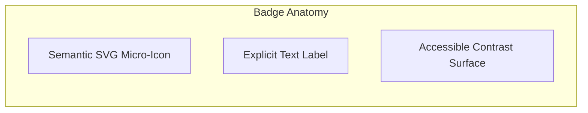
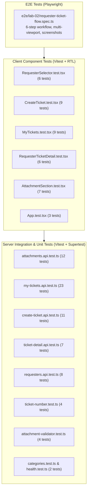

# Feature Engineering Contract: UI Polish & End-to-End (E2E) Testing

**Feature Identifier:** Feature 10: UI Polish & End-to-End (E2E) Testing (Branch: `feature/10-ui-polish-e2e`)  
**Sprint Issue:** TokTickIT Lab 2 (Sprint 2) — Issue 10: UI Polish, Multi-Viewport Verification & Automated E2E Testing (Final Milestone Synthesis)  
**Target Branch:** `feature/10-ui-polish-e2e` (Base: `lab2-staging`)  
**Specification Version:** 1.0.0  
**Status:** PROPOSED CONTRACT (Awaiting Review)  

---

## 1. Purpose, Scope, and Exclusions

### 1.1 Purpose
This engineering contract establishes the formal specification for **Feature 10: UI Polish & E2E Testing**, representing the final integration, visual refinement, and verification phase of **TokTickIT Lab 2 (Sprint 2)**. 

The primary objectives of this feature are:
1. **Zen Green Design System Polish & Standardization**: Audit and harmonize the user interface across all views (`RequesterSelector`, `AppHeader`, `CreateTicket`, `MyTickets`, `RequesterTicketDetail`, and `AttachmentSection`) to ensure 100% compliance with KMUTT's **Zen Green** visual design tokens, geometry, typography hierarchy, button hierarchy, and non-color dependent accessibility standards (`Lab_02_labsheet.pdf` Section 7, 8; `TokTickIT-System-Level-SDS-v1.0.pdf` p. 10–15; `docs/lab-02/ui-spec.md`).
2. **Multi-Viewport Layout & Responsive Integrity**: Eliminate horizontal screen overflow, enforce a touch-friendly minimum tapping target of $44 \times 44\text{px}$ on mobile screens ($< 768\text{px}$), verify 2-column adaptive layout on tablet ($768\text{px} - 991\text{px}$), and maintain a structured, centered $1200\text{px}$ container on desktop ($\ge 992\text{px}$).
3. **Automated End-to-End (E2E) Test Suite (Playwright)**: Implement a complete, deterministic browser walkthrough suite at `e2e/lab-02/requester-ticket-flow.spec.ts` that exercises the entire requester lifecycle from persona selection to ticket creation, attachment upload, list filtering, detail inspection, soft-removal, and multi-tenant isolation.
4. **Automated Visual Evidence Screenshot Pipeline**: Configure Playwright to automatically capture full-page viewport screenshots across Desktop, Tablet, and Mobile viewport sizes, outputting timestamped visual artifacts to `artifacts/lab-02/screenshots/` for sprint grading and peer review.
5. **Full Test Regression Protection**: Preserve 100% functionality and test pass rate across all existing server Vitest unit/integration suites (71 tests across 9 files) and client Vitest RTL component suites (40 tests across 6 files), ensuring zero regressions across prior sprint increments.

---

### 1.2 In-Scope Capabilities

* **Global UI Polish & Styling Compliance:**
  * Strict adherence to approved Zen Green palette (`#006B3C`, `#0B7A46`, `#EAF6EF`, `#F5F7F6`, `#FFFFFF`, `#1F2937`).
  * Removal of unapproved raw Bootstrap colors or ad-hoc styles in favor of semantic CSS custom properties and utility classes.
  * Audit of card geometries, uniform $38\text{px}$ control heights, $6\text{px}$ input border-radius, $8\text{px}$ card radius, and $1.5\text{rem}$ ($24\text{px}$) card padding.
  * Standardized button hierarchy across Primary, Secondary/Neutral, Destructive, Disabled, and Busy/Loading states.
  * Full WCAG 2.2 Level AA accessibility compliance: status and priority badges must pair color with explicit text labels and semantic SVG micro-icons (non-color dependency).
  * Accessible mobile navigation: header links collapse cleanly into a responsive hamburger toggle menu (`navbar-toggler`) on viewports $< 768\text{px}$ with correct `aria-expanded` and `aria-label` attributes.
  * Mobile table adaptation: 9-column tabular grid on desktop/tablet collapses into structured, readable cards on mobile ($< 768\text{px}$) with zero horizontal scrolling.

* **Playwright Automated E2E Testing Suite (`e2e/lab-02/requester-ticket-flow.spec.ts`):**
  * Automated testing running on Chromium/WebKit/Firefox engines against live client and server processes.
  * Deterministic test script executing the 6 mandatory requester workflow steps:
    1. **Identity Selection:** Select simulated Requester persona from header context widget and confirm identity.
    2. **Ticket Creation:** Open Create Ticket screen, fill mandatory fields (Summary, Description, Category, Related System, Priority), attach a valid file ($\le 5\text{ MB}$, PDF/PNG), and submit with busy state assertion.
    3. **Ticket List Inspection:** Verify submission redirects or navigates to My Tickets; assert ticket number format `TKT-YYYY-NNNNN`, summary, priority badge, and status `New` are displayed.
    4. **Ticket Detail Navigation:** Click ticket row/number to open Ticket Detail view; verify read-only header fields, summary, description, and active attachment listing.
    5. **Attachment Lifecycle & Soft-Removal:** Upload second attachment, download active attachment, invoke soft-removal confirmation modal, assert $\ge 5$ character reason validation, confirm soft-removal, and assert tombstone appearance with download disabled.
    6. **Requester Isolation Verification:** Switch active requester identity in the header and assert that the tickets list dynamically refreshes, filtering out the previous user's ticket.

* **Automated Screenshot Capture Pipeline:**
  * Automated full-page screenshot capturing embedded directly into the Playwright test suite.
  * Saved under `artifacts/lab-02/screenshots/` organized by feature and viewport:
    * `create-ticket/`: Desktop ($1280 \times 800$), Tablet ($768 \times 1024$), Mobile ($375 \times 667$ / $390 \times 844$).
    * `my-tickets/`: Desktop ($1280 \times 800$), Tablet ($768 \times 1024$), Mobile ($375 \times 667$ / $390 \times 844$).
    * `ticket-detail/`: Desktop Active ($1280 \times 800$), Desktop Soft-Removed ($1280 \times 800$), Tablet ($768 \times 1024$), Mobile ($375 \times 667$ / $390 \times 844$).

* **Regression Verification Pipeline:**
  * Automated execution script or test runner target validating:
    * `cd server && npm test`: 71 passing tests.
    * `cd client && npm test`: 40 passing tests.
    * `npx playwright test`: 100% passing E2E scenarios.

---

### 1.3 Explicit Exclusions (Strictly Out of Scope)

To maintain strict compliance with the course sprint boundaries and prevent architectural creep:
* **No Alternative or Custom Themes:** Absolutely NO dark mode, high-contrast black themes, or arbitrary CSS color schemes outside the approved KMUTT Zen Green palette.
* **No Ticket Mutation in View Mode:** Summary, Description, Category, Related System, and Priorities remain strictly read-only on the Ticket Detail screen.
* **No Ticket Lifecycle Transitions:** Requesters CANNOT resolve, close, cancel, or reopen tickets. No status transition buttons shall be added.
* **No Collaboration Features:** Public Comments, Internal Notes, and Actions Taken tabs or forms remain strictly excluded.
* **No IT Staff or Triage Queues:** Requesters cannot access staff queues, reassign ticket owners, or view other requesters' tickets.
* **No Real User Authentication:** The system remains entirely driven by simulated development identities via `RequesterContext` and `x-requester-id` headers.

---

## 2. KMUTT Zen Green Design System Compliance

### 2.1 CSS Color Tokens & Property Invariants

The application must strictly enforce the following CSS variable tokens defined in `client/src/index.css` (scoped to `:root`):

| Token Variable | Hex Value | Semantic Role & Application Rules |
| :--- | :--- | :--- |
| `--color-primary-green` | `#006B3C` | Primary actions, app shell header background, major structural anchors, ticket number accent, primary button backgrounds. |
| `--color-secondary-green` | `#0B7A46` | Active tab indicators, input focus rings, button hover states, link highlights, secondary supportive accents. |
| `--color-pale-green` | `#EAF6EF` | Alert success banners, selected card surfaces, table header row backgrounds, soft badge surfaces. |
| `--color-page-bg` | `#F5F7F6` | Global page background canvas. Muted light gray-green preventing glare and visual fatigue. |
| `--color-surface-card` | `#FFFFFF` | Clean white card surfaces, modals, dropdowns, and data table rows. |
| `--color-text-primary` | `#1F2937` | Base text color. Dark charcoal-green (not harsh pure black `#000000`) providing high contrast and readability. |
| `--color-text-muted` | `#5B6573` | Secondary text, field helper labels, timestamps, table column headers, and breadcrumb labels. |
| `--color-field-bg` | `#FFFFFF` | Editable input, select, and textarea background. |
| `--color-field-border` | `#D1D5DB` | Default neutral border for interactive form inputs. |
| `--color-field-readonly-bg` | `#F5F7F6` | Read-only input background shading indicating non-editable state. |
| `--color-field-readonly-border` | `#E5E7EB` | Read-only field border. |
| `--color-danger` | `#B3261E` | Destructive action buttons, validation error text, required field asterisks, error alert banners. |
| `--color-danger-bg` | `#FDF2F2` | Error alert banner and callout background. |
| `--color-warning` | `#B26A00` | Warning badges and notice text. |
| `--color-warning-bg` | `#FFF8E1` | Warning surface and callout backgrounds. |
| `--color-success` | `#2E7D32` | Success status indicators, confirmation alerts, check icons. |
| `--focus-ring` | `0 0 0 3px rgba(11, 122, 70, 0.2)` | Zen Green accessible focus ring for keyboard navigation. |
| `--shadow-card` | `0 1px 3px rgba(0,0,0,0.08), 0 1px 2px rgba(0,0,0,0.04)` | Subtle elevation shadow for card surfaces. |
| `--shadow-modal` | `0 10px 25px rgba(0,0,0,0.15)` | Elevation shadow for centered modal dialogs. |

---

### 2.2 Surface Card Geometry & Typography Hierarchy

* **Card Elevation & Borders:** Clean white background (`#FFFFFF`), `border: 1px solid #E5E7EB`, `border-radius: 8px` (`rounded-3`), and `box-shadow: var(--shadow-card)`.
* **Card Internal Padding:** Uniform `1.5rem` ($24\text{px}$) on desktop/tablet; `1rem` ($16\text{px}$) on mobile (<768px).
* **Font Family Stack:** `system-ui, -apple-system, BlinkMacSystemFont, "Segoe UI", Roboto, Helvetica, Arial, sans-serif` (`DEC-UI-01`).
* **Type Scale:**
  * **Screen Titles (H1):** `1.5rem` ($24\text{px}$), bold (`font-weight: 700`), line-height: `1.3`, color: `var(--color-text-primary)`.
  * **Section Titles (H2):** `1.125rem` ($18\text{px}$), semi-bold (`font-weight: 600`), line-height: `1.4`.
  * **Field Labels:** `0.875rem` ($14\text{px}$), semi-bold (`font-weight: 600`), line-height: `1.4`.
  * **Body & Table Cells:** `0.875rem` ($14\text{px}$), regular (`font-weight: 400`), line-height: `1.5`.
  * **Helper & Validation Text:** `0.75rem` ($12\text{px}$), medium (`font-weight: 500`), line-height: `1.4`.

---

### 2.3 Non-Color Dependent Badge Palette (WCAG 2.2 AA)

Every badge MUST pair theme colors with visible text labels and semantic SVG micro-icons (`DEC-UI-19`):



#### Status Badges
* **New:** Blue surface (`#EBF5FF`), dark blue text (`#1E429F`), clock icon.
* **Assigned / In Progress:** Yellow surface (`#FEF08A`), dark amber text (`#854D0E`), gear/arrow icon.
* **Pending Requester:** Orange surface (`#FFEDD5`), dark orange text (`#9A3412`), question icon.
* **Resolved / Closed:** Pale green surface (`#EAF6EF`), dark green text (`#006B3C`), check-circle icon.
* **Cancelled:** Gray surface (`#F3F4F6`), dark slate text (`#4B5563`), x-circle icon.

#### Priority Badges (Requested Priority & IT Priority)
* **Low:** Light gray surface (`#F3F4F6`), text `#374151`, arrow-down micro-icon.
* **Medium:** Light amber surface (`#FEF3C7`), text `#92400E`, horizontal-dash micro-icon.
* **High:** Light orange surface (`#FFEDD5`), text `#C2410C`, arrow-up micro-icon.
* **Urgent:** Light red surface (`#FEE2E2`), text `#991B1B`, exclamation-triangle micro-icon.

---

### 2.4 Button Hierarchy & Interactive States

Action buttons must follow strict styling rules (`DEC-UI-09`):
* **Height:** Uniform `38px` across all action controls.
* **Border Radius:** `6px` (`rounded-2`).
* **Font Weight:** `600` (semi-bold).
* **Button States Table:**

| Button Class / Style | Base State | Hover State | Active / Focus State | Disabled State | Busy / Loading State |
| :--- | :--- | :--- | :--- | :--- | :--- |
| **Primary Action** (`.btn-primary-green`) | `bg: #006B3C`<br/>`color: #FFFFFF`<br/>`border: none` | `bg: #0B7A46`<br/>`filter: brightness(0.95)` | `box-shadow: var(--focus-ring)` | `opacity: 0.65`<br/>`cursor: not-allowed`<br/>`pointer-events: none` | Spinner visible;<br/>width locked;<br/>disabled; dynamic text |
| **Secondary / Neutral** (`.btn-outline-secondary`) | `bg: #FFFFFF`<br/>`color: #1F2937`<br/>`border: 1px solid #D1D5DB` | `bg: #F3F4F6`<br/>`color: #1F2937` | `box-shadow: var(--focus-ring)` | `opacity: 0.65`<br/>`cursor: not-allowed` | Spinner visible;<br/>disabled |
| **Destructive Action** (`.btn-outline-danger` / `.btn-danger`) | `bg: transparent`<br/>`color: #B3261E`<br/>`border: 1px solid #B3261E` | `bg: #B3261E`<br/>`color: #FFFFFF` | `box-shadow: 0 0 0 3px rgba(179,38,30,0.2)` | `opacity: 0.65`<br/>`cursor: not-allowed` | Spinner visible;<br/>disabled |

---

## 3. Multi-Viewport Layout Rules

### 3.1 Breakpoint Standards
The responsive layout implements three standardized viewport tiers:
1. **Desktop ($\ge 992\text{px}$)**: Standard resolution $1280 \times 800\text{px}$ or $1440 \times 900\text{px}$.
2. **Tablet ($768\text{px} - 991\text{px}$)**: Standard resolution $768 \times 1024\text{px}$ (iPad portrait) or $820 \times 1180\text{px}$.
3. **Mobile ($< 768\text{px}$)**: Standard resolution $375 \times 667\text{px}$ (iPhone SE) or $390 \times 844\text{px}$ (iPhone 12/13/14).

---

### 3.2 Desktop Layout Rules ($\ge 992\text{px}$)
* **Centered Canvas:** Contained in `max-width: 1200px` (`container-xl`) with `margin: 0 auto; padding: 1.5rem;`.
* **Ticket Form:** Multi-column layout with 2-column grid for Category/System, 2-column grid for Priorities, and full-width Summary/Description.
* **My Tickets List:** Full 9-column tabular grid (Ticket No, Created Date, Summary, Category, Requested Priority, IT Priority, Status, Owner, Actions).
  * Table rows feature pure white background, $1\text{px}$ separator, soft pale-green hover (`#F4FAF6`), and pointer cursor.
* **Ticket Detail View:** 2-column header details card (Left: Ticket No, Date, Requester, Category, System; Right: Priorities, Status, Owner) with full-width Description below.
* **Attachment Section:** Structured table displaying icon, filename, size, date, download button, and remove button.

---

### 3.3 Tablet Layout Rules ($768\text{px} - 991\text{px}$)
* **Adaptive Grid:** 2-column form adaptation with summary and description spanning full width.
* **Header & Navigation:** Brand and full navigation links ("My Tickets", "+ Create Ticket") remain visible.
* **Table Wrapping:** Wrapped in `.table-responsive` with clean, frictionless horizontal containment without clipping container boundaries or breaking page margins.
* **Attachment Section:** Compact table layout with formatted metadata.

---

### 3.4 Mobile Layout Rules ($< 768\text{px}$)
* **Zero Horizontal Screen Overflow:** Strict enforcement of `overflow-x: hidden` on root containers. No horizontal scrollbars under any circumstance.
* **Touch-Friendly Tapping Targets:** Every interactive control (buttons, links, select dropdowns, pagination buttons, hamburger toggles) must have a minimum bounding box of $44 \times 44\text{px}$ (or adequate touch padding) per WCAG 2.5.5.
* **Collapsible App Shell Navigation (`DEC-UI-10`):**
  * App header retains TokTickIT brand and active requester pill badge.
  * Desktop nav links ("My Tickets", "+ Create Ticket") collapse into an accessible hamburger menu toggle (`navbar-toggler` with `aria-expanded` and `aria-label="Toggle navigation"`).
  * Clicking the hamburger toggles a full-width dropdown drawer allowing clean tab switching on mobile.
* **Card-Based Mobile Ticket List (`DEC-UI-11`):**
  * Desktop 9-column table is hidden (`d-none d-md-table` or `d-none d-md-block`).
  * Rendered as vertical stack of distinct ticket cards (`d-block d-md-none`):
    * Card header: Monospace Ticket Number and Status badge.
    * Card body: Summary (bold, 14px), Category badge, Priority badge.
    * Card footer: Relative/absolute creation date and "View Details →" touch target.
* **Vertically Stacked Form Fields:** Create Ticket and Detail cards stack all fields into a single 1-column flow with $1\text{rem}$ ($16\text{px}$) vertical spacing.

---

## 4. Playwright Automated E2E Test Suite Specification

### 4.1 Architecture & Configuration

* **Configuration File:** `playwright.config.ts` in workspace root.
* **Test Suite File:** `e2e/lab-02/requester-ticket-flow.spec.ts`.
* **Server Orchestration:** Automatically verifies or spins up:
  * Backend API server on `http://localhost:3000` (or `3001`).
  * Frontend Vite SPA on `http://localhost:5173`.
* **Browsers:** Chromium (Desktop, Tablet, Mobile emulation).
* **Test Isolation:** Independent test execution utilizing database seed data (`Sompong IT`, `Jennifer Anderson`, `Anong Staff`).

---

### 4.2 6-Step End-to-End Test Workflow

```mermaid
sequenceDiagram
    autonumber
    actor E2E as Playwright Runner
    participant Header as App Shell & Persona Widget
    participant Create as Create Ticket Screen
    participant List as My Tickets Screen
    participant Detail as Ticket Detail Screen
    participant Attach as Attachment Modal & API

    E2E->>Header: Step 1: Select simulated Requester (Sompong IT) & Confirm
    Header-->>E2E: Active identity set to Sompong IT (verified in header pill)

    E2E->>Create: Step 2: Click "+ Create Ticket", fill form, attach file, submit
    Create-->>E2E: Submit busy state -> Official Ticket Number returned (TKT-YYYY-NNNNN)

    E2E->>List: Step 3: Navigate to My Tickets
    List-->>E2E: Assert new ticket is visible with summary, category, priority, and status "New"

    E2E->>Detail: Step 4: Click ticket row / number
    Detail-->>E2E: Assert read-only header fields, owner "Unassigned", and initial attachment

    E2E->>Attach: Step 5: Upload 2nd file, download active file, soft-remove with reason
    Attach-->>E2E: Modal validates >= 5 chars -> Tombstone displayed -> Download blocked (410)

    E2E->>Header: Step 6: Switch Requester in header to Jennifer Anderson
    Header-->>List: My Tickets dynamically refreshes -> Sompong's ticket is hidden (Isolated!)
```

#### Step 1: Simulated Requester Selection & Confirmation
1. Navigate to client root URL (`/`).
2. If blocking selector is open, select active development requester **"Sompong IT"** (or use header "Change" button if already selected).
3. Click "Continue" to establish identity.
4. **Assertions:**
   * Header persona pill displays `"Sompong IT"`.
   * Header identity displays "Change" button.
   * `sessionStorage` contains active requester payload.

#### Step 2: Create Ticket Submission with Attachment
1. Click `+ Create Ticket` navigation tab or button.
2. Assert Create Ticket form renders:
   * System-generated Ticket Number placeholder (`TKT-YYYY-NNNNN`).
   * Read-only Requester name matching `"Sompong IT"`.
3. Fill mandatory form fields:
   * Category: Select `"Hardware"`.
   * Related System: Select `"Corporate Laptop"`.
   * Requested Priority: Select `"High"`.
   * Summary: Enter `"Battery draining extremely fast under normal load"`.
   * Description: Enter `"The laptop battery drops from 100% to 15% within 40 minutes of normal office use."`.
4. Attach valid file:
   * Upload test PDF or PNG file (`battery_diagnostic.png`, $\le 5\text{ MB}$).
5. Click "Submit Ticket".
6. **Assertions:**
   * Submit button enters disabled busy state with spinner and text `"Submitting..."`.
   * Form successfully creates ticket; success banner or modal renders containing official Ticket Number formatted as `TKT-YYYY-NNNNN`.

#### Step 3: My Tickets Listing & Metadata Verification
1. Navigate to `"My Tickets"` view (via success action or header tab).
2. **Assertions:**
   * The newly created ticket is visible in the ticket list.
   * Ticket row displays the generated `TKT-YYYY-NNNNN`.
   * Summary matches `"Battery draining extremely fast under normal load"`.
   * Category badge displays `"Hardware"`.
   * Priority badge displays `"High"` (with micro-icon).
   * Status badge displays `"New"` (with micro-icon).

#### Step 4: Ticket Detail View Navigation
1. Click the ticket number or row to open the Ticket Detail view.
2. **Assertions:**
   * Read-only Ticket Number badge is prominently displayed.
   * Requester is `"Sompong IT"`.
   * Ticket Owner displays `"Unassigned"`.
   * Current Status displays `"New"`.
   * Summary and multiline Description match entered text.
   * Active attachments table lists the initial uploaded file (`battery_diagnostic.png`) with formatted file size and upload timestamp.
   * Confirms absence of Public Comments, Internal Notes, or Actions Taken tabs.

#### Step 5: Attachment Lifecycle (Upload 2nd, Download Active, Soft-Remove)
1. In the Attachment workspace, click `+ Add Attachment`.
2. Select a second valid file (`system_specs.pdf`, $\le 5\text{ MB}$).
3. Assert active attachment count increments (e.g. `Attachments (2/5)`).
4. Click `Download` on `battery_diagnostic.png`; assert download stream triggers with HTTP 200 and binary content.
5. Click `Remove` on `system_specs.pdf` to invoke the Soft-Removal Confirmation Modal (`DEC-UI-17`, `DEC-UI-20`).
6. **Modal Validation Assertions:**
   * Modal displays filename `system_specs.pdf`.
   * "Remove Attachment" button is initially disabled.
   * Enter 3 characters (`"err"`): button remains disabled.
   * Enter valid reason ($\ge 5$ characters: `"Uploaded wrong specification document"`): button becomes enabled.
7. Click "Remove Attachment".
8. **Post-Removal Assertions:**
   * `system_specs.pdf` disappears from active attachments list.
   * `system_specs.pdf` appears in the Soft-Removed Tombstones section below.
   * Strikethrough styling, removal timestamp, removed by `"Sompong IT"`, and removal reason are clearly visible.
   * Download button is strictly disabled/hidden.

#### Step 6: Requester Switching & Multi-Tenant Isolation Assertion
1. Click `"Change"` in the header persona pill.
2. Context switch dialog opens; select **"Jennifer Anderson"** (or **"Anong Staff"**).
3. Click "Continue".
4. **Assertions:**
   * Header persona pill updates to `"Jennifer Anderson"`.
   * Application redirects / reloads the My Tickets list.
   * Sompong's ticket (`TKT-YYYY-NNNNN`) is **NOT** present in Jennifer's list (strict requester isolation verified!).
   * Only Jennifer's owned tickets (or empty state) are displayed.

---

## 5. Visual Evidence Screenshot Capture Specification

### 5.1 Artifact Storage Hierarchy

All automated visual artifacts must be captured via Playwright's `page.screenshot({ fullPage: true })` API and written to:
`artifacts/lab-02/screenshots/`

```
artifacts/lab-02/screenshots/
├── create-ticket/
│   ├── desktop-form.png          (1280x800)
│   ├── tablet-form.png           (768x1024)
│   └── mobile-form.png           (375x667)
├── my-tickets/
│   ├── desktop-table.png         (1280x800)
│   ├── tablet-table.png          (768x1024)
│   └── mobile-cards.png          (375x667)
└── ticket-detail/
    ├── desktop-detail-active.png (1280x800)
    ├── desktop-detail-removed.png(1280x800)
    ├── tablet-detail.png         (768x1024)
    └── mobile-detail.png         (375x667)
```

---

### 5.2 Screenshot Matrix & Verification Standards

| Screen View | Target File Name | Viewport Dimensions | Required Visual Elements |
| :--- | :--- | :--- | :--- |
| **Create Ticket** | `desktop-form.png` | $1280 \times 800$ | Centered 1200px layout; read-only ticket number & requester; required red asterisks; category & system selects; file upload dropzone. |
| **Create Ticket** | `tablet-form.png` | $768 \times 1024$ | Adaptive 2-column grid; full-width summary and description; zero horizontal scroll. |
| **Create Ticket** | `mobile-form.png` | $375 \times 667$ | Vertically stacked fields; $\ge 44\text{px}$ touch targets; mobile header with hamburger menu toggle. |
| **My Tickets** | `desktop-table.png` | $1280 \times 800$ | 9-column grid; filter controls; status & priority badges with micro-icons; pale green row hover. |
| **My Tickets** | `tablet-table.png` | $768 \times 1024$ | Adaptive table with clean horizontal wrapping; responsive header. |
| **My Tickets** | `mobile-cards.png` | $375 \times 667$ | Stacked responsive ticket cards; desktop table hidden; zero horizontal overflow. |
| **Ticket Detail** | `desktop-detail-active.png` | $1280 \times 800$ | Read-only header card; "Unassigned" owner; active attachment with Download and Remove buttons. |
| **Ticket Detail** | `desktop-detail-removed.png`| $1280 \times 800$ | Both active attachment and soft-removed tombstone visible with removal reason and disabled download. |
| **Ticket Detail** | `tablet-detail.png` | $768 \times 1024$ | 2-column detail grid; compact attachment list; "← Back to My Tickets" button. |
| **Ticket Detail** | `mobile-detail.png` | $375 \times 667$ | Vertically stacked ticket attributes; mobile-friendly attachment cards. |

---

## 6. Automated Test Suites (STS) & Execution Paths

### 6.1 Multi-Tier Test Verification Framework



---

### 6.2 Test Runner Execution Paths

#### 1. Server Unit & API Integration Tests
```bash
cd server
npm test
```
* **Scope:** 71 tests across 9 test files.
* **Pass Criterion:** 100% pass rate, 0 failed, 0 skipped.

#### 2. Client Component Tests
```bash
cd client
npm test
```
* **Scope:** 40 tests across 6 test files.
* **Pass Criterion:** 100% pass rate, 0 failed, 0 skipped.

#### 3. Playwright End-to-End Tests & Screenshot Generation
```bash
npx playwright test
```
* **Scope:** Full browser walkthrough across desktop, tablet, and mobile viewports.
* **Pass Criterion:** All 6 steps pass; all 10 visual screenshots generated under `artifacts/lab-02/screenshots/`.

---

## 7. Acceptance Criteria Traceability Matrix

| AC ID | Requirement Description | Primary Verification Level | Test File Path |
| :---: | :--- | :---: | :--- |
| **AC-01** | Valid ticket creation & system-generated ticket number (`TKT-YYYY-NNNNN`) | API, UI, E2E | `server/tests/lab-02/create-ticket.api.test.ts`<br/>`client/tests/lab-02/CreateTicket.test.tsx`<br/>`e2e/lab-02/requester-ticket-flow.spec.ts` |
| **AC-02** | Required field validation & error display immediately below fields | UI, API | `client/tests/lab-02/CreateTicket.test.tsx`<br/>`server/tests/lab-02/create-ticket.api.test.ts` |
| **AC-03** | Field length boundary constraints (Summary $\ge 5$, Description $\ge 10$) | API, UI | `server/tests/lab-02/create-ticket.api.test.ts`<br/>`client/tests/lab-02/CreateTicket.test.tsx` |
| **AC-04** | Mandatory requester selector guard before ticketing access | UI, E2E | `client/tests/lab-02/RequesterSelector.test.tsx`<br/>`e2e/lab-02/requester-ticket-flow.spec.ts` |
| **AC-05** | Inactive requester exclusion from identity dropdown | API, UI | `server/tests/lab-02/requesters.api.test.ts`<br/>`client/tests/lab-02/RequesterSelector.test.tsx` |
| **AC-06** | Requester context switching & dynamic ticket list reloading | UI, E2E | `client/tests/lab-02/RequesterContext.test.tsx`<br/>`e2e/lab-02/requester-ticket-flow.spec.ts` |
| **AC-07** | My Tickets requester-scoped list retrieval | API, E2E | `server/tests/lab-02/my-tickets.api.test.ts`<br/>`e2e/lab-02/requester-ticket-flow.spec.ts` |
| **AC-08** | Keyword search (debounced 300ms) and multi-field filtering | API, UI | `server/tests/lab-02/my-tickets.api.test.ts`<br/>`client/tests/lab-02/MyTickets.test.tsx` |
| **AC-09** | Column sorting and pagination metadata | API | `server/tests/lab-02/my-tickets.api.test.ts` |
| **AC-10** | Empty state (0 total tickets) vs No-Results state (0 filter matches) | UI | `client/tests/lab-02/MyTickets.test.tsx` |
| **AC-11** | Owned ticket detail read-only inspection | API, UI, E2E | `server/tests/lab-02/ticket-detail.api.test.ts`<br/>`client/tests/lab-02/RequesterTicketDetail.test.tsx`<br/>`e2e/lab-02/requester-ticket-flow.spec.ts` |
| **AC-12** | Cross-requester ticket access denial (HTTP 403/404) | API, E2E | `server/tests/lab-02/ticket-detail.api.test.ts`<br/>`e2e/lab-02/requester-ticket-flow.spec.ts` |
| **AC-13** | Valid attachment upload to ticket ($\le 5\text{ MB}$, allowed MIME) | API, UI, E2E | `server/tests/lab-02/attachments.api.test.ts`<br/>`client/tests/lab-02/AttachmentSection.test.tsx`<br/>`e2e/lab-02/requester-ticket-flow.spec.ts` |
| **AC-14** | Attachment size (>5MB) and MIME rejection | Unit, API, UI | `server/tests/lab-02/attachment-validator.test.ts`<br/>`server/tests/lab-02/attachments.api.test.ts`<br/>`client/tests/lab-02/AttachmentSection.test.tsx` |
| **AC-15** | Attachment 5-file active count boundary | API, UI | `server/tests/lab-02/attachments.api.test.ts`<br/>`client/tests/lab-02/AttachmentSection.test.tsx` |
| **AC-16** | Soft-removal with mandatory reason ($\ge 5$ chars) | API, UI, E2E | `server/tests/lab-02/attachments.api.test.ts`<br/>`client/tests/lab-02/AttachmentSection.test.tsx`<br/>`e2e/lab-02/requester-ticket-flow.spec.ts` |
| **AC-17** | Soft-removed file download block (HTTP 410 Gone / 404) | API, E2E | `server/tests/lab-02/attachments.api.test.ts`<br/>`e2e/lab-02/requester-ticket-flow.spec.ts` |
| **AC-18** | Cross-requester attachment download rejection (HTTP 403) | API | `server/tests/lab-02/attachments.api.test.ts` |
| **AC-19** | Duplicate submission prevention & submitting busy state | UI, E2E | `client/tests/lab-02/CreateTicket.test.tsx`<br/>`e2e/lab-02/requester-ticket-flow.spec.ts` |
| **AC-20** | Form value preservation on recoverable API error | UI | `client/tests/lab-02/CreateTicket.test.tsx` |
| **AC-E2E-01** | Full E2E requester lifecycle walkthrough (Steps 1–6) | E2E | `e2e/lab-02/requester-ticket-flow.spec.ts` |
| **AC-E2E-02** | Automated multi-viewport screenshot capture (Desktop, Tablet, Mobile) | Visual / E2E | `artifacts/lab-02/screenshots/` |
| **AC-E2E-03** | Zero regression across existing unit/integration/component test suites | Unit, API, UI | `server/tests/lab-02/*`<br/>`client/tests/lab-02/*` |

---

## 8. Definition of Done (DoD) for Issue 10

To successfully complete and merge `feature/10-ui-polish-e2e` into `lab2-staging`:
1. **Design System & Aesthetics:**
   - 100% adherence to KMUTT Zen Green palette (`#006B3C`, `#0B7A46`, `#EAF6EF`, `#F5F7F6`, `#FFFFFF`, `#1F2937`).
   - Zero raw Bootstrap primary/success/danger utility colors where Zen Green variables apply.
   - All status and priority badges pair color with explicit text labels and SVG micro-icons (WCAG 2.2 AA).
   - Uniform button heights ($38\text{px}$), input radius ($6\text{px}$), card radius ($8\text{px}$), and card padding ($1.5\text{rem}$).
2. **Responsive Multi-Viewport Verification:**
   - Desktop ($\ge 992\text{px}$): Centered $1200\text{px}$ layout, 9-column table, hover states.
   - Tablet ($768 - 991\text{px}$): 2-column adaptive layout, table scrollable without breaking page margins.
   - Mobile ($< 768\text{px}$): Collapsed hamburger navigation menu (`DEC-UI-10`), stacked ticket cards (`DEC-UI-11`), zero horizontal screen overflow, touch targets $\ge 44 \times 44\text{px}$.
3. **Playwright E2E Test Suite:**
   - `e2e/lab-02/requester-ticket-flow.spec.ts` runs automatically and passes 100% of the 6 workflow steps.
4. **Visual Evidence Capture:**
   - All 10 required full-page screenshots are generated under `artifacts/lab-02/screenshots/` across Desktop, Tablet, and Mobile viewports for Create Ticket, My Tickets, and Ticket Detail views.
5. **Zero Regression Guarantee:**
   - All 71 server Vitest unit and Supertest API integration tests pass with 0 failures.
   - All 40 client Vitest + React Testing Library component tests pass with 0 failures.
6. **No Scope Creep:**
   - Zero implementation of status lifecycle transitions, comments, internal notes, or IT staff triage.
