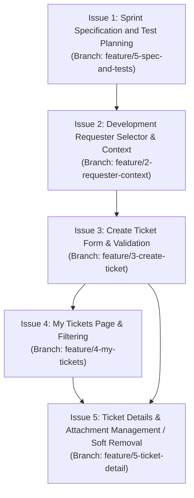

# TokTickIT Sprint 2 (Lab 2) — POC Scope and Implementation Plan

This document establishes the official sprint execution roadmap and decomposition of **TokTickIT Lab 2 (Sprint 2)** into five bounded GitHub Issues. 

All features originate from `TokTickIT-System-Level-SDS-v1.0.pdf` and `Lab_02_labsheet.pdf`, branch from and merge into `lab2-staging`, and preserve the complete Lab 1 baseline.

---

## Sprint Overview & Issue Dependency Flow

---

## Issue 1: Sprint Specification and Test Planning

* **Branch Name:** `feature/5-spec-and-tests`
* **Target Base Branch:** `lab2-staging`
* **Merge Order:** **1** (Must be completed, peer-reviewed, and merged before implementation begins)
* **Mapped Requirement IDs:**
  * **Labsheet:** Sec. 4.1 (What Contract Must Cover), Sec. 8.9 (Spec DD Deliverable), Sec. 8.10 (specification.md Sections), Sec. 9.1–9.2 (Test DD & tests.md), Sec. 10 (GitHub Issues & Workflow), Sec. 11.1 (AI Specification Agent Rules), Sec. 15–17 (Appendices A, B, C).
  * **SDS:** Sec. "Feature Specification Contract" (p. 19), Sec. "Specification Precedence" (p. 19), Sec. "Traceability and Change Control" (p. 20), Sec. "System-Level Review Checklist" (p. 20).

### Scope (Included)
1. Authoring the complete Sprint 2 specification suite in `docs/lab-02/`:
   * `source-evidence.md`: Comprehensive Specified/Missing/Conflict/Proposed Decision matrix.
   * `poc-scope-and-issues.md`: Detailed 5-issue implementation plan with scope, exclusions, ACs, and dependencies.
   * `specification.md`: Feature engineering specification covering sprint goal, stakeholder interpretation, included/excluded scope, numbered functional requirements (FR-01..), business rules (BR-01..), data models, API contract, and Definition of Done.
   * `ui-spec.md`: Complete Zen Green UI specification (color tokens, typography, spacing, responsive breakpoints, component states, and validation rules).
   * `api-spec.md`: Formal REST API contract (endpoints, HTTP methods, request/response DTOs, query parameters, error responses, and status codes).
   * `tests.md`: Software Test Specification (STS) with planned test table, AC-to-test traceability matrix, and visual/responsive checklist.
2. Setting up the GitHub Project Kanban board with the six mandatory columns: `Backlog`, `Specified`, `Started`, `PR Review`, `Fixing`, `Done`.
3. Creating the 5 GitHub Issue cards with initial requirements and Acceptance Criteria.

### Explicit Exclusions (Out of Scope)
* Writing or modifying any application code in `client/` or `server/`.
* Running database migrations or altering database schemas.
* Modifying existing Lab 1 baseline files (`client/src/App.tsx`, `server/src/app.ts`, `server/prisma/schema.prisma`).

### Acceptance Criteria
* **AC-01-01 (Specification Completeness):** Given the reference SDS and Labsheet, when the specification files in `docs/lab-02/` are reviewed, then all functional requirements (FR), business rules (BR), UI specifications, API endpoints, data models, and acceptance criteria are documented with zero unresolved critical ambiguities.
* **AC-01-02 (Test Traceability):** Given the sprint test specification `docs/lab-02/tests.md`, when audited, then every numbered Acceptance Criterion across all 5 sprint issues traces to at least one specific planned automated test file path.
* **AC-01-03 (Kanban Workflow Compliance):** Given the GitHub Project board, when inspected, then exactly six columns exist in order (`Backlog`, `Specified`, `Started`, `PR Review`, `Fixing`, `Done`) per the GitHub Workflow Guide.

---

## Issue 2: Development Requester Selector & Context

* **Branch Name:** `feature/2-requester-context`
* **Target Base Branch:** `lab2-staging`
* **Merge Order:** **2** (Foundational for all subsequent features that require requester context)
* **Mapped Requirement IDs:**
  * **Labsheet:** Sec. 1 (p. 1), Sec. 3 (p. 3), Sec. 4.1 (p. 3), Sec. 4.3 (**BR-03**), Sec. 5.3 (p. 6-7), Sec. 6 (p. 7), Sec. 8.1 (p. 9), Sec. 11.2 (p. 17), Sec. 14 Part 5 & 6, **AC-02**.
  * **SDS:** Approved Decisions **D-04/D-05** (deferred real auth/sessions), Sec. "Shared Components and Boundaries - Authentication" (p. 7), Sec. "Frontend Structure" (p. 13).

### Scope (Included)
1. **Database Model & Seed Data:**
   * Introduce a `RequesterUser` (or `User`) model in `server/prisma/schema.prisma` with fields: `id` (Int/UUID), `email` (unique String), `displayName` (String), `department` (optional String), `isActive` (Boolean, default `true`), and timestamps.
   * Seed data in `server/prisma/seed.ts` containing at least 4 active Requesters (e.g. Jennifer Anderson, Michael Brown, David Lee, Sarah Johnson) and at least 1 inactive Requester (e.g. Inactive User), runnable repeatedly without duplicates.
2. **Backend API:**
   * Implement `GET /api/v1/requesters` returning HTTP 200 with an array of active requesters (`where: { isActive: true }`). Inactive requesters must be excluded.
3. **Frontend Presentation & State:**
   * Create a `RequesterContext` (and provider) managing `currentRequester`, storing the selection in `sessionStorage` so browser refresh preserves test identity.
   * Build the **Development Requester Selection Screen / Modal** displaying TokTickIT title, clear explanation that this is a Lab 2 testing mechanism and not authentication, dropdown populated with active requesters from PostgreSQL, and a "Continue" button.
   * Handle states: Loading spinner, empty state (if no active requesters exist), and safe API failure state.
   * Application header integration: Render active requester name and a "Change Requester" action button to switch testing context.
4. **Automated Verification Tests:**
   * Server API tests: `server/tests/lab-02/requesters.api.test.ts` (verifying active filtering and exclusion of inactive users).
   * Client component tests: `client/tests/lab-02/RequesterSelector.test.tsx` (verifying dropdown loading, selection, empty state, and switching).

### Explicit Exclusions (Out of Scope)
* Real login/logout authentication with passwords or Argon2id password hashing.
* Server-side session tokens, HttpOnly cookies, or JWT verification.
* IT Staff or Administrator role workflows.
* User registration, profile editing, or administrative user management.

### Acceptance Criteria
* **AC-02-01 (Idempotent Seed):** Given the database seed is executed, when inspected in PostgreSQL, then at least 4 active requesters and at least 1 inactive requester exist, and running the seed multiple times creates no duplicates.
* **AC-02-02 (Active Requester Filtering):** Given the `GET /api/v1/requesters` endpoint is requested, when executed, then HTTP 200 is returned with a JSON array containing all active requesters, and all inactive requesters (`isActive: false`) are strictly omitted.
* **AC-02-03 (Mandatory Selection Guard):** Given no development requester is selected, when a user accesses the ticketing application, then the Development Requester selection view is displayed and access to ticketing features is blocked until a requester is chosen.
* **AC-02-04 (Context Display):** Given an active requester is selected and confirmed, when the main app view loads, then the application shell header displays the active requester's display name and provides a visible "Change Requester" action.
* **AC-02-05 (Context Switching Isolation):** Given a user clicks "Change Requester" and selects a different requester, when confirmed, then all previously displayed ticket data is cleared and the application reloads data specifically for the new requester context.
* **AC-02-06 (Empty & Failure States):** Given the API returns an empty list or encounters an error, when the selector loads, then clear user-friendly feedback is displayed (empty message or safe failure banner) without crashing.

---

## Issue 3: Create Ticket Form & Validation

* **Branch Name:** `feature/3-create-ticket`
* **Target Base Branch:** `lab2-staging`
* **Merge Order:** **3** (Requires Issue 2)
* **Mapped Requirement IDs:**
  * **Labsheet:** Sec. 1 (p. 1), Sec. 3 (p. 3), Sec. 4.3 (**BR-01, BR-02**), Sec. 4.4 (Required Fields & Validation, p. 4-5), Sec. 5.1–5.3 (p. 6), Sec. 6 (p. 7), Sec. 8.2 & 8.3 (p. 10), Sec. 14 Part 6 (p. 19), **AC-01**.
  * **SDS:** Approved Decision **D-02** (Initial status `New`), Approved Decision **D-03** (Priority vocabulary), Approved Decision **D-10** (Ticket number format `TKT-YYYY-NNNNN`), Sec. "Domain Data Model" (Ticket entity, p. 7), Sec. "Concurrency and Transactions" (p. 9), Sec. "Authorization Model" (Requester create = Yes, p. 10), Sec. "API Design Standards" (p. 12).

### Scope (Included)
1. **Database Schema & Reference Data:**
   * Add `RelatedSystem` model (`id`, `name`, `description`, `isActive`, `createdAt`) in `schema.prisma`.
   * Seed at least 6 realistic Related Systems idempotently: `Email`, `Campus Wi-Fi`, `VPN`, `LEB2 App`, `Grade Submission App`, `Printer`, `Corporate Laptop`.
   * Add `Ticket` model with fields: `id`, `ticketNo` (unique String), `summary` (String), `description` (String), `categoryId` (FK to Category), `relatedSystemId` (FK to RelatedSystem), `requestedPriority` (Enum: `LOW`, `MEDIUM`, `HIGH`, `URGENT`), `itPriority` (Enum), `status` (Enum: default `NEW`), `requesterId` (FK to RequesterUser), `version` (Int, default 1), and timestamps.
2. **Ticket Number Generator Service:**
   * Implement transactional `generateTicketNumber()` utility producing format `TKT-YYYY-NNNNN` with annual sequence reset logic.
3. **Backend API:**
   * `GET /api/v1/related-systems`: Returns active related systems.
   * `POST /api/v1/tickets`: Accepts ticket payload, validates input, assigns active `requesterId`, generates unique `ticketNo`, sets initial `status = NEW`, initializes `version = 1`, and returns HTTP 201 with the created ticket DTO.
4. **Frontend UI (Create Ticket Screen):**
   * Responsive layout conforming to Zen Green UI guidelines (Section 8.2 & 8.3).
   * Fields: Read-only system-generated values (Ticket Number placeholder, Ticket Date, Requester display name), Category dropdown, Related System dropdown, Requested Priority dropdown, Summary text input, Description textarea.
   * Form styling: Labels above inputs, red asterisks on required fields, dark red validation error text placed immediately below invalid fields.
   * Submitting busy state: Submit button displays a spinner and is disabled during submission to prevent duplicate creation.
   * Success state: Clear feedback modal/banner showing the official Ticket Number and navigation action to "View in My Tickets" or "Create Another".
   * Safe error handling: Preserves entered form values if an API error occurs.
5. **Automated Verification Tests:**
   * Generator unit tests: Verify `TKT-YYYY-NNNNN` format, padding, and annual reset.
   * API integration tests: `server/tests/lab-02/create-ticket.api.test.ts` (happy path 201, missing field validation 422, invalid priority 422).
   * Client component tests: `client/tests/lab-02/CreateTicket.test.tsx` (validation messages, submitting busy state, data preservation on error, success state).

### Explicit Exclusions (Out of Scope)
* Requester editing `IT Priority` directly (defaults to match `Requested Priority`).
* Assigning Ticket Owner during creation (owner is null/unassigned initially).
* Transitioning ticket status beyond `New`.
* Adding Public Comments, Internal Notes, or Actions Taken.

### Acceptance Criteria
* **AC-03-01 (Successful Creation & Number Generation):** Given valid ticket data (Summary, Description, Category, Related System, Requested Priority) for the selected Requester, when submitted, then one Ticket is saved in PostgreSQL with status `New`, version `1`, matching `requesterId`, and the API returns HTTP 201 with an official Ticket Number in format `TKT-YYYY-NNNNN`.
* **AC-03-02 (Server & Client Validation):** Given an invalid submission (e.g. empty summary, summary < 5 characters, or missing category), when submitted, then field-specific error messages appear immediately below the invalid inputs, the API returns HTTP 422/400, and no ticket is persisted.
* **AC-03-03 (Duplicate Submission Prevention):** Given the user clicks the Submit button, when the request is in flight, then the button becomes disabled and shows a busy state (spinner / `Submitting...`) until processing completes.
* **AC-03-04 (Error Data Preservation):** Given a backend failure or network disconnection during ticket submission, when the error response is received, then a safe error alert is displayed, and all previously entered field values are retained in the form.
* **AC-03-05 (Success Feedback):** Given a successful ticket creation, when the confirmation renders, then the official system-generated Ticket Number is prominently displayed with a link/action to view the ticket.

---

## Issue 4: My Tickets Page & Filtering

* **Branch Name:** `feature/4-my-tickets`
* **Target Base Branch:** `lab2-staging`
* **Merge Order:** **4** (Requires Issue 2 and Issue 3)
* **Mapped Requirement IDs:**
  * **Labsheet:** Sec. 1 (p. 1), Sec. 3 (p. 3), Sec. 6 & 6.1 (p. 7), Sec. 8.4 (p. 10-11), Sec. 8.7 (p. 12), Sec. 14 Part 7 (p. 20), **AC-02, AC-03**.
  * **SDS:** Sec. "Authorization Model" (Requester view own tickets only, p. 10), Sec. "API Design Standards" (Pagination, filtering, sort whitelist, p. 12), Sec. "KMUTT Theme Tokens" (p. 13).

### Scope (Included)
1. **Backend API (Ticket List Endpoint):**
   * Implement `GET /api/v1/tickets` scoped to the current requester (`where: { requesterId }`).
   * Support query parameters: `search` (case-insensitive search across `ticketNo`, `summary`, and `description`), `categoryId`, `requestedPriority`, `itPriority`, `status`, `sortBy` (whitelist: `ticketNo`, `createdAt`, `updatedAt`, `status`), `sortOrder` (`asc`/`desc`, default `desc`), `page` (default 1), and `limit` (default 10).
   * Return pagination metadata: `{ data: Ticket[], pagination: { totalItems, totalPages, currentPage, pageSize } }`.
2. **Frontend UI (My Tickets Screen):**
   * Responsive layout conforming to Zen Green UI guidelines (Section 8.4 & 8.7).
   * Filter controls: Search textbox with debounce, Category dropdown ("All Categories"), Requested Priority dropdown ("All Priorities"), IT Priority dropdown ("All Priorities"), Status dropdown ("All Statuses"), Clear Filters button, and a primary "+ Create Ticket" navigation action.
   * Data display (9 columns on desktop): Ticket No, Created Date, Summary, Category, Requested Priority, IT Priority, Current Status, Ticket Owner, Last Updated.
   * Clickable Ticket No / row navigating to the Ticket Detail screen.
   * Zen Green styled status and priority badges (pairing color with explicit text labels).
   * Visual states:
     * Loading state: skeleton loader or spinner while fetching data.
     * Empty state: Friendly message when requester has 0 total tickets with a prominent "+ Create Ticket" call-to-action.
     * No-results state: Distinct message when filters yield 0 matches with a "Clear Filters" button.
     * Error state: Informative alert if the ticket list API fails to load.
   * Responsive behavior: Full tabular view on desktop ($\ge 992\text{px}$), responsive table/stacked rows on tablet (768–991px), and ticket cards on mobile ($< 768\text{px}$) with zero horizontal scrolling.
3. **Cross-Requester Ownership Filtering:**
   * Backend strictly enforces `where: { requesterId: currentRequester.id }`.
   * Switching requester in the UI immediately re-fetches tickets for the new requester. Requester A's tickets must never appear to Requester B.
4. **Automated Verification Tests:**
   * Server API tests: `server/tests/lab-02/my-tickets.api.test.ts` (verifying pagination, search, category/status filters, sort order, and requester ownership isolation).
   * Client component tests: `client/tests/lab-02/MyTickets.test.tsx` (verifying table rendering, search/filter interactions, clear filters action, empty state vs no-results state, and context switching).

### Explicit Exclusions (Out of Scope)
* Viewing tickets owned by other requesters (global IT Staff triage queue).
* In-line editing of ticket details, priorities, or statuses directly from the list view.
* Bulk deletion or bulk status actions.

### Acceptance Criteria
* **AC-04-01 (Requester Ownership Scoping):** Given Requester A is selected, when My Tickets loads, then only tickets where `requesterId == RequesterA.id` are returned and displayed.
* **AC-04-02 (Context Switch Isolation):** Given Requester A's ticket list is visible, when the user switches context to Requester B, then Requester A's tickets disappear and only Requester B's tickets (or empty state) are shown.
* **AC-04-03 (Search & Filter Querying):** Given query filters (e.g. search keyword, category, status), when applied, then the ticket list dynamically updates to show only tickets satisfying all criteria, and pagination reflects the filtered count.
* **AC-04-04 (No-Results State):** Given a filter combination matches zero tickets for the active requester, when rendered, then a distinct "No tickets match your filter criteria" message and a "Clear Filters" button are displayed.
* **AC-04-05 (Accessible Badges):** Given status and priority columns, when rendered, then values display both compliant Zen Green colors and readable text labels (e.g. "Low", "Medium", "High", "Urgent", "New") without relying on color alone.

---

## Issue 5: Ticket Details & Attachment Management / Soft Removal

* **Branch Name:** `feature/5-ticket-detail`
* **Target Base Branch:** `lab2-staging`
* **Merge Order:** **5** (Requires Issue 3 and Issue 4)
* **Mapped Requirement IDs:**
  * **Labsheet:** Sec. 1 (p. 1), Sec. 3 (p. 3), Sec. 4.5 (Attachment Rules, p. 5), Sec. 6 (p. 7), Sec. 8.5 (p. 11), Sec. 14 Part 8 (p. 20), **AC-03**.
  * **SDS:** Approved Decision **D-06** (SeaweedFS storage, DB stores metadata), Approved Decision **D-11** (Immediate binary removal, metadata retention), Sec. "Domain Data Model" (Attachment tombstone & TicketEvent, p. 7-8), Sec. "Authorization Model" (Requester view own, delete own attachment, p. 10), Sec. "Attachment Architecture" (Upload Controls & Removal/Audit Sequence, p. 14-15), Sec. "Event and Audit Model" (p. 15), Sec. "Mandatory Business-Rule Tests" (p. 17-18).

### Scope (Included)
1. **Database Schema & Audit Models:**
   * Add `Attachment` model in `schema.prisma`: `id` (UUID/Int), `ticketId` (FK), `uploadedById` (FK to RequesterUser), `originalFilename` (String), `mimeType` (String), `sizeBytes` (Int), `storageKey` (String), `deletedAt` (DateTime nullable), `deletedById` (Int/UUID nullable), timestamps.
   * Add `TicketEvent` model in `schema.prisma`: `id` (UUID/Int), `ticketId` (FK), `actorId` (FK to RequesterUser), `eventType` (String, e.g. `ATTACHMENT_ADDED`, `ATTACHMENT_REMOVED`), `payloadJson` (String / Json), `createdAt` (DateTime).
2. **Storage Adapter Service:**
   * Implement local storage service abstraction supporting save, stream/download, and immediate delete of file binaries.
3. **Backend APIs:**
   * `GET /api/v1/tickets/:id`: Retrieves ticket details if `ticket.requesterId == currentRequester.id`. Rejects unauthorized access (HTTP 403/404).
   * `POST /api/v1/tickets/:id/attachments`: Handles multipart upload with validation (max 5 MB, max 5 active attachments per ticket, allowed types: JPG/JPEG, PNG, WEBP, PDF). Stores binary, records metadata, returns HTTP 201.
   * `GET /api/v1/tickets/:id/attachments/:attachmentId`: Authorizes requester; streams active binary. If soft-removed (`deletedAt !== null`), returns HTTP 404/410.
   * `POST /api/v1/tickets/:id/attachments/:attachmentId/remove` (or `DELETE`): Validates requester ownership and non-empty removal reason. In a single Prisma transaction, marks `deletedAt = now()` and `deletedById = currentRequester.id`, and appends `ATTACHMENT_REMOVED` TicketEvent. Immediately deletes binary file from storage.
4. **Frontend UI (Ticket Detail & Attachment Screen):**
   * Responsive layout conforming to Zen Green UI guidelines (Section 8.5 & 8.7).
   * Read-only presentation of ticket attributes: Ticket No, Created Date, Category, Related System, Requester, Requested Priority, IT Priority, Current Status, Ticket Owner, Summary, Description, Resolution Summary.
   * Attachment management panel:
     * List of active attachments with filename, formatted size, and upload date.
     * Download button for active attachments.
     * File upload input with client-side validation (5MB size, allowed extensions, 5-file maximum guard).
     * Remove button on owned attachments triggering a confirmation modal requiring a mandatory removal reason.
     * Removed attachments / audit section displaying tombstones (filename, removed by, timestamp, removal reason) with download actions strictly disabled/hidden.
5. **Cross-Requester Security Checks:**
   * Direct URL access to `GET /api/v1/tickets/:id` or attachment endpoints for a ticket owned by another requester is strictly denied (HTTP 403/404).
6. **Automated Verification Tests:**
   * API tests: `server/tests/lab-02/attachments.api.test.ts` (upload validation, max 5 limit, 5MB limit, soft removal transaction, binary deletion, 404 on removed download, cross-requester access rejection).
   * Client component tests: `client/tests/lab-02/RequesterTicketDetail.test.tsx` and `client/tests/lab-02/AttachmentSection.test.tsx` (detail rendering, removal modal, reason validation, removed file presentation).

### Explicit Exclusions (Out of Scope)
* Modifying ticket attributes (Summary, Description, Category) in view mode.
* Changing ticket status (Resolve, Close, Cancel, Reopen) — Requesters cannot resolve or close tickets.
* Public Comments, Internal Notes, or Actions Taken tabs (deferred to later labs).
* Deleting another user's attachments (Requesters only delete their own attachments on non-Closed tickets).

### Acceptance Criteria
* **AC-05-01 (Owned Ticket Detail Retrieval):** Given Requester A is selected and owns Ticket 1, when navigating to Ticket 1 Detail, then complete read-only ticket attributes and active attachments are displayed.
* **AC-05-02 (Cross-Requester Ticket Protection):** Given Requester B is selected, when Requester B attempts to access Ticket 1 (owned by Requester A) via API or direct navigation, then the request is rejected with HTTP 403/404 and no ticket details are revealed.
* **AC-05-03 (Attachment Upload Validation & Limits):** Given an attachment file exceeding 5MB, an unsupported file extension (e.g. `.exe`, `.txt`), or an upload to a ticket that already has 5 active files, when upload is attempted, then the request is rejected with a descriptive error message and the file is not stored.
* **AC-05-04 (Mandatory Removal Reason):** Given an active attachment owned by the requester, when the user clicks Remove, then a confirmation dialog appears requiring a non-empty removal reason before removal can be confirmed.
* **AC-05-05 (Soft-Removal Transaction & Binary Deletion):** Given a confirmed attachment removal with reason, when processed, then the attachment row is updated with `deletedAt` and `deletedById`, an `ATTACHMENT_REMOVED` TicketEvent is persisted in the same transaction, the physical binary is deleted from storage, and subsequent download attempts return HTTP 404/410.
* **AC-05-06 (Cross-Requester Attachment Protection):** Given Requester B is selected, when Requester B attempts to download an attachment from a ticket owned by Requester A, then the download is rejected with HTTP 403/404.

---

## Sprint 2 Execution & Merge Schedule

| Step | Issue | Branch Name | Dependency | Target Branch | Verification Requirement |
| :---: | :--- | :--- | :--- | :--- | :--- |
| **1** | **Issue 1** | `feature/5-spec-and-tests` | None | `lab2-staging` | All specification docs complete; AC-to-test traceability verified; Kanban columns setup. |
| **2** | **Issue 2** | `feature/2-requester-context` | Issue 1 | `lab2-staging` | Seed idempotency verified; active filtering API tests pass; context selector UI tests pass. |
| **3** | **Issue 3** | `feature/3-create-ticket` | Issue 2 | `lab2-staging` | Ticket Number format unit tests pass; create ticket API tests pass; form validation & busy state pass. |
| **4** | **Issue 4** | `feature/4-my-tickets` | Issue 3 | `lab2-staging` | List API query/filter/page tests pass; cross-requester list isolation verified; UI responsive tests pass. |
| **5** | **Issue 5** | `feature/5-ticket-detail` | Issue 3, 4 | `lab2-staging` | Attachment upload/download/soft-remove tests pass; cross-requester 403/404 tests pass; UI detail tests pass. |
| **6** | **Release** | `lab2-staging` $\rightarrow$ `main` | All Issues | `main` | Full suite pass (`npm test` in client and server); Playwright E2E smoke tests pass; Release PR peer-reviewed. |
