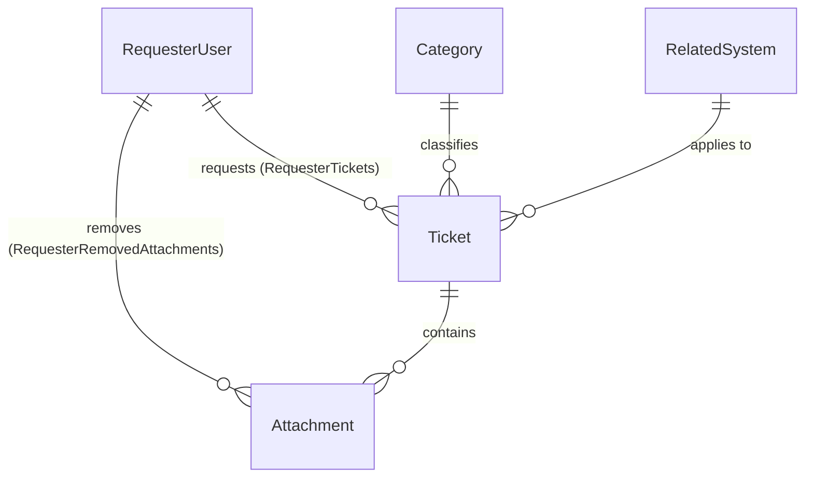

# TokTickIT Sprint 2 (Lab 2) — Sprint Engineering Specification

## 1. Sprint Goal
Deliver a robust, professional, and responsive Requester-facing Minimum Viable Product (MVP) for the **TokTickIT** IT Service Desk. The increment enables simulated Development Requesters to create IT support tickets with permitted attachments, receive unique system-generated Ticket Numbers, view their owned tickets with search, filtering, sorting, and pagination, inspect ticket details, and manage attachments under strict soft-removal and cross-requester security rules using the **Zen Green** design language.

---

## 2. Stakeholder Request Interpretation
The IT department requires a self-service ticketing interface for end-users (Requesters) prior to the implementation of full corporate authentication in Sprint 3. The stakeholder mandates:
* A simulated **Development Requester** context selector to represent authenticated users during testing.
* A streamlined **Create Ticket** form capturing problem categorization, affected system, priority, description, and supporting attachments.
* A **My Tickets** history screen enabling Requesters to track and locate their own submissions.
* A read-only **Ticket Detail** screen supporting attachment addition, download, and audited soft-removal.
* Strict multi-tenant security preventing any Requester from viewing, querying, or downloading another Requester's tickets or files.
* A cohesive **Zen Green** visual identity with responsive support across desktop, tablet, and mobile devices.

---

## 3. Scope

### 3.1 Included Scope
1. **Development Requester Simulation:** Persistent context selector modal/dropdown loading active requesters from PostgreSQL, displaying active user in the app shell, and enabling context switching.
2. **Ticket Creation Form:** Capture Ticket Summary, Description, Category, Related System, and Requested Priority; read-only display of generated Ticket Number, Ticket Date, and Requester; multi-file attachment selection.
3. **Ticket Number Generation:** Transactional backend generation of unique numbers in format `TKT-YYYY-NNNNN` with an annual sequence reset.
4. **My Tickets History:** Requester-isolated paginated list view with search across summary/number, category filter, priority filter, status filter, sorting, and pagination controls.
5. **Ticket Detail View:** Read-only inspection of owned ticket attributes and status badges.
6. **Attachment Management:** Upload validation (max 5 MB per file, max 5 active files per ticket, JPG/PNG/WEBP/PDF only), secure streaming download for active files, and soft-removal requiring a mandatory reason.
7. **Audit Logging:** Transactional creation of `ATTACHMENT_REMOVED` TicketEvent on soft-removal.
8. **Responsive UI:** Full desktop layout ($\ge 992\text{px}$), adaptive tablet layout ($768 - 991\text{px}$), and mobile stacked cards ($< 768\text{px}$) adhering to Zen Green theme tokens.

### 3.2 Explicitly Excluded Scope
* Passwords, password hashing (Argon2id), login/logout sessions, HttpOnly cookies, JWT tokens, and role-based permissions (deferred to Lab 3).
* IT Staff workflows: IT Staff dashboard/queue, claiming or assigning tickets, adjusting IT Priority, or resolving tickets.
* Ticket collaboration features: Public Comments, Internal Notes, and Actions Taken.
* Ticket lifecycle transitions beyond initial `New` status (no closing, cancelling, or reopening in Lab 2).
* Administrative functions: User management, category management, and administrative audit logs.

---

## 4. Functional Requirements

* **FR-01 (Requester Context Selection):** The system shall allow the user to select an active Development Requester from PostgreSQL before accessing ticketing features.
* **FR-02 (Requester Context Switching):** The system shall allow the user to change the active Requester at any time; switching context shall immediately clear all ticket and attachment views and reload data for the newly selected Requester.
* **FR-03 (Ticket Drafting & Input Capture):** The system shall capture Category, Related System, Requested Priority, Ticket Summary, and Description on the Create Ticket screen.
* **FR-04 (Ticket Creation & Persistence):** The system shall persist valid ticket submissions in PostgreSQL with initial status `New`, `version = 1`, and associate the ticket with the active Requester.
* **FR-05 (Ticket Number Assignment):** Upon successful submission, the system shall generate and return an official, unique Ticket Number formatted as `TKT-YYYY-NNNNN`.
* **FR-06 (My Tickets List Retrieval):** The system shall provide a paginated list of tickets owned strictly by the currently selected Requester.
* **FR-07 (Ticket Search & Filtering):** The system shall filter the Requester's ticket list by search term (matching summary, ticket number, or description), category, requested priority, IT priority, and current status.
* **FR-08 (Ticket Sorting & Pagination):** The system shall support sorting by ticket number, creation date, and status, and provide pagination with metadata (total items, total pages, current page, page size).
* **FR-09 (Ticket Detail Retrieval):** The system shall retrieve complete read-only details of a ticket only if the ticket is owned by the active Requester.
* **FR-10 (Attachment Upload & Validation):** The system shall allow uploading attachments during or after ticket creation, validating file extension, declared MIME type, file size ($\le 5\text{ MB}$), and active file count ($\le 5$).
* **FR-11 (Attachment Download):** The system shall stream active attachment binaries to authorized Requesters who own the parent ticket.
* **FR-12 (Attachment Soft-Removal):** The system shall permit the Requester to soft-remove their own attachment on non-Closed tickets by providing a mandatory removal reason.
* **FR-13 (Soft-Removal Audit Trail):** Upon soft-removal, the system shall retain the attachment metadata record, record `isRemoved = true`, `removalReason`, `removedAt`, and `removedByRequesterId`, delete the physical binary from storage, and create an immutable `ATTACHMENT_REMOVED` TicketEvent in the same database transaction.
* **FR-14 (Download Blocking on Removed Attachments):** The system shall reject download or preview requests for soft-removed attachments with HTTP 404/410.
* **FR-15 (Cross-Requester Security Enforcement):** The backend shall reject any attempt by Requester B to view, query, download, or delete tickets or attachments owned by Requester A with HTTP 403 Forbidden or HTTP 404 Not Found.

---

## 5. Business Rules

* **BR-01 (Ticket Number Format):** The official Ticket Number is generated by the backend in the format `TKT-YYYY-NNNNN`, where `YYYY` is the 4-digit calendar year and `NNNNN` is a 5-digit sequential number padded with leading zeros (e.g. `TKT-2026-00001`). The sequence resets annually on January 1st and is generated transactionally to prevent duplicates (*SDS Approved Decision D-10*).
* **BR-02 (Initial Ticket Status):** Every newly created ticket must begin with status `New` (*SDS Approved Decision D-02; Labsheet BR-02*).
* **BR-03 (Development Requester Simulation):** Lab 2 uses a Development Requester selector instead of login. The identity is for testing only and is not authentication. Only active users (`isActive == true`) can be selected (*Labsheet BR-03, Sec. 5.3*).
* **BR-04 (Priority Hierarchy):** Requesters control `Requested Priority` (`LOW`, `MEDIUM`, `HIGH`, `URGENT`). `IT Priority` is controlled by IT Staff; upon ticket creation, `IT Priority` is automatically initialized to match `Requested Priority` (*SDS p. 12*).
* **BR-05 (Field Length & Content Boundaries):**
  * Ticket Summary: Required, trimmed length between 5 and 100 characters.
  * Ticket Description: Required, trimmed length between 10 and 2000 characters.
* **BR-06 (Attachment Constraints):**
  * Allowed file extensions and MIME types: `.jpg`, `.jpeg` (`image/jpeg`), `.png` (`image/png`), `.webp` (`image/webp`), and `.pdf` (`application/pdf`).
  * Maximum size per file: exactly 5 MB ($5 \times 1024 \times 1024 = 5,242,880$ bytes).
  * Maximum active attachments per ticket: exactly 5 files (*SDS p. 14; Labsheet Sec. 4.5*).
* **BR-07 (Attachment Soft-Removal Invariants):**
  * Soft-removed attachments remain visible as metadata in ticket history but cannot be downloaded or previewed.
  * Physical binary file is immediately deleted from storage upon soft-removal (*SDS Approved Decision D-11*).
  * Removal requires an explicit confirmation and a mandatory removal reason of at least 5 characters.
  * Creates an immutable `ATTACHMENT_REMOVED` TicketEvent in the same database transaction.
* **BR-08 (Strict Cross-Requester Isolation):** A Requester may only view, list, and interact with tickets where `requesterId == currentRequesterId`. Requests for tickets or attachments belonging to other users must be denied by backend domain logic (*SDS p. 10; Labsheet AC-03*).
* **BR-09 (Duplicate Submission Prevention):** The UI submit button must display a busy spinner and be disabled during processing. Double-click submissions must be blocked (*Labsheet Sec. 8.3*).
* **BR-10 (Error Data Preservation):** In the event of a recoverable submission error or network failure, all user-entered field values must be preserved in the form (*SDS p. 13; Labsheet Sec. 8.3*).
* **BR-11 (Optimistic Concurrency):** Tickets have an integer `version` field initialized to 1 and incremented on modification. Stale updates return HTTP 409 Conflict (*SDS p. 7, 9*).

---

## 6. UI Specification Summary
The UI implements the KMUTT **Zen Green** design language defined in [docs/lab-02/ui-spec.md](file:///c:/Users/xande/Documents/Year%203%20Sem%201/CPE%20334/Lab%201/toktickit/docs/lab-02/ui-spec.md):
* **Palette:** Primary green `#006B3C`, Secondary green `#0B7A46`, Pale green `#EAF6EF`, Background `#F5F7F6`, White card surface `#FFFFFF`, Primary text `#1F2937`, Error `#B3261E`.
* **Typography:** System font stack (`system-ui, -apple-system, sans-serif`), H1: 24px bold, H2: 18px semi-bold, Labels: 14px semi-bold, Body: 14px regular, Validation: 12px regular (**DEC-UI-01, DEC-UI-04**).
* **Form & Field Styling:** 38px uniform control height, 6px border-radius, Zen Green focus ring (`0 0 0 3px rgba(11, 122, 70, 0.2)`), read-only fields shaded `#F5F7F6`, required red asterisks (`*`) (**DEC-UI-05, DEC-UI-06**).
* **Responsive Breakpoints:**
  * **Desktop ($\ge 992\text{px}$):** Centered `1200px` container (`container-xl`), 9-column ticket table with pale green row hover (**DEC-UI-02, DEC-UI-07, DEC-UI-08**).
  * **Tablet ($768 - 991\text{px}$):** Adaptive 2-column form layout; compact table.
  * **Mobile ($< 768\text{px}$):** Stacked single-column fields, responsive ticket cards eliminating horizontal scroll, collapsible hamburger navigation bar (**DEC-UI-10, DEC-UI-11**).
* **States & Accessibility:** Shimmering skeleton loading placeholders (**DEC-UI-15**), illustrated empty and no-results cards (**DEC-UI-16**), pill badges with semantic micro-icons for non-color status indication (**DEC-UI-19**), accessible modal dialogs with focus trapping and `Escape` support (**DEC-UI-17**).

---

## 7. Data Changes & Prisma Schema

### 7.1 Entity Relationship Diagram


### 7.2 Prisma Models (`server/prisma/schema.prisma`)

```prisma
generator client {
  provider = "prisma-client-js"
}

datasource db {
  provider = "postgresql"
  url      = env("DATABASE_URL")
}

// ---------------------------------------------------------------------------
// 1. Requester User (Simulated Development Identity)
// ---------------------------------------------------------------------------
model RequesterUser {
  id                 Int          @id @default(autoincrement())
  name               String
  email              String       @unique
  department         String?
  isActive           Boolean      @default(true)
  createdAt          DateTime     @default(now())
  updatedAt          DateTime     @updatedAt

  // Relational Integrity
  tickets            Ticket[]     @relation("RequesterTickets")
  removedAttachments Attachment[] @relation("RequesterRemovedAttachments")

  @@map("requester_users")
}

// ---------------------------------------------------------------------------
// 2. Related System (Affected Campus IT Services)
// ---------------------------------------------------------------------------
model RelatedSystem {
  id        Int      @id @default(autoincrement())
  name      String   @unique
  isActive  Boolean  @default(true)
  createdAt DateTime @default(now())
  updatedAt DateTime @updatedAt

  // Relational Integrity
  tickets   Ticket[]

  @@map("related_systems")
}

// ---------------------------------------------------------------------------
// 3. Category (Problem Classification — Extended from Lab 1)
// ---------------------------------------------------------------------------
model Category {
  id          Int      @id @default(autoincrement())
  code        String?  @unique
  name        String   @unique
  description String?
  isActive    Boolean  @default(true)
  createdAt   DateTime @default(now())
  updatedAt   DateTime @updatedAt

  // Relational Integrity
  tickets     Ticket[]

  @@map("categories")
}

// ---------------------------------------------------------------------------
// 4. Ticket (Service Desk Incident / Request)
// ---------------------------------------------------------------------------
model Ticket {
  id                Int           @id @default(autoincrement())
  ticketNumber      String        @unique @db.VarChar(32) // Format: TKT-YYYY-NNNNN
  requesterId       Int
  categoryId        Int
  relatedSystemId   Int
  summary           String        @db.VarChar(100)
  description       String        @db.Text
  requestedPriority String        // Low, Medium, High, Urgent
  itPriority        String?       // Low, Medium, High, Urgent
  currentStatus     String        @default("New") // New, Assigned, In Progress, Pending Requester, Resolved, Closed, Cancelled
  createdAt         DateTime      @default(now())
  updatedAt         DateTime      @updatedAt

  // Relations
  requester         RequesterUser @relation("RequesterTickets", fields: [requesterId], references: [id], onDelete: Restrict)
  category          Category      @relation(fields: [categoryId], references: [id], onDelete: Restrict)
  relatedSystem     RelatedSystem @relation(fields: [relatedSystemId], references: [id], onDelete: Restrict)
  attachments       Attachment[]

  @@index([requesterId])
  @@index([currentStatus])
  @@map("tickets")
}

// ---------------------------------------------------------------------------
// 5. Attachment (Supporting File Metadata & Soft-Removal Tombstone)
// ---------------------------------------------------------------------------
model Attachment {
  id                   Int            @id @default(autoincrement())
  ticketId             Int
  originalFilename     String
  storedFilename       String         @unique
  mimeType             String
  fileSize             Int            // Size in bytes
  isRemoved            Boolean        @default(false)
  removalReason        String?        @db.Text
  removedAt            DateTime?
  removedByRequesterId Int?
  createdAt            DateTime       @default(now())
  updatedAt            DateTime       @updatedAt

  // Relations
  ticket               Ticket         @relation(fields: [ticketId], references: [id], onDelete: Cascade)
  removedByRequester   RequesterUser? @relation("RequesterRemovedAttachments", fields: [removedByRequesterId], references: [id], onDelete: SetNull)

  @@index([ticketId])
  @@map("attachments")
}

// ---------------------------------------------------------------------------
// 6. Ticket Number Sequence (Annual Sequence Reset for TKT-YYYY-NNNNN)
// ---------------------------------------------------------------------------
model TicketNumberSequence {
  year    Int @id
  nextVal Int @default(1)

  @@map("ticket_number_sequences")
}
```

### 7.3 Seed Specifications (`server/prisma/seed.ts`)
Must execute idempotently via `upsert`:
* **4 Categories:**
  1. `ACC`: Account and Access
  2. `HW`: Hardware
  3. `SW`: Software
  4. `NET`: Network
* **7 Related Systems:** `Email`, `Campus Wi-Fi`, `VPN`, `LEB2 App`, `Grade Submission App`, `Printer`, `Corporate Laptop`.
* **5 Thai Development Personas (Peer Reviewer Program):**
  1. Sompong IT (`sompong.it@kmutt.ac.th`, Department: Information Technology Office, `isActive: true`)
  2. Anong Staff (`anong.sta@kmutt.ac.th`, Department: Academic Affairs Office, `isActive: true`)
  3. Kittisak Student (`kittisak.stu@kmutt.ac.th`, Department: Computer Engineering Dept, `isActive: true`)
  4. Wichai Faculty (`wichai.fac@kmutt.ac.th`, Department: Department of Mathematics, `isActive: true`)
  5. Prasert Inactive (`prasert.ina@kmutt.ac.th`, Department: Human Resources Office, `isActive: false`)
* **5 Baseline Development Personas:**
  1. Jennifer Anderson (`jennifer.anderson@kmutt.ac.th`, Department: Computer Engineering, `isActive: true`)
  2. Michael Brown (`michael.brown@kmutt.ac.th`, Department: Information Technology, `isActive: true`)
  3. David Lee (`david.lee@kmutt.ac.th`, Department: Electrical Engineering, `isActive: true`)
  4. Sarah Johnson (`sarah.johnson@kmutt.ac.th`, Department: Science Faculty, `isActive: true`)
  5. Inactive Test User (`inactive.user@kmutt.ac.th`, Department: Registrar Office, `isActive: false`)

---

## 8. API Contract Summary

| Method | Endpoint Path | Description | Access / Security |
| :--- | :--- | :--- | :--- |
| `GET` | `/api/categories` | Retrieve all active ticket categories | Public |
| `GET` | `/api/related-systems` | Retrieve all active related systems | Public |
| `GET` | `/api/development-requesters` | Retrieve active simulated requesters (`isActive: true`) | Public (Testing only) |
| `POST` | `/api/tickets` | Create a new ticket for active requester | `x-requester-id` required |
| `GET` | `/api/tickets` | List tickets owned by active requester (search/filter/page) | `x-requester-id` required |
| `GET` | `/api/tickets/:id` | Get details of owned ticket | `x-requester-id` required (owned only) |
| `POST` | `/api/tickets/:id/attachments` | Upload attachment file to owned ticket | `x-requester-id` required (owned only) |
| `GET` | `/api/attachments/:id/download` | Stream binary of active attachment | `x-requester-id` required (owned only) |
| `DELETE` | `/api/attachments/:id` | Soft-remove attachment with reason | `x-requester-id` required (owned only) |

---

## 9. Acceptance Criteria

* **AC-01 (Successful Ticket Submission):** Given valid ticket data (Summary, Description, Category, Related System, Priority) for an active Requester, when the Requester submits the form, then one Ticket is saved with status `New`, version `1`, matching `requesterId`, and the official Ticket Number in format `TKT-YYYY-NNNNN` is displayed.
* **AC-02 (Required Field Validation):** Given an empty summary or description, when the Requester attempts to submit the form, then submission is halted, field-level error messages appear directly below the invalid inputs, and no API call or ticket creation occurs.
* **AC-03 (Length Boundary Validation):** Given a summary of 4 characters or a description of 9 characters, when submitted, then validation errors indicate minimum length requirements (Summary $\ge 5$, Description $\ge 10$) and submission is rejected.
* **AC-04 (Mandatory Requester Guard):** Given no Development Requester is currently selected, when the user visits `/tickets` or attempts to create a ticket, then the Development Requester Selection modal/screen is shown and access is blocked until a requester is chosen.
* **AC-05 (Inactive Requester Filtering):** Given the database contains active and inactive requesters, when the Development Requester dropdown loads, then only active requesters (`isActive == true`) are displayed and selectable.
* **AC-06 (Requester Switching Isolation):** Given Requester A is selected and viewing My Tickets, when the user switches context to Requester B, then Requester A's tickets disappear immediately and only Requester B's tickets (or empty state) are displayed.
* **AC-07 (My Tickets Scoping):** Given Requester A has created tickets and Requester B has created tickets, when `GET /api/tickets` is invoked with Requester A's context, then only Requester A's tickets are returned.
* **AC-08 (Search & Filter Querying):** Given active search terms or category/priority/status filters, when the ticket list is fetched, then the returned items match all criteria and pagination reflects the filtered count.
* **AC-09 (Sorting & Pagination):** Given multiple tickets, when navigating pages or selecting sort order, then items are paginated by the requested page size (default 10) and ordered correctly without duplicate entries.
* **AC-10 (Empty vs. No-Results Feedback):** Given a requester with 0 total tickets, the empty card with "+ Create Ticket" is shown; given an active filter matching 0 tickets, the no-results card with "Clear Filters" is shown.
* **AC-11 (Owned Ticket Detail Inspection):** Given an existing ticket owned by Requester A, when Requester A navigates to the Ticket Detail screen, then complete read-only ticket attributes, status badges, and active attachments are displayed.
* **AC-12 (Cross-Requester Ticket Access Rejection):** Given Requester B attempts to access `GET /api/tickets/:id` for a ticket owned by Requester A, then the backend rejects the request with HTTP 403 or 404 and no ticket data is returned.
* **AC-13 (Valid Attachment Upload):** Given a valid file ($\le 5\text{ MB}$, allowed type) and a ticket with $< 5$ active attachments, when uploaded, then the binary is stored, metadata is saved, and HTTP 201 is returned.
* **AC-14 (Attachment Size & Type Rejection):** Given a file $> 5\text{ MB}$ or an invalid file extension/MIME (e.g. `.exe`, `.txt`), when upload is attempted, then the upload is rejected with HTTP 400/422 and a clear error message.
* **AC-15 (Attachment Quantity Limit):** Given a ticket with 5 active attachments, when an upload of a 6th attachment is attempted, then the system rejects the upload stating the 5-file limit is reached.
* **AC-16 (Attachment Soft-Removal with Reason):** Given an active attachment owned by the requester, when the requester confirms removal and provides a reason ($\ge 5$ characters), then the attachment record is soft-deleted (`isRemoved = true`, `removalReason`, `removedAt`, `removedByRequesterId`), an `ATTACHMENT_REMOVED` TicketEvent is persisted in the same transaction, and the binary is deleted from storage.
* **AC-17 (Soft-Removed Download Block):** Given an attachment has been soft-removed, when any user attempts to download via `GET /api/attachments/:id/download`, then HTTP 404 or 410 is returned.
* **AC-18 (Cross-Requester Attachment Protection):** Given Requester B attempts to download an attachment belonging to Requester A's ticket, then HTTP 403 or 404 is returned.
* **AC-19 (Duplicate Submission Prevention):** Given the user clicks "Submit Ticket", when the asynchronous request is pending, then the submit button shows a busy spinner and is disabled, preventing double submission.
* **AC-20 (Form Value Preservation on Error):** Given an API or network failure during submission, when the error alert is displayed, then all previously typed user inputs in the form remain preserved.

---

## 10. Definition of Done (DoD)

### 10.1 Product Completion Criteria
1. All 15 Functional Requirements (FR-01..15) and 11 Business Rules (BR-01..11) implemented according to contract.
2. All 20 Acceptance Criteria (AC-01..20) satisfied with passing automated test evidence.
3. 100% automated test pass rate with zero skipped, disabled, or flaky tests across unit, API, component, and E2E suites.
4. Conformance to the **Zen Green** UI specification (`docs/lab-02/ui-spec.md`) and WCAG 2.2 Level AA accessibility standards.
5. Zero critical vulnerabilities or credential leaks; `.env.example` verified; `.gitignore` verified.

### 10.2 Course Delivery Criteria
1. Work decomposed into 5 GitHub Issues tracked across 6 Kanban columns (`Backlog`, `Specified`, `Started`, `PR Review`, `Fixing`, `Done`).
2. Feature branches branched from and merged into `lab2-staging` via peer-reviewed Pull Requests.
3. Reviewer merge agreement strictly followed (reviewer merges, author does not merge own PR).
4. `reviewer.md` and `ai-use.md` completed.
5. Final release Pull Request created from `lab2-staging` into `main`.

---

## 11. Assumptions & Design Decisions

1. **Entity Primary Key Types:** Standardized on `Int` autoincrement primary keys (`SERIAL`) across `Category`, `RequesterUser`, `RelatedSystem`, `Ticket`, and `Attachment` to match peer-reviewer compatibility and the course standard. Unique external identification for tickets is provided by the formatted `ticketNumber` (`TKT-YYYY-NNNNN`), and internal storage references for attachments use the `@unique` `storedFilename`.
2. **API Path Aliasing:** Routes are hosted at `/api/...` to strictly match Labsheet Section 6 conventions (`/api/tickets`, `/api/categories`, etc.), with backend support for `/api/v1/...` namespace mapping.
3. **Storage Strategy:** Attachment binaries are stored in a dedicated local directory using generated unique stored filenames behind an abstraction service, preparing the codebase for transparent drop-in of SeaweedFS S3 client in production.
4. **Database Indexes:** Indexed `Ticket(requesterId)` for instant ticket isolation; indexed `Ticket(currentStatus)` for optimized filtering; indexed `Attachment(ticketId)` for fast active attachment queries.
