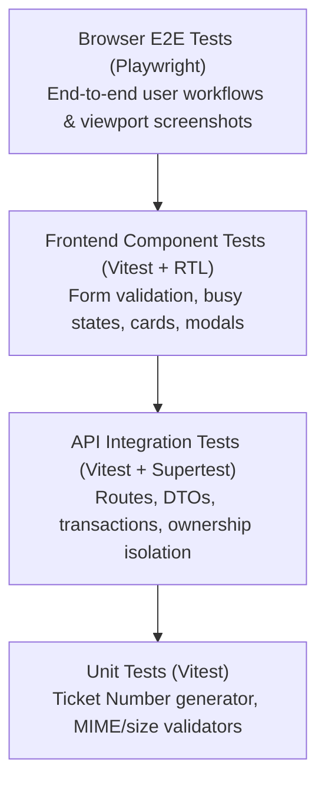

# TokTickIT Sprint 2 (Lab 2) — Software Test Specification (STS) & Test Plan

This document establishes the official test plan, acceptance-criterion traceability, and visual verification checklist for **TokTickIT Lab 2 (Sprint 2)**, strictly adhering to **Lab_02_labsheet.pdf** (Section 9 & Appendix B) and **TokTickIT-System-Level-SDS-v1.0.pdf** (Testing Architecture, p. 17).

---

## 1. Test Strategy

Testing follows a comprehensive multi-tiered verification pyramid ensuring complete functional correctness, visual fidelity, and security isolation:



* **Unit Tests (Vitest):** Pure domain logic, generators, formatters, and validators. Runs isolated in memory with zero database side-effects.
* **API Integration Tests (Vitest + Supertest):** Validates Express endpoints, payload schemas, HTTP status codes, Prisma transactional consistency, and backend cross-requester authorization rules against a dedicated test database.
* **UI Component Tests (Vitest + React Testing Library):** Verifies component rendering, user interactions, field-level validation error display, submit busy states, mobile card collapse, and modal focus trapping.
* **Visual & Responsive Verification:** Systematic verification of Zen Green theme tokens, typography hierarchy, and breakpoint adaptations (Desktop $\ge 992\text{px}$, Tablet $768 - 991\text{px}$, Mobile $< 768\text{px}$) with automated Playwright viewport screenshots.
* **End-to-End Tests (Playwright):** Full browser walkthroughs from Development Requester selection to ticket submission, list filtering, detail inspection, attachment upload, and soft-removal.

---

## 2. Planned Tests Table

| Test ID | Level | Requirement / AC | What It Tests | Expected Result | Automated Test File Path | Status |
| :--- | :--- | :--- | :--- | :--- | :--- | :--- |
| **UNIT-01** | Unit | BR-01, AC-01 | Ticket Number format and zero-padding | Produces string matching `TKT-YYYY-NNNNN` with 5-digit padding | `server/tests/lab-02/ticket-number.test.ts` | Planned |
| **UNIT-02** | Unit | BR-01 | Ticket Number annual sequence reset | Resets sequence to 1 when year increments | `server/tests/lab-02/ticket-number.test.ts` | Planned |
| **UNIT-03** | Unit | BR-06, AC-14 | Attachment file validator utility | Validates extension & MIME; rejects invalid types & size > 5MB | `server/tests/lab-02/attachment-validator.test.ts` | Planned |
| **API-01** | API | FR-01, AC-05 | `GET /api/development-requesters` | 200 OK; returns only active requesters (`isActive: true`) | `server/tests/lab-02/requesters.api.test.ts` | Planned |
| **API-02** | API | FR-04, BR-02, AC-01 | `POST /api/tickets` (Valid submission) | 201 Created; returns Ticket with unique `ticketNumber`, `currentStatus: New` | `server/tests/lab-02/create-ticket.api.test.ts` | Planned |
| **API-03** | API | BR-05, AC-02, AC-03 | `POST /api/tickets` (Validation boundaries) | 422 Unprocessable; rejects missing fields & length violations | `server/tests/lab-02/create-ticket.api.test.ts` | Planned |
| **API-04** | API | FR-06, BR-08, AC-07 | `GET /api/tickets` (Requester isolation) | 200 OK; strictly returns tickets matching `x-requester-id` | `server/tests/lab-02/my-tickets.api.test.ts` | Planned |
| **API-05** | API | FR-07, FR-08, AC-08, AC-09 | `GET /api/tickets` (Search, filter, page) | 200 OK; returns filtered results and pagination metadata | `server/tests/lab-02/my-tickets.api.test.ts` | Planned |
| **API-06** | API | FR-09, AC-11 | `GET /api/tickets/:id` (Owned detail) | 200 OK; returns full ticket details and attachment metadata | `server/tests/lab-02/ticket-detail.api.test.ts` | Planned |
| **API-07** | API | FR-15, BR-08, AC-12 | `GET /api/tickets/:id` (Cross-requester access) | 403 or 404; denies access when ticket belongs to another user | `server/tests/lab-02/ticket-detail.api.test.ts` | Planned |
| **API-08** | API | FR-10, BR-06, AC-13, AC-15 | `POST /api/tickets/:id/attachments` (Upload & limits) | 201 Created; rejects 6th file or files > 5MB with 422 | `server/tests/lab-02/attachments.api.test.ts` | Planned |
| **API-09** | API | FR-11, AC-18 | `GET /api/attachments/:id/download` | 200 OK with binary stream; 403 if requester not owner | `server/tests/lab-02/attachments.api.test.ts` | Planned |
| **API-10** | API | FR-12, FR-13, FR-14, AC-16, AC-17 | `DELETE /api/attachments/:id` (Soft-removal) | 200 OK; records reason, sets `isRemoved = true`, `removedAt`, `removedByRequesterId`, deletes file; download 410 | `server/tests/lab-02/attachments.api.test.ts` | Planned |
| **UI-01** | UI | FR-01, AC-04, AC-05 | Requester Selector modal & active filter | Displays active requesters; blocks main UI if unselected | `client/tests/lab-02/RequesterSelector.test.tsx` | Planned |
| **UI-02** | UI | FR-02, AC-06 | Requester context switching | Header shows user; switching clears and reloads ticket view | `client/tests/lab-02/RequesterContext.test.tsx` | Planned |
| **UI-03** | UI | BR-05, AC-02, AC-03 | Create Ticket form inline validation | Field errors appear under inputs; API is not called | `client/tests/lab-02/CreateTicket.test.tsx` | Planned |
| **UI-04** | UI | BR-09, AC-19 | Create Ticket busy & disabled state | Submit button shows spinner and disables on click | `client/tests/lab-02/CreateTicket.test.tsx` | Planned |
| **UI-05** | UI | BR-10, AC-20 | Form value retention on API failure | Shows alert banner; typed inputs are preserved in fields | `client/tests/lab-02/CreateTicket.test.tsx` | Planned |
| **UI-06** | UI | FR-07, AC-10 | My Tickets empty vs no-results states | Shows 0-ticket card or 0-filter card with Clear Filters action | `client/tests/lab-02/MyTickets.test.tsx` | Planned |
| **UI-07** | UI | FR-09, AC-11 | Ticket Detail read-only presentation | Renders read-only fields; confirms no comments/actions tabs | `client/tests/lab-02/RequesterTicketDetail.test.tsx` | Planned |
| **UI-08** | UI | FR-12, AC-16 | Attachment removal modal & reason validation | Requires confirmation and $\ge 5$ char reason before submit | `client/tests/lab-02/AttachmentSection.test.tsx` | Planned |
| **E2E-01** | E2E | AC-01, AC-04, AC-07 | Full create-and-view flow | Requester creates ticket, sees number, finds it in My Tickets | `e2e/lab-02/requester-ticket-flow.spec.ts` | Planned |
| **E2E-02** | E2E | AC-06, AC-12 | Cross-requester security isolation | Requester A tickets and attachments are invisible to Requester B | `e2e/lab-02/cross-requester-security.spec.ts` | Planned |
| **E2E-03** | E2E | AC-13, AC-16, AC-17 | Attachment lifecycle & soft-removal | Uploads file, downloads, soft-removes with reason; download fails | `e2e/lab-02/attachment-lifecycle.spec.ts` | Planned |

---

## 3. Acceptance-Criterion Traceability Matrix

Every Acceptance Criterion defined in [docs/lab-02/specification.md](file:///c:/Users/xande/Documents/Year%203%20Sem%201/CPE%20334/Lab%201/toktickit/docs/lab-02/specification.md) traces to at least one automated test:

| Acceptance Criterion | Requirement Description | Planned Test IDs | Test Level | Automated Test File Path |
| :---: | :--- | :--- | :--- | :--- |
| **AC-01** | Valid ticket creation & number generation | `UNIT-01`, `API-02`, `E2E-01` | Unit, API, E2E | `server/tests/lab-02/create-ticket.api.test.ts` |
| **AC-02** | Required field validation & error display | `API-03`, `UI-03` | API, UI | `client/tests/lab-02/CreateTicket.test.tsx` |
| **AC-03** | Field length boundary constraints | `API-03`, `UI-03` | API, UI | `server/tests/lab-02/create-ticket.api.test.ts` |
| **AC-04** | Mandatory requester selector guard | `UI-01`, `E2E-01` | UI, E2E | `client/tests/lab-02/RequesterSelector.test.tsx` |
| **AC-05** | Inactive requester dropdown exclusion | `API-01`, `UI-01` | API, UI | `server/tests/lab-02/requesters.api.test.ts` |
| **AC-06** | Requester switching context isolation | `UI-02`, `E2E-02` | UI, E2E | `client/tests/lab-02/RequesterContext.test.tsx` |
| **AC-07** | My Tickets requester-scoped listing | `API-04`, `E2E-01` | API, E2E | `server/tests/lab-02/my-tickets.api.test.ts` |
| **AC-08** | Search & multi-filter querying | `API-05`, `UI-06` | API, UI | `server/tests/lab-02/my-tickets.api.test.ts` |
| **AC-09** | Sorting & pagination verification | `API-05` | API | `server/tests/lab-02/my-tickets.api.test.ts` |
| **AC-10** | Empty state vs no-results state UI | `UI-06` | UI | `client/tests/lab-02/MyTickets.test.tsx` |
| **AC-11** | Owned ticket detail read-only view | `API-06`, `UI-07` | API, UI | `client/tests/lab-02/RequesterTicketDetail.test.tsx` |
| **AC-12** | Cross-requester ticket access denial | `API-07`, `E2E-02` | API, E2E | `server/tests/lab-02/ticket-detail.api.test.ts` |
| **AC-13** | Valid attachment upload | `API-08`, `E2E-03` | API, E2E | `server/tests/lab-02/attachments.api.test.ts` |
| **AC-14** | Attachment size & MIME rejection | `UNIT-03`, `API-08` | Unit, API | `server/tests/lab-02/attachments.api.test.ts` |
| **AC-15** | Attachment 5-file count boundary | `API-08` | API | `server/tests/lab-02/attachments.api.test.ts` |
| **AC-16** | Soft-removal with mandatory reason | `API-10`, `UI-08`, `E2E-03` | API, UI, E2E | `server/tests/lab-02/attachments.api.test.ts` |
| **AC-17** | Soft-removed file download block | `API-10`, `E2E-03` | API, E2E | `server/tests/lab-02/attachments.api.test.ts` |
| **AC-18** | Cross-requester attachment download rejection | `API-09`, `E2E-02` | API, E2E | `server/tests/lab-02/attachments.api.test.ts` |
| **AC-19** | Duplicate submission prevention & busy state | `UI-04` | UI | `client/tests/lab-02/CreateTicket.test.tsx` |
| **AC-20** | Form value preservation on error | `UI-05` | UI | `client/tests/lab-02/CreateTicket.test.tsx` |

---

## 4. Responsive & Visual Verification Checklist

| Viewport Category | Width | Verification Target | Verification Standard | Pass Criteria |
| :--- | :--- | :--- | :--- | :--- |
| **Desktop** | $\ge 992\text{px}$ | My Tickets Grid | 9 columns displayed with header borders and row hover | Zero text truncation; pale-green row hover |
| **Desktop** | $\ge 992\text{px}$ | Create Ticket Form | Centered `1200px` layout; labels above inputs; red asterisks | Balanced multi-column layout without clipping |
| **Tablet** | $768 - 991\text{px}$ | Navigation & Form | 2-column form adaptation; summary/description full width | Clean wrapping without horizontal scroll |
| **Mobile** | $< 768\text{px}$ | My Tickets List | 9-col table collapses into stacked responsive cards | Zero horizontal page scrolling; touch-friendly |
| **Mobile** | $< 768\text{px}$ | App Shell Navigation | Nav links collapse into accessible hamburger menu | Clean toggle behavior; brand/requester visible |
| **All Viewports** | All | Theme Tokens | Zen Green `#006B3C`, `#0B7A46`, `#EAF6EF`, `#F5F7F6` | Palette verified via CSS inspections |
| **All Viewports** | All | Status/Priority Badges | Color paired with explicit text and SVG micro-icons | WCAG 2.2 Level AA non-color-only compliance |
| **All Viewports** | All | Attachment Modal | Centered 500px modal; focus trapping; Escape key close | Focus returned to trigger upon dismissal |

---

## 5. Test Execution Commands

### 5.1 Backend Tests (Server)
```bash
cd server
npm test
```
*Executes all Vitest unit and Supertest API integration tests in `server/tests/lab-02/`.*

### 5.2 Frontend Tests (Client)
```bash
cd client
npm test
```
*Executes all Vitest + React Testing Library component tests in `client/tests/lab-02/`.*

### 5.3 End-to-End Tests (Browser)
```bash
npx playwright test
```
*Executes full browser workflows across Chromium, Firefox, and WebKit viewports.*
