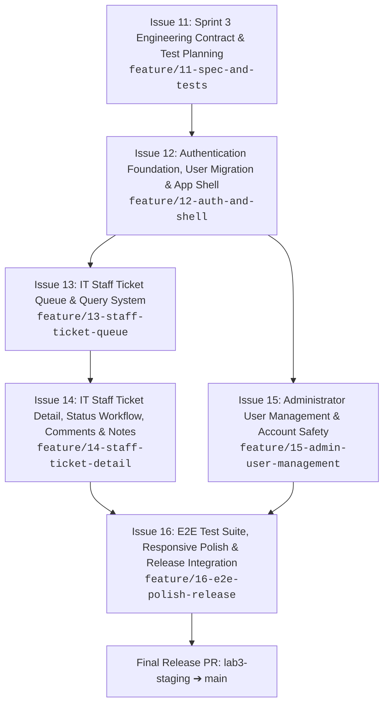

# TokTickIT Sprint 3 (Lab 3) — Scope & Issue Decomposition

**Document Status**: Official Implementation Plan  
**Target Sprint**: TokTickIT Lab 3 (Sprint 3) — Users, Roles, IT Staff Ticketing, and Admin Screens  
**Base Branch**: `lab3-staging`  
**Initial Active Branch**: `feature/11-spec-and-tests`  
**Traceability Reference**: [Lab_3_sheet.pdf](../reference/Lab_3_sheet.pdf)  

---

## 1. Sprint Architecture & Delivery Plan

### 1.1. Sprint Goal
Deliver an authenticated, role-based IT ticketing product increment supporting three distinct roles: **Requester**, **IT Staff**, and **Administrator**.
1. Replace the temporary Lab 2 Development Requester selector with secure authentication, hashed credentials, and mandatory first-login password change.
2. Maintain uninterrupted Requester continuity so Requesters manage their own tickets using their authenticated identity, post Public Comments, and indicate that a problem appears resolved.
3. Introduce an operational IT Staff workflow with a searchable, filterable, sortable, and paginated shared Ticket Queue, along with an IT Staff Ticket Detail view allowing ticket ownership claims/reassignments, IT Priority setting, permitted status workflow transitions, Public Comments, and role-restricted private Internal Notes.
4. Provide a minimalist Administrator User Management screen for viewing, creating, editing, activating/deactivating accounts, and resetting initial passwords, while enforcing strict administrative safety rules.
5. Uphold the Zen Green UI design language across all screens and maintain 100% automated test verification across API, UI component, authorization, and E2E suites.

### 1.2. Git & GitHub Engineering Workflow
* All feature branches are cut from `lab3-staging` and merged back into `lab3-staging` via peer-reviewed Pull Requests.
* The designated peer reviewer reviews and merges approved PRs; the PR author responds to all review comments.
* When all feature slices are verified on `lab3-staging`, a final release PR is submitted from `lab3-staging` into `main`.
* The GitHub Project Kanban board tracks issues through the 6 approved states:  
  `Backlog` $\rightarrow$ `Specified` $\rightarrow$ `Started` $\rightarrow$ `PR Review` $\rightarrow$ `Fixing` $\rightarrow$ `Done`.

---

## 2. Six Planned GitHub Issues for Sprint 3

---

### Issue 11: Sprint 3 Engineering Contract & Software Test Planning

* **Issue Title**: `Issue 11: Sprint 3 Engineering Contract & Software Test Planning`
* **Branch Name**: `feature/11-spec-and-tests`
* **Base / Target Branch**: `lab3-staging`
* **Labels**: `documentation`, `spec-dd`, `test-dd`, `sprint-3`
* **Dependencies**: Sprint 3 initialization (`lab3-staging` created from `main`).
* **Merge Order**: 1st (Must merge before implementation issues begin).

#### Detailed Scope
1. **Author Authoritative Engineering Contract Documents in `docs/lab-03/`**:
   - `docs/lab-03/specification.md`:
     - Sprint goal and stakeholder request interpretation.
     - Included and explicitly excluded scope boundaries.
     - Numbered Functional Requirements (`FR-01` to `FR-06`) covering authentication, authorization, IT Staff queue, IT Staff detail operations, comments and notes, and minimalist user administration.
     - Numbered Business Rules (`BR-01` to `BR-12`) covering active login, first-login password change, session-derived ownership, single-role policy, comments vs notes visibility, requester resolution indication, status transition matrix, and administrator safety rules.
     - Data model migration plan from Lab 2 to Lab 3.
     - Acceptance Criteria (`AC-01` to `AC-15`) in Given-When-Then format.
     - Product Definition of Done.
   - `docs/lab-03/ui-spec.md`:
     - Zen Green design tokens, typography, component states, and layout checklists for:
       - Login screen
       - Mandatory Change Password screen
       - IT Staff Ticket Queue screen
       - IT Staff Ticket Detail screen (distinct Public Comments & Internal Notes sections)
       - Administrator User Management screen (table, create user modal, edit user modal)
     - Responsive breakpoints: Desktop ($\ge 1200\text{px}$), Tablet ($768\text{px}-1024\text{px}$), Mobile ($< 768\text{px}$).
   - `docs/lab-03/api-spec.md`:
     - REST API contracts for auth, queue, ticket operational actions, comments/notes, and admin user management.
     - Request/response DTO schemas, query parameters, validation rules, HTTP status codes, and safe error envelopes (avoiding existence leaks).
   - `docs/lab-03/tests.md`:
     - Software Test Specification (STS) linking every Acceptance Criterion directly to designated test file paths across unit, API integration, UI component, authorization, and E2E suites.
   - `docs/lab-03/reviewer.md` & `docs/lab-03/ai-use.md`:
     - Setup review templates and AI prompt log structure.
2. **Directory Scaffolding**:
   - Create directories for upcoming tests and artifacts:
     - `server/tests/lab-03/`
     - `client/src/tests/lab-03/`
     - `e2e/lab-03/`
     - `artifacts/lab-03/screenshots/` (`authentication/`, `staff-queue/`, `staff-ticket-detail/`, `user-management/`)

#### Explicit Exclusions (Out of Scope)
- Writing backend controllers, API routes, or database migrations.
- Implementing React UI components or business logic.

#### Mapped Requirement IDs
- **Labsheet**: §4.1, §4.4, §6, §7, §9, §10, §11, §12, §14 (Parts 2 & 3).

#### Acceptance Criteria
- **AC-11.1**: *Given* the Lab 3 handout, *when* `docs/lab-03/specification.md` is authored, *then* it contains numbered functional requirements, numbered business rules, Given-When-Then acceptance criteria, and a concrete Definition of Done.
- **AC-11.2**: *Given* the course testing rubric, *when* `docs/lab-03/tests.md` is drafted, *then* every Acceptance Criterion maps to at least one designated automated test file path across unit, API, UI, or E2E levels.
- **AC-11.3**: *Given* Zen Green specifications, *when* `docs/lab-03/ui-spec.md` is drafted, *then* layout wireframes, badges, feedback states, and responsive breakpoints are fully documented.
- **AC-11.4**: *Given* completion of the contract files on `feature/11-spec-and-tests`, *when* submitted for peer review, *then* the PR into `lab3-staging` is reviewed, approved, and merged before implementing subsequent issues.

---

### Issue 12: Authentication Foundation, User Migration & Application Shell Navigation

* **Issue Title**: `Issue 12: Authentication Foundation, User Migration & Application Shell Navigation`
* **Branch Name**: `feature/12-auth-and-shell`
* **Base / Target Branch**: `lab3-staging`
* **Labels**: `backend`, `frontend`, `auth`, `security`, `sprint-3`
* **Dependencies**: Issue 11 merged to `lab3-staging`.
* **Merge Order**: 2nd.

#### Detailed Scope
1. **Database Modeling, Migration & Seed Data**:
   - Evolve the Prisma `User` model:
     - `passwordHash`: String (securely hashed via Argon2id or bcrypt; passwords never stored in plaintext).
     - `role`: Enum (`REQUESTER`, `IT_STAFF`, `ADMINISTRATOR`) — strictly one role per user.
     - `mustChangePassword`: Boolean, default `true`.
     - `isActive`: Boolean, default `true`.
   - Migrate existing Lab 2 Requester records into the real User model so existing Ticket ownership remains intact.
   - Update `server/prisma/seed.ts` with idempotent seed data:
     - $\ge 4$ active Requester accounts, $\ge 1$ inactive Requester account.
     - $\ge 3$ active IT Staff accounts, $\ge 1$ inactive IT Staff account.
     - $\ge 1$ active Administrator account.
     - Documented local development credentials.
2. **Backend Authentication & Authorization API**:
   - `POST /api/v1/auth/login`:
     - Verifies email and password.
     - Rejects inactive accounts with a safe error message (`BR-01`).
     - Issues authenticated session/token (HttpOnly cookie or secure bearer token).
     - Returns user identity, role, and `mustChangePassword` status.
   - `POST /api/v1/auth/logout`: clears session/token.
   - `GET /api/v1/auth/me`: returns authenticated user profile and role; returns `401 Unauthorized` if unauthenticated.
   - `POST /api/v1/auth/change-password`:
     - Requires current password and valid new password.
     - Enforces password strength rules (minimum 8 characters, uppercase, lowercase, digit, special character).
     - Updates `passwordHash` and sets `mustChangePassword = false`.
   - Server-side middleware:
     - Rejects unauthenticated requests to protected routes with `401`.
     - Intercepts users with `mustChangePassword === true` and blocks access to normal operational routes (`BR-02`).
3. **Frontend Login, Password Change & Shell Navigation**:
   - **Login Screen**: email and password inputs, validation, busy state spinner, safe failure alert for invalid credentials or inactive accounts.
   - **Mandatory Change Password Screen**: current password, new password, confirmation, interactive rule validation list, blocks normal app until saved (`BR-02`).
   - **Application Shell Update**:
     - Remove the Lab 2 Development Requester selector banner and modal completely.
     - Display authenticated user name and role badge in header.
     - Add Logout action in profile dropdown.
     - Render role-specific navigation (Requesters: Create Ticket, My Tickets; IT Staff: My Queue, Create Ticket; Admins: User Management).
4. **Requester Regression**:
   - Update Lab 2 ticket creation and "My Tickets" retrieval to derive Requester identity strictly from the server-side authenticated session (`req.user.id`), ignoring any client-supplied IDs (`BR-03`).
5. **Automated Tests**:
   - `server/tests/lab-03/auth.api.test.ts`: valid login, invalid credentials, inactive account rejection, password change flow, logout session invalidation.
   - `client/src/tests/lab-03/Login.test.tsx`: login form rendering, validation, submission, error handling.
   - `client/src/tests/lab-03/ChangePassword.test.tsx`: rule checklists, confirmation mismatch, successful password update.

#### Explicit Exclusions (Out of Scope)
- Email invitations, password-reset emails, or self-registration.
- Multi-factor authentication (MFA), social login, or single sign-on (SSO).
- Multiple roles per user (strictly 1 role per user).

#### Mapped Requirement IDs
- **FR-01**: User Authentication & Session Lifecycle.
- **FR-02**: Mandatory First-Login Password Change.
- **BR-01**: Active account and valid credentials requirement.
- **BR-02**: Password change enforcement before application entry.
- **BR-03**: Server-side authenticated identity determines Requester ownership.
- **Labsheet**: §1, §3, §4.3, §4.4, §5.1, §5.2, §5.3, §6.1, §7, §8.1, §8.2, §14 (Part 5).

#### Acceptance Criteria
- **AC-12.1**: *Given* an active user with valid credentials, *when* logging in, *then* authenticated access is granted, returning the user identity and permitted role.
- **AC-12.2**: *Given* an inactive user account or invalid password, *when* login is attempted, *then* the server rejects access with a safe error message without leaking account status.
- **AC-12.3**: *Given* a user with `mustChangePassword = true`, *when* login succeeds, *then* application navigation remains blocked until a valid new password is saved.
- **AC-12.4**: *Given* an authenticated Requester, *when* ticket operations are executed, *then* ownership is enforced based on authenticated session identity and client-supplied requester IDs are disregarded.
- **AC-12.5**: *Given* an authenticated user, *when* the Logout action is executed, *then* the session is invalidated and subsequent protected route requests return `401 Unauthorized`.

---

### Issue 13: IT Staff Ticket Queue & List Queries

* **Issue Title**: `Issue 13: IT Staff Ticket Queue & List Queries`
* **Branch Name**: `feature/13-staff-ticket-queue`
* **Base / Target Branch**: `lab3-staging`
* **Labels**: `backend`, `frontend`, `it-staff`, `sprint-3`
* **Dependencies**: Issue 12 merged to `lab3-staging`.
* **Merge Order**: 3rd.

#### Detailed Scope
1. **Database Modeling Increment**:
   - Update `Ticket` model with:
     - `ownerId`: Int/UUID (nullable FK to `User` for assigned IT Staff or Administrator).
     - `itPriority`: Enum (`LOW`, `MEDIUM`, `HIGH`, `URGENT`, initialized to match `requestedPriority`).
     - Update `status` Enum with all required statuses: `NEW`, `OPEN`, `IN_PROGRESS`, `WAITING_FOR_REQUESTER`, `RESOLVED`, `CLOSED`, `REOPENED`, `CANCELLED`.
2. **Backend Staff Queue Query API**:
   - `GET /api/v1/staff/tickets`:
     - Server-side authorization: accessible by IT Staff and Administrator roles; returns `403 Forbidden` for Requesters.
     - Query parameters supported:
       - `search`: case-insensitive partial match on `ticketNo` or `summary`.
       - `status`: filter by single status.
       - `category`: filter by category ID.
       - `itPriority`: filter by IT priority.
       - `owner`: filter by assigned owner user ID, or special token `unassigned`.
       - `sortBy`: sortable by `createdAt`, `ticketNo`, `summary`, `itPriority`, `status` (default `createdAt`).
       - `sortOrder`: `asc` or `desc` (default `desc`).
       - `page` & `pageSize`: page-based pagination (default page 1, size 10; allowed: 10, 25, 50).
     - Response envelope: `{ items: StaffTicketSummaryDTO[], totalCount: number, page: number, pageSize: number, totalPages: number }`.
3. **Frontend IT Staff Ticket Queue Screen**:
   - Zen Green layout matching design specification wireframe.
   - Search input (by ticket number or summary).
   - Filter bar: Status, Category, IT Priority, and Owner filters.
   - Data table displaying: Ticket Number, Created Date, Summary, Category, Requested Priority badge, IT Priority badge, Current Status badge, and Ticket Owner.
   - Pagination controls (Previous, page numbers, Next, page size selector).
   - Row action / click to navigate to IT Staff Ticket Detail.
   - UI feedback states: loading skeleton/spinner, empty queue state, no-results filter state, and API failure alert.
   - Responsive presentation: gracefully collapses to stacked cards on tablet and mobile viewports with zero horizontal scrolling.
4. **Automated Tests**:
   - `server/tests/lab-03/staff-queue.api.test.ts`: queue querying, search and filter combinations, sorting, pagination metadata, requester access rejection (`403`).
   - `client/src/tests/lab-03/StaffTicketQueue.test.tsx`: table rendering, filter interactions, pagination changes, empty/no-results states, mobile responsive presentation.

#### Explicit Exclusions (Out of Scope)
- SLA calculations or escalation rules.
- Analytics dashboards or KPI metrics beyond simple queue counts.
- Multi-tenant organization filters.
- Inline status or priority editing directly inside queue table cells.

#### Mapped Requirement IDs
- **FR-03**: IT Staff Ticket Queue & List Queries.
- **BR-06**: Queue role authorization (IT Staff and Administrator only).
- **BR-07**: Default IT Priority initialization from Requested Priority.
- **Labsheet**: §1, §3, §4.3, §4.5, §6, §6.3, §7, §8.3, §14 (Part 6).

#### Acceptance Criteria
- **AC-13.1**: *Given* an authenticated IT Staff or Admin user, *when* requesting `/api/v1/staff/tickets`, *then* the API returns paginated ticket records with status, priority, and ownership metadata.
- **AC-13.2**: *Given* an authenticated Requester, *when* attempting to access `/api/v1/staff/tickets`, *then* the server rejects the request with `403 Forbidden`.
- **AC-13.3**: *Given* query filters (search, category, status, priority, owner), *when* applied, *then* only matching tickets are returned with accurate pagination counters.
- **AC-13.4**: *Given* a viewport $< 768\text{px}$, *when* the ticket queue is displayed, *then* tickets render as stacked Zen Green cards without horizontal page scroll.

---

### Issue 14: IT Staff Ticket Detail, Operational Controls, Comments & Notes

* **Issue Title**: `Issue 14: IT Staff Ticket Detail, Operational Controls, Comments & Notes`
* **Branch Name**: `feature/14-staff-ticket-detail`
* **Base / Target Branch**: `lab3-staging`
* **Labels**: `backend`, `frontend`, `it-staff`, `sprint-3`
* **Dependencies**: Issue 13 merged to `lab3-staging`.
* **Merge Order**: 4th.

#### Detailed Scope
1. **Database Modeling Increment**:
   - Create Prisma model `PublicComment`:
     - `id`: Int/UUID PK.
     - `ticketId`: FK to `Ticket`.
     - `authorId`: FK to `User`.
     - `content`: String (text, min 1 char, max 2000 chars, non-empty after trim).
     - `createdAt`: DateTime.
   - Create Prisma model `InternalNote`:
     - `id`: Int/UUID PK.
     - `ticketId`: FK to `Ticket`.
     - `authorId`: FK to `User`.
     - `content`: String (text, min 1 char, max 2000 chars, non-empty after trim).
     - `createdAt`: DateTime.
   - Both models are strictly append-only (no editing, no deleting).
2. **Backend Detail, Workflow, Comments & Notes APIs**:
   - `GET /api/v1/tickets/:id`:
     - Requester access: allowed only if `ticket.requesterId === req.user.id`; returns `403/404` otherwise.
     - IT Staff / Admin access: allowed for all tickets.
     - Public comments included for all permitted viewers (`BR-04`).
     - Internal notes included **only** for IT Staff and Administrator; strictly stripped for Requesters (`BR-04`).
   - `PATCH /api/v1/staff/tickets/:id/assignment`:
     - Assign or reassign ticket to an active IT Staff or Administrator user, or unassign (IT Staff / Admin only).
   - `PATCH /api/v1/staff/tickets/:id/priority`:
     - Update `itPriority` (IT Staff / Admin only).
   - `PATCH /api/v1/staff/tickets/:id/status`:
     - Enforces permitted status transitions according to the defined transition matrix (IT Staff / Admin only).
     - Enforces confirmation/validation for terminal statuses (`RESOLVED`, `CLOSED`, `CANCELLED`).
   - `POST /api/v1/tickets/:id/resolve-request`:
     - Requester action indicating "Problem Appears Resolved" (`BR-05`).
   - `POST /api/v1/tickets/:id/comments`:
     - Append Public Comment (Requester for owned tickets, IT Staff, Administrator).
   - `POST /api/v1/tickets/:id/notes`:
     - Append Internal Note (IT Staff and Administrator only; `403 Forbidden` for Requester).
3. **Frontend Ticket Detail Interfaces**:
   - **IT Staff Ticket Detail Screen**:
     - Header info, read-only Requester details, summary, and description.
     - Operational Controls: Owner assignment dropdown (with "Claim" shortcut), IT Priority dropdown, and Current Status transition dropdown.
     - Attachments panel preserving Lab 2 download capabilities.
     - Distinct sections/tabs for "Public Comments" and "Internal Notes" with unmistakable visual differentiation (e.g., amber styling, lock icons) to prevent accidental public disclosure.
   - **Requester Ticket Detail Screen Update**:
     - Add Public Comments thread and comment submission form.
     - Add "Problem Appears Resolved" action button (`BR-05`).
     - Ensure Internal Notes are completely absent from the UI and never requested over the network.
4. **Automated Tests**:
   - `server/tests/lab-03/staff-ticket-detail.api.test.ts`: ownership assignment, IT priority update, status transitions.
   - `server/tests/lab-03/comments-notes.api.test.ts`: public comments creation/retrieval, internal notes creation/retrieval, non-empty validation.
   - `server/tests/lab-03/authorization.api.test.ts`: Requester forbidden from accessing internal notes (`403`), non-owner Requester blocked from viewing other tickets.
   - `client/src/tests/lab-03/StaffTicketDetail.test.tsx`: operational control interactions, comment/note submission, distinct styling verification.

#### Explicit Exclusions (Out of Scope)
- "Actions Taken by IT Staff" (explicitly deferred to Lab 4).
- Blocking resolution due to incomplete Actions Taken (deferred to Lab 4).
- Editing or deletion of Public Comments or Internal Notes.

#### Mapped Requirement IDs
- **FR-04**: IT Staff Ticket Detail & Operational Management.
- **FR-05**: Public Comments & Internal Notes Management.
- **BR-04**: Public Comments vs Internal Notes visibility rules.
- **BR-05**: Requester resolution indication without formal closing authority.
- **BR-08**: Append-only comment and note lifecycle.
- **Labsheet**: §1, §3, §4.3, §4.4, §4.5, §4.6, §6, §7, §8.4, §14 (Part 7).

#### Acceptance Criteria
- **AC-14.1**: *Given* an active IT Staff user, *when* viewing Ticket Detail, *then* they can claim or reassign ownership, update IT Priority, and transition status according to permitted rules.
- **AC-14.2**: *Given* a ticket, *when* a Public Comment is posted by any permitted role, *then* it is visible to Requester, IT Staff, and Administrator (`BR-04`).
- **AC-14.3**: *Given* an authenticated Requester, *when* attempting to view or post an Internal Note, *then* the request is rejected with `403 Forbidden` without exposing note content (`BR-04`).
- **AC-14.4**: *Given* an authenticated Requester, *when* clicking "Problem Appears Resolved", *then* the system records the resolution indication without allowing the Requester to formally set status to `Resolved` or `Closed` (`BR-05`).

---

### Issue 15: Administrator User Management & Account Safety

* **Issue Title**: `Issue 15: Administrator User Management & Account Safety`
* **Branch Name**: `feature/15-admin-user-management`
* **Base / Target Branch**: `lab3-staging`
* **Labels**: `backend`, `frontend`, `admin`, `security`, `sprint-3`
* **Dependencies**: Issue 12 merged to `lab3-staging`.
* **Merge Order**: 5th.

#### Detailed Scope
1. **Backend Admin API (`/api/v1/admin/users/*`)**:
   - Strictly restricted to `ADMINISTRATOR` role (`403 Forbidden` for Requester and IT Staff).
   - `GET /api/v1/admin/users`: returns user list (`name`, `email`, `role`, `isActive`, `createdAt`). Supports query param `search` (name or email) and optional `role` filter.
   - `POST /api/v1/admin/users`:
     - Creates user with name, email, one permitted role, activation state, and initial password.
     - Flags user with `mustChangePassword = true`.
     - Rejects duplicate emails (`409 Conflict`).
   - `PATCH /api/v1/admin/users/:id`:
     - Updates name, email, role, and activation state.
     - **Safety rule**: Prevents Administrator from deactivating their own account (`400/403`).
     - **Safety rule**: Prevents deactivating or demoting the last active Administrator in the system (`400/409`).
     - Rejects duplicate emails (`409 Conflict`).
   - `POST /api/v1/admin/users/:id/reset-password`:
     - Sets a new initial password and flags `mustChangePassword = true`.
   - Strictly no user deletion endpoint (account deactivation only).
2. **Frontend Administrator User Management Screen**:
   - Dedicated User Management screen for Admins (`/admin/users`).
   - User list table displaying: Name, Email, Role badge, Status badge (`Active` / `Inactive`), and Edit action button.
   - Search input (by name or email) and optional Role filter dropdown.
   - "Create User" slideout/modal: form with Full Name, Email Address, Role selector, Active toggle, Initial Password field, and Save button.
   - "Edit User" slideout/modal: edit name, email, role; toggle active status; set new initial password; Deactivate action.
   - In-app safety feedback alerts for self-deactivation or last-admin deactivation attempts.
3. **Automated Tests**:
   - `server/tests/lab-03/users-admin.api.test.ts`: user listing, search/filter, creation, duplicate-email rejection, self-deactivation prevention, last-admin protection, non-admin forbidden checks (`403`).
   - `client/src/tests/lab-03/UserManagement.test.tsx`: table rendering, search interactions, create/edit modal workflows, safety error alerts.

#### Explicit Exclusions (Out of Scope)
- Hard user deletion (deactivation only).
- Bulk user operations, user import or export.
- Mandatory pagination or multi-column sorting on user list.
- Departments, organization structures, or profile photos.
- Email delivery of initial passwords or reset links.
- Multiple roles assigned to one user.

#### Mapped Requirement IDs
- **FR-06**: Administrator User Management.
- **BR-09**: Single-role assignment policy.
- **BR-10**: Unique email constraint enforcement.
- **BR-11**: Self-deactivation prevention safety rule.
- **BR-12**: Minimum active administrator preservation safety rule.
- **Labsheet**: §1, §3, §4.3, §4.4, §5.1, §6, §7, §8.5, §14 (Part 8).

#### Acceptance Criteria
- **AC-15.1**: *Given* an Administrator, *when* creating a user with valid details, *then* the account is created with one permitted role, and `mustChangePassword` is set to true.
- **AC-15.2**: *Given* an email already in use, *when* creating or updating a user, *then* the API rejects the request with `409 Conflict`.
- **AC-15.3**: *Given* an Administrator viewing their own account, *when* attempting to deactivate it, *then* the operation is blocked with a clear safety warning.
- **AC-15.4**: *Given* only one active Administrator exists in the system, *when* attempting to deactivate or demote that user, *then* the system rejects the operation.
- **AC-15.5**: *Given* an IT Staff or Requester user, *when* attempting to access `/api/v1/admin/users`, *then* the server responds with `403 Forbidden`.

---

### Issue 16: End-to-End Test Suite, Responsive Polish & Staged Release Verification

* **Issue Title**: `Issue 16: End-to-End Test Suite, Responsive Polish & Staged Release Verification`
* **Branch Name**: `feature/16-e2e-polish-release`
* **Base / Target Branch**: `lab3-staging`
* **Labels**: `testing`, `e2e`, `ui-polish`, `release`, `sprint-3`
* **Dependencies**: Issues 12, 13, 14, 15 merged to `lab3-staging`.
* **Merge Order**: 6th (Final Sprint 3 slice).

#### Detailed Scope
1. **Playwright E2E Test Suite Implementation**:
   - `e2e/lab-03/authentication.spec.ts`:
     - Valid and invalid login attempts.
     - Inactive account rejection feedback.
     - Mandatory initial-password change flow and successful transition into normal app.
     - Application shell user/role display and Logout session invalidation.
   - `e2e/lab-03/staff-ticket-flow.spec.ts`:
     - IT Staff login and Queue navigation.
     - Queue search, filtering, and sorting.
     - Ticket Detail inspection, claiming ownership, updating IT Priority, and executing status transitions.
     - Public Comments posting and verification across roles.
     - Internal Notes creation and verification that Requesters cannot access them.
     - Requester "Problem Appears Resolved" indication.
   - `e2e/lab-03/user-administration.spec.ts`:
     - Administrator login and User Management navigation.
     - Creating a new user with an initial password.
     - Searching and filtering users.
     - Editing user details and toggling active status.
     - Verifying safety rules (self-deactivation and last active admin protection).
     - Resetting initial password and validating subsequent forced change upon user login.
2. **Responsive Design & Zen Green Theme Polish**:
   - Audit all Lab 3 screens across Desktop ($\ge 1200\text{px}$), Tablet ($768\text{px}-1024\text{px}$), and Mobile ($< 768\text{px}$).
   - Complete visual checklist: design consistency, role navigation, status/priority/role badges, editable vs read-only field styling, validation placement, focus states, and zero horizontal overflow.
   - Capture submission screenshot artifacts in `artifacts/lab-03/screenshots/`:
     - `authentication/`
     - `staff-queue/`
     - `staff-ticket-detail/`
     - `user-management/`
3. **Course Review & Reflection Documentation**:
   - Complete `docs/lab-03/reviewer.md` recording peer reviewer identity, PR links, comments, and approvals.
   - Complete `docs/lab-03/ai-use.md` with LLM identification, 6–10 key prompts, and "My Reflection".
4. **Staged Release Integration**:
   - Verify full test suite passes on `lab3-staging`:
     - `npm run test` (Server Supertest + Client Vitest)
     - `npx playwright test e2e/lab-03/`
   - Open final release Pull Request from `lab3-staging` into `main` with all test evidence.

#### Explicit Exclusions (Out of Scope)
- Core feature refactoring outside of bug fixes discovered during E2E testing.
- Production cloud deployment configurations.

#### Mapped Requirement IDs
- **Labsheet**: §2, §7, §8.6, §8.7, §10, §12, §13, §14 (Parts 1, 4, 9).

#### Acceptance Criteria
- **AC-16.1**: *Given* all feature branches merged into `lab3-staging`, *when* `npx playwright test e2e/lab-03/` is executed, *then* all authentication, staff workflow, and user administration tests pass.
- **AC-16.2**: *Given* responsive viewports across desktop, tablet, and mobile, *when* all Lab 3 screens are rendered, *then* layouts display without horizontal scroll or clipping, and screenshot artifacts are saved.
- **AC-16.3**: *Given* test and documentation completion, *when* `reviewer.md` and `ai-use.md` are finalized, *then* the release PR to `main` is submitted and verified.

---

## 3. Explicit Exclusions & Scope Boundaries

To prevent over-engineering and strictly honor **§4.2 of the Lab 3 Sheet**, the following features are **strictly out of scope** across all issues:
* **Email & External Auth**: No email invitations, password-reset emails, MFA, social login, or SSO.
* **Self-Registration**: No self-registration or Requester-created accounts.
* **Actions Taken**: "Actions Taken by IT Staff" and blocking resolution while actions remain incomplete are deferred to Lab 4.
* **SLAs & Notifications**: No formal SLA calculations, escalation rules, or notification services.
* **Analytics**: No dashboards or KPI analytics beyond simple queue counts.
* **Multi-Tenancy**: No multi-tenant organizations, departments, or customer administration.
* **Account Extras**: No profile photos, user deletion, bulk user operations, user import/export, or account audit history.
* **Single Role Policy**: Users have strictly one role (`Requester`, `IT_Staff`, or `Administrator`).

---

## 4. Course Deliverables & 60-Point Rubric Mapping

| Submission Part | Points | Handout Section | Mapped GitHub Issues | Target File / Evidence |
| :--- | :---: | :--- | :--- | :--- |
| **Part 1: Git Use & Workflow** | 10 | §11, §14 | Issues 11–16 | Commit history, GitHub Kanban in Done, `docs/lab-03/reviewer.md` |
| **Part 2: Spec DD** | 5 | §9, §14 | Issue 11 | `docs/lab-03/specification.md` |
| **Part 3: Test DD & Traceability** | 10 | §10, §14 | Issue 11, 16 | `docs/lab-03/tests.md` and test suite execution logs |
| **Part 4: AI Use with Reflection** | 5 | §14 | Issue 11, 16 | `docs/lab-03/ai-use.md` (6–10 prompts + "My Reflection") |
| **Part 5: Working Login & Password Change UI** | 5 | §8.1, §14 | Issue 12, 16 | Screenshots in `artifacts/lab-03/screenshots/authentication/` |
| **Part 6: Working IT Staff Ticket Queue UI** | 5 | §8.3, §14 | Issue 13, 16 | Screenshots in `artifacts/lab-03/screenshots/staff-queue/` |
| **Part 7: Working IT Staff Ticket Detail UI** | 10 | §8.4, §14 | Issue 14, 16 | Screenshots in `artifacts/lab-03/screenshots/staff-ticket-detail/` |
| **Part 8: Working Administrator User Management UI** | 5 | §8.5, §14 | Issue 15, 16 | Screenshots in `artifacts/lab-03/screenshots/user-management/` |
| **Part 9: Zen Green UI & Responsive Evidence** | 5 | §7, §8.7, §14 | Issue 16 | `docs/lab-03/ui-spec.md` + responsive screenshots (desktop, tablet, mobile) |
| **Total** | **60** | | | |
