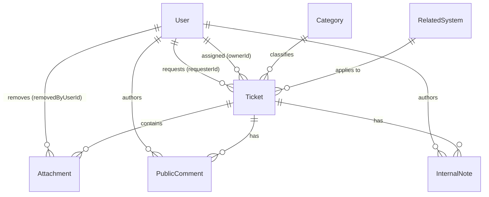

# TokTickIT Sprint 3 (Lab 3) — Sprint Engineering Specification

**Document Status**: Official Engineering Specification  
**Target Sprint**: TokTickIT Lab 3 (Sprint 3) — Users, Roles, IT Staff Ticketing, and Admin Screens  
**Base Branch**: `lab3-staging`  
**Active Branch**: `feature/11-spec-and-tests`  
**Traceability References**: [Lab_3_sheet.pdf](../reference/Lab_3_sheet.pdf), [TokTickIT-System-Level-SDS-v1.0.pdf](../reference/TokTickIT-System-Level-SDS-v1.0.pdf), [poc-scope-and-issues.md](./poc-scope-and-issues.md)

---

## 1. Sprint Goal

Deliver an authenticated, role-based IT ticketing product increment for the **TokTickIT** IT Service Desk supporting three distinct roles: **Requester**, **IT Staff**, and **Administrator**.
1. Replace the temporary Lab 2 Development Requester selector with secure email/password authentication, hashed credentials, and mandatory first-login password change.
2. Maintain uninterrupted continuity for Requester operations so Requesters manage their own tickets using their authenticated identity, post Public Comments, and indicate that a problem appears resolved.
3. Introduce an operational IT Staff workflow featuring a searchable, filterable, sortable, and paginated shared Ticket Queue, alongside an IT Staff Ticket Detail view enabling ownership claims/reassignments, IT Priority management, permitted status workflow transitions, Public Comments, and confidential Internal Notes.
4. Provide a minimalist Administrator User Management screen for viewing, creating, editing, activating/deactivating accounts, and setting initial passwords while enforcing strict administrative safety rules.
5. Uphold the Zen Green UI design language across all screens and maintain 100% automated test verification across unit, API, UI component, authorization, and E2E suites.

---

## 2. Stakeholder Request Interpretation

The IT Service Desk requires a transition from the prototype simulation used in Sprint 2 to a fully authenticated, multi-role platform:
* **Authentication & First-Login Security**: The temporary Development Requester selector must be decommissioned. Every user must log in with an email and password. Any user provisioned with an initial password must be forced to choose a secure new password before accessing application functions.
* **Uninterrupted Requester Functionality**: Requesters must continue creating tickets, viewing owned tickets, and managing attachments as established in Lab 2. However, ticket ownership must be derived strictly from the server-side authenticated session. Requesters may post Public Comments and signal that a problem appears resolved, but cannot formally close tickets.
* **Operational IT Staff Workflow**: IT Staff require a shared Ticket Queue to discover and prioritize work, view full ticket details, claim or reassign tickets, update IT Priority, execute valid status transitions, communicate with Requesters via Public Comments, and record private Internal Notes hidden from Requesters.
* **Minimalist Administrator Control**: Administrators need a focused User Management screen to view accounts, create users with a single permitted role, edit basic account info, activate/deactivate accounts, and issue new initial passwords. Safety rules must prevent self-deactivation and guarantee the system is never left without an active Administrator.
* **Architecture & Styling Rigor**: All access control and business rules must be enforced by the backend API. The Zen Green UI design system established in Lab 2 must be preserved across desktop, tablet, and mobile viewports.

---

## 3. Scope Boundaries

### 3.1 Included Scope
1. **User Authentication & Session Management**:
   - Secure login via `POST /api/v1/auth/login` verifying email, password hash, and active status.
   - Opaque server-side session management (HttpOnly, Secure, SameSite cookie or equivalent bearer token per SDS D-04).
   - Session invalidation on `POST /api/v1/auth/logout`.
   - Authenticated profile inspection via `GET /api/v1/auth/me`.
   - Mandatory first-login password change intercept via `POST /api/v1/auth/change-password` for accounts flagged with `mustChangePassword: true`.
2. **Requester Regression & Identity Continuity**:
   - Complete removal of the Lab 2 Development Requester selector banner and modal.
   - Ticket creation (`POST /api/v1/tickets`) and listing (`GET /api/v1/tickets`) automatically bound to authenticated session user ID (`req.user.id`).
   - Attachment download and soft-removal permissions strictly bound to authenticated Requester ownership.
   - Requester ability to post Public Comments on owned tickets and submit "Problem Appears Resolved" indication.
3. **IT Staff Shared Ticket Queue**:
   - Paginated queue retrieval (`GET /api/v1/staff/tickets`) restricted to IT Staff and Administrators.
   - Multi-field text search (`ticketNumber`, `summary`), category filtering, status filtering, IT Priority filtering, and owner assignment filtering (`unassigned` or specific user ID).
   - Dynamic sorting by `createdAt`, `ticketNumber`, `summary`, `itPriority`, and `status`.
   - Pagination controls with metadata (`totalCount`, `totalPages`, `page`, `pageSize` supporting 10, 25, 50).
4. **IT Staff Ticket Detail & Operational Lifecycle**:
   - Comprehensive detail retrieval (`GET /api/v1/tickets/:id`) with role-based field redaction.
   - Ticket ownership assignment and self-claiming (`PATCH /api/v1/staff/tickets/:id/assignment`).
   - IT Priority adjustments (`PATCH /api/v1/staff/tickets/:id/priority`).
   - Status workflow transitions adhering to the approved status matrix (`PATCH /api/v1/staff/tickets/:id/status`).
   - Append-only Public Comments thread and Append-only Internal Notes thread with distinct visual styling.
5. **Administrator User Management**:
   - Dedicated management screen (`/admin/users`) restricted to Administrators.
   - User list retrieval (`GET /api/v1/admin/users`) with search (name or email) and role filtering.
   - Create user modal (`POST /api/v1/admin/users`) with single-role assignment, active toggle, and initial password.
   - Edit user modal (`PATCH /api/v1/admin/users/:id`) for updating name, email, role, and active status.
   - Reset initial password action (`POST /api/v1/admin/users/:id/reset-password`) flagging `mustChangePassword = true`.
   - Enforcement of safety invariants: self-deactivation prevention and last active administrator protection.
6. **Zen Green UI & Responsive Verification**:
   - Consistent KMUTT Zen Green palette (`#006B3C`, `#0B7A46`, `#EAF6EF`, `#F5F7F6`).
   - Responsive layouts verified across Desktop ($\ge 1200\text{px}$), Tablet ($768\text{px} - 1024\text{px}$), and Mobile ($< 768\text{px}$) with zero horizontal overflow.

### 3.2 Explicitly Excluded Scope (Honoring §4.2 of Lab 3 Sheet)
* **Email & External Auth**: No email invitations, password-reset emails, magic links, multi-factor authentication (MFA), social login, or single sign-on (SSO).
* **Self-Registration**: No public registration or Requester-created accounts; all accounts are provisioned by an Administrator.
* **Actions Taken by IT Staff**: The "Actions Taken" subsystem and blocking ticket resolution on incomplete actions are strictly deferred to Lab 4.
* **SLAs & Notifications**: No formal SLA deadline calculations, escalation timers, email notifications, or SMS alerts.
* **Analytics**: No executive dashboards, SLA compliance reports, or KPI analytics beyond basic queue counts.
* **Multi-Tenancy & Structure**: No multi-tenant organizations, company accounts, departments, or customer hierarchy administration.
* **Account Extras**: No user deletion (hard delete), bulk user imports/exports, user profile photos, or account audit history logs.
* **Single Role Policy**: Users are assigned strictly one role (`REQUESTER`, `IT_STAFF`, or `ADMINISTRATOR`). Multiple simultaneous roles are prohibited.
* **Advanced User Grid Features**: No mandatory pagination, multi-column sorting, or multi-faceted filter combinations for the Administrator user list.

---

## 4. Functional Requirements (FR-01 to FR-06)

### FR-01: User Authentication & Session Lifecycle
* **FR-01.1**: The system shall provide a secure login endpoint (`POST /api/v1/auth/login`) accepting user email and password.
* **FR-01.2**: The backend shall verify credentials against the stored password hash using a secure algorithm (Argon2id or bcrypt).
* **FR-01.3**: The system shall reject unauthenticated requests to protected resources with HTTP `401 Unauthorized`.
* **FR-01.4**: Upon successful authentication, the system shall establish an authenticated session, return the user's basic profile (`id`, `name`, `email`, `role`, `mustChangePassword`), and issue an opaque session identifier.
* **FR-01.5**: The system shall provide a profile endpoint (`GET /api/v1/auth/me`) returning the currently authenticated user context.
* **FR-01.6**: The system shall provide a logout endpoint (`POST /api/v1/auth/logout`) that terminates the session and invalidates subsequent requests.

### FR-02: Mandatory First-Login Password Change
* **FR-02.1**: When a user authenticated with `mustChangePassword === true` accesses the application, the system shall redirect them to the Mandatory Change Password interface and block access to normal operational routes.
* **FR-02.2**: The Change Password endpoint (`POST /api/v1/auth/change-password`) shall require the current password, a new password, and a password confirmation.
* **FR-02.3**: The system shall validate that the new password meets complexity rules: minimum 8 characters, at least 1 uppercase letter, 1 lowercase letter, 1 number, and 1 special character, and does not match the current password.
* **FR-02.4**: Upon successful password update, the system shall hash the new password, persist it, set `mustChangePassword = false`, and permit the user to proceed into the application shell.

### FR-03: IT Staff Ticket Queue & Query System
* **FR-03.1**: The system shall provide a shared ticket queue endpoint (`GET /api/v1/staff/tickets`) accessible only to `IT_STAFF` and `ADMINISTRATOR` roles. Requesters shall be rejected with HTTP `403 Forbidden`.
* **FR-03.2**: The queue endpoint shall support text search across `ticketNumber` and `summary` (case-insensitive partial matching).
* **FR-03.3**: The queue endpoint shall support filtering by `status`, `categoryId`, `itPriority`, and `ownerId` (including filtering for `unassigned` tickets).
* **FR-03.4**: The queue endpoint shall support sorting by `createdAt`, `ticketNumber`, `summary`, `itPriority`, and `status` in ascending or descending order (default: `createdAt DESC`).
* **FR-03.5**: The queue endpoint shall support page-based pagination (`page`, `pageSize` default 10, with allowed options of 10, 25, 50) and return standard pagination metadata (`totalCount`, `page`, `pageSize`, `totalPages`).

### FR-04: IT Staff Ticket Detail & Operational Lifecycle
* **FR-04.1**: The system shall provide a detailed ticket retrieval endpoint (`GET /api/v1/tickets/:id`) returning ticket metadata, requester details, category, system, attachments, priority, and workflow status.
* **FR-04.2**: The system shall permit IT Staff and Administrators to claim ownership of an unassigned ticket or reassign a ticket to any active IT Staff or Administrator account (`PATCH /api/v1/staff/tickets/:id/assignment`).
* **FR-04.3**: The system shall permit IT Staff and Administrators to update `itPriority` (`LOW`, `MEDIUM`, `HIGH`, `URGENT`) via `PATCH /api/v1/staff/tickets/:id/priority`.
* **FR-04.4**: The system shall permit IT Staff and Administrators to execute permitted status transitions according to the status transition matrix via `PATCH /api/v1/staff/tickets/:id/status`.
* **FR-04.5**: The system shall permit an authenticated Requester to indicate that their reported issue appears resolved via `POST /api/v1/tickets/:id/resolve-request` on owned tickets.

### FR-05: Public Comments & Internal Notes Management
* **FR-05.1**: The system shall support append-only Public Comments on tickets (`POST /api/v1/tickets/:id/comments`), accessible to the ticket's Requester, IT Staff, and Administrators.
* **FR-05.2**: The system shall support append-only Internal Notes on tickets (`POST /api/v1/tickets/:id/notes`), strictly restricted to IT Staff and Administrators.
* **FR-05.3**: Requesters attempting to view or post Internal Notes shall be rejected with HTTP `403 Forbidden`. Ticket detail payloads delivered to Requesters shall never include Internal Notes.
* **FR-05.4**: The system shall validate comment and note content: required, trimmed length between 1 and 2000 characters. Editing or deleting existing comments/notes is strictly prohibited.

### FR-06: Minimalist Administrator User Management
* **FR-06.1**: The system shall provide user management endpoints under `/api/v1/admin/users/*` accessible exclusively to the `ADMINISTRATOR` role. All other roles shall receive HTTP `403 Forbidden`.
* **FR-06.2**: The system shall list users (`GET /api/v1/admin/users`) with optional query search by name or email and role filtering.
* **FR-06.3**: An Administrator shall be able to create a user (`POST /api/v1/admin/users`) specifying Name, Email, exactly one permitted Role, initial Active status, and an Initial Password. The new user shall automatically be flagged with `mustChangePassword = true`.
* **FR-06.4**: An Administrator shall be able to edit user attributes (`PATCH /api/v1/admin/users/:id`), updating Name, Email, Role, and Active status.
* **FR-06.5**: An Administrator shall be able to reset a user's initial password (`POST /api/v1/admin/users/:id/reset-password`), which sets the new password hash and flags `mustChangePassword = true`.
* **FR-06.6**: The system shall enforce administrative safety invariants: prevent self-deactivation and prevent deactivating or demoting the last active Administrator. No hard user deletion is supported.

---

## 5. Business Rules (BR-01 to BR-12)

* **BR-01 (Active Login & Credential Verification)**: Only active user accounts (`isActive === true`) with valid password credentials may authenticate. Inactive accounts or incorrect passwords return a generic safe error envelope without revealing account existence (*SDS p. 9; Labsheet BR-01*).
* **BR-02 (Mandatory First-Login Password Change Enforcement)**: Any user account flagged with `mustChangePassword === true` is blocked by server middleware and client navigation from all normal operational routes until a new password conforming to complexity rules is successfully saved (*Labsheet BR-02*).
* **BR-03 (Session-Derived Requester Ownership)**: Ticket creation and Requester ticket listing derive ownership strictly from the server-side authenticated user context (`req.user.id`). Any client-supplied `requesterId` in request bodies, headers, or query parameters is disregarded (*Labsheet BR-03*).
* **BR-04 (Comments vs. Notes Visibility Invariant)**: Public Comments are visible to the ticket Requester, IT Staff, and Administrators. Internal Notes are strictly confidential to IT Staff and Administrators. Internal Notes are never returned in Requester API responses, and direct Requester access returns HTTP `403 Forbidden` (*Labsheet BR-04*).
* **BR-05 (Requester Resolution Indication Boundary)**: A Requester may record that a problem appears resolved (`requesterResolutionConfirmedAt`), but has no authority to formally set the ticket status to `Resolved` or `Closed`. Formal resolution authority is reserved exclusively for IT Staff and Administrators (*Labsheet BR-05, SDS p. 11*).
* **BR-06 (Queue Role Authorization)**: Access to the shared IT Staff Ticket Queue (`/api/v1/staff/tickets`) is restricted to `IT_STAFF` and `ADMINISTRATOR` roles. Requesters attempting access receive HTTP `403 Forbidden` (*Labsheet §4.3*).
* **BR-07 (Default IT Priority Initialization)**: Upon ticket creation, `itPriority` is automatically initialized to match `requestedPriority`. Subsequently, `itPriority` may be modified only by IT Staff or Administrators (*SDS p. 12, Labsheet §4.5*).
* **BR-08 (Append-Only Comment & Note Lifecycle)**: Public Comments and Internal Notes are strictly append-only. No modification, soft-deletion, or hard-deletion is permitted. Entries must contain between 1 and 2000 non-whitespace characters (*Labsheet §4.6*).
* **BR-09 (Single-Role Assignment Policy)**: Every user account must possess exactly one role: `REQUESTER`, `IT_STAFF`, or `ADMINISTRATOR`. Multi-role assignments are prohibited (*Labsheet §4.2, §4.3*).
* **BR-10 (Email Uniqueness & Case-Insensitive Normalization)**: User email addresses must be unique across the application. Comparison and persistence are case-insensitively normalized. Duplicate submissions return HTTP `409 Conflict` (*SDS p. 9; Labsheet §4.4*).
* **BR-11 (Administrator Self-Deactivation Prevention)**: An Administrator cannot deactivate their own account (`isActive = false`) or alter their own active status. Attempts are blocked with HTTP `400 Bad Request` or `403 Forbidden` (*Labsheet §4.4, §8.5*).
* **BR-12 (Minimum Active Administrator Preservation)**: The system must always maintain at least one active user with the `ADMINISTRATOR` role. Any operation that would deactivate, demote, or disable the last remaining active Administrator is rejected with HTTP `400 Bad Request` or `409 Conflict` (*Labsheet §4.4, §8.5*).

---

## 6. Status Transition Matrix

In accordance with **SDS Approved Decision D-02** and **Labsheet §4.5**, TokTickIT implements eight standardized ticket statuses:
1. `New` (Unassigned or newly submitted)
2. `Assigned` (Owner accepted responsibility)
3. `In Progress` (Active diagnostic/remediation work)
4. `Pending Requester` (Awaiting requester response/verification)
5. `Resolved` (IT Staff completed fix; awaiting closure or reopen)
6. `Closed` (Terminal completion; locked)
7. `Reopened` (Previously resolved/closed/cancelled ticket reactivated)
8. `Cancelled` (Work abandoned with mandatory reason)

### 6.1 State Transition Permissions Matrix

| Current Status | Permitted Target Statuses | Authorized Roles | Invariants & Requirements |
| :--- | :--- | :--- | :--- |
| **New** | `Assigned`, `In Progress`, `Cancelled` | IT Staff, Admin (Cancel: Requester) | Assigning requires active IT Staff/Admin `ownerId`. Cancel requires reason. |
| **Assigned** | `In Progress`, `Pending Requester`, `Resolved`, `Cancelled` | IT Staff, Admin (Cancel: Requester) | Moving to `Resolved` requires confirmation. |
| **In Progress** | `Pending Requester`, `Resolved`, `Cancelled` | IT Staff, Admin (Cancel: Requester) | Moving to `Resolved` requires confirmation. |
| **Pending Requester**| `In Progress`, `Resolved`, `Cancelled` | IT Staff, Admin (Cancel: Requester) | Re-entering work returns to `In Progress`. |
| **Resolved** | `Closed`, `Reopened`, `Cancelled` | IT Staff, Admin (Reopen: Requester) | Formal closure restricted to IT Staff/Admin. Reopen requires comment/reason. |
| **Closed** | `Reopened` | IT Staff, Admin, Requester | Normal edits locked. Reopen transitions to `In Progress` (if owned) or `New`. |
| **Reopened** | `Assigned`, `In Progress`, `Cancelled` | IT Staff, Admin (Cancel: Requester) | Resumes active operational handling. |
| **Cancelled** | `Reopened` | IT Staff, Admin, Requester | Reopening restores ticket to `In Progress` or `New`. |

*Note: In accordance with SDS D-02, any authorized user with read access to a ticket may cancel an open ticket or reopen a resolved/closed/cancelled ticket. Only IT Staff or Administrator may set `Resolved` or `Closed`.*

---

## 7. Data Model Migration Plan (Lab 2 to Lab 3)

### 7.1 Entity Evolution Overview
The Lab 2 simulated `RequesterUser` model is migrated into the unified, production `User` entity. Existing ticket ownership, attachment links, and categories are 100% preserved.



### 7.2 Prisma Schema Specification (`server/prisma/schema.prisma`)

```prisma
datasource db {
  provider = "postgresql"
  url      = env("DATABASE_URL")
}

generator client {
  provider = "prisma-client-js"
}

enum Role {
  REQUESTER
  IT_STAFF
  ADMINISTRATOR
}

enum Priority {
  LOW
  MEDIUM
  HIGH
  URGENT
}

enum TicketStatus {
  NEW
  ASSIGNED
  IN_PROGRESS
  PENDING_REQUESTER
  RESOLVED
  CLOSED
  REOPENED
  CANCELLED
}

model User {
  id                 Int              @id @default(autoincrement())
  email              String           @unique
  passwordHash       String
  name               String
  department         String?
  role               Role             @default(REQUESTER)
  mustChangePassword Boolean          @default(true)
  isActive           Boolean          @default(true)
  createdAt          DateTime         @default(now())
  updatedAt          DateTime         @updatedAt

  // Relationships
  requestedTickets   Ticket[]         @relation("RequesterTickets")
  assignedTickets    Ticket[]         @relation("StaffAssignedTickets")
  removedAttachments Attachment[]     @relation("UserRemovedAttachments")
  publicComments     PublicComment[]
  internalNotes      InternalNote[]

  @@map("users")
}

model RelatedSystem {
  id        Int      @id @default(autoincrement())
  name      String   @unique
  isActive  Boolean  @default(true)
  createdAt DateTime @default(now())
  updatedAt DateTime @updatedAt
  tickets   Ticket[]

  @@map("related_systems")
}

model Category {
  id          Int      @id @default(autoincrement())
  code        String?  @unique
  name        String   @unique
  description String?
  isActive    Boolean  @default(true)
  createdAt   DateTime @default(now())
  updatedAt   DateTime @updatedAt
  tickets     Ticket[]

  @@map("categories")
}

model Ticket {
  id                             Int             @id @default(autoincrement())
  ticketNumber                   String          @unique @db.VarChar(32) // TKT-YYYY-NNNNN
  requesterId                    Int
  ownerId                        Int?
  categoryId                     Int
  relatedSystemId                Int
  summary                        String          @db.VarChar(100)
  description                    String          @db.Text
  requestedPriority              Priority        @default(MEDIUM)
  itPriority                     Priority?
  currentStatus                  TicketStatus    @default(NEW)
  requesterResolutionConfirmedAt DateTime?
  version                        Int             @default(1)
  createdAt                      DateTime        @default(now())
  updatedAt                      DateTime        @updatedAt

  // Relationships
  requester                      User            @relation("RequesterTickets", fields: [requesterId], references: [id], onDelete: Restrict)
  owner                          User?           @relation("StaffAssignedTickets", fields: [ownerId], references: [id], onDelete: SetNull)
  category                       Category        @relation(fields: [categoryId], references: [id], onDelete: Restrict)
  relatedSystem                  RelatedSystem   @relation(fields: [relatedSystemId], references: [id], onDelete: Restrict)
  attachments                    Attachment[]
  publicComments                 PublicComment[]
  internalNotes                  InternalNote[]

  @@index([requesterId])
  @@index([ownerId])
  @@index([currentStatus])
  @@index([itPriority])
  @@map("tickets")
}

model Attachment {
  id               Int       @id @default(autoincrement())
  ticketId         Int
  originalFilename String
  storedFilename   String    @unique
  mimeType         String
  fileSize         Int
  isRemoved        Boolean   @default(false)
  removalReason    String?   @db.Text
  removedAt        DateTime?
  removedByUserId  Int?
  createdAt        DateTime  @default(now())
  updatedAt        DateTime  @updatedAt

  // Relationships
  ticket           Ticket    @relation(fields: [ticketId], references: [id], onDelete: Cascade)
  removedByUser    User?     @relation("UserRemovedAttachments", fields: [removedByUserId], references: [id], onDelete: SetNull)

  @@index([ticketId])
  @@map("attachments")
}

model PublicComment {
  id        Int      @id @default(autoincrement())
  ticketId  Int
  authorId  Int
  content   String   @db.Text
  createdAt DateTime @default(now())

  ticket    Ticket   @relation(fields: [ticketId], references: [id], onDelete: Cascade)
  author    User     @relation(fields: [authorId], references: [id], onDelete: Restrict)

  @@index([ticketId])
  @@map("public_comments")
}

model InternalNote {
  id        Int      @id @default(autoincrement())
  ticketId  Int
  authorId  Int
  content   String   @db.Text
  createdAt DateTime @default(now())

  ticket    Ticket   @relation(fields: [ticketId], references: [id], onDelete: Cascade)
  author    User     @relation(fields: [authorId], references: [id], onDelete: Restrict)

  @@index([ticketId])
  @@map("internal_notes")
}

model TicketNumberSequence {
  year    Int @id
  nextVal Int @default(1)

  @@map("ticket_number_sequences")
}
```

### 7.3 Migration Strategy & Data Preservation
1. **Zero Data Loss**: Existing `requester_users` table data is migrated into `users`. All primary key IDs (`id`) are retained so `tickets.requesterId` foreign keys remain perfectly intact.
2. **Password Seeding**: Migrated Requester users receive a secure default initial password hash (e.g. `Password123!`) and are flagged with `mustChangePassword = true`.
3. **Idempotent Seeding (`server/prisma/seed.ts`)**:
   - $\ge 4$ active Requester accounts, $\ge 1$ inactive Requester account.
   - $\ge 3$ active IT Staff accounts, $\ge 1$ inactive IT Staff account.
   - $\ge 1$ active Administrator account.
   - Realistic ticket distribution across all 8 statuses and assigned/unassigned states.

---

## 8. Acceptance Criteria (AC-01 to AC-15)

* **AC-01 (Authentication & Profile Retrieval)**:  
  *Given* an active user with valid credentials,  
  *When* `POST /api/v1/auth/login` is executed,  
  *Then* HTTP `200 OK` is returned with the authenticated user profile (`id`, `name`, `email`, `role`, `mustChangePassword`) and an authenticated session cookie/token is established.

* **AC-02 (Invalid Credentials & Inactive Account Rejection)**:  
  *Given* an incorrect password or an account where `isActive === false`,  
  *When* login is attempted,  
  *Then* the system rejects the request with HTTP `401 Unauthorized` and a safe error envelope without revealing account existence.

* **AC-03 (Mandatory First-Login Password Change)**:  
  *Given* an authenticated user with `mustChangePassword === true`,  
  *When* accessing any protected business endpoint,  
  *Then* access is blocked until `POST /api/v1/auth/change-password` succeeds with a valid new password meeting complexity criteria, setting `mustChangePassword = false`.

* **AC-04 (Session-Derived Requester Ownership)**:  
  *Given* an authenticated Requester,  
  *When* submitting a new ticket or fetching `GET /api/v1/tickets`,  
  *Then* ownership is derived strictly from the session user ID, and any client-supplied `requesterId` is disregarded.

* **AC-05 (Logout Session Termination)**:  
  *Given* an active authenticated session,  
  *When* `POST /api/v1/auth/logout` is called,  
  *Then* the session is destroyed and subsequent requests return HTTP `401 Unauthorized`.

* **AC-06 (Staff Shared Queue Pagination & Retrieval)**:  
  *Given* an authenticated user with role `IT_STAFF` or `ADMINISTRATOR`,  
  *When* requesting `GET /api/v1/staff/tickets`,  
  *Then* the server returns paginated ticket records with ticket numbers, summary, requested priority, IT priority, status, category, and assigned owner.

* **AC-07 (Staff Queue Multi-Criteria Filtering & Sorting)**:  
  *Given* the shared ticket queue,  
  *When* query parameters for `search`, `status`, `category`, `itPriority`, `owner`, and `sortBy` are supplied,  
  *Then* only matching tickets are returned and pagination metadata accurately reflects the filtered count.

* **AC-08 (Requester Forbidden from Staff Queue)**:  
  *Given* an authenticated user with role `REQUESTER`,  
  *When* attempting to access `GET /api/v1/staff/tickets`,  
  *Then* the server rejects the request with HTTP `403 Forbidden`.

* **AC-09 (Staff Ticket Ownership Assignment & Claiming)**:  
  *Given* an authenticated IT Staff member viewing Ticket Detail,  
  *When* clicking "Claim Ticket" or selecting an active staff member,  
  *Then* `PATCH /api/v1/staff/tickets/:id/assignment` updates the ticket `ownerId` and persists the change.

* **AC-10 (IT Priority & Permitted Status Transitions)**:  
  *Given* an authenticated IT Staff member,  
  *When* adjusting `itPriority` or selecting a valid next status from the transition matrix,  
  *Then* the backend validates and applies the update; invalid transitions are rejected with HTTP `422 Unprocessable Entity`.

* **AC-11 (Public Comment Thread & Visibility)**:  
  *Given* a ticket,  
  *When* a Public Comment (1–2000 chars) is posted by Requester, IT Staff, or Admin,  
  *Then* it is saved and visible in the public comment thread to all permitted roles.

* **AC-12 (Internal Note Confidentiality)**:  
  *Given* an authenticated Requester,  
  *When* attempting to fetch or post to `/api/v1/tickets/:id/notes`,  
  *Then* the backend rejects the request with HTTP `403 Forbidden` and no note data is ever leaked in ticket detail responses.

* **AC-13 (Requester Problem Resolution Indication)**:  
  *Given* an authenticated Requester viewing an owned ticket,  
  *When* clicking "Problem Appears Resolved",  
  *Then* `POST /api/v1/tickets/:id/resolve-request` updates `requesterResolutionConfirmedAt` without altering the formal status to `Resolved` or `Closed`.

* **AC-14 (Administrator User Creation & Conflict Prevention)**:  
  *Given* an authenticated Administrator,  
  *When* creating a new user with a unique email, single role, and initial password,  
  *Then* the user is created with `mustChangePassword = true`; if the email already exists, HTTP `409 Conflict` is returned.

* **AC-15 (Administrator Safety Invariants)**:  
  *Given* an authenticated Administrator,  
  *When* attempting to deactivate their own account or deactivate the last remaining active Administrator,  
  *Then* the operation is rejected with HTTP `400 Bad Request` and an explicit safety alert.

---

## 9. Product Definition of Done (DoD)

### 9.1 Functional & Architecture Completion
- [ ] All 6 Functional Requirements (`FR-01` to `FR-06`) implemented.
- [ ] All 12 Business Rules (`BR-01` to `BR-12`) strictly enforced server-side.
- [ ] Status Transition Matrix fully implemented and enforced.
- [ ] Lab 2 Requester features continue functioning seamlessly without the Development Requester selector.
- [ ] Zero credential leaks; passwords hashed via Argon2id or bcrypt; `.env.example` verified.

### 9.2 Quality Assurance & Testing Gates
- [ ] All 15 Acceptance Criteria (`AC-01` to `AC-15`) verified by automated tests.
- [ ] 100% automated test pass rate across unit, API, UI, and E2E suites:
  - `npm test` in `server/` (Supertest API integration suites)
  - `npm test` in `client/` (Vitest + React Testing Library component suites)
  - `npx playwright test` in `e2e/lab-03/`
- [ ] No disabled, skipped, or flaky tests.

### 9.3 UI/UX & Responsive Conformance
- [ ] Conformance to Zen Green design tokens (`#006B3C`, `#0B7A46`, `#EAF6EF`, `#F5F7F6`).
- [ ] Verified responsive layout across Desktop ($\ge 1200\text{px}$), Tablet ($768\text{px} - 1024\text{px}$), and Mobile ($< 768\text{px}$) with zero horizontal scrollbars.
- [ ] Distinct visual styling between Public Comments and Internal Notes (amber/lock indicators for notes).
- [ ] Screenshot evidence captured in `artifacts/lab-03/screenshots/`.

### 9.4 Course Process & Delivery Deliverables
- [ ] Sprint work decomposed into 6 planned GitHub issues (Issues 11–16).
- [ ] Feature branches branched from and merged into `lab3-staging` via peer-reviewed Pull Requests.
- [ ] Reviewer merge agreements followed (`reviewer.md` completed).
- [ ] AI prompt log and reflection completed (`ai-use.md`).
- [ ] Staged integration PR submitted from `lab3-staging` into `main`.

---

## 10. Architectural Decisions Register

1. **Password Hashing**: Use bcrypt (cost factor 10) or Argon2id for password hashing in Node.js. Plaintext passwords never enter database records or logs.
2. **Session Model**: Server-side session authentication with opaque session tokens stored in HttpOnly cookies, adhering to SDS Approved Decision D-04.
3. **Queue Query Optimization**: Compound database indexes on `Ticket(currentStatus)`, `Ticket(itPriority)`, `Ticket(ownerId)`, and `Ticket(requesterId)` to support sub-500ms p95 response times.
4. **Append-Only Immutability**: Public Comments and Internal Notes are append-only. Deletions and updates are prohibited at the API and database levels.
