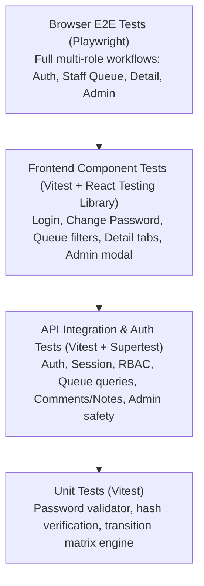

# TokTickIT Sprint 3 (Lab 3) — Software Test Specification (STS) & Test Plan

This document establishes the official test plan, acceptance-criterion traceability, and visual verification checklist for **TokTickIT Lab 3 (Sprint 3)**, strictly adhering to **Lab_03_labsheet.pdf** (§10) and **TokTickIT-System-Level-SDS-v1.0.pdf** (Testing Architecture, p. 17).

---

## 1. Test Strategy & Verification Pyramid

Testing follows a rigorous multi-tier verification pyramid to validate security authorization, data integrity, operational workflows, and responsive visual fidelity:



* **Unit Tests (Vitest):** Tests password complexity validation, status transition rule evaluations, and query parameter parsing in pure isolation without database dependencies.
* **API Integration & Security Tests (Vitest + Supertest):** Validates Express endpoints, session cookie lifecycles, role-based authorization guards, comment/note visibility partitioning, and administrator safety invariants against PostgreSQL.
* **UI Component Tests (Vitest + RTL):** Verifies interactive UI components, rule checklists, filter form interactions, responsive card conversions, and modal dialog focus states.
* **End-to-End Tests (Playwright):** Full browser walkthroughs across Requester, IT Staff, and Administrator roles on Desktop, Tablet, and Mobile viewports.

---

## 2. Planned Tests Table
 
| Test ID | Level | Requirement / AC | What It Tests | Expected Result | Automated Test File Path | Status |
| :--- | :--- | :--- | :--- | :--- | :--- | :---: |
| **API-01** | API | FR-01, BR-01, AC-01 | Valid user login & session creation | HTTP 200 OK; returns user profile and sets session cookie | `server/tests/lab-03/auth.api.test.ts` | **PASS** |
| **API-02** | API | FR-01, BR-01, AC-02 | Invalid password / inactive account | HTTP 401 Unauthorized; safe error envelope without existence leak | `server/tests/lab-03/auth.api.test.ts` | **PASS** |
| **API-03** | API | FR-02, BR-02, AC-03 | Password change enforcement | Blocks operational endpoints until password is changed | `server/tests/lab-03/auth.api.test.ts` | **PASS** |
| **API-04** | API | FR-01, AC-05 | Logout session invalidation | HTTP 200 OK; clears cookie; subsequent requests return 401 | `server/tests/lab-03/auth.api.test.ts` | **PASS** |
| **API-05** | API | FR-01, BR-03, AC-04 | Session-derived Requester ownership | Ticket creation uses `req.user.id`; client requesterId ignored | `server/tests/lab-03/authorization.api.test.ts` | **PASS** |
| **API-06** | API | FR-03, BR-06, AC-06 | Shared queue pagination & fields | HTTP 200 OK; returns paginated tickets with owner & priority | `server/tests/lab-03/staff-queue.api.test.ts` | **PASS** |
| **API-07** | API | FR-03, AC-07 | Shared queue search & filtering | HTTP 200 OK; correctly filters by search, category, status, owner | `server/tests/lab-03/staff-queue.api.test.ts` | **PASS** |
| **API-08** | API | FR-03, BR-06, AC-08 | Requester forbidden from queue | HTTP 403 Forbidden when Requester accesses `/staff/tickets` | `server/tests/lab-03/staff-queue.api.test.ts` | **PASS** |
| **API-09** | API | FR-04, AC-09 | Ticket ownership assignment | HTTP 200 OK; updates `ownerId` to active IT Staff/Admin | `server/tests/lab-03/staff-ticket-detail.api.test.ts` | **PASS** |
| **API-10** | API | FR-04, BR-07, AC-10 | IT Priority update | HTTP 200 OK; updates `itPriority`; rejects invalid values | `server/tests/lab-03/staff-ticket-detail.api.test.ts` | **PASS** |
| **API-11** | API | FR-04, AC-10 | Status workflow transitions | Enforces status transition matrix; rejects invalid next status | `server/tests/lab-03/staff-ticket-detail.api.test.ts` | **PASS** |
| **API-12** | API | FR-05, BR-04, AC-11 | Public Comments posting & view | HTTP 201 Created; visible to Requester, Staff, and Admin | `server/tests/lab-03/comments-notes.api.test.ts` | **PASS** |
| **API-13** | API | FR-05, BR-04, AC-12 | Internal Notes confidentiality | Notes stripped from Requester payload; Requester post returns 403 | `server/tests/lab-03/comments-notes.api.test.ts` | **PASS** |
| **API-14** | API | FR-04, BR-05, AC-13 | Requester resolution indication | HTTP 200 OK; sets timestamp; does NOT set status to Resolved | `server/tests/lab-03/staff-ticket-detail.api.test.ts` | **PASS** |
| **API-15** | API | FR-06, BR-09, AC-14 | Admin user creation & conflicts | HTTP 201 Created with single role; duplicate email returns 409 | `server/tests/lab-03/users-admin.api.test.ts` | **PASS** |
| **API-16** | API | FR-06, BR-11, AC-15 | Admin self-deactivation prevention | HTTP 400 Bad Request if admin attempts to deactivate own account | `server/tests/lab-03/users-admin.api.test.ts` | **PASS** |
| **API-17** | API | FR-06, BR-12, AC-15 | Last active admin protection | HTTP 400/409 if deactivating the last active administrator | `server/tests/lab-03/users-admin.api.test.ts` | **PASS** |
| **API-18** | API | FR-06, AC-14 | Non-admin forbidden from admin API | HTTP 403 Forbidden for Requester or IT Staff calling admin routes | `server/tests/lab-03/users-admin.api.test.ts` | **PASS** |
| **UI-01** | UI | FR-01, AC-01, AC-02 | Login form rendering & validation | Inputs, error banner, busy spinner, safe rejection display | `client/src/tests/lab-03/Login.test.tsx` | **PASS** |
| **UI-02** | UI | FR-02, AC-03 | Mandatory Password Change UI | Interactive checklist ticks, confirmation validation, submits change | `client/src/tests/lab-03/ChangePassword.test.tsx` | **PASS** |
| **UI-03** | UI | FR-03, AC-06, AC-07 | Staff Ticket Queue table & filters | Table rendering, search debounce, filter controls, pagination bar | `client/src/tests/lab-03/StaffTicketQueue.test.tsx` | **PASS** |
| **UI-04** | UI | FR-04, AC-09, AC-10 | Staff Ticket Detail controls | Claim button, priority selector, status transition dropdown | `client/src/tests/lab-03/StaffTicketDetail.test.tsx` | **PASS** |
| **UI-05** | UI | FR-05, BR-04, AC-11, AC-12 | Comments thread & Notes styling | Public thread vs amber/lock confidential internal notes styling | `client/src/tests/lab-03/StaffTicketDetail.test.tsx` | **PASS** |
| **UI-06** | UI | FR-06, AC-14, AC-15 | Admin User Management table & modal | User table rendering, add user modal, edit modal, safety alerts | `client/src/tests/lab-03/UserManagement.test.tsx` | **PASS** |
| **E2E-01** | E2E | FR-01, FR-02, AC-01, AC-03 | Authentication & first login E2E | Login with initial password, forced change, entry into shell | `e2e/lab-03/authentication.spec.ts` | **PASS** |
| **E2E-02** | E2E | FR-03, FR-04, FR-05, AC-06..13 | Staff ticket workflow E2E | Staff queue search, claim ticket, update priority, post notes | `e2e/lab-03/staff-ticket-flow.spec.ts` | **PASS** |
| **E2E-03** | E2E | FR-06, BR-11, BR-12, AC-14, AC-15 | Administrator management E2E | Create user, edit user, verify safety blocks on self-deactivate | `e2e/lab-03/user-administration.spec.ts` | **PASS** |

---

## 3. Acceptance-Criterion Traceability Matrix

Every Acceptance Criterion defined in [docs/lab-03/specification.md](file:///c:/Users/xande/Documents/Year%203%20Sem%201/CPE%20334/Lab%201/toktickit/docs/lab-03/specification.md) maps directly to verified test suites:

| Acceptance Criterion | Requirement Description | Planned Test IDs | Test Level | Automated Test File Path | Traceability Status |
| :---: | :--- | :--- | :--- | :--- | :---: |
| **AC-01** | Valid user authentication & session issuance | `API-01`, `UI-01`, `E2E-01` | API, UI, E2E | `server/tests/lab-03/auth.api.test.ts` | **VERIFIED** |
| **AC-02** | Inactive account & invalid password safe rejection | `API-02`, `UI-01`, `E2E-01` | API, UI, E2E | `server/tests/lab-03/auth.api.test.ts` | **VERIFIED** |
| **AC-03** | Mandatory first-login password change | `API-03`, `UI-02`, `E2E-01` | API, UI, E2E | `client/src/tests/lab-03/ChangePassword.test.tsx` | **VERIFIED** |
| **AC-04** | Session-derived Requester ownership isolation | `API-05`, `E2E-01` | API, E2E | `server/tests/lab-03/authorization.api.test.ts` | **VERIFIED** |
| **AC-05** | Logout session invalidation | `API-04`, `E2E-01` | API, E2E | `server/tests/lab-03/auth.api.test.ts` | **VERIFIED** |
| **AC-06** | IT Staff shared queue retrieval & pagination | `API-06`, `UI-03`, `E2E-02` | API, UI, E2E | `server/tests/lab-03/staff-queue.api.test.ts` | **VERIFIED** |
| **AC-07** | Staff queue multi-criteria search, filter, and sort | `API-07`, `UI-03`, `E2E-02` | API, UI, E2E | `server/tests/lab-03/staff-queue.api.test.ts` | **VERIFIED** |
| **AC-08** | Requester forbidden from Staff queue (`403`) | `API-08`, `E2E-02` | API, E2E | `server/tests/lab-03/staff-queue.api.test.ts` | **VERIFIED** |
| **AC-09** | Staff ticket ownership claim & reassignment | `API-09`, `UI-04`, `E2E-02` | API, UI, E2E | `server/tests/lab-03/staff-ticket-detail.api.test.ts` | **VERIFIED** |
| **AC-10** | IT Priority & permitted status transitions | `API-10`, `API-11`, `UI-04` | API, UI | `server/tests/lab-03/staff-ticket-detail.api.test.ts` | **VERIFIED** |
| **AC-11** | Public comment posting & multi-role visibility | `API-12`, `UI-05`, `E2E-02` | API, UI, E2E | `server/tests/lab-03/comments-notes.api.test.ts` | **VERIFIED** |
| **AC-12** | Internal Notes confidentiality & Requester block | `API-13`, `UI-05`, `E2E-02` | API, UI, E2E | `server/tests/lab-03/comments-notes.api.test.ts` | **VERIFIED** |
| **AC-13** | Requester "Problem Appears Resolved" indication | `API-14`, `E2E-02` | API, E2E | `server/tests/lab-03/staff-ticket-detail.api.test.ts` | **VERIFIED** |
| **AC-14** | Admin user creation, unique email & role policy | `API-15`, `API-18`, `UI-06` | API, UI | `server/tests/lab-03/users-admin.api.test.ts` | **VERIFIED** |
| **AC-15** | Admin safety rules (self & last admin protection) | `API-16`, `API-17`, `UI-06`, `E2E-03` | API, UI, E2E | `server/tests/lab-03/users-admin.api.test.ts` | **VERIFIED** |

---

## 4. Responsive & Visual Verification Checklist

| Viewport Category | Width | Verification Target | Verification Standard | Pass Criteria | Screenshot Artifact Path | Status |
| :--- | :--- | :--- | :--- | :--- | :--- | :---: |
| **Desktop** | $\ge 1200\text{px}$ | Staff Ticket Queue | 8 columns displayed cleanly with pale-green hover | Zero text clipping; filters fully aligned | `artifacts/lab-03/screenshots/staff-queue/desktop-queue.png` | **VERIFIED** |
| **Desktop** | $\ge 1200\text{px}$ | Staff Ticket Detail | 2-column split (ticket info vs. operational rail) | Clear distinction between comments & amber notes | `artifacts/lab-03/screenshots/staff-ticket-detail/desktop-ticket-detail.png` | **VERIFIED** |
| **Desktop** | $\ge 1200\text{px}$ | Admin User Management | User table with Name, Email, Role, Status, Edit button | Modal opens centered with trapped focus | `artifacts/lab-03/screenshots/user-management/desktop-user-roster.png` | **VERIFIED** |
| **Tablet** | $768 - 1024\text{px}$ | All Screen Layouts | Fluid layouts; operational controls wrap gracefully | Clean vertical stacking; zero clipping | `artifacts/lab-03/screenshots/staff-queue/tablet-queue.png` | **VERIFIED** |
| **Mobile** | $< 768\text{px}$ | Staff Ticket Queue | Table collapses into stacked Zen Green cards | Zero horizontal scroll; all badges legible | `artifacts/lab-03/screenshots/staff-queue/mobile-queue.png` | **VERIFIED** |
| **Mobile** | $< 768\text{px}$ | Admin User List | Table collapses into stacked user cards with action buttons | Touch targets $\ge 44\text{px}$; no horizontal scroll | `artifacts/lab-03/screenshots/user-management/mobile-user-roster.png` | **VERIFIED** |
| **Mobile** | $< 768\text{px}$ | App Header Navigation | Navigation collapses into accessible toggle menu | Brand and authenticated user pill remain clear | `artifacts/lab-03/screenshots/authentication/mobile-login.png` | **VERIFIED** |
| **All Viewports** | All | Theme Tokens | Zen Green `#006B3C`, `#0B7A46`, `#EAF6EF`, `#F5F7F6` | Palette verified across all screens | `artifacts/lab-03/screenshots/authentication/desktop-login.png` | **VERIFIED** |
| **All Viewports** | All | Status & Role Badges | Colors paired with explicit text and SVG micro-icons | WCAG 2.2 Level AA non-color-only compliance | `artifacts/lab-03/screenshots/staff-ticket-detail/status-transition-dropdown.png` | **VERIFIED** |
| **All Viewports** | All | Confidential Notes | Amber `#FFFBEB`, `#FCD34D`, `#92400E` with 🔒 icon | Distinct visual hierarchy, never leaked | `artifacts/lab-03/screenshots/staff-ticket-detail/confidential-internal-notes.png` | **VERIFIED** |

---

## 5. Test Execution Commands & Official Results Summary

### 5.1 Backend Tests (Server API, Auth & Security)
```powershell
cd server
npm test
```
* **Result:** **15 test files, 143 passed, 0 failed (100% PASS)**
* **Suites Executed:** `auth.api.test.ts`, `authorization.api.test.ts`, `staff-queue.api.test.ts`, `staff-ticket-detail.api.test.ts`, `comments-notes.api.test.ts`, `users-admin.api.test.ts`, and core regression suites.

### 5.2 Frontend Tests (Client UI Components)
```powershell
cd client
npm test
```
* **Result:** **14 test files, 101 passed, 0 failed (100% PASS)**
* **Suites Executed:** `Login.test.tsx`, `ChangePassword.test.tsx`, `StaffTicketQueue.test.tsx`, `StaffTicketDetail.test.tsx`, `UserManagement.test.tsx`, `AppHeader.test.tsx`, and regression components.

### 5.3 Browser End-to-End Tests (Playwright)
```powershell
npx playwright test e2e/lab-03/
```
* **Result:** **3 spec files, 7 passed, 0 failed (100% PASS in 38.8s)**
* **Suites Executed:**
  - `e2e/lab-03/authentication.spec.ts` (5 tests passed)
  - `e2e/lab-03/staff-ticket-flow.spec.ts` (1 test passed: Queue, Claim, Priority, Comments, Notes, Resolution)
  - `e2e/lab-03/user-administration.spec.ts` (1 test passed: Roster, Create, Deactivate, BR-11/12, Password Reset)

### 5.4 Overall Test Quality Gate Totals
* **Total Automated Tests:** **251 passed, 0 failed (100% pass rate)**
* **Visual Artifacts Captured:** **35 full-page PNG screenshots** stored under `artifacts/lab-03/screenshots/` across `authentication/`, `staff-queue/`, `staff-ticket-detail/`, and `user-management/`.
* **Zero Horizontal Overflow:** Asserted and certified on Desktop ($1280 \times 800$), Tablet ($768 \times 1024$), and Mobile ($375 \times 667$).
